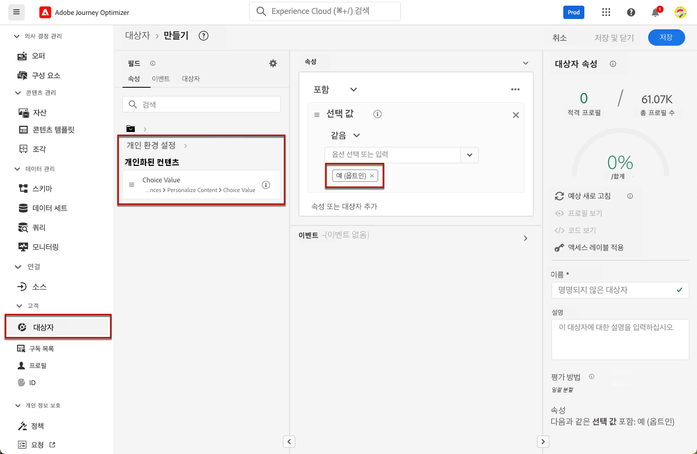
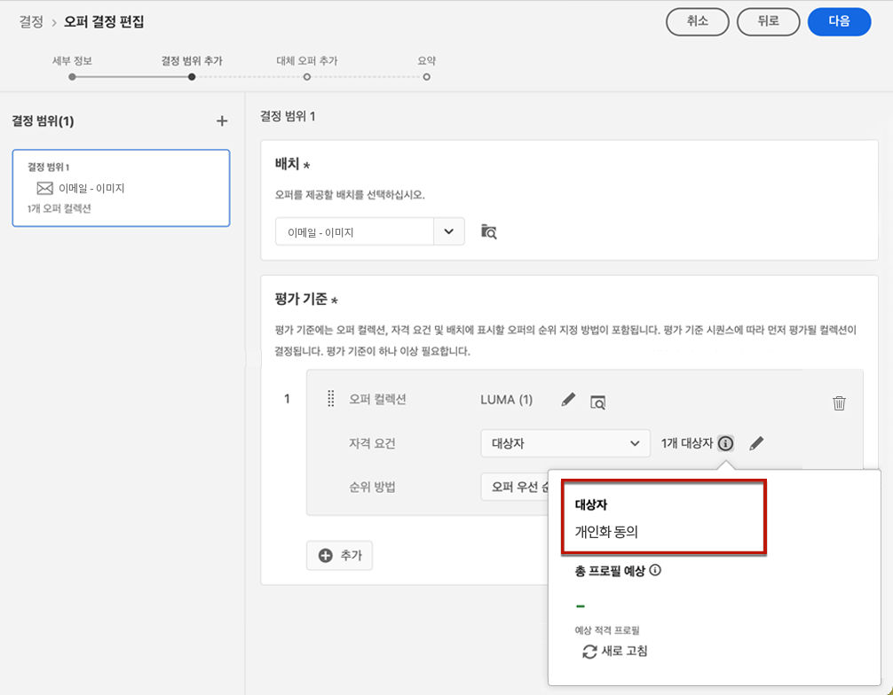
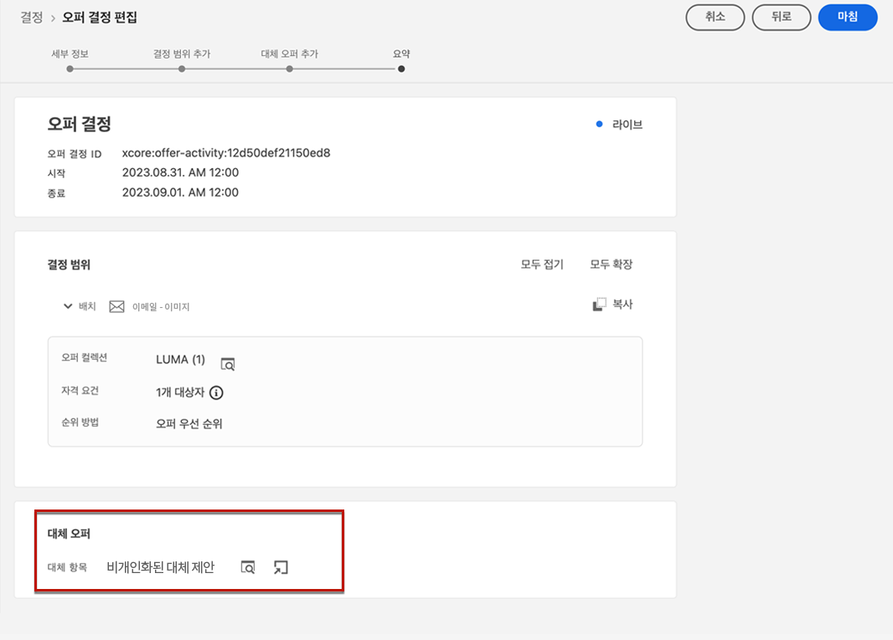
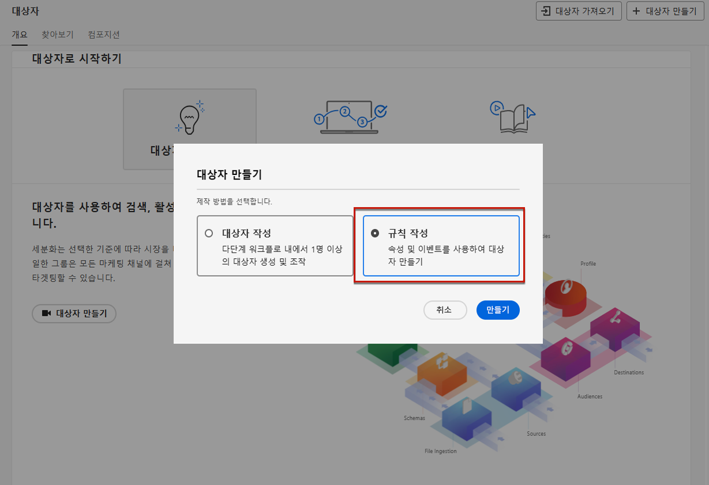
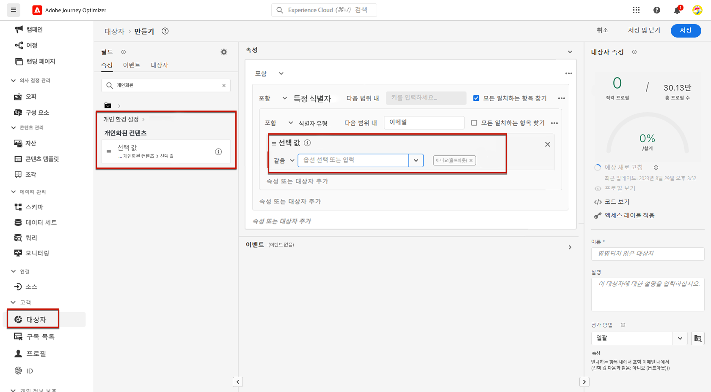
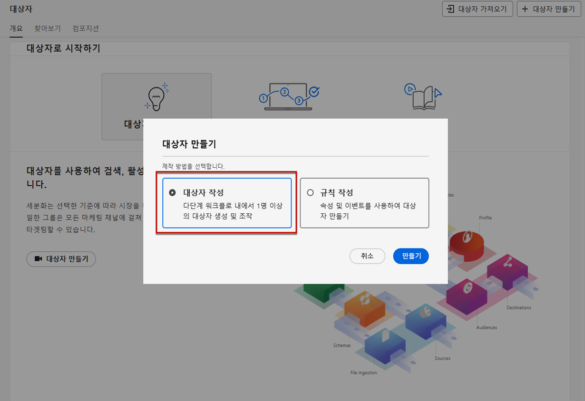
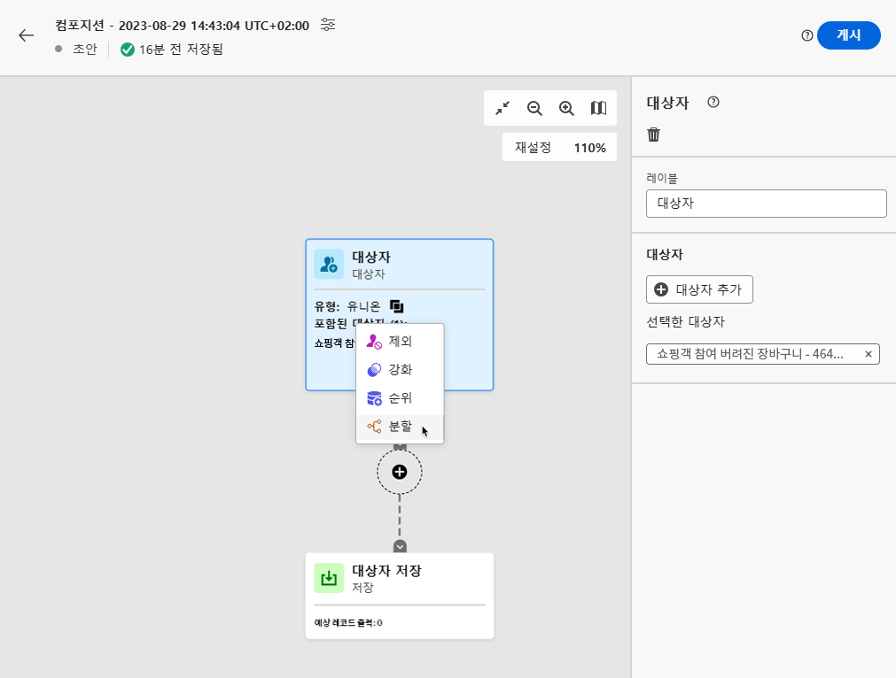
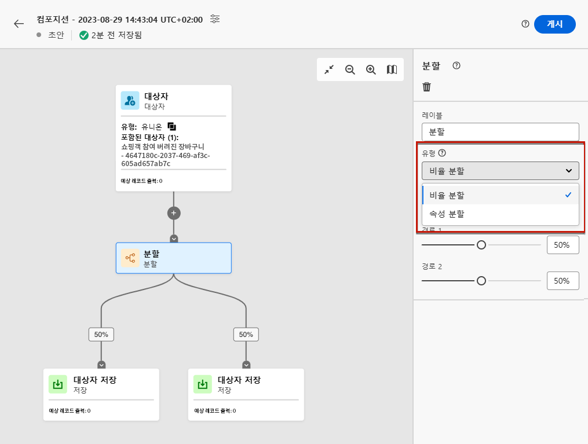
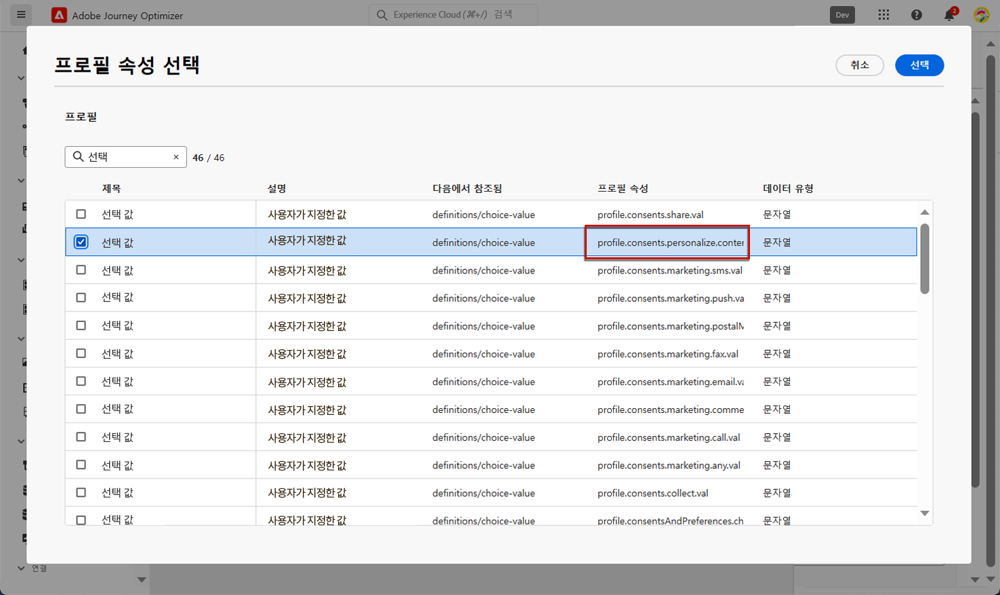
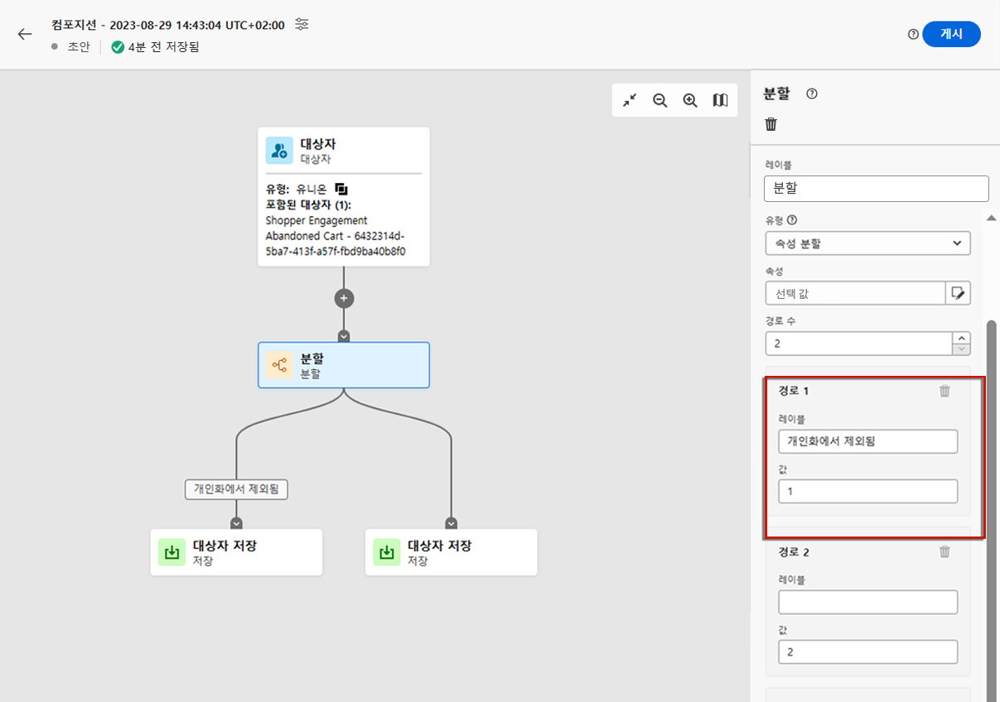

# 옵트아웃 관리 {#consent}

수신자가 브랜드로부터 커뮤니케이션 수신을 거부할 수 있는 기능을 제공하는 것은 법적 요구 사항이며 이러한 선택이 허용되도록 합니다. 이러한 규정을 준수하지 않으면 브랜드에 대한 규제 법률 리스크가 발생합니다. 이는 원하지 않는 커뮤니케이션을 수신자에게 보내지 않도록 하여 메시지를 스팸으로 표시하고 명성을 손상시킬 수 있습니다.

[Experience Platform 설명서](https://experienceleague.adobe.com/docs/experience-platform/privacy/regulations/overview.html#regulations){target="_blank"}에서 해당 법률에 대해 자세히 알아보세요.

## 여정 및 캠페인에서의 구독 취소 관리 {#opt-out-ajo}

여정 또는 캠페인에서 메시지를 보낼 때 고객이 향후 커뮤니케이션에서 구독을 취소할 수 있도록 항상 확인해야 합니다. 구독을 취소하면 향후 마케팅 메시지 대상자에서 프로필이 자동으로 제거됩니다.

**[!DNL Journey Optimizer]**&#x200B;은(는) 이메일 및 SMS 메시지에서 옵트아웃을 관리하는 방법을 제공하지만, 푸시 알림은 수신자가 디바이스를 통해 직접 구독을 취소할 수 있으므로 별도의 작업이 필요하지 않습니다. 예를 들어 앱을 다운로드하거나 사용하는 경우 알림을 중지하도록 선택할 수 있습니다. 마찬가지로 모바일 운영 체제를 통해 알림 설정을 변경할 수 있습니다.

>[!NOTE]
>
>또한 Journey Optimizer **제외 REST API**&#x200B;를 활용하여 제외 및 허용 목록을 사용하여 보내는 메시지를 제어할 수 있습니다. [비표시 REST API로 작업하는 방법을 알아봅니다](https://developer.adobe.com/journey-optimizer-apis/references/suppression){target="_blank"}

### 푸시 옵트아웃 상태 확인 {#push-opt-out-status}

모바일 앱에 대한 푸시 옵트아웃은 장치 수준에서 처리됩니다. 사용자가 장치에서 알림을 비활성화하면 푸시 토큰이 프로필에서 제거됩니다. 따라서 프로필에 **푸시 토큰이 있음**&#x200B;은(는) 암시적 푸시 동의의 표시기입니다.

Adobe Experience Platform에서 프로필의 푸시 동의 상태를 확인하려면 다음을 수행하십시오.

1. Adobe Experience Platform의 **[!UICONTROL 프로필]** 섹션에서 프로필을 엽니다.
1. **[!UICONTROL 특성]** 탭으로 이동하여 **[!UICONTROL 푸시 알림 세부 정보]** 필드 그룹을 찾습니다.
1. 푸시 토큰이 있는 경우 프로필이 푸시 알림을 수신하도록 묵시적으로 동의했습니다. 토큰을 찾을 수 없으면 사용자가 장치 수준에서 을 옵트아웃했습니다.

>[!NOTE]
>
>명시적 푸시 동의 추적이 필요한 준수 사용 사례의 경우 [동의 및 환경 설정 필드 그룹](https://experienceleague.adobe.com/docs/experience-platform/xdm/field-groups/profile/consents.html){target="_blank"}의 **`consents.marketing.push.val`** 특성을 사용하십시오. `y` 값은 명시적 옵트인을 나타내며 `n`은(는) 명시적 옵트아웃을 나타냅니다.

다음 섹션에서 Journey Optimizer 이메일 및 SMS 메시지에서 옵트아웃을 관리하는 방법을 알아봅니다.

<table style="table-layout:fixed"><tr style="border: 0;">
<td>

<a href="../email/email-opt-out.md"><strong>이메일 옵트아웃 관리</strong>

</td>
<td>

<a href="../sms/sms-opt-out.md"><strong>SMS 옵트아웃 관리</strong></a>

</td>
</tr></table>

>[!NOTE]
>
>[!DNL Journey Optimizer]에서 동의는 Experience Platform [동의 스키마](https://experienceleague.adobe.com/docs/experience-platform/xdm/field-groups/profile/consents.html){target="_blank"}에 의해 처리됩니다. 기본적으로 동의 필드의 값은 비어 있으며 커뮤니케이션을 수신하기 위한 동의로 처리됩니다. [여기](https://experienceleague.adobe.com/docs/experience-platform/xdm/data-types/consents.html#choice-values){target="_blank"}에 나열된 가능한 값 중 하나로 온보딩하는 동안 이 기본값을 수정하거나 [동의 정책](../action/consent.md)을 사용하여 기본 논리를 재정의할 수 있습니다.

## 개인화 동의 구현 {#opt-out-personalization}

고객은 개인화된 콘텐츠를 표시하지 않도록 선택할 수도 있습니다. 프로필이 개인화를 옵트아웃한 경우 해당 데이터가 개인화에 사용되지 않도록 해야 하며 개인화된 모든 콘텐츠를 대체 변형으로 교체해야 합니다.

### 의사 결정 관리 {#opt-out-decision-management}

오퍼를 활용할 때 개인화 환경 설정은 [의사 결정](../offers/api-reference/offer-delivery-api/decisioning-api.md) API 요청 또는 [Edge 의사 결정](../offers/api-reference/offer-delivery-api/edge-decisioning-api.md) API 요청에서 사용되는 [의사 결정 범위](../offers/offer-activities/create-offer-activities.md#add-decision-scopes)에서 자동으로 구현되지 않습니다. 이 경우 개인화 동의를 수동으로 적용해야 합니다. 이렇게 하려면 아래 단계를 수행합니다.

>[!NOTE]
>
>작성된 [!DNL Journey Optimizer] 채널에서 사용되는 결정 범위는 해당 범위가 속한 여정 또는 캠페인에서 이 요구 사항을 충족합니다.

1. [세그먼테이션 서비스](https://experienceleague.adobe.com/docs/experience-platform/segmentation/ui/overview.html){target="_blank"}를 사용하여 [Adobe Experience Platform 대상](../audience/about-audiences.md)을(를) 만들고 **[!UICONTROL 콘텐츠 개인화 = 예(옵트인)]**&#x200B;와(과) 같은 프로필 특성을 사용하여 개인화에 동의한 사용자를 대상으로 합니다.

   

1. [결정](../offers/offer-activities/create-offer-activities.md)을 만들 때 결정 범위를 추가하고 개인화된 오퍼를 포함하는 각 평가 기준 컬렉션에 대해 이 대상을 기반으로 자격 제한 사항을 정의합니다.

   

1. 개인화된 콘텐츠를 포함하지 않는 [대체 오퍼](../offers/offer-library/creating-fallback-offers.md)를 만드십시오.

1. 결정에 개인화되지 않은 대체 오퍼를 [할당](../offers/offer-activities/create-offer-activities.md#add-fallback)합니다.

   

1. [결정을 검토하고 저장](../offers/offer-activities/create-offer-activities.md#review)합니다.

사용자에게 다음이 있는 경우:

* 개인화에 동의하면 결정 범위가 해당 프로필에 대한 최상의 오퍼를 결정합니다.

* 개인화에 동의하지 않으면 해당 프로필은 평가 기준에 있는 오퍼에 적합하지 않으므로 개인화되지 않은 대체 오퍼를 수신하게 됩니다.

>[!NOTE]
>
>[데이터 모델링](../offers/ranking/ai-models.md)에서 프로필 데이터를 사용하는 것에 대한 동의는 아직 [!DNL Journey Optimizer]에서 지원되지 않습니다.

### 개인화 편집기에서 {#opt-out-expression-editor}

[개인화 편집기](../personalization/personalization-build-expressions.md) 자체는 메시지 배달과 관련이 없으므로 동의 확인 또는 적용을 수행하지 않습니다.

그러나 오른쪽 기반 액세스 제어 레이블을 사용하면 개인화에 사용할 수 있는 필드를 제한할 수 있습니다. [메시지 미리 보기](../content-management/preview.md) 및 [전자 메일 렌더링 서비스](../content-management/rendering.md)에서 중요한 정보로 식별된 필드를 마스킹합니다.

>[!NOTE]
>
>[이 섹션](../administration/object-based-access.md)에서 OLAC(개체 수준 액세스 제어)에 대해 자세히 알아보세요.

[!DNL Journey Optimizer] 캠페인에서는 동의 정책이 다음과 같이 적용됩니다.

* 동의 정책 정의를 대상자 만들기의 일부로 포함시켜 캠페인에 대해 선택한 대상자에게 이미 **동의 기준과 일치하지 않는 프로필이 필터링되었는지 확인**&#x200B;할 수 있습니다.

* [!DNL Journey Optimizer]은(는) 채널 수준에서 일반 동의 검사를 수행하여 **프로필이 해당 채널에서 마케팅 커뮤니케이션을 수신하도록**&#x200B;을(를) 선택했는지 확인합니다.

  >[!NOTE]
  >
  >[!DNL Journey Optimizer] 캠페인 개체 자체는 현재 추가적인 동의 정책 시행 검사를 수행하지 않습니다.

캠페인에서 개인화 동의를 수동으로 적용하려면 아래 옵션 중 하나를 수행합니다.

### 세그먼트 규칙 빌더 사용

세그먼트 규칙 빌더를 사용하여 옵트아웃 프로필이 포함된 대상자를 만들 수 있습니다.

1. [세그먼테이션 서비스](https://experienceleague.adobe.com/docs/experience-platform/segmentation/ui/overview.html){target="_blank"}를 사용하여 [Adobe Experience Platform 대상](../audience/about-audiences.md)을 만듭니다.

   

1. **[!UICONTROL 콘텐츠 개인화 = 아니요(옵트아웃)]**&#x200B;와 같은 프로필 속성을 선택하여 개인화에 동의하지 않은 사용자를 제외합니다.

   

1. **[!UICONTROL 저장]**&#x200B;을 클릭합니다.

이제 이 대상자를 사용하여 캠페인의 개인화에 동의하지 않은 프로필을 필터링할 수 있습니다.

### 작성 워크플로우에서 분할 활동 사용

또한 구성 워크플로우에 분할 활동을 추가하여 대상자에 개인화 동의 검사를 추가할 수 있습니다.

1. **[!UICONTROL 대상자 작성]** 옵션을 사용하여 대상자를 만듭니다. [컴포지션 워크플로 만들기에 대해 자세히 알아보기](../audience/get-started-audience-orchestration.md)

   

1. 오른쪽의 전용 버튼을 사용하여 시작 대상자를 추가합니다.

1. **+** 아이콘을 클릭하고 **[!UICONTROL 분할]** 활동을 선택하여 분할 대상을 만듭니다.

   

1. 오른쪽 창에서 **[!UICONTROL 특성 분할]**&#x200B;을(를) 분할 유형으로 선택합니다.

   

1. **[!UICONTROL 특성]** 필드 옆에 있는 연필 아이콘을 클릭하여 **[!UICONTROL 프로필 특성 선택]** 창을 표시합니다.

1. 개인화 동의 특성(`profile.consents.personalize.content.val`)을 검색하고 선택합니다.

   

1. **[!UICONTROL 경로 1]**&#x200B;은(는) 개인화되지 않은 대상입니다. 관련 레이블을 선택합니다.

1. 이 [목록](https://experienceleague.adobe.com/docs/experience-platform/xdm/data-types/consents.html#choice-values){target="_blank"}에서 적절한 값을 선택하세요.

   이 경우 `n`을(를) 사용하여 사용자가 개인화를 위한 데이터 사용에 동의하지 않음을 나타냅니다.

   

1. 다른 선택 값에 대해 별도의 경로를 만들 수 있습니다. 나머지 경로를 삭제하고 **[!UICONTROL 다른 프로필]**&#x200B;을(를) 켜서 선택 값이 `n`이(가) 없는 다른 모든 프로필을 포함하도록 선택할 수도 있습니다.

1. 완료되면 각 경로에 대해 **[!UICONTROL 대상자 저장]**&#x200B;을 클릭하여 워크플로우의 결과를 새 대상자에 저장합니다. 각 경로에 대해 한 명의 대상자가 Adobe Experience Platform에 저장됩니다.

1. 완료되면 작성 워크플로우를 게시합니다.

이제 이 대상자를 사용하여 캠페인의 개인화에 동의하지 않은 프로필을 필터링할 수 있습니다.

>[!NOTE]
>
>개인화에 동의하지 않은 대상자를 만든 다음, 캠페인에서 이 대상자를 선택하면 개인화 도구를 계속 사용할 수 있습니다. 개인화를 받지 않아야 하는 대상자와 함께 작업하는 경우 개인화 도구를 사용하지 말아야 한다는 것은 마케팅 사용자에게 달려 있습니다.
