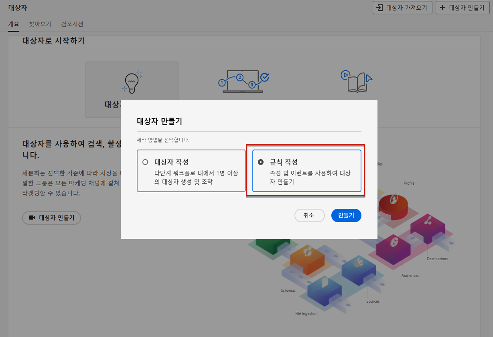

# 옵트아웃 관리 {#consent}

수신자에게 브랜드의 커뮤니케이션 수신을 거부할 수 있는 기능을 제공하고, 이러한 선택을 존중하는 것은 법률에 명시된 사항입니다. 적용되는 법률에 대한 자세한 내용은[Experience Platform 설명서](https://experienceleague.adobe.com/docs/experience-platform/privacy/regulations/overview.html?lang=ko#regulations){target="_blank"}를 참조하세요.

**중요한 이유**

* 이러한 규정을 준수하지 않으면 브랜드에 대한 규제 법률 리스크가 발생합니다.
* 이메일은 원하지 않는 커뮤니케이션을 수신자에게 보내지 않도록 함으로써 메시지를 스팸으로 표시하고 명성을 손상시킬 수 있습니다.

## 여정 및 캠페인에서의 구독 취소 관리 {#opt-out-ajo}

여정 또는 캠페인에서 메시지를 보낼 때 고객이 향후 커뮤니케이션에서 구독을 취소할 수 있도록 항상 확인해야 합니다. 구독이 취소되면 향후 마케팅 메시지 대상자에서 프로필이 자동으로 제거됩니다.

**[!DNL Journey Optimizer]**&#x200B;는 이메일 및 SMS 메시지에서 옵트아웃을 관리하는 방법을 제공하지만, 푸시 알림은 수신자가 디바이스를 통해 직접 구독을 취소할 수 있으므로 별도의 작업이 필요하지 않습니다. 예를 들어, 앱을 다운로드하거나 사용하는 경우 알림을 중지하도록 선택할 수 있습니다. 마찬가지로 모바일 운영 체제를 통해 알림 설정을 변경할 수 있습니다.

다음 섹션에서 Journey Optimizer 이메일 및 SMS 메시지에서 옵트아웃을 관리하는 방법을 알아봅니다.

<table style="table-layout:fixed"><tr style="border: 0;">
<td>

<a href="../email/email-opt-out.md"><strong>이메일 옵트아웃 관리</strong>

</td>
<td>

<a href="../sms/sms-opt-out.md"><strong>SMS 옵트아웃 관리</strong></a>

</td>
</tr></table>

>[!NOTE]
>
>[!DNL Journey Optimizer]에서 동의는 Experience Platform [동의 스키마](https://experienceleague.adobe.com/docs/experience-platform/xdm/field-groups/profile/consents.html?lang=ko){target="_blank"}. By default, the value for the consent field is empty and treated as consent to receive your communications. You can modify this default value while onboarding to one of the possible values listed [here](https://experienceleague.adobe.com/docs/experience-platform/xdm/data-types/consents.html?lang=ko#choice-values){target="_blank"}가 처리합니다.

## 개인화 동의 구현 {#opt-out-personalization}

고객은 개인화된 콘텐츠를 표시하지 않도록 옵트아웃할 수도 있습니다. 개인화를 옵트아웃한 경우 해당 데이터가 개인화에 사용되지 않도록 해야 하며, 모든 개인화 콘텐츠 대신 대체 콘텐츠를 사용해야 합니다.

### 의사 결정 관리의 경우 {#opt-out-decision-management}

오퍼를 활용하는 경우 개인화 동의 여부는 [decisioning](../offers/api-reference/offer-delivery-api/decisioning-api.md) API 요청이나 [edge decisioning](../offers/api-reference/offer-delivery-api/edge-decisioning-api.md) API 요청에서 사용하는 [결정 범위](../offers/offer-activities/create-offer-activities.md#add-decision-scopes)에 자동으로 적용되지 않습니다. 이 경우 개인화 동의를 수동으로 강제해야 합니다. 그 방법은 다음과 같습니다.

>[!NOTE]
>
>[!DNL Journey Optimizer]에서 작성한 채널에서 사용하는 결정 범위는 소속된 여정이나 캠페인의 이 요건을 충족합니다.

1. [Segmentation Service](https://experienceleague.adobe.com/docs/experience-platform/segmentation/ui/overview.html?lang=ko){target="_blank"}를 사용하여 [Adobe Experience Platform 대상자](../audience/access-audiences.md)를 만들고 **[!UICONTROL 콘텐츠 개인화 = 예(옵트인)]** 같은 프로필 속성을 사용하여 개인화에 동의한 사용자를 타겟팅합니다.

   

1. [결정](../offers/offer-activities/create-offer-activities.md)을 만들 때 결정 범위를 추가하고 이 대상자를 기반으로 개인화된 오퍼가 있는 각 평가 기준 모음마다 적격성 제한을 정의합니다.

   

1. 개인화 콘텐츠가 없는 [대체 제안](../offers/offer-library/creating-fallback-offers.md)을 만듭니다.

1. 개인화하지 않은 대체 제안을 결정에 [할당](../offers/offer-activities/create-offer-activities.md#add-fallback)합니다.

   

1. 결정을 [검토하고 저장](../offers/offer-activities/create-offer-activities.md#review)합니다.

만약 사용자가

* 개인화에 동의한 경우, 결정 범위가 해당 프로필에 대한 최상의 오퍼를 결정합니다.

* 개인화에 동의하지 않은 경우, 해당 프로필은 평가 기준에 있는 오퍼에 적격하지 않으므로 개인화하지 않은 대체 오퍼를 수신하게 됩니다.

>[!NOTE]
>
>프로필 데이터를 [데이터 모델링](../offers/ranking/ai-models.md)에 사용하는 데 대한 동의는 아직 [!DNL Journey Optimizer]에서 지원되지 않습니다.

## 표현식 편집기에서 {#opt-out-expression-editor}

[표현식 편집기](../personalization/personalization-build-expressions.md) 자체는 동의 여부 확인이나 적용을 수행하지 않습니다. 메시지 게재 작업에 포함되지 않기 때문입니다.

그러나 권한 기반 액세스 제어 레이블을 사용하면 개인화에 사용할 수 있는 필드를 제한할 수 있습니다. [메시지 미리 보기](../content-management/preview.md) 및 [이메일 렌더링 서비스](../content-management/rendering.md)가 중요한 정보로 식별된 필드를 마스킹합니다.

>[!NOTE]
>
>[이 섹션](../administration/object-based-access.md)에서는 OLAC(개체 수준 액세스 제어)에 대해 자세히 알아봅니다.

[!DNL Journey Optimizer] 캠페인에서 동의 정책은 다음과 같이 시행됩니다.

* 대상자를 만들 때 동의 정책 정의를 포함하면 이미 **동의 기준을 충족하지 않는 프로필을 필터링하여 제거**&#x200B;한 대상자만 캠페인 타겟으로 선택하도록 할 수 있습니다

* [!DNL Journey Optimizer]가 채널 수준에서 일반 동의 검사를 수행하여 **타겟 프로필이 특정 채널에서 마케팅 커뮤니케이션을 받도록 옵트인**&#x200B;했는지 확인합니다.

  >[!NOTE]
  >
  >[!DNL Journey Optimizer] 캠페인 개체 자체는 현재 추가적인 동의 정책 시행 검사를 수행하지 않습니다.

캠페인에 개인화 동의 여부를 수동으로 적용하려면 아래 작업 중 하나를 수행합니다.

### 세분화 규칙 빌더 사용

세그먼트 규칙 빌더를 사용하여 옵트아웃한 프로필이 포함된 대상자를 만들 수 있습니다.

1. [Segmentation Service](https://experienceleague.adobe.com/docs/experience-platform/segmentation/ui/overview.html?lang=ko){target="_blank"}를 사용하여 [Adobe Experience Platform 대상자](../audience/access-audiences.md)를 만듭니다.

   

1. **[!UICONTROL 콘텐츠 개인화 = 아니요(옵트아웃)]** 같은 프로필 속성을 선택하면 개인화에 동의하지 않은 사용자를 제외합니다.

   

1. **[!UICONTROL 저장]**&#x200B;을 클릭합니다.

이제 이 대상자를 사용하여 캠페인의 개인화에 동의하지 않은 프로필을 필터링할 수 있습니다.

### 구성 워크플로우에서 분할 활동 사용

또한 구성 워크플로우에 분할 활동을 추가하여 대상자에 대한 개인화 동의 검사를 추가할 수 있습니다.

1. **[!UICONTROL 대상자 구성]** 옵션을 사용하여 대상자를 만듭니다. [구성 워크플로우 만들기에 대해 자세히 알아보기](../audience/create-compositions.md)

   

1. 오른쪽의 전용 버튼을 사용하여 시작할 대상자를 추가합니다.

1. **+** 아이콘을 클릭하고 **[!UICONTROL 분할]** 활동을 선택하여 분할 대상자를 만듭니다. [분할 활동에 대해 자세히 알아보기](../audience/composition-canvas.md#split)

   

1. 오른쪽 창에서 분할 유형으로 **[!UICONTROL 속성 분할]**&#x200B;을 선택합니다.

   

1. **[!UICONTROL 속성]** 필드 옆에 있는 연필 아이콘을 클릭하여 **[!UICONTROL 프로필 속성 선택]** 창을 꺼냅니다.

1. 개인화 동의 속성(`profile.consents.personalize.content.val`)을 검색한 다음 선택합니다.

   

1. **[!UICONTROL 경로 1]**&#x200B;은 개인화하지 않을 대상자입니다. 관련 레이블을 선택합니다.

1. 이 [목록](https://experienceleague.adobe.com/docs/experience-platform/xdm/data-types/consents.html?lang=ko#choice-values){target="_blank"}에서 적절한 값을 선택합니다.

   이 사례에서는 `n`를 사용하여 사용자가 개인화를 위해 자신의 데이터를 사용하는 데에 동의하지 않음을 나타냅니다.

   

1. 다른 선택 값에 대해서도 별도의 경로를 만들 수 있습니다. 나머지 경로를 삭제하고 **[!UICONTROL 기타 프로필]**&#x200B;을 켜서 `n` 선택 값을 가지고 있지 않은 기타 프로필을 모두 포함할 수도 있습니다.

1. 완료되면 각 경로마다 **[!UICONTROL 대상자 저장]**&#x200B;을 클릭하여 워크플로우의 결과를 새 대상자로 저장합니다. 각 경로마다 대상자 하나씩이 Adobe Experience Platform에 저장됩니다.

1. 완료되면 구성 워크플로우를 게시합니다.

이제 이 대상자를 사용하여 캠페인의 개인화에 동의하지 않은 프로필을 필터링할 수 있습니다.

>[!NOTE]
>
>개인화에 동의하지 않는 대상자를 만든 다음 캠페인에서 해당 대상자를 선택한 경우에도 개인화 도구는 계속 사용 가능 상태입니다. 개인화 콘텐츠를 수신하지 않아야 하는 대상자를 사용하여 작업하는 경우 개인화 도구를 사용하지 않아야 하며, 이를 이해하는 것은 귀사 마케팅 사용자의 책임입니다.
