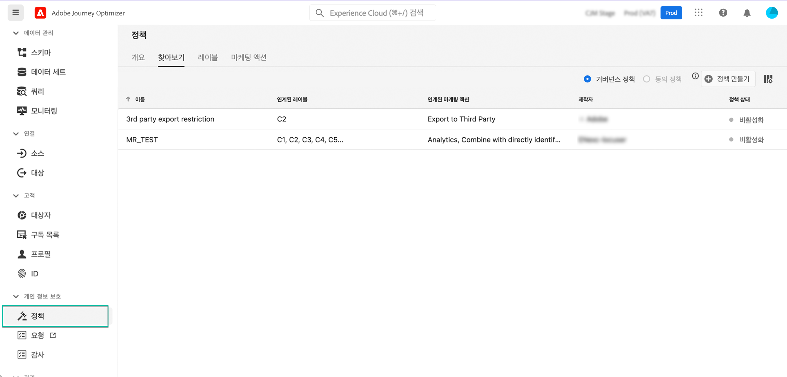

# 데이터 사용 정책 {#Policies}

Adobe Experience Platform **데이터 거버넌스 서비스**&#x200B;를 사용하면 레이블, 마케팅 작업 및 정책으로 데이터 사용을 제한할 수 있습니다.

이를 위해 데이터 거버넌스 서비스로 데이터 세트 및 필드에 데이터 사용 레이블을 적용하여 관련 데이터 사용 정책에 따라 각 레이블을 분류할 수 있습니다.

데이터 사용 정책은 Experience Platform 내에서 데이터 수행을 허용하거나 제한하는 마케팅 작업 종류를 설명하는 규칙입니다. **[!UICONTROL 정책]** 메뉴에서 액세스할 수 있습니다.

데이터 거버넌스 프레임워크, 그리고 레이블 및 정책으로 작동하는 방법에 대한 자세한 내용은 Adobe Experience Platform 설명서를 참조하십시오.

* [데이터 거버넌스 서비스 개요](https://experienceleague.adobe.com/docs/experience-platform/data-governance/home.html?lang=ko)
* [데이터 사용 레이블 개요](https://experienceleague.adobe.com/docs/experience-platform/data-governance/labels/overview.html?lang=ko)
* [데이터 사용 정책](https://experienceleague.adobe.com/docs/experience-platform/data-governance/policies/overview.html?lang=ko)
