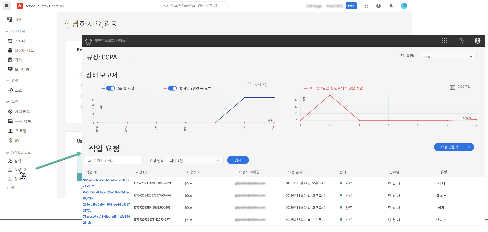

# 개인 정보 보호 요청 {#track-changes}

Adobe Experience Platform **Privacy Service**&#x200B;는 고객 데이터 요청을 관리하는 데 도움이 되는 RESTful API 및 사용자 인터페이스를 제공합니다. Privacy Service를 사용하면 Adobe Experience Cloud 애플리케이션에서 개인 고객 데이터에 액세스하고 삭제하도록 요청할 수 있으므로, 법적 및 조직의 개인 정보 보호 규정을 자동으로 준수할 수 있습니다.

개인 정보 보호 요청은 **[!UICONTROL 요청]** 메뉴에서 생성하고 관리할 수 있습니다.



Privacy Service 및 개인 정보 보호 요청을 만들고 관리하는 방법에 대한 자세한 내용은 [Adobe Experience Platform 설명서](https://experienceleague.adobe.com/docs/experience-platform/privacy/home.html?lang=ko){target="_blank"}를 참조하십시오.

<!--* [Privacy Service overview](https://experienceleague.adobe.com/docs/experience-platform/privacy/home.html)
* [Managing privacy jobs in the Privacy Service UI](https://experienceleague.adobe.com/docs/experience-platform/privacy/ui/user-guide.html)-->

## Adobe Journey Optimizer에 보낼 수 있는 개별 데이터 개인 정보 요청 관리 {#data-privacy-requests}

Adobe Journey Optimizer에서 소비자 데이터에 액세스하고 이를 삭제하기 위한 개별 요청은 다음 두 가지 방법으로 제출할 수 있습니다.

* **Privacy Service UI**&#x200B;를 통한 방법. [자세히 알아보기](https://experienceleague.adobe.com/docs/experience-platform/privacy/ui/user-guide.html?lang=ko){target="_blank"}
* **Privacy Service API**&#x200B;를 통한 방법. [자세히 알아보기](https://experienceleague.adobe.com/ko/docs/experience-platform/privacy/api/overview){target="_blank"}
  <!--More specific information on Privacy Service API [here](https://developer.adobe.com/experience-platform-apis/references/privacy-service/#_blank).-->

Privacy Service는 **데이터 액세스**&#x200B;와 **데이터 삭제**&#x200B;라는 두 가지 유형의 요청을 지원합니다.

**액세스 요청** 시 UI에서 “**Adobe Journey Optimizer**”를 지정합니다(또는 API에서 “**CJM**”을 제품 코드로 지정).

**삭제 요청** 시에는 “**Adobe Journey Optimizer**” 요청 외에도 Journey Optimizer가 삭제된 데이터를 다시 주입하지 않도록 **3개의 업스트림 서비스**&#x200B;에 삭제 요청을 제출해야 합니다. 이 업스트림 서비스를 지정하지 않으면 “Adobe Journey Optimizer” 요청은 해당 업스트림 서비스에 대한 삭제 요청이 만들어질 때까지 “처리 중” 상태로 유지됩니다.

이 세 가지 업스트림 서비스는 다음과 같습니다.

* 프로필(제품 코드: “profileService”)
* AEP 데이터 레이크(제품 코드: “AdobeCloudPlatform”)
* ID(제품 코드: “identity”)

>[!NOTE]
>
>이 안내서에서는 [!UICONTROL Adobe Journey Optimizer]에 개인 정보 요청을 보내는 방법만 다룹니다. 
>
>* Platform 데이터 레이크에도 개인 정보 요청을 보내려면 이 튜토리얼 외에 이 [안내서](https://experienceleague.adobe.com/ko/docs/experience-platform/catalog/privacy)도 참조하십시오.
>
>* 실시간 고객 프로필에 대해서는 이 [안내서](https://experienceleague.adobe.com/ko/docs/experience-platform/profile/privacy)를 참조하십시오.
>* ID 서비스에 대해서는 이 [안내서](https://experienceleague.adobe.com/ko/docs/experience-platform/identity/privacy)를 참조하십시오.
>
>삭제 및 액세스 요청을 할 때는 이 개별 시스템을 호출하여 각 시스템에서 요청을 처리하도록 해야 합니다. [!DNL Adobe Journey Optimizer]에 개인 정보 요청을 보낸다고 해서 이 시스템 전체의 데이터가 제거되지는 않습니다.

## 액세스 및 삭제 요청 만들기

### 전제 조건

Adobe Journey Optimizer에 데이터 액세스 및 삭제를 요청하려면 다음 항목을 준비해야 합니다.

* Adobe 조직 ID
* 작업을 수행할 사람의 ID 식별자와 해당 네임스페이스. Adobe Journey Optimizer 및 Experience Platform의 ID 네임스페이스에 대한 자세한 내용은 [ID 네임스페이스 개요](https://experienceleague.adobe.com/ko/docs/experience-platform/identity/features/namespaces)를 참조하십시오.

>[!IMPORTANT]
>
>개인 정보 보호 요청을 제출할 때는 대상 제품 이름으로 ‘[!DNL '**Adobe Journey Optimizer**]’를 지정하고 액세스하거나 제거해야 하는 프로필 데이터와 연결된 **모든 ID 네임스페이스**(예: ‘이메일’ ‘ECID’ 또는 ‘충성도 ID’)를 지정해야 합니다. 특히 삭제 요청의 경우 제품 이름과 해당하는 모든 네임스페이스를 명시적으로 포함하지 않으면 [!DNL Adobe Journey Optimizer]에서 데이터가 제거되지 않습니다.

### API 요청 시 Journey Optimizer에 필수 입력해야 하는 필드 값

```json
"companyContexts":
    "namespace": imsOrgID
    "value": <Your Adobe Organization ID Value>

"users":
    "action": either access or delete

    "userIDs":
        "namespace": e.g. email, aaid, ecid, etc.
        "type": standard
        "value": <Data Subject's Identity Identifier>

"include":
    CJM (which is the Adobe product code for Adobe Journey Optimizer)
    profileService (product code for Profile)
    AdobeCloudPlatform (product code for AEP Data Lake)
    identity (product code for Identity)

"regulation":
    gdpr, ccpa, pdpa, lgpd_bra, or nzpa_nzl (which is the privacy regulation that applies to the request)
```


### GDPR 액세스 요청 예시:

UI에서 요청:

{width="60%" align="center"}

API를 통한 요청:

```json
// JSON Request
{
   "companyContexts":[
      {
         "namespace":"imsOrgID",
         "value":"745F37C35E4B776E0A49421B@AdobeOrg"
      }
   ],
   "users":[
      {
         "action":[
            "access"
         ],
         "userIDs":[
            {
               "namespace":"ecid",
               "value":"38400000-8cf0-11bd-b23e-10b96e40000d",
               "type":"standard"
            },
            {
               "namespace":"email",
               "value":"johndoe4@gmail.com",
               "type":"standard"
            }
         ]
      }
   ],
   "include":[
      "CJM"
   ],
   "regulation":"gdpr"
}
```

```json
// JSON Response
{
    "requestId": "17163122360480365RX-705",
    "totalRecords": 1,
    "jobs": [
        {
            "jobId": "e709b1f4-1796-11ef-b422-eddd0aebc40d",
            "customer": {
                "user": {
                    "key": "John Doe",
                    "action": [
                        "access"
                    ],
                    "userIDs": [
                        {
                            "namespace": "ecid",
                            "value": "38400000-8cf0-11bd-b23e-10b96e40000d",
                            "type": "standard",
                            "namespaceId": 4,
                            "isDeletedClientSide": false
                        },
                        {
                            "namespace": "email",
                            "value": "johndoe4@gmail.com",
                            "type": "standard",
                            "namespaceId": 6,
                            "isDeletedClientSide": false
                        }
                    ]
                }
            }
        }
    ]
}
```

### GDPR 삭제 요청 예시:

UI에서 요청:

{width="60%" align="center"}

API를 통한 요청:

```json
// JSON Request
{
  "companyContexts": [
    {
      "namespace": "imsOrgID",
      "value": "745F37C35E4B776E0A49421B@AdobeOrg"
    }
  ],
  "users": [
    {
      "action": [
          "delete"
      ],
      "userIDs": [
        {
          "namespace": "ecid",
          "value": "38400000-8cf0-11bd-b23e-10b96e40000d",
          "type": "standard"
        },
                {
          "namespace": "email",
          "value": "johndoe4@gmail.com",
          "type": "standard"
        }
      ]
    }
  ],
  "include": [
    "CJM", "profileService", "AdobeCloudPlatform", "identity"
  ],
  "regulation": "gdpr"
}
```

```json
// JSON Response
{
    "requestId": "17163122360480365RX-705",
    "totalRecords": 1,
    "jobs": [
        {
            "jobId": "e709b1f4-1796-11ef-b422-eddd0aebc40d",
            "customer": {
                "user": {
                    "key": "John Doe",
                    "action": [
                        "delete"
                    ],
                    "userIDs": [
                        {
                            "namespace": "ecid",
                            "value": "38400000-8cf0-11bd-b23e-10b96e40000d",
                            "type": "standard",
                            "namespaceId": 4,
                            "isDeletedClientSide": false
                        },
                        {
                            "namespace": "email",
                            "value": "johndoe4@gmail.com",
                            "type": "standard",
                            "namespaceId": 6,
                            "isDeletedClientSide": false
                        }
                    ]
                }
            }
        }
    ]
}
```
