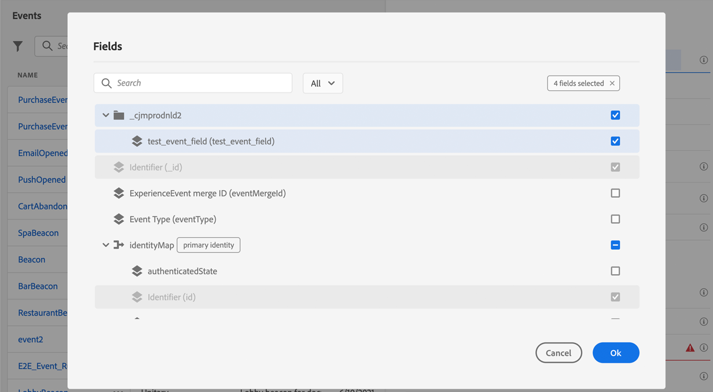

# 푸시 알림 채널 구성 {#push-notification-configuration}

[!DNL Journey Optimizer] 에서는 여정을 만들고 타겟팅된 대상자에게 메시지를 전송할 수 있습니다. [!DNL Journey Optimizer](으)로 푸시 알림을 전송하기 전에 모바일 앱과 [!DNL Adobe Experience Platform] 및 [!DNL Adobe Experience Platform Launch]에 구성 및 통합이 있는지 확인해야 합니다. Adobe 여정 최적기의 푸시 알림 데이터 흐름을 이해하려면 [이 페이지](push-gs.md)를 참조하십시오.

## 시작하기 전

<!--
### Check provisioning

Your Adobe Experience Platform account must be provisioned to contain following schemas and datasets for push notification data flow to function correctly:

| Schema <br>Dataset                                                                       | Group of fields                                                                                                                                                                         | Operation                                                |
| -------------------------------------------------------------------------------------- | --------------------------------------------------------------------------------------------------------------------------------------------------------------------------------------- | -------------------------------------------------------- |
| CJM Push Profile Schema <br>CJM Push Profile Dataset                                     | Push Notification Details<br>Adobe CJM ExperienceEvent - Message Profile Details<br>Adobe CJM ExperienceEvent - Message Execution Details<br>Application Details<br>Environment Details | Register Push Token                                      |
| CJM Push Tracking Experience Event Schema<br>CJM Push Tracking Experience Event Dataset | Push Notification Tracking                                                                                                                                                              | Track interactions and provide data for the reporting UI |
-->

### 권한 설정

모바일 애플리케이션을 만들기 전에 먼저 **Adobe Experience Platform Launch**&#x200B;에 올바른 사용자 권한이 있는지 또는 있는지 확인해야 합니다. 자세한 내용은 [Adobe Experience Platform Launch 설명서](https://experienceleague.adobe.com/docs/launch/using/admin/user-permissions.html)를 참조하십시오.

>[!CAUTION]
>
>푸시 구성은 전문가 사용자가 수행해야 합니다. 구현 모델 및 이 구현과 관련된 가상 인력에 따라 전체 권한 세트를 단일 제품 프로필에 할당하거나 앱 개발자와 **Adobe Journey Optimizer** 관리자 간에 권한을 공유해야 할 수 있습니다. [이 설명서](https://experienceleague.adobe.com/docs/launch/using/admin/user-permissions.html?lang=en#platform-launch-permissions)의 **Adobe Experience Platform Launch** 권한에 대해 자세히 알아보십시오

<!--ou need to your have access to perform following roles :

* Manage Datastreams
* Manage Client-side Properties
* Manage App Configurations
-->

**속성** 및 **회사** 권한을 할당하려면 아래 단계를 따르십시오.

1. **[!DNL Admin Console]**&#x200B;에 액세스합니다.

1. **[!UICONTROL Products]** 탭에서 **[!UICONTROL Adobe Experience Platform Launch]** 카드를 선택합니다.

   

1. 기존 **[!UICONTROL Product Profile]** 을 선택하거나 **[!UICONTROL New profile]** 버튼을 사용하여 새 하나를 만듭니다. [Admin Console 설명서](https://experienceleague.adobe.com/docs/experience-platform/access-control/ui/create-profile.html#ui)에서 새 **[!UICONTROL New profile]**&#x200B;을 만드는 방법을 알아봅니다.

1. **[!UICONTROL Permissions]** 탭에서 **[!UICONTROL Property rights]** 을 선택합니다.

   

1. **[!UICONTROL Add all]**&#x200B;을(를) 클릭합니다. 이렇게 하면 제품 프로필에 다음 권한이 추가됩니다.
   * **[!UICONTROL Approve]**
   * **[!UICONTROL Develop]**
   * **[!UICONTROL Manage Environments]**
   * **[!UICONTROL Manage Extensions]**
   * **[!UICONTROL Publish]**

   이러한 권한은 Adobe Experience Platform Mobile SDK에서 Adobe Journey Optimizer 확장을 설치 및 게시하고 앱 속성을 게시하는 데 필요합니다.

1. 그런 다음 왼쪽 메뉴에서 **[!UICONTROL Company rights]** 을 선택합니다.

   

1. 다음 권한을 추가합니다.

   * **[!UICONTROL Manage App Configurations]**
   * **[!UICONTROL Manage Properties]**

   이러한 권한은 모바일 앱 개발자가 **Adobe Experience Launch**&#x200B;에서 푸시 자격 증명을 설정하고 **Adobe Journey Optimizer**&#x200B;에서 푸시 알림 사전 설정을 정의하는 데 필요합니다.

   

1. **[!UICONTROL Save]**&#x200B;을(를) 클릭합니다.

이 **[!UICONTROL Product profile]**&#x200B;을 사용자에게 할당하려면 아래 단계를 따르십시오.

1. **[!DNL Admin Console]**&#x200B;에 액세스합니다.

1. **[!UICONTROL Products]** 탭에서 **[!UICONTROL Adobe Experience Platform Launch]** 카드를 선택합니다.

1. 이전에 구성한 **[!UICONTROL Product profile]** 을 선택합니다.

1. **[!UICONTROL Users]** 탭에서 **[!UICONTROL Add user]**&#x200B;을 클릭합니다.

   

1. 사용자 이름이나 이메일 주소를 입력하고 사용자를 선택합니다. 그런 다음 **[!UICONTROL Save]** 을 클릭합니다.

   >[!NOTE]
   >
   >이전에 Admin Console에서 사용자를 만들지 않은 경우 [사용자 추가 설명서](https://helpx.adobe.com/enterprise/admin-guide.html/enterprise/using/manage-users-individually.ug.html#add-users)를 참조하십시오.

   

### 앱 구성

기술 설정에는 앱 개발자와 비즈니스 관리자 간의 긴밀한 공동 작업이 포함됩니다. [!DNL Journey Optimizer]으로 푸시 알림을 전송하기 전에 Adobe Experience Platform Launch에서 설정을 정의하고 모바일 앱을 Adobe Experience Platform Mobile SDK와 통합해야 합니다.

아래 링크에 자세히 설명된 구현 단계를 따르십시오.

* **Apple iOS**&#x200B;의 경우:[Apple 설명서](https://developer.apple.com/documentation/usernotifications/registering_your_app_with_apns)에서 APNs에 앱을 등록하는 방법을 알아봅니다.
* **Google Android**&#x200B;의 경우:[Google Documentation](https://firebase.google.com/docs/cloud-messaging/android/client)에서 Android에서 Firebase Cloud Messaging 클라이언트 앱을 설정하는 방법을 알아봅니다

### 모바일 앱을 Adobe Experience Platform SDK와 통합합니다

Adobe Experience Platform Mobile SDK는 Android 및 iOS 호환 SDK를 통해 모바일용 클라이언트측 통합 API를 제공합니다. 앱에서 Adobe Experience Platform Mobile SDK로 설정하려면 [Adobe Experience Platform Mobile SDK 설명서](https://aep-sdks.gitbook.io/docs/getting-started/overview)를 따르십시오.

이렇게 하면 Adobe Experience Platform Launch에서 모바일 속성도 만들고 구성해야 합니다. 일반적으로 관리할 각 모바일 애플리케이션에 대해 모바일 속성을 만듭니다. [Adobe Experience Platform Launch 설명서](https://aep-sdks.gitbook.io/docs/getting-started/create-a-mobile-property)에서 모바일 속성을 만들고 구성하는 방법을 알아봅니다.


## 1단계:Adobe Experience Platform Launch {#push-credentials-launch}에 앱 푸시 자격 증명을 추가합니다.

올바른 사용자 권한을 부여한 후 이제 [!DNL Adobe Experience Platform Launch]에 모바일 애플리케이션 푸시 자격 증명을 추가해야 합니다.

Adobe이 대신 푸시 알림을 전송하도록 승인하려면 모바일 앱 푸시 자격 증명 등록이 필요합니다. 아래 절차를 참조하십시오.

1. [!DNL Adobe Experience Platform Launch]에서 드롭다운 메뉴에서 **[!UICONTROL Client Side]**&#x200B;이 선택되었는지 확인합니다.

1. 왼쪽 패널에서 **[!UICONTROL App Configurations]** 탭을 선택하고 **[!UICONTROL App Configuration]** 을 클릭하여 새 구성을 만듭니다.

1. 구성에 대해 **[!UICONTROL Name]**&#x200B;을 입력합니다.

1. **[!UICONTROL Messaging Service Type]** 드롭다운 메뉴에서 이러한 자격 증명에 사용할 **[!UICONTROL Messaging service type]** 을 선택합니다.

   * **Android용**

      

      1. **[!UICONTROL App ID (Android package name)]** 제공:일반적으로 패키지 이름은 `build.gradle` 파일의 앱 id입니다.

      1. FCM 푸시 자격 증명을 끌어다 놓습니다. 푸시 자격 증명을 가져오는 방법에 대한 자세한 내용은 [Google 설명서](https://firebase.google.com/docs/admin/setup#initialize-sdk)를 참조하십시오.
   * **iOS용**

      

      1. **[!UICONTROL App ID (iOS Bundle ID)]** 필드에 모바일 앱 **번들 Id**&#x200B;를 입력합니다. 앱 번들 ID는 **XCode**&#x200B;에서 기본 대상의 **일반** 탭에 있습니다.

      1. Apple 개발자 계정에 대한 **Apple 푸시 알림 인증 키**&#x200B;를 끌어다 놓습니다. 이 키는 **인증서**, **식별자** 및 **프로필** 페이지에서 가져올 수 있습니다.

      1. **키 ID**&#x200B;를 입력합니다. p8 인증 키를 만드는 동안 지정된 10자 문자열입니다. **인증서**, **식별자** 및 **프로필** 페이지의 **키** 탭에서 찾을 수 있습니다.

      1. **팀 ID**&#x200B;를 제공합니다. 멤버십 탭에서 찾을 수 있는 문자열 값입니다.


1. **[!UICONTROL Save]** 을 클릭하여 앱 구성을 만듭니다.

<!--
## Step 2: Set up a mobile property in Adobe Experience Platform Launch {#launch-property}

Setting up a mobile property allows the mobile app developer or marketer to configure the mobile SDKs attributes such as Session Timeouts, the [!DNL Adobe Experience Platform] sandbox to be targeted and the **[!UICONTROL Adobe Experience Platform Datasets]** to be used for mobile SDK to send data to.

For further details and procedures on how to set up a **[!UICONTROL Platform Launch property]**, refer to the steps detailed in [Adobe Experience Platform Mobile SDK documentation](https://aep-sdks.gitbook.io/docs/getting-started/create-a-mobile-property#create-a-mobile-property).


To get the SDKs needed for push notification to work you will need the following SDK extensions, for both Android and iOS:

* **[!UICONTROL Mobile Core]** (installed automatically)
* **[!UICONTROL Profile]** (installed automatically)
* **[!UICONTROL Adobe Experience Platform Edge]**
* **[!UICONTROL Adobe Experience Platform Assurance]**, optional but recommended to debug the mobile implementation.

Learn more about [!DNL Adobe Experience Platform Launch] extensions in [Adobe Experience Platform Launch documentation](https://experienceleague.adobe.com/docs/launch-learn/implementing-in-mobile-android-apps-with-launch/configure-launch/launch-add-extensions.html).
-->

## 2단계:모바일 속성에서 Adobe Journey Optimizer 확장 구성

Adobe Experience Platform Mobile SDK용 **Adobe Journey Optimizer 확장**&#x200B;은 모바일 앱에 대한 푸시 알림을 활성화하고 사용자 푸시 토큰을 수집하고 Adobe Experience Platform 서비스와의 상호 작용 측정을 관리하는 데 도움이 됩니다.

[Adobe Experience Platform Mobile SDK 설명서](https://aep-sdks.gitbook.io/docs/using-mobile-extensions/adobe-journey-optimizer)에서 Journey Optimizer 확장을 설정하는 방법을 알아봅니다.


<!-- 
**[!UICONTROL Edge configuration]** is used by **[!UICONTROL Edge]** extension to send custom data from mobile device to [!DNL Adobe Experience Platform]. 
To configure [!DNL Adobe Experience Platform], you must provide the **[!UICONTROL Sandbox]** name and **[!UICONTROL Event Dataset]**.

For further details and procedures on how to create **[!UICONTROL Edge configuration]**, refer to the steps detailed in [Adobe Experience Platform Mobile SDK documentation](https://aep-sdks.gitbook.io/docs/getting-started/configure-datastreams).

1. From [!DNL Adobe Experience Platform Launch], select the **[!UICONTROL Edge Configurations]** tab and click **[!UICONTROL Edge Configurations]**.
    
1. Select **[!UICONTROL New Edge Configuration]** to add a new **[!UICONTROL Edge Configuration]**.
1. Enter a **[!UICONTROL Name]** and click **[!UICONTROL Save]**

1. Click the **[!UICONTROL Adobe Experience Platform]** toggle to enable it.

1. Fill in the **[!UICONTROL Sandbox]**, **[!UICONTROL Event dataset]** and **[!UICONTROL Profile Dataset]** fields. Then, click **[!UICONTROL Save]**.
    
    


1. From [!DNL Adobe Experience Platform Launch], ensure that **[!UICONTROL Client Side]** is selected in the drop-down menu.

1. select the **[!UICONTROL Properties]** tab and click **[!UICONTROL New Property]**.

    

1. Enter a **[!UICONTROL Name]** for your new property.

1. Select **[!UICONTROL Mobile]** as **[!UICONTROL Platform]**.

    

1. Click **[!UICONTROL Save]** to create your new property.

To configure **[!UICONTROL Adobe Experience Platform Edge Extension]** to send custom data from mobile devices to [!DNL Adobe Experience Platform].

1. Select your previously created property and select the **[!UICONTROL Extensions]** tab to view the extensions for this property.

    

1. Click **[!UICONTROL Configure]** under the **[!UICONTROL Adobe Experience Platform Edge]** Network' extension.

1. From the **[!UICONTROL Edge Configuration]** drop-down list, select the **[!UICONTROL Edge Configuration]** created in the previous steps. For more information on **[!UICONTROL Edge Configuration]**, refer to this [section](#edge-configuration).

1. Click **[!UICONTROL Save]**.

To configure **[!UICONTROL Adobe Experience Platform Messaging]** extension to send push profile and push interactions to the correct datasets, follow the same steps as above. Use **[!UICONTROL Sandbox]**, **[!UICONTROL Event dataset]** and **[!UICONTROL Profile Dataset]** created in the [Adobe Experience Platform setup](#edge-configuration).
-->

<!--
## Step 4: Publish the Property {#publish-property}

You now need to publish the property to integrate your configuration and to use it in the mobile app. 

To publish your property, refer to the steps detailed in [Adobe Experience Platform Mobile SDK documentation](https://aep-sdks.gitbook.io/docs/getting-started/create-a-mobile-property#publish-the-configuration)

## Step 5: Configure the ProfileDataSource {#configure-profiledatasource}

To configure the `ProfileDataSource`, use the `ProfileDCInletURL` from [!DNL Adobe Experience Platform] setup and add the following in the mobile app:

```
    MobileCore.updateConfiguration(
    mutableMapOf("messaging.dccs" to <ProfileDCSInletURL>)
```

-->

## 3단계:이벤트 {#mobile-app-test} 를 사용하여 모바일 앱을 테스트합니다

이제 Adobe Experience Platform과 Launch 모두에서 모바일 앱을 구성한 후 프로필에 푸시 알림을 보내기 전에 테스트할 수 있습니다. 이 사용 사례에서는 모바일 앱을 타깃팅할 여정을 만들고 푸시 알림을 트리거할 이벤트를 설정합니다.

<!--
You can use a test mobile app for this use case. For more on this, refer to this [page](https://wiki.corp.adobe.com/pages/viewpage.action?spaceKey=CJM&title=Details+of+setting+the+mobile+test+app) (internal use only).
-->

이 여정이 작동하려면 XDM 스키마를 만들어야 합니다. 자세한 내용은 [XDM 설명서](https://experienceleague.adobe.com/docs/experience-platform/xdm/schema/composition.html?lang=en#schemas-and-data-ingestion) 를 참조하십시오.

1. 왼쪽 메뉴에서 **[!UICONTROL Schemas]**&#x200B;으로 이동합니다.

1. **[!UICONTROL Create schema]** 을 클릭한 다음 **[!UICONTROL XDM ExperienceEvent]** 을 선택합니다.

   

1. **[!UICONTROL Create a new field group]**&#x200B;를 선택합니다.

1. **[!UICONTROL Display Name]** 및 **[!UICONTROL Description]**&#x200B;을 입력합니다. 완료되면 **[!UICONTROL Add field groups]** 을 클릭합니다. 필드 그룹을 만드는 방법에 대한 자세한 내용은 [XDM 시스템 설명서](https://experienceleague.adobe.com/docs/experience-platform/xdm/tutorials/create-schema-ui.html?lang=ko) 를 참조하십시오.


   

1. 왼쪽에서 스키마를 선택합니다. 오른쪽 창에서 스키마 이름과 설명을 입력합니다. **[!UICONTROL Profile]**&#x200B;에 대해 이 스키마를 사용하도록 설정하십시오.

   


1. 왼쪽에서 필드 그룹을 선택한 다음 + 아이콘을 클릭하여 새 필드를 만듭니다. 오른쪽의 **[!UICONTROL Field groups properties]**&#x200B;에 **[!UICONTROL Field name]**, **[!UICONTROL Display name]**&#x200B;를 입력하고 **[!UICONTROL String]**&#x200B;을 **[!UICONTROL Type]**(으)로 선택합니다.

   

1. **[!UICONTROL Required]** 을 선택하고 **[!UICONTROL Apply]** 를 클릭합니다.

1. **[!UICONTROL Save]**&#x200B;을(를) 클릭합니다. 이제 스키마가 만들어지고 이벤트에서 사용할 수 있습니다.

그런 다음 이벤트를 설정해야 합니다.

1. 홈 페이지의 왼쪽 메뉴에서 관리 아래에서 **[!UICONTROL Configurations]** 을 선택합니다. **[!UICONTROL Events]** 섹션에서 **[!UICONTROL Manage]** 을 클릭하여 새 이벤트를 만듭니다.

1. **[!UICONTROL Create Event]** 을 클릭하면 화면 오른쪽에 이벤트 구성 창이 열립니다.

   

1. 이벤트의 이름을 입력합니다. 설명을 추가할 수도 있습니다.

1. **[!UICONTROL Event ID type]** 필드에서 **[!UICONTROL Rule Based]**&#x200B;을(를) 선택합니다.

1. **[!UICONTROL Parameters]**&#x200B;에서 앞에서 만든 스키마를 선택합니다.

   

1. 필드 목록에서 스키마 필드 그룹에 생성된 필드가 선택되어 있는지 확인합니다.

   

1. **[!UICONTROL Event ID condition]** 필드에서 **[!UICONTROL Edit]** 을 클릭합니다. 이전에 추가한 필드를 끌어다 놓아 여정을 트리거할 이벤트를 식별하는 데 시스템에서 사용할 조건을 정의합니다.

   

1. 테스트 앱에서 푸시 알림을 트리거하는 데 사용할 구문을 입력합니다. 이 예제에서는 **주문 확인**&#x200B;입니다.

   

1. **[!UICONTROL ECID]** 을(를) **[!UICONTROL Namespace]**(으)로 선택합니다.

1. **[!UICONTROL Ok]**&#x200B;을(를) 클릭한 뒤 **[!UICONTROL Save]**&#x200B;을(를) 클릭합니다.

이제 이벤트가 생성되어 이제 여정에서 사용할 수 있습니다.

1. 왼쪽 메뉴에서 **[!UICONTROL Journeys]** 을 클릭합니다.

1. **[!UICONTROL Create Journey]** 을 클릭하여 새 여정을 만듭니다.

1. 오른쪽에 표시되는 구성 창에서 여정의 속성을 편집합니다. 자세한 내용은 이 [섹션](building-journeys/journey-gs.md#change-properties)을 참조하십시오.

1. 먼저 **[!UICONTROL Events]** 드롭다운에서 이전 단계에서 만든 이벤트를 드래그하여 놓습니다.

   

1. **[!UICONTROL Actions]** 드롭다운에서 **[!UICONTROL Message]** 활동을 여정에 끌어다 놓습니다.

1. 앞에서 만든 메시지를 선택합니다. 푸시 알림을 만드는 방법에 대한 자세한 내용은 이 [page](create-message.md)을 참조하십시오.

1. **[!UICONTROL End]** 활동을 여정에 끌어다 놓습니다.

1. **[!UICONTROL Test]** 토글을 클릭하여 푸시 알림 테스트를 시작하고 **[!UICONTROL Trigger an event]** 를 클릭합니다.

   

1. **[!UICONTROL Key]** 필드에 ECID를 입력한 다음 두 번째 필드에 **주문 확인**&#x200B;을 입력합니다.

   

1. **[!UICONTROL Send]**&#x200B;을(를) 클릭합니다.

이벤트가 트리거되고 모바일 앱에 대한 푸시 알림을 받게 됩니다.

## 4단계:푸시{#message-preset}에 대한 메시지 사전 설정을 만듭니다.

모바일 앱이 [!DNL Adobe Experience Platform Launch]에 설정되면 **[!DNL Journey Optimizer]**&#x200B;에서 푸시 알림을 전송할 수 있도록 메시지 사전 설정을 만들어야 합니다.

[이 섹션](configuration/message-presets.md)에서 메시지 사전 설정을 만들고 구성하는 방법을 알아봅니다.

이제 Journey Optimizer에서 푸시 알림을 전송할 준비가 되었습니다.

* [이 페이지에서 푸시 메시지를 만드는 방법을 알아봅니다](create-push.md).
* [이 섹션](building-journeys/journeys-message.md)에서 여정에 메시지를 추가하는 방법을 알아봅니다.
