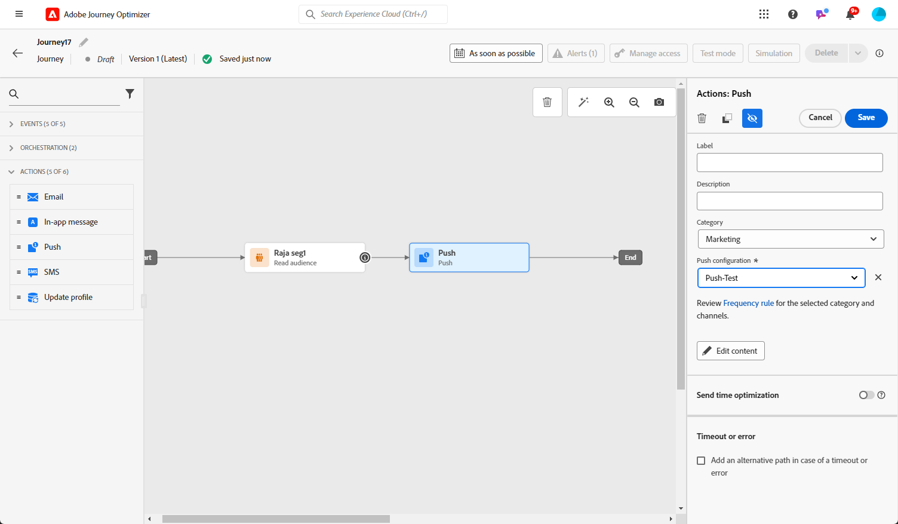

# 푸시 알림 만들기 {#create-push-notification}

>[!CONTEXTUALHELP]
>id="ajo_message_push"
>title="푸시 메시지 생성"
>abstract="푸시 메시지를 추가하고 표현식 편집기로 개인화를 시작합니다."

## 여정 또는 캠페인에서 푸시 알림 만들기 {#create}

푸시 알림을 만들려면 아래 단계를 수행하십시오.

>[!BEGINTABS]

>[!TAB 여정에 푸시 추가]

1. 여정을 열고 팔레트의 작업 섹션에서 푸시 활동을 끌어서 놓습니다.

   

1. 메시지에 대한 기본 정보(레이블, 설명, 카테고리)를 입력한 다음 사용할 메시지 표면을 선택합니다. 다음 **[!UICONTROL 표면]** 필드는 기본적으로 미리 채워져 있으며 사용자가 해당 채널에 대해 마지막으로 사용한 서페이스가 있습니다.

   

   >[!NOTE]
   >
   >여정에서 푸시 알림을 보내는 경우 Adobe Journey Optimizer의 전송 시간 최적화 기능을 활용하여 메시지를 보내는 최적의 시간을 예측하여 과거 열기 및 클릭률을 기반으로 참여를 극대화할 수 있습니다. [전송 시간 최적화를 사용하여 작업하는 방법에 대해 알아봅니다](../building-journeys/journeys-message.md#send-time-optimization)

   여정 구성 방법에 대한 자세한 내용은 [이 페이지](../building-journeys/journey-gs.md)

1. 여정 구성 화면에서 **[!UICONTROL 콘텐츠 편집]** 푸시 콘텐츠 구성 단추 [푸시 알림 디자인](design-push.md)

1. 메시지가 정의되면 테스트 프로필을 사용하여 미리 보고 테스트할 수 있습니다.

1. 푸시가 준비되면 의 구성을 완료합니다. [여정](../building-journeys/journey-gs.md) 보낼 수 있습니다.

   푸시 열기 및/또는 상호 작용을 통해 수신자의 동작을 추적하려면 추적 섹션의 전용 옵션이에서 활성화되어 있는지 확인합니다. [이메일 활동](../building-journeys/journeys-message.md).

>[!TAB 캠페인에 푸시 추가]

1. 새 예약된 캠페인 또는 API에서 트리거된 캠페인을 만들고, 다음을 선택합니다. **[!UICONTROL 푸시 알림]** 을(를) 작업으로 선택하고 **[!UICONTROL 앱 표면]** 사용할 수 있습니다. [푸시 구성에 대해 자세히 알아보기](push-configuration.md).

   

1. **[!UICONTROL 만들기]**&#x200B;를 클릭합니다.

1. 다음에서 **[!UICONTROL 속성]** 섹션, 캠페인의 편집 **[!UICONTROL 제목]** 및 **[!UICONTROL 설명]**.

   

1. 다음을 클릭합니다. **[!UICONTROL 대상자 선택]** 사용 가능한 Adobe Experience Platform 대상 목록에서 타깃팅할 대상을 정의하는 단추입니다. [자세히 알아보기](../audience/about-audiences.md).

1. 다음에서 **[!UICONTROL ID 네임스페이스]** 필드에서 선택한 대상에서 개인을 식별하기 위해 사용할 네임스페이스를 선택합니다. [자세히 알아보기](../event/about-creating.md#select-the-namespace).

   

1. 클릭 **[!UICONTROL 실험 만들기]** 콘텐츠 실험 구성을 시작하고 처리를 만들어 성능을 측정하고 타겟 대상자에 대한 최상의 옵션을 식별합니다. [자세히 알아보기](../campaigns/content-experiment.md)

1. 캠페인은 특정 날짜 또는 되풀이되는 빈도로 실행되도록 디자인됩니다. 구성 방법 알아보기 **[!UICONTROL 예약]** 의 내 캠페인 [이 섹션](../campaigns/create-campaign.md#schedule).

1. 다음에서 **[!UICONTROL 작업 트리거]** 메뉴에서 다음을 선택합니다. **[!UICONTROL 빈도]** 푸시 알림:

   * 한 번
   * 일별
   * 주별
   * 월별

1. 캠페인 구성 화면에서 다음을 클릭합니다. **[!UICONTROL 콘텐츠 편집]** 푸시 콘텐츠 구성 단추 [푸시 알림 디자인](design-push.md)

1. 메시지가 정의되면 테스트 프로필을 사용하여 미리 보고 테스트할 수 있습니다.

1. 푸시가 준비되면 의 구성을 완료합니다. [campaign](../campaigns/create-campaign.md) 보낼 수 있습니다.

   푸시 열기 및/또는 상호 작용을 통해 수신자의 동작을 추적하려면 추적 섹션의 전용 옵션이에서 활성화되어 있는지 확인합니다. [campaign](../campaigns/create-campaign.md).

>[!ENDTABS]

**관련 항목**

* [푸시 채널 구성](push-gs.md)
* [여정에 메시지 추가](../building-journeys/journeys-message.md)

## 빠른 전송 모드 {#rapid-delivery}

>[!CONTEXTUALHELP]
>id="ajo_campaigns_rapid_delivery"
>title="빠른 전송 모드"
>abstract="빠른 전송 모드를 사용하면 푸시 알림 채널에서 3천만 명 미만의 대상자에게 고속 메시지 전송 작업을 수행할 수 있습니다."

빠른 전송 모드는 [!DNL Journey Optimizer] 캠페인을 통해 매우 빠른 푸시 메시지를 대량으로 전송할 수 있는 추가 기능입니다.

빠른 게재는 메시지 게재 지연이 비즈니스에 중요한 경우, 휴대폰에 긴급 푸시 알림(예: 뉴스 채널 앱을 설치한 사용자에게 속보)을 전송하려는 경우 사용됩니다.

빠른 전송 모드를 사용할 때의 성능에 대한 자세한 내용은 다음을 참조하십시오. [Adobe Journey Optimizer 제품 설명](https://helpx.adobe.com/kr/legal/product-descriptions/adobe-journey-optimizer.html).

### 전제 조건 {#prerequisites}

빠른 전송 메시징에는 다음 요구 사항이 포함됩니다.

* 다음에 대한 빠른 전송 사용 가능: **[!UICONTROL 예약됨]** 캠페인에만 해당되며, API 트리거 캠페인에는 사용할 수 없습니다.
* 푸시 메시지에 개인화가 허용되지 않음,
* 타겟 대상자에는 3천만 개 이하의 프로필이 있어야 합니다.
* 빠른 전송 모드를 사용하여 최대 5개의 캠페인을 동시에 실행할 수 있습니다.

### 빠른 전송 모드 활성화

1. 푸시 알림 캠페인을 만들고 **[!UICONTROL 빠른 전송]** 옵션을 선택합니다.

1. 메시지 콘텐츠를 구성하고 타겟팅할 대상을 선택합니다. [캠페인을 만드는 방법 알아보기](#create)

   >[!IMPORTANT]
   >
   >메시지 콘텐츠에 개인화가 포함되지 않았으며 대상자에 30M 미만의 프로필이 포함되어 있는지 확인하십시오.

1. 평소대로 캠페인을 검토하고 활성화합니다. 테스트 모드에서는 메시지가 빠른 전송 모드를 통해 전송되지 않습니다.