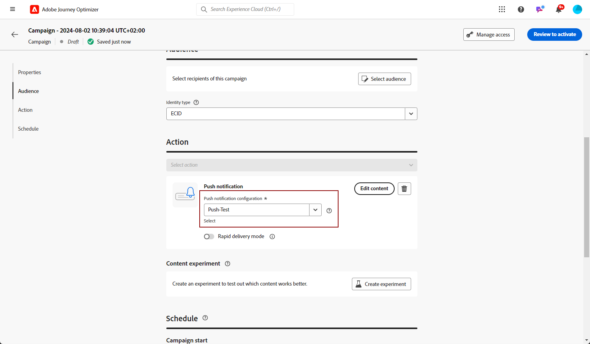

# 푸시 알림 만들기 {#create-push-notification}

>[!CONTEXTUALHELP]
>id="ajo_message_push"
>title="푸시 메시지 생성"
>abstract="푸시 메시지를 추가하고 개인화 편집기로 개인화를 시작합니다."

## 여정 또는 캠페인에서 푸시 알림 만들기 {#create}

푸시 알림을 만들려면 아래 단계를 수행하십시오.

>[!BEGINTABS]

>[!TAB 여정에 푸시 추가]

1. 여정을 열고 팔레트의 작업 섹션에서 푸시 활동을 끌어서 놓습니다.

   

1. 메시지에 대한 기본 정보(레이블, 설명, 카테고리)를 입력한 다음 사용할 메시지 구성을 선택합니다.

   

   >[!NOTE]
   >
   >여정에서 푸시 알림을 보내는 경우 Adobe Journey Optimizer의 전송 시간 최적화 기능을 활용하여 메시지를 보내는 최적의 시간을 예측하여 과거 열기 및 클릭률을 기반으로 참여를 극대화할 수 있습니다. [전송 시간 최적화를 사용하여 작업하는 방법을 알아봅니다](../building-journeys/journeys-message.md#send-time-optimization)

   여정 구성 방법에 대한 자세한 내용은 [이 페이지](../building-journeys/journey-gs.md)를 참조하세요.

1. 여정 구성 화면에서 **[!UICONTROL 콘텐츠 편집]** 단추를 클릭하여 푸시 콘텐츠를 구성합니다. [푸시 알림 디자인](design-push.md)

1. 메시지 콘텐츠가 정의되면 테스트 프로필 또는 CSV/JSON 파일에서 업로드한 샘플 입력 데이터 또는 수동으로 추가한 샘플 입력 데이터를 사용하여 콘텐츠를 미리 볼 수 있습니다.

1. 푸시가 준비되면 [여정](../building-journeys/journey-gs.md)의 구성을 완료하여 보내십시오.

   푸시 열기 및/또는 상호 작용을 통해 수신자의 동작을 추적하려면 [전자 메일 활동](../building-journeys/journeys-message.md)에서 추적 섹션의 전용 옵션을 사용하도록 설정해야 합니다.

>[!TAB Campaign에 푸시 추가]

1. **[!UICONTROL 캠페인]** 메뉴에 액세스한 다음 **[!UICONTROL 캠페인 만들기]**&#x200B;를 클릭합니다.

1. 실행할 캠페인 유형 선택

   * **예약됨 - 마케팅**: 캠페인을 즉시 또는 지정한 날짜에 실행합니다. 예약된 캠페인은 마케팅 메시지 전송을 목적으로 합니다. 사용자 인터페이스에서 구성 및 실행됩니다.

   * **API 트리거됨 - 마케팅/트랜잭션**: API 호출을 사용하여 캠페인을 실행하십시오. API 트리거 캠페인은 마케팅 또는 트랜잭션 메시지(예: 암호 재설정, 장바구니 구매 등 개인이 수행한 작업에 따라 전송된 메시지)를 보내는 것을 목표로 합니다.

1. **[!UICONTROL 속성]** 섹션에서 Campaign의 **[!UICONTROL 제목]** 및 **[!UICONTROL 설명]**&#x200B;을(를) 편집합니다.

1. 사용 가능한 Adobe Experience Platform 대상 목록에서 타깃팅할 대상을 정의하려면 **[!UICONTROL 대상 선택]** 단추를 클릭하십시오. [자세히 알아보기](../audience/about-audiences.md).

1. **[!UICONTROL ID 네임스페이스]** 필드에서 선택한 대상에서 개인을 식별하기 위해 사용할 네임스페이스를 선택합니다. [자세히 알아보기](../event/about-creating.md#select-the-namespace).

1. **[!UICONTROL 작업]** 섹션에서 **[!UICONTROL 푸시 알림]**&#x200B;을 선택하고 새 구성을 선택하거나 만드십시오.

   [이 페이지](push-configuration.md)에서 푸시 구성에 대해 자세히 알아보세요.

   

1. 콘텐츠 실험 구성을 시작하고 처리를 만들어 성능을 측정하고 대상 대상에 가장 적합한 옵션을 식별하려면 **[!UICONTROL 실험 만들기]**&#x200B;를 클릭하십시오. [자세히 알아보기](../content-management/content-experiment.md)

1. 캠페인은 특정 날짜 또는 되풀이되는 빈도로 실행되도록 디자인됩니다. [이 섹션](../campaigns/create-campaign.md#schedule)에서 캠페인의 **[!UICONTROL 일정]**&#x200B;을 구성하는 방법을 알아보세요.

1. **[!UICONTROL 작업 트리거]** 메뉴에서 푸시 알림의 **[!UICONTROL 빈도]**&#x200B;를 선택합니다.

   * 한 번
   * 일별
   * 주간
   * 월별

1. 캠페인 구성 화면에서 **[!UICONTROL 콘텐츠 편집]** 단추를 클릭하여 푸시 콘텐츠를 구성합니다. [푸시 알림 디자인](design-push.md)

1. 메시지 콘텐츠가 정의되면 테스트 프로필 또는 CSV/JSON 파일에서 업로드한 샘플 입력 데이터 또는 수동으로 추가한 샘플 입력 데이터를 사용하여 콘텐츠를 미리 볼 수 있습니다.

1. 푸시가 준비되면 [campaign](../campaigns/create-campaign.md)의 구성을 완료하여 보내십시오.

   푸시 열기 및/또는 상호 작용을 통해 수신자의 동작을 추적하려면 [campaign](../campaigns/create-campaign.md)에서 추적 섹션의 전용 옵션을 사용하도록 설정해야 합니다.

>[!ENDTABS]

**관련 항목**

* [푸시 채널 구성](push-gs.md)
* [여정에 메시지 추가](../building-journeys/journeys-message.md)

## 빠른 전송 모드 {#rapid-delivery}

>[!CONTEXTUALHELP]
>id="ajo_campaigns_rapid_delivery"
>title="빠른 전송 모드"
>abstract="빠른 전송 모드를 사용하면 푸시 채널에서 3000만 명 미만의 대상자에게 고속 메시지 전송 작업을 수행할 수 있습니다."

빠른 전송 모드는 캠페인을 통해 대량으로 매우 빠른 푸시 메시지를 전송할 수 있는 [!DNL Journey Optimizer] 추가 기능입니다.

빠른 게재는 메시지 게재 지연이 비즈니스에 중요한 경우, 휴대폰에 긴급 푸시 알림(예: 뉴스 채널 앱을 설치한 사용자에게 속보)을 전송하려는 경우 사용됩니다.

빠른 전송 모드를 사용할 때의 성능에 대한 자세한 내용은 [Adobe Journey Optimizer 제품 설명](https://helpx.adobe.com/kr/legal/product-descriptions/adobe-journey-optimizer.html)을 참조하세요.

### 전제 조건 {#prerequisites}

빠른 전송 메시징에는 다음 요구 사항이 포함됩니다.

* 빠른 게재는 **[!UICONTROL 예약됨]** 캠페인에만 사용할 수 있으며 API 트리거 캠페인에는 사용할 수 없습니다.
* 푸시 메시지에 개인화가 허용되지 않음,
* 타겟 대상자에는 3천만 개 이하의 프로필이 있어야 합니다.
* 빠른 전송 모드를 사용하여 최대 5개의 캠페인을 동시에 실행할 수 있습니다.

### 빠른 전송 모드 활성화

1. 푸시 알림 캠페인을 만들고 **[!UICONTROL 빠른 게재]** 옵션을 켭니다.

   

1. 메시지 콘텐츠를 구성하고 타겟팅할 대상을 선택합니다. [캠페인을 만드는 방법 알아보기](#create)

   >[!IMPORTANT]
   >
   >메시지 콘텐츠에 개인화가 포함되지 않았으며 대상자에 30M 미만의 프로필이 포함되어 있는지 확인하십시오.

1. 평소대로 캠페인을 검토하고 활성화합니다. 테스트 모드에서는 메시지가 빠른 전송 모드를 통해 전송되지 않습니다.