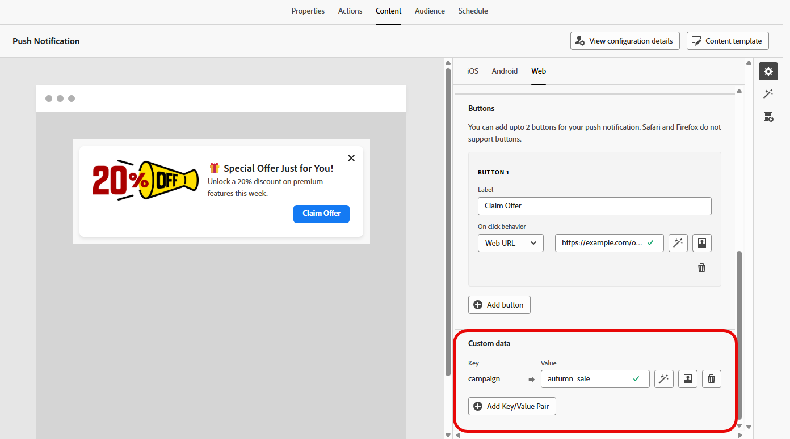

# 웹 푸시 알림 디자인 {#design-push-notification}

>[!AVAILABILITY]
>
>현재 Journey Optimizer의 웹 푸시 알림은 **자동 알림** 기능을 지원하지 않지만 나중에 사용할 수 있습니다.

웹 푸시 알림 캠페인이나 여정을 만든 후 요구 사항에 따라 콘텐츠 및 구조를 디자인할 수 있습니다. 웹 푸시 알림을 전송하기 전에 먼저 [채널 구성](push-configuration-web.md)에서 이 채널을 구성해야 합니다.

<!--
## Send a silent notification {#silent-notification}

A silent push notification (also called a background notification) is a hidden message sent to your web application without alerting the user.

To enable a silent notification, enable the **[!UICONTROL Silent Notification]** option. When this option is used, the notification is delivered directly to the application, and no alert, banner, or sound is shown to the user.

Use the **Custom Data** section to include additional information in the form of key-value pairs. 

-->

## 제목 및 본문 {#push-title-body}

메시지를 작성하려면 **[!UICONTROL 제목]** 및 **[!UICONTROL 본문]** 필드를 클릭합니다. 개인화 편집기를 사용하여 콘텐츠를 정의하고 [데이터를 개인 설정](../personalization/personalize.md)한 다음 [다이내믹 콘텐츠](../personalization/get-started-dynamic-content.md)를 추가하십시오.

Journey Optimizer AI Assistant를 사용하여 간편하게 콘텐츠를 생성하려면 **[!UICONTROL AI Assistant로 텍스트 편집]**&#x200B;을 클릭하십시오.

## 클릭 시 비헤이비어 {#on-click-behavior}

**[!UICONTROL 본문 클릭 동작]** 필드를 사용하여 사용자가 알림 본문을 클릭할 때 발생하는 동작을 결정하는 딥링크를 정의합니다. 이렇게 하면 웹 애플리케이션의 특정 페이지 또는 섹션으로 사용자를 직접 보낼 수 있습니다.

## 미디어 추가 {#add-media-push}

**[!UICONTROL 미디어 추가]** 필드에 미디어 URL을 입력합니다. URL에 개인화 토큰을 포함하여 각 사용자에 대한 콘텐츠를 사용자 지정할 수도 있습니다.

Journey Optimizer AI Assistant를 사용하여 미디어를 빠르게 생성하려면 을 클릭하십시오.

## 버튼 추가 {#add-buttons-push}

콘텐츠에 단추를 추가하여 웹 푸시 알림을 대화형으로 만듭니다.

장치의 잠금이 해제된 경우에만 버튼이 표시됩니다. 화면이 잠겨 있으면 **[!UICONTROL 제목]** 및 **[!UICONTROL 메시지]**&#x200B;만 표시됩니다.

**[!UICONTROL 단추 추가]** 옵션을 사용하여 각 단추의 레이블과 관련 작업을 정의합니다. 자세한 내용은 다음과 같습니다.

* **[!UICONTROL 딥링크]**: 앱 내의 특정 보기, 섹션 또는 탭으로 사용자를 리디렉션합니다. 관련 필드에 딥링크 URL을 입력합니다.

* **[!UICONTROL 웹 URL]**: 사용자를 외부 웹 페이지로 리디렉션합니다. 관련 필드에 URL을 입력합니다.

## 사용자 정의 데이터 {#custom-data}

**[!UICONTROL 사용자 지정 데이터]** 섹션에서 알림 페이로드에 사용자 지정 키-값 쌍을 추가할 수 있습니다. 이러한 값은 웹 애플리케이션에서 특정 작업을 트리거하거나 사용자 경험을 사용자 지정하는 데 사용할 수 있습니다. Adobe Experience Platform에서 푸시 알림을 설정하는 방법에 대한 자세한 내용은 [이 섹션](push-gs.md)을 참조하세요.

