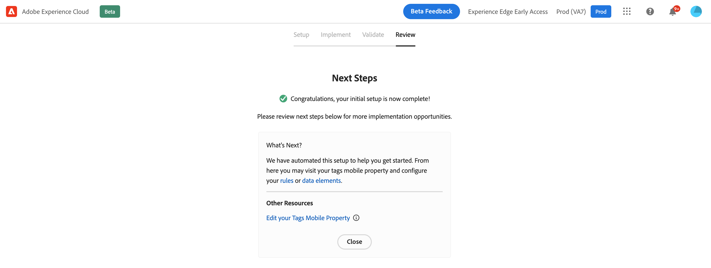

# 모바일 온보딩 빠른 시작 워크플로 {#mobile-wf}

새로운 **모바일 온보딩 빠른 시작 워크플로**&#x200B;는 Adobe Experience Platform Mobile SDK를 빠르게 구성하고, 모바일 이벤트 데이터의 수집 및 유효성 검사를 시작하고, [!DNL Journey Optimizer]을(를) 사용하여 푸시 알림을 전송하는 새로운 제품 기능입니다.

이 기능은 **[!DNL Adobe Experience Platform Data Collection]** 홈 페이지를 통해 모든 고객에게 공개 Beta으로 액세스할 수 있습니다.

## 시작하기{#gs-mobile-wf}

이 새로운 워크플로우는 총 클릭 수를 줄이고 Journey Optimizer에 대한 모바일 구성을 가속화하여 데이터 수집 설정을 자동화합니다. 이 빠른 시작 워크플로우에서는 모바일 구성을 [설정](##setup-mobile-wf), [구현](#implement-mobile-wf), [유효성 검사](#valid-mobile-wf) 및 [검토](#review-mobile-wf)하는 네 가지 간단한 단계를 수행합니다.

새 모바일 온보딩 빠른 시작 워크플로우에 액세스하려면 솔루션 전환기에서 **[!DNL Data Collection]**&#x200B;을(를) 찾아보십시오. 그런 다음 홈 페이지에서 **[!DNL Start Collecting Mobile Data]** 카드를 선택하십시오.

다음은 몇 가지 추가 기능입니다.

* 간편한 4단계 워크플로우 및 사용자 인터페이스.
* [Adobe Experience Platform Mobile SDK](https://developer.adobe.com/client-sdks/documentation/){target="_blank"}를 통해 모바일 이벤트 데이터 수집을 시작하는 기본 설정을 몇 분 만에 제공합니다.
* [Adobe Experience Platform Assurance](https://experienceleague.adobe.com/docs/experience-platform/assurance/home.html){target="_blank"}을(를) 활용하여 기본 모바일 푸시 이벤트를 테스트하고 확인하는 기능.
* 자동은 필요한 모든 데이터 수집 및 Journey Optimizer 에셋을 자동으로 만들고 구성합니다.
* 제품 지침 및 툴팁에 있습니다.
* 필요한 경우 고급 구현을 위한 자연스러운 전환을 제공합니다.

## 설정 {#setup-mobile-wf}

이 워크플로우의 첫 번째 단계는 모바일 속성, 모바일 확장, Journey Optimizer 확장, 규칙, 데이터 요소 등과 같은 Journey Optimizer 에셋 및 모든 필요한 데이터 수집을 자동으로 만들고 구성합니다.

Beta 약관에 동의한 후 모바일 앱 이름을 입력하고 **[!DNL Next]**&#x200B;을(를) 클릭합니다.

앱 ID와 인증 키 또는 키 파일을 포함하여 iOS 및 Android 플랫폼에 대한 정보를 제공합니다.

## 구현{#implement-mobile-wf}

다음 단계에서는 모바일 앱에 코드를 설치하기 위한 단계별 지침을 제공합니다.

## 유효성 검사{#valid-mobile-wf}

구현을 검토하고 확인하여 확인합니다. 테스트 푸시 알림을 전송할 수 있습니다.

## 검토 {#review-mobile-wf}

자동 설정이 완료되었습니다. 이제 태그 모바일 속성을 방문하여 규칙이나 데이터 요소를 구성하고 Adobe Journey Optimizer을 사용하여 푸시 알림을 전송할 수 있습니다.

**관련 항목**

* [푸시 알림 시작](get-started-push.md)
* [푸시 알림 데이터 흐름 및 구성 요소](push-gs.md)
* [푸시 채널 구성](push-configuration.md)
* [푸시 알림 보고서](../reports/journey-global-report-cja-push.md#push-global)
* [푸시 알림 만들기](create-push.md)
