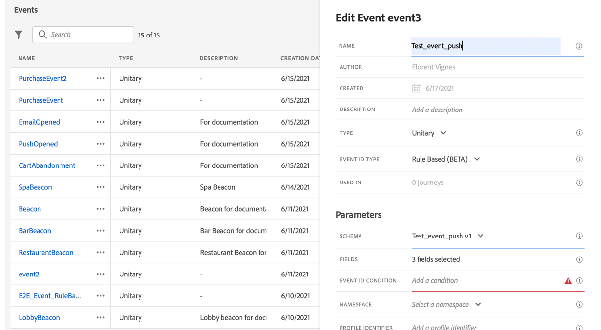
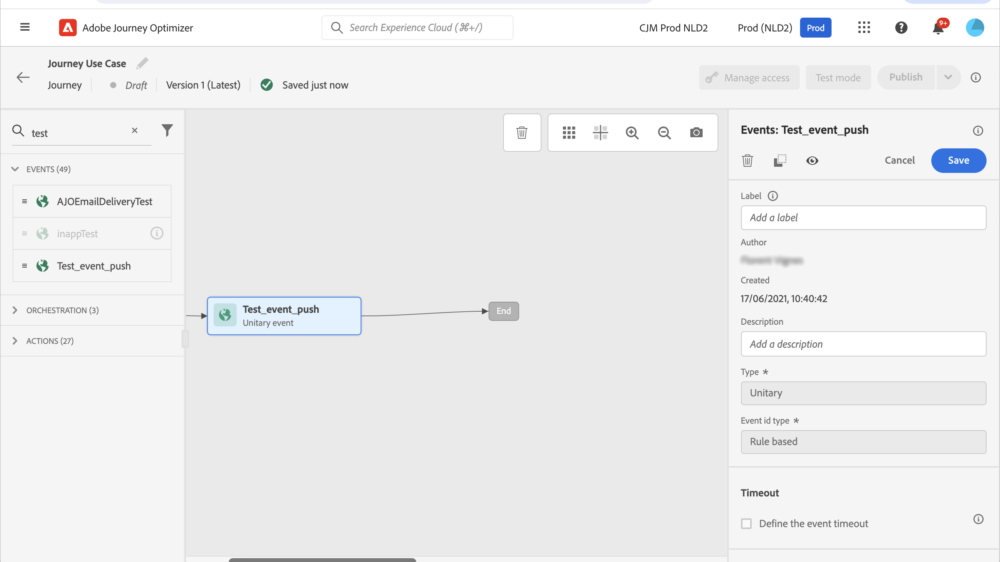

# 푸시 알림 채널 구성 {#push-notification-configuration}

[!DNL Journey Optimizer]에서는 여정을 만들고 타겟팅한 대상자에게 메시지를 보낼 수 있습니다. [!DNL Journey Optimizer]을(를) 사용하여 푸시 알림을 전송하기 전에 모바일 앱과 Adobe Experience Platform의 태그에 대한 구성 및 통합을 수행해야 합니다. [!DNL Adobe Journey Optimizer]의 푸시 알림 데이터 흐름을 파악하려면 [이 페이지](push-gs.md)를 참조하십시오.

>[!AVAILABILITY]
>
>이제 새 **모바일 온보딩 빠른 시작 워크플로우**&#x200B;를 사용할 수 있습니다. 이 새로운 제품 기능을 사용하여 모바일 이벤트 데이터 수집 및 유효성 검사를 시작하고 모바일 푸시 알림을 전송할 모바일 SDK을 신속하게 구성할 수 있습니다. 이 기능은 데이터 수집 홈 페이지를 통해 공개 베타로 액세스할 수 있습니다. [자세히 알아보기](mobile-onboarding-wf.md)
>

## 시작하기 전 {#start-push}

### 권한 설정 {#setup-permissions}

모바일 애플리케이션을 만들기 전에 먼저 Adobe Experience Platform의 태그에 대한 올바른 사용자 권한이 있는지 확인하거나 사용자에게 할당해야 합니다. 자세한 내용은 [태그 설명서](https://experienceleague.adobe.com/docs/experience-platform/tags/admin/user-permissions.html){target="_blank"}를 참조하세요.

>[!CAUTION]
>
>푸시 구성은 전문가 사용자가 수행해야 합니다. 구현 모델 및 이 구현에 관련된 담당자에 따라 단일 제품 프로필에 전체 권한 집합을 할당하거나 앱 개발자와 **Adobe Journey Optimizer** 관리자 간에 권한을 공유해야 할 수 있습니다. [이 설명서](https://experienceleague.adobe.com/docs/experience-platform/tags/admin/user-permissions.html){target="_blank"}에서 **태그** 권한에 대해 자세히 알아보세요.

<!--ou need to your have access to perform following roles :

* Manage Datastreams
* Manage Client-side Properties
* Manage App Configurations
-->

**속성** 및 **회사** 권한을 할당하려면 아래 단계를 따르십시오.

1. **[!DNL Admin Console]**&#x200B;에 액세스합니다.

1. **[!UICONTROL 제품]** 탭에서 **[!UICONTROL Adobe Experience Platform 데이터 수집]** 카드를 선택합니다.

   

1. 기존 **[!UICONTROL 제품 프로필]**&#x200B;을 선택하거나 **[!UICONTROL 새 프로필]** 버튼을 사용하여 새 프로필을 만드십시오. [Admin Console 설명서](https://experienceleague.adobe.com/docs/experience-platform/access-control/ui/create-profile.html#ui){target="_blank"}에서 새 **[!UICONTROL 새 프로필]**&#x200B;을 만드는 방법을 알아보세요.

1. **[!UICONTROL 권한]** 탭에서 **[!UICONTROL 속성 권한]**&#x200B;을 선택합니다.

   

1. **[!UICONTROL 모두 추가]**&#x200B;를 클릭합니다. 이렇게 하면 제품 프로필에 다음 권한이 추가됩니다.
   * **[!UICONTROL 승인]**
   * **[!UICONTROL 개발]**
   * **[!UICONTROL 환경 관리]**
   * **[!UICONTROL 확장 관리]**
   * **[!UICONTROL 게시]**

   Adobe Experience Platform Mobile SDK에서 Adobe Journey Optimizer 확장을 설치 및 게시하고 앱 속성을 게시하려면 이러한 권한이 필요합니다.

1. 그런 다음 왼쪽 메뉴에서 **[!UICONTROL 회사 권한]**&#x200B;을 선택합니다.

   

1. 다음 권한을 추가합니다.

   * **[!UICONTROL 앱 구성 관리]**
   * **[!UICONTROL 속성 관리]**

   이러한 권한은 모바일 앱 개발자가 **Adobe Experience Platform 데이터 수집**&#x200B;에서 푸시 자격 증명을 설정하고 **Adobe Journey Optimizer**&#x200B;에서 푸시 알림 채널 구성(즉, 메시지 사전 설정)을 정의하는 데 필요합니다.

   

1. **[!UICONTROL 저장]**&#x200B;을 클릭합니다.

이 **[!UICONTROL 제품 프로필]**&#x200B;을 사용자에게 할당하려면 아래 단계를 따르십시오.

1. **[!DNL Admin Console]**&#x200B;에 액세스합니다.

1. **[!UICONTROL 제품]** 탭에서 **[!UICONTROL Adobe Experience Platform 데이터 수집]** 카드를 선택합니다.

1. 이전에 구성한 **[!UICONTROL 제품 프로필]**&#x200B;을 선택하세요.

1.  **[!UICONTROL 사용자]** 탭에서 **[!UICONTROL 사용자 추가]**&#x200B;를 클릭합니다.

   

1. 사용자의 이름 또는 이메일 주소를 입력하고 사용자를 선택합니다. 그런 다음 **[!UICONTROL 저장]**&#x200B;을 클릭합니다.

   >[!NOTE]
   >
   >사용자가 이전에 Admin Console에서 만들어진 것이 아니라면 [사용자 추가 설명서](https://helpx.adobe.com/enterprise/admin-guide.html/enterprise/using/manage-users-individually.ug.html#add-users)를 참조하세요.

   


### 데이터 세트 확인 {#push-datasets}

푸시 알림 채널에서는 다음 스키마 및 데이터 세트를 사용할 수 있습니다.

| 스키마 <br>데이터 집합 | 필드 그룹 | 작업 |
| -------------------------------------------------------------------------------------- | --------------------------------------------------------------------------------------------------------------------------------------------------------------------------------------- | -------------------------------------------------------- |
| CJM 푸시 프로필 스키마 <br>CJM 푸시 프로필 데이터 세트 | 푸시 알림 세부 정보<br>Adobe CJM ExperienceEvent - 메시지 프로필 세부 정보<br>Adobe CJM ExperienceEvent - 메시지 실행 세부 정보<br>애플리케이션 세부 정보<br>환경 세부 정보 | 푸시 토큰 등록 |
| CJM 푸시 추적 경험 이벤트 스키마<br>CJM 푸시 추적 경험 이벤트 데이터 세트 | 푸시 알림 추적 | 상호 작용 추적 및 보고 UI에 대한 데이터 제공 |


>[!NOTE]
>
>푸시 추적 이벤트가 CJM 푸시 추적 경험 이벤트 데이터 세트에 수집되면 데이터가 부분적으로 성공적으로 수집되더라도 일부 오류가 발생할 수 있습니다. 이 문제는 매핑의 일부 필드가 수신 이벤트에 없는 경우 발생할 수 있습니다. 시스템에서 경고를 기록하지만 데이터의 유효한 부분에 대한 수집은 금지하지 않습니다. 이러한 경고는 일괄 처리 상태에서 &#39;실패&#39;로 표시되지만 부분 수집 성공을 반영합니다.
>
>각 스키마의 전체 필드와 속성 목록을 보려면 [Journey Optimizer 스키마 사전](https://experienceleague.adobe.com/tools/ajo-schemas/schema-dictionary.html?lang=ko){target="_blank"}을 찾아봅니다.


### 앱 구성 {#configure-app}

기술 설정에는 앱 개발자와 비즈니스 관리자 간의 긴밀한 협업이 포함됩니다. [!DNL Journey Optimizer]을(를) 사용하여 푸시 알림 전송을 시작하기 전에 푸시 자격 증명, Adobe Journey Optimizer의 푸시 채널 구성을 만들고 모바일 앱을 Adobe Experience Platform Mobile SDK와 통합해야 합니다.

아래 링크에 자세히 설명된 구현 단계를 따르십시오.

* **Apple iOS**&#x200B;의 경우: [Apple 설명서](https://developer.apple.com/documentation/usernotifications/registering_your_app_with_apns){target="_blank"}에서 APNs에 앱을 등록하는 방법에 대해 알아보세요.
* **Google Android**&#x200B;의 경우: Android에서 Firebase Cloud Messaging 클라이언트 앱을 설정하는 방법은 [Google 설명서](https://firebase.google.com/docs/cloud-messaging/android/client){target="_blank"}를 참조하세요.

### 모바일 앱을 Adobe Experience Platform SDK과 통합 {#integrate-mobile-app}

Adobe Experience Platform Mobile SDK은 Android 및 iOS 호환 SDK를 통해 모바일에 대한 클라이언트측 통합 API를 제공합니다. 앱에서 Adobe Experience Platform Mobile SDK를 설정하려면 [Adobe Experience Platform Mobile SDK 설명서](https://developer.adobe.com/client-sdks/documentation/getting-started/){target="_blank"}를 따르십시오.

이 작업이 끝날 때까지 [!DNL Adobe Experience Platform Data Collection]에서 모바일 속성도 만들고 구성해야 합니다. 일반적으로 관리하려는 각 모바일 애플리케이션에 대해 모바일 속성을 만듭니다. [Adobe Experience Platform Mobile SDK 설명서](https://developer.adobe.com/client-sdks/documentation/getting-started/create-a-mobile-property/){target="_blank"}에서 모바일 속성을 만들고 구성하는 방법에 대해 알아봅니다.


## 1단계: Journey Optimizer에서 앱 푸시 자격 증명 추가 {#push-credentials-launch}

올바른 사용자 권한을 부여한 후 이제 Journey Optimizer에서 모바일 애플리케이션 푸시 자격 증명을 추가해야 합니다.

Adobe이 사용자를 대신하여 푸시 알림을 전송하도록 승인하려면 모바일 앱 푸시 자격 증명 등록이 필요합니다. 아래에 자세히 설명된 단계를 참조하십시오.

1. **[!UICONTROL 채널]** > **[!UICONTROL 푸시 설정]** > **[!UICONTROL 푸시 자격 증명]** 메뉴에 액세스합니다.

1. **[!UICONTROL 푸시 자격 증명 만들기]**&#x200B;를 클릭합니다.

1. **[!UICONTROL 플랫폼]** 드롭다운에서 운영 체제를 선택합니다.

   * **iOS용**

     

      1. 모바일 앱 **[!UICONTROL 앱 ID]**&#x200B;를 입력하세요.

      1. **[!UICONTROL 모든 샌드박스에 적용]** 옵션을 활성화하여 모든 샌드박스에서 푸시 자격 증명을 사용할 수 있도록 합니다. 특정 샌드박스에 동일한 플랫폼 및 앱 ID 쌍에 대한 자체 자격 증명이 있는 경우 해당 샌드박스별 자격 증명이 우선합니다.

      1. 자격 증명을 추가하려면 **[!UICONTROL 푸시 자격 증명 수동 입력]** 단추를 켭니다.

      1. .p8 Apple 푸시 알림 인증 키 파일을 끌어서 놓습니다. 이 키는 **인증서**, **식별자** 및 **프로필** 페이지에서 가져올 수 있습니다.

      1. **키 ID**&#x200B;을(를) 제공합니다. p8 인증 키를 만드는 동안 할당된 10개의 문자열입니다. **인증서**, **식별자** 및 **프로필** 페이지의 **키** 탭에서 찾을 수 있습니다.

      1. **팀 ID**&#x200B;를 제공하십시오. 멤버십 탭에서 찾을 수 있는 문자열 값입니다.

   * **Android용**

     

      1. **[!UICONTROL 앱 ID]**&#x200B;를 제공하십시오. 일반적으로 패키지 이름은 `build.gradle` 파일의 앱 ID입니다.

      1. **[!UICONTROL 모든 샌드박스에 적용]** 옵션을 활성화하여 모든 샌드박스에서 푸시 자격 증명을 사용할 수 있도록 합니다. 특정 샌드박스에 동일한 플랫폼 및 앱 ID 쌍에 대한 자체 자격 증명이 있는 경우 해당 샌드박스별 자격 증명이 우선합니다.

      1. 자격 증명을 추가하려면 **[!UICONTROL 푸시 자격 증명을 수동으로 입력]** 단추를 켭니다.

      1. FCM 푸시 자격 증명을 끌어서 놓습니다. 푸시 자격 증명을 가져오는 방법에 대한 자세한 내용은 [Google 설명서](https://firebase.google.com/docs/admin/setup#initialize-sdk){target="_blank"}를 참조하세요.


1. 앱 구성을 만들려면 **[!UICONTROL 제출]**&#x200B;을 클릭합니다.

<!--
## Step 2: Set up a mobile property in Adobe Experience Platform Launch {#launch-property}

Setting up a mobile property allows the mobile app developer or marketer to configure the mobile SDKs attributes such as Session Timeouts, the [!DNL Adobe Experience Platform] sandbox to be targeted and the **[!UICONTROL Adobe Experience Platform Datasets]** to be used for mobile SDK to send data to.

For further details and procedures on how to set up a **[!UICONTROL Platform Launch property]**, refer to the steps detailed in [Adobe Experience Platform Mobile SDK documentation](https://aep-sdks.gitbook.io/docs/getting-started/create-a-mobile-property#create-a-mobile-property).


To get the SDKs needed for push notification to work you will need the following SDK extensions, for both Android and iOS:

* **[!UICONTROL Mobile Core]** (installed automatically)
* **[!UICONTROL Profile]** (installed automatically)
* **[!UICONTROL Adobe Experience Platform Edge]**
* **[!UICONTROL Adobe Experience Platform Assurance]**, optional but recommended to debug the mobile implementation.

Learn more about [!DNL Adobe Experience Platform Launch] extensions in [Adobe Experience Platform Launch documentation](https://experienceleague.adobe.com/docs/launch-learn/implementing-in-mobile-android-apps-with-launch/configure-launch/launch-add-extensions.html).
-->

## 2단계: 푸시할 채널 구성 만들기{#message-preset}

푸시 자격 증명을 만든 후에는 **[!DNL Journey Optimizer]**&#x200B;에서 푸시 알림을 전송할 수 있는 구성을 만들어야 합니다.

1. **[!UICONTROL 채널]** > **[!UICONTROL 일반 설정]** > **[!UICONTROL 채널 구성]** 메뉴에 액세스한 다음 **[!UICONTROL 채널 구성 만들기]**&#x200B;를 클릭하십시오.

   

1. 구성의 이름 및 설명(선택 사항)을 입력합니다.

   >[!NOTE]
   >
   > 이름은 문자(A-Z)로 시작해야 합니다. 영숫자만 포함할 수 있습니다. 밑줄 `_`, 점 `.`, 하이픈 `-`도 사용할 수 있습니다.


1. 구성에 사용자 지정 또는 핵심 데이터 사용 레이블을 할당하려면 **[!UICONTROL 액세스 관리]**&#x200B;를 선택할 수 있습니다. [OLAC(개체 수준 액세스 제어)에 대해 자세히 알아보세요](../administration/object-based-access.md).

1. **푸시** 채널을 선택하십시오.

   

1. 이 구성을 사용하여 동의 정책을 메시지에 연결하려면 **[!UICONTROL 마케팅 액션]**&#x200B;을 선택하십시오. 마케팅 액션과 관련된 모든 동의 정책은 고객의 선호도를 존중하기 위해 활용됩니다. [자세히 알아보기](../action/consent.md#surface-marketing-actions)

1. **[!UICONTROL 플랫폼]**&#x200B;을 선택하세요.

1. 위에 구성된 [푸시 자격 증명](#push-credentials-launch)과 동일한 **[!UICONTROL 앱 ID]**&#x200B;을(를) 선택하십시오.

1. 변경 내용을 저장합니다.

이제 푸시 알림을 만들 때 구성을 선택할 수 있습니다.

## 3단계: 모바일 속성에서 Adobe Journey Optimizer 확장 구성 {#configure-journey-optimizer-extension}

Adobe Experience Platform Mobile SDK용 **Adobe Journey Optimizer 확장**&#x200B;은(는) 모바일 앱에 대한 푸시 알림을 실행하고 사용자 푸시 토큰을 수집하고 Adobe Experience Platform 서비스와의 상호 작용 측정을 관리하는 데 도움이 됩니다.

[Journey Optimizer Mobile SDK 설명서](https://developer.adobe.com/client-sdks/documentation/adobe-journey-optimizer/){target="_blank"}에서 Adobe Experience Platform 확장을 설정하는 방법을 알아봅니다.


<!-- 
**[!UICONTROL Edge configuration]** is used by **[!UICONTROL Edge]** extension to send custom data from mobile device to [!DNL Adobe Experience Platform]. 
To configure [!DNL Adobe Experience Platform], you must provide the **[!UICONTROL Sandbox]** name and **[!UICONTROL Event Dataset]**.

1. From [!DNL Adobe Experience Platform Launch], select the **[!UICONTROL Edge Configurations]** tab and click **[!UICONTROL Edge Configurations]**.
    
1. Select **[!UICONTROL New Edge Configuration]** to add a new **[!UICONTROL Edge Configuration]**.
1. Enter a **[!UICONTROL Name]** and click **[!UICONTROL Save]**

1. Click the **[!UICONTROL Adobe Experience Platform]** toggle to enable it.

1. Fill in the **[!UICONTROL Sandbox]**, **[!UICONTROL Event dataset]** and **[!UICONTROL Profile Dataset]** fields. Then, click **[!UICONTROL Save]**.
    
    


1. From [!DNL Adobe Experience Platform Launch], ensure that **[!UICONTROL Client Side]** is selected in the drop-down menu.

1. select the **[!UICONTROL Properties]** tab and click **[!UICONTROL New Property]**.

    

1. Enter a **[!UICONTROL Name]** for your new property.

1. Select **[!UICONTROL Mobile]** as **[!UICONTROL Platform]**.

    

1. Click **[!UICONTROL Save]** to create your new property.

To configure **[!UICONTROL Adobe Experience Platform Edge Extension]** to send custom data from mobile devices to [!DNL Adobe Experience Platform].

1. Select your previously created property and select the **[!UICONTROL Extensions]** tab to view the extensions for this property.

    

1. Click **[!UICONTROL Configure]** under the **[!UICONTROL Adobe Experience Platform Edge]** Network' extension.

1. From the **[!UICONTROL Edge Configuration]** drop-down list, select the **[!UICONTROL Edge Configuration]** created in the previous steps. For more information on **[!UICONTROL Edge Configuration]**, refer to this [section](#edge-configuration).

1. Click **[!UICONTROL Save]**.

To configure **[!UICONTROL Adobe Experience Platform Messaging]** extension to send push profile and push interactions to the correct datasets, follow the same steps as above. Use **[!UICONTROL Sandbox]**, **[!UICONTROL Event dataset]** and **[!UICONTROL Profile Dataset]** created in the [Adobe Experience Platform setup](#edge-configuration).
-->

<!--
## Step 4: Publish the Property {#publish-property}

You now need to publish the property to integrate your configuration and to use it in the mobile app. 

To publish your property, refer to the steps detailed in [Adobe Experience Platform Mobile SDK documentation](https://aep-sdks.gitbook.io/docs/getting-started/create-a-mobile-property#publish-the-configuration)

## Step 5: Configure the ProfileDataSource {#configure-profiledatasource}

To configure the `ProfileDataSource`, use the `ProfileDCInletURL` from [!DNL Adobe Experience Platform] setup and add the following in the mobile app:

```
    MobileCore.updateConfiguration(
    mutableMapOf("messaging.dccs" to <ProfileDCSInletURL>)
```

-->

## 4단계: 이벤트로 모바일 앱 테스트 {#mobile-app-test}

이제 Adobe Experience Platform과 [!DNL Adobe Experience Platform Data Collection]에서 모두 모바일 앱을 구성한 후 프로필로 푸시 알림을 보내기 전에 테스트할 수 있습니다. 이 사용 사례에서는 모바일 앱을 타깃팅하는 여정을 만들고 푸시 알림을 트리거하는 이벤트를 설정합니다.

<!--
You can use a test mobile app for this use case. For more on this, refer to this [page](https://wiki.corp.adobe.com/pages/viewpage.action?spaceKey=CJM&title=Details+of+setting+the+mobile+test+app) (internal use only).
-->

이 여정이 작동하려면 XDM 스키마를 만들어야 합니다. 자세한 내용은 [XDM 설명서](https://experienceleague.adobe.com/docs/experience-platform/xdm/schema/composition.html#schemas-and-data-ingestion){target="_blank"}를 참조하세요.

1. 데이터 관리 메뉴 섹션에서 **[!UICONTROL 스키마]**를 클릭합니다.
   
1. **[!UICONTROL 스키마 만들기]**&#x200B;를 클릭하고 오른쪽 상단에서 **[!UICONTROL 경험 이벤트]**&#x200B;를 선택한 후 **다음**을 클릭합니다.
   
1. 스키마의 이름과 설명을 입력하고 **마침**을 클릭합니다.
   
1. **필드 그룹** 섹션에서 왼쪽의 **추가**&#x200B;를 클릭하고 **[!UICONTROL 새 필드 그룹 만들기]**&#x200B;를 선택합니다.

1. **[!UICONTROL 표시 이름]** 및 **[!UICONTROL 설명]**&#x200B;을 입력하십시오. 완료되면 **[!UICONTROL 필드 그룹 추가]**&#x200B;를 클릭하세요. 필드 그룹을 만드는 방법에 대한 자세한 내용은 [XDM 시스템 설명서](https://experienceleague.adobe.com/docs/experience-platform/xdm/tutorials/create-schema-ui.html?lang=ko){target="_blank"}를 참조하세요.


   

1. 왼쪽에서 스키마를 선택합니다. 오른쪽 창에서 **[!UICONTROL 프로필]**&#x200B;에 대해 이 스키마를 사용하도록 설정하십시오.

   


1. 왼쪽에서 필드 그룹을 선택한 다음 + 아이콘을 클릭하여 새 필드를 만듭니다. **[!UICONTROL 필드 그룹 속성]**&#x200B;의 오른쪽에서 **[!UICONTROL 필드 이름]**, **[!UICONTROL 표시 이름]**&#x200B;을 입력하고 **[!UICONTROL 문자열]**&#x200B;을(를) **[!UICONTROL 유형]**(으)로 선택합니다.

   

1. **[!UICONTROL 필수]**&#x200B;을(를) 확인하고 **[!UICONTROL 적용]**&#x200B;을 클릭합니다.

1. **[!UICONTROL 저장]**&#x200B;을 클릭합니다. 이제 스키마가 만들어지고 이벤트에서 사용할 수 있습니다.

그런 다음 이벤트를 설정해야 합니다.

1. 홈 페이지의 왼쪽 메뉴에서 관리 아래의 **[!UICONTROL 구성]**&#x200B;을 선택합니다. **[!UICONTROL 이벤트]** 섹션에서 **[!UICONTROL 관리]**&#x200B;를 클릭하여 새 이벤트를 만듭니다.

1. **[!UICONTROL 이벤트 만들기]**&#x200B;를 클릭하면 화면 오른쪽에 이벤트 구성 창이 열립니다.

   

1. 이벤트의 이름을 입력합니다. 설명을 추가할 수도 있습니다.

1. **[!UICONTROL 이벤트 ID 유형]** 필드에서 **[!UICONTROL 규칙 기반]**&#x200B;을 선택합니다.

1. **[!UICONTROL 매개 변수]**&#x200B;에서 이전에 만든 스키마를 선택합니다.

   

1. 필드 목록에서 스키마 필드 그룹에서 만든 필드가 선택되어 있는지 확인합니다.

   

1. **[!UICONTROL 이벤트 ID 조건]** 필드에서 **[!UICONTROL 편집]**&#x200B;을 클릭합니다. 이전에 추가한 필드를 드래그 앤 드롭하여 여정을 트리거하는 이벤트를 식별하는 데 사용할 조건을 정의합니다.

   

1. 테스트 앱에서 푸시 알림을 트리거하는 데 사용해야 하는 구문을 이 예제 **주문 확인**&#x200B;에서 입력합니다.

   

1. **[!UICONTROL ECID]**&#x200B;을(를) **[!UICONTROL 네임스페이스]**(으)로 선택합니다.

1. **[!UICONTROL 확인]**&#x200B;을 클릭한 다음 **[!UICONTROL 저장]**&#x200B;을 클릭합니다.

이제 이벤트가 생성되었으며 이제 여정에서 사용할 수 있습니다.

1. 왼쪽 메뉴에서 **[!UICONTROL 여정]**&#x200B;을 클릭합니다.

1. 새 여정을 만들려면 **[!UICONTROL 여정 만들기]**&#x200B;를 클릭하십시오.

1. 오른쪽에 표시되는 구성 창에서 여정의 속성을 편집합니다. 이 [섹션](../building-journeys/journey-properties.md)에서 자세히 알아보세요.

1. **[!UICONTROL 이벤트]** 드롭다운에서 이전 단계에서 만든 이벤트를 끌어서 놓는 것으로 시작합니다.

   

1. **[!UICONTROL 작업]** 드롭다운에서 **[!UICONTROL 푸시]** 활동을 여정으로 끌어다 놓습니다.

1. 푸시 알림을 구성합니다. 푸시 알림을 만드는 방법에 대한 자세한 내용은 이 [페이지](create-push.md)를 참조하세요.

1. **[!UICONTROL 테스트]** 토글을 클릭하여 푸시 알림 테스트를 시작하고 **[!UICONTROL 이벤트 트리거]**&#x200B;를 클릭합니다.

   

1. **[!UICONTROL 키]** 필드에 ECID를 입력한 다음 두 번째 필드에 **주문 확인**&#x200B;을 입력합니다.

   

1. **[!UICONTROL 보내기]**&#x200B;를 클릭합니다.

이벤트가 트리거되고 모바일 앱에 대한 푸시 알림을 받게 됩니다.

