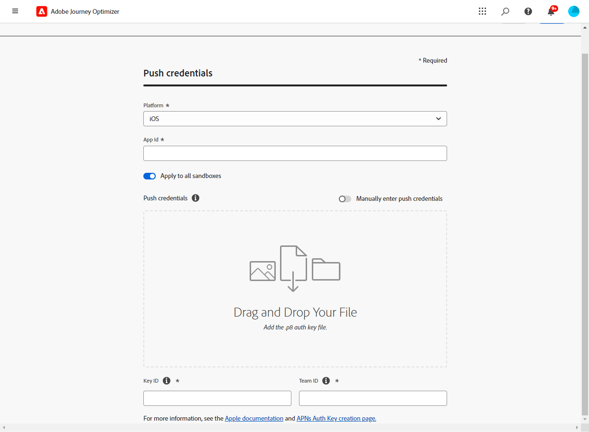

# 푸시 알림 채널 구성 {#push-notification-configuration}

[!DNL Journey Optimizer] 을(를) 통해 여정을 만들고 타겟팅된 대상자에게 메시지를 보낼 수 있습니다. 을(를) 사용하여 푸시 알림 전송을 시작하기 전에 [!DNL Journey Optimizer], Adobe Experience Platform의 태그와 모바일 앱에 대한 구성 및 통합이 제대로 되어 있는지 확인해야 합니다. 의 푸시 알림 데이터 흐름을 이해하려면 [!DNL Adobe Journey Optimizer] 다음을 참조하십시오. [이 페이지](push-gs.md).

>[!AVAILABILITY]
>
>새로운 **모바일 온보딩 빠른 시작 워크플로우** 을(를) 이제 사용할 수 있습니다. 이 새로운 제품 기능을 사용하여 모바일 이벤트 데이터 수집 및 유효성 검사를 시작하고 모바일 푸시 알림을 전송할 Mobile SDK를 신속하게 구성할 수 있습니다. 이 기능은 공개 Beta 중이며 [데이터 수집] 홈 페이지를 통해 액세스할 수 있습니다. [자세히 알아보기](mobile-onboarding-wf.md)


## 시작하기 전 {#before-starting}

<!--
### Check provisioning

Your Adobe Experience Platform account must be provisioned to contain following schemas and datasets for push notification data flow to function correctly:

| Schema <br>Dataset                                                                       | Group of fields                                                                                                                                                                         | Operation                                                |
| -------------------------------------------------------------------------------------- | --------------------------------------------------------------------------------------------------------------------------------------------------------------------------------------- | -------------------------------------------------------- |
| CJM Push Profile Schema <br>CJM Push Profile Dataset                                     | Push Notification Details<br>Adobe CJM ExperienceEvent - Message Profile Details<br>Adobe CJM ExperienceEvent - Message Execution Details<br>Application Details<br>Environment Details | Register Push Token                                      |
| CJM Push Tracking Experience Event Schema<br>CJM Push Tracking Experience Event Dataset | Push Notification Tracking                                                                                                                                                              | Track interactions and provide data for the reporting UI |
-->

### 권한 설정 {#setup-permissions}

모바일 애플리케이션을 만들기 전에 먼저 Adobe Experience Platform의 태그에 대한 올바른 사용자 권한이 있는지 확인하거나 사용자에게 할당해야 합니다. 다음에서 자세히 알아보기 [태그 설명서](https://experienceleague.adobe.com/docs/experience-platform/tags/admin/user-permissions.html){target="_blank"}.

>[!CAUTION]
>
>푸시 구성은 전문가 사용자가 수행해야 합니다. 구현 모델 및 이 구현에 포함된 담당자에 따라 전체 권한 집합을 단일 제품 프로필에 할당하거나 앱 개발자와 사용자 간에 권한을 공유해야 할 수 있습니다. **Adobe Journey Optimizer** 관리자. 자세히 알아보기 **태그** 의 권한 [이 설명서](https://experienceleague.adobe.com/docs/experience-platform/tags/admin/user-permissions.html){target="_blank"}.

<!--ou need to your have access to perform following roles :

* Manage Datastreams
* Manage Client-side Properties
* Manage App Configurations
-->

할당하려면 **속성** 및 **회사** 권한 아래 단계를 따르십시오.

1. 액세스 **[!DNL Admin Console]**.

1. 다음에서 **[!UICONTROL 제품]** 탭에서 **[!UICONTROL Adobe Experience Platform 데이터 수집]** 카드.

   

1. 기존 항목 선택 **[!UICONTROL 제품 프로필]** 또는 를 사용하여 새 템플릿을 만듭니다. **[!UICONTROL 새 프로필]** 단추를 클릭합니다. 새로 만드는 방법 알아보기 **[!UICONTROL 새 프로필]** 다음에서 [Admin Console 설명서](https://experienceleague.adobe.com/docs/experience-platform/access-control/ui/create-profile.html#ui){target="_blank"}.

1. 다음에서 **[!UICONTROL 권한]** 탭, 선택 **[!UICONTROL 속성 권한]**.

   

1. 클릭 **[!UICONTROL 모두 추가]**. 이렇게 하면 제품 프로필에 다음 권한이 추가됩니다.
   * **[!UICONTROL 승인]**
   * **[!UICONTROL 개발]**
   * **[!UICONTROL 환경 관리]**
   * **[!UICONTROL 확장 관리]**
   * **[!UICONTROL 게시]**

   Adobe Journey Optimizer 확장을 설치 및 게시하고 Adobe Experience Platform Mobile SDK에 앱 속성을 게시하려면 이러한 권한이 필요합니다.

1. 그런 다음 을 선택합니다. **[!UICONTROL 회사 권한]** 왼쪽 메뉴에서 을 클릭합니다.

   

1. 다음 권한을 추가합니다.

   * **[!UICONTROL 앱 구성 관리]**
   * **[!UICONTROL 속성 관리]**

   모바일 앱 개발자가에서 푸시 자격 증명을 설정하려면 이러한 권한이 필요합니다. **Adobe Experience Platform 데이터 수집** 및 는에서 푸시 알림 채널 표면 (즉, 메시지 사전 설정)을 정의합니다 **Adobe Journey Optimizer**.

   

1. **[!UICONTROL 저장]**&#x200B;을 클릭합니다.

할당하려면 **[!UICONTROL 제품 프로필]** 사용자에게 아래 단계를 수행합니다.

1. 액세스 **[!DNL Admin Console]**.

1. 다음에서 **[!UICONTROL 제품]** 탭에서 **[!UICONTROL Adobe Experience Platform 데이터 수집]** 카드.

1. 이전에 구성한 항목 선택 **[!UICONTROL 제품 프로필]**.

1. 다음에서 **[!UICONTROL 사용자]** 탭을 클릭하고 **[!UICONTROL 사용자 추가]**.

   

1. 사용자의 이름 또는 이메일 주소를 입력하고 사용자를 선택합니다. 그런 다음 을 클릭합니다. **[!UICONTROL 저장]**.

   >[!NOTE]
   >
   >사용자가 이전에 Admin Console에서 생성되지 않은 경우 다음을 참조하십시오. [사용자 설명서 추가](https://helpx.adobe.com/enterprise/admin-guide.html/enterprise/using/manage-users-individually.ug.html#add-users).

   

### 앱 구성 {#configure-app}

기술 설정에는 앱 개발자와 비즈니스 관리자 간의 긴밀한 협업이 포함됩니다. 다음으로 푸시 알림 전송을 시작하기 전에 [!DNL Journey Optimizer], 다음에서 설정을 정의해야 합니다. [!DNL Adobe Experience Platform Data Collection] 모바일 앱을 Adobe Experience Platform Mobile SDK와 통합할 수 있습니다.

아래 링크에 자세히 설명된 구현 단계를 따르십시오.

* 대상 **Apple iOS**: 의 APNs에 앱을 등록하는 방법에 대해 알아봅니다. [Apple 설명서](https://developer.apple.com/documentation/usernotifications/registering_your_app_with_apns){target="_blank"}
* 대상 **Google Android**: Android에서 Firebase Cloud Messaging 클라이언트 앱을 설정하는 방법에 대해 알아봅니다. [Google 설명서](https://firebase.google.com/docs/cloud-messaging/android/client){target="_blank"}

### 모바일 앱을 Adobe Experience Platform SDK와 통합 {#integrate-mobile-app}

Adobe Experience Platform Mobile SDK는 Android 및 iOS 호환 SDK를 통해 모바일에 대한 클라이언트측 통합 API를 제공합니다. 팔로우 [Adobe Experience Platform Mobile SDK 설명서](https://developer.adobe.com/client-sdks/documentation/getting-started/){target="_blank"} 앱에서 Adobe Experience Platform Mobile SDK를 사용하여 설정을 가져옵니다.

이 작업이 끝날 때쯤이면 의 모바일 속성도 만들고 구성해야 합니다. [!DNL Adobe Experience Platform Data Collection]. 일반적으로 관리하려는 각 모바일 애플리케이션에 대해 모바일 속성을 만듭니다. 에서 모바일 속성을 만들고 구성하는 방법에 대해 알아봅니다. [Adobe Experience Platform Mobile SDK 설명서](https://developer.adobe.com/client-sdks/documentation/getting-started/create-a-mobile-property/){target="_blank"}.


## 1단계: Adobe Experience Platform 데이터 수집에서 앱 푸시 자격 증명 추가 {#push-credentials-launch}

올바른 사용자 권한을 부여한 후에는에서 모바일 애플리케이션 푸시 자격 증명을 추가해야 합니다 [!DNL Adobe Experience Platform Data Collection].

사용자를 대신하여 푸시 알림을 보낼 Adobe을 승인하려면 모바일 앱 푸시 자격 증명 등록이 필요합니다. 아래에 자세히 설명된 단계를 참조하십시오.

1. 출처: [!DNL Adobe Experience Platform Data Collection]를 선택하고 **[!UICONTROL 앱 표면]** 왼쪽 패널의 탭입니다.

1. 클릭 **[!UICONTROL 앱 표면 만들기]** 을 클릭하여 새 구성을 만듭니다.

   

1. 입력 **[!UICONTROL 이름]** 구성.

1. 출처: **[!UICONTROL 모바일 애플리케이션 구성]**&#x200B;운영 체제를 선택합니다.

   * **iOS용**

      

      1. 모바일 앱 입력 **번들 ID** 다음에서 **[!UICONTROL 앱 ID (iOS 번들 ID)]** 필드. 앱 번들 ID는에서 찾을 수 있습니다. **일반** 의 기본 대상 탭 **XCode**.

      1. 켜짐 **[!UICONTROL 푸시 자격 증명]** 자격 증명을 추가하는 버튼입니다.

      1. .p8 Apple 푸시 알림 인증 키 파일을 끌어서 놓습니다. 이 키는 다음 위치에서 얻을 수 있습니다. **인증서**, **식별자** 및 **프로필** 페이지를 가리키도록 업데이트하는 중입니다.

      1. 다음을 제공합니다 **키 ID**. p8 인증 키를 만드는 동안 할당된 10개의 문자열입니다. 다음에서 찾을 수 있습니다 **키** 의 탭 **인증서**, **식별자** 및 **프로필** 페이지를 가리키도록 업데이트하는 중입니다.

      1. 다음을 제공합니다 **팀 ID**. 멤버십 탭에서 찾을 수 있는 문자열 값입니다.
   * **Android용**

      

      1. 다음을 제공합니다 **[!UICONTROL 앱 ID (Android 패키지 이름)]**: 일반적으로 패키지 이름은 의 앱 id입니다 `build.gradle` 파일.

      1. 켜짐 **[!UICONTROL 푸시 자격 증명]** 자격 증명을 추가하는 버튼입니다.

      1. FCM 푸시 자격 증명을 끌어서 놓습니다. 푸시 자격 증명을 가져오는 방법에 대한 자세한 내용은 을(를) 참조하십시오. [Google 설명서](https://firebase.google.com/docs/admin/setup#initialize-sdk){target="_blank"}.


1. 클릭 **[!UICONTROL 저장]** 앱 구성을 만듭니다.

<!--
## Step 2: Set up a mobile property in Adobe Experience Platform Launch {#launch-property}

Setting up a mobile property allows the mobile app developer or marketer to configure the mobile SDKs attributes such as Session Timeouts, the [!DNL Adobe Experience Platform] sandbox to be targeted and the **[!UICONTROL Adobe Experience Platform Datasets]** to be used for mobile SDK to send data to.

For further details and procedures on how to set up a **[!UICONTROL Platform Launch property]**, refer to the steps detailed in [Adobe Experience Platform Mobile SDK documentation](https://aep-sdks.gitbook.io/docs/getting-started/create-a-mobile-property#create-a-mobile-property).


To get the SDKs needed for push notification to work you will need the following SDK extensions, for both Android and iOS:

* **[!UICONTROL Mobile Core]** (installed automatically)
* **[!UICONTROL Profile]** (installed automatically)
* **[!UICONTROL Adobe Experience Platform Edge]**
* **[!UICONTROL Adobe Experience Platform Assurance]**, optional but recommended to debug the mobile implementation.

Learn more about [!DNL Adobe Experience Platform Launch] extensions in [Adobe Experience Platform Launch documentation](https://experienceleague.adobe.com/docs/launch-learn/implementing-in-mobile-android-apps-with-launch/configure-launch/launch-add-extensions.html).
-->

## 2단계: 모바일 속성에서 Adobe Journey Optimizer 확장 구성 {#configure-journey-optimizer-extension}

다음 **Adobe Journey Optimizer 확장** Adobe Experience Platform용 Mobile SDK는 모바일 앱에 대한 푸시 알림을 실행하고 사용자 푸시 토큰을 수집하고 Adobe Experience Platform 서비스와의 상호 작용 측정을 관리할 수 있습니다.

에서 Journey Optimizer 확장을 설정하는 방법 알아보기 [Adobe Experience Platform Mobile SDK 설명서](https://aep-sdks.gitbook.io/docs/using-mobile-extensions/adobe-journey-optimizer){target="_blank"}.


<!-- 
**[!UICONTROL Edge configuration]** is used by **[!UICONTROL Edge]** extension to send custom data from mobile device to [!DNL Adobe Experience Platform]. 
To configure [!DNL Adobe Experience Platform], you must provide the **[!UICONTROL Sandbox]** name and **[!UICONTROL Event Dataset]**.

For further details and procedures on how to create **[!UICONTROL Edge configuration]**, refer to the steps detailed in [Adobe Experience Platform Mobile SDK documentation](https://aep-sdks.gitbook.io/docs/getting-started/configure-datastreams).

1. From [!DNL Adobe Experience Platform Launch], select the **[!UICONTROL Edge Configurations]** tab and click **[!UICONTROL Edge Configurations]**.
    
1. Select **[!UICONTROL New Edge Configuration]** to add a new **[!UICONTROL Edge Configuration]**.
1. Enter a **[!UICONTROL Name]** and click **[!UICONTROL Save]**

1. Click the **[!UICONTROL Adobe Experience Platform]** toggle to enable it.

1. Fill in the **[!UICONTROL Sandbox]**, **[!UICONTROL Event dataset]** and **[!UICONTROL Profile Dataset]** fields. Then, click **[!UICONTROL Save]**.
    
    


1. From [!DNL Adobe Experience Platform Launch], ensure that **[!UICONTROL Client Side]** is selected in the drop-down menu.

1. select the **[!UICONTROL Properties]** tab and click **[!UICONTROL New Property]**.

    

1. Enter a **[!UICONTROL Name]** for your new property.

1. Select **[!UICONTROL Mobile]** as **[!UICONTROL Platform]**.

    

1. Click **[!UICONTROL Save]** to create your new property.

To configure **[!UICONTROL Adobe Experience Platform Edge Extension]** to send custom data from mobile devices to [!DNL Adobe Experience Platform].

1. Select your previously created property and select the **[!UICONTROL Extensions]** tab to view the extensions for this property.

    

1. Click **[!UICONTROL Configure]** under the **[!UICONTROL Adobe Experience Platform Edge]** Network' extension.

1. From the **[!UICONTROL Edge Configuration]** drop-down list, select the **[!UICONTROL Edge Configuration]** created in the previous steps. For more information on **[!UICONTROL Edge Configuration]**, refer to this [section](#edge-configuration).

1. Click **[!UICONTROL Save]**.

To configure **[!UICONTROL Adobe Experience Platform Messaging]** extension to send push profile and push interactions to the correct datasets, follow the same steps as above. Use **[!UICONTROL Sandbox]**, **[!UICONTROL Event dataset]** and **[!UICONTROL Profile Dataset]** created in the [Adobe Experience Platform setup](#edge-configuration).
-->

<!--
## Step 4: Publish the Property {#publish-property}

You now need to publish the property to integrate your configuration and to use it in the mobile app. 

To publish your property, refer to the steps detailed in [Adobe Experience Platform Mobile SDK documentation](https://aep-sdks.gitbook.io/docs/getting-started/create-a-mobile-property#publish-the-configuration)

## Step 5: Configure the ProfileDataSource {#configure-profiledatasource}

To configure the `ProfileDataSource`, use the `ProfileDCInletURL` from [!DNL Adobe Experience Platform] setup and add the following in the mobile app:

```
    MobileCore.updateConfiguration(
    mutableMapOf("messaging.dccs" to <ProfileDCSInletURL>)
```

-->

## 3단계: 이벤트로 모바일 앱 테스트 {#mobile-app-test}

Adobe Experience Platform 및 모두에서 모바일 앱을 구성한 후 [!DNL Adobe Experience Platform Data Collection]이제 프로필에 푸시 알림을 전송하기 전에 테스트할 수 있습니다. 이 사용 사례에서는 모바일 앱을 타깃팅하는 여정을 만들고 푸시 알림을 트리거하는 이벤트를 설정합니다.

<!--
You can use a test mobile app for this use case. For more on this, refer to this [page](https://wiki.corp.adobe.com/pages/viewpage.action?spaceKey=CJM&title=Details+of+setting+the+mobile+test+app) (internal use only).
-->

이 여정이 작동하려면 XDM 스키마를 만들어야 합니다. 자세한 내용은 다음을 참조하십시오. [XDM 설명서](https://experienceleague.adobe.com/docs/experience-platform/xdm/schema/composition.html#schemas-and-data-ingestion){target="_blank"}.

1. 왼쪽 메뉴에서 **[!UICONTROL 스키마]**.

1. 클릭 **[!UICONTROL 스키마 만들기]** 그런 다음 선택 **[!UICONTROL XDM ExperienceEvent]**.

   

1. 선택 **[!UICONTROL 새 필드 그룹 만들기]**.

1. 입력 **[!UICONTROL 표시 이름]** 및 a **[!UICONTROL 설명]**. 클릭 **[!UICONTROL 필드 그룹 추가]** 완료 시. 필드 그룹을 만드는 방법에 대한 자세한 내용은 [XDM 시스템 설명서](https://experienceleague.adobe.com/docs/experience-platform/xdm/tutorials/create-schema-ui.html?lang=ko){target="_blank"}.


   

1. 왼쪽에서 스키마를 선택합니다. 오른쪽 창에서 스키마 이름과 설명을 입력합니다. 다음에 대해 이 스키마 활성화: **[!UICONTROL 프로필]**.

   


1. 왼쪽에서 필드 그룹을 선택한 다음 + 아이콘을 클릭하여 새 필드를 만듭니다. 다음에서 **[!UICONTROL 필드 그룹 속성]**&#x200B;를 클릭하고 오른쪽에 **[!UICONTROL 필드 이름]**, **[!UICONTROL 표시 이름]** 및 선택 **[!UICONTROL 문자열]** 다음으로: **[!UICONTROL 유형]**.

   

1. 확인 **[!UICONTROL 필수]** 및 클릭 **[!UICONTROL 적용]**.

1. **[!UICONTROL 저장]**&#x200B;을 클릭합니다. 이제 스키마가 만들어지고 이벤트에서 사용할 수 있습니다.

그런 다음 이벤트를 설정해야 합니다.

1. 홈 페이지의 왼쪽 메뉴에서 관리 아래의 을(를) 선택합니다 **[!UICONTROL 구성]**. 클릭 **[!UICONTROL 관리]** 다음에서 **[!UICONTROL 이벤트]** 섹션 을 클릭하여 새 이벤트를 만듭니다.

1. 클릭 **[!UICONTROL 이벤트 만들기]**&#x200B;그러면 화면 오른쪽에 이벤트 구성 창이 열립니다.

   

1. 이벤트의 이름을 입력합니다. 설명을 추가할 수도 있습니다.

1. 다음에서 **[!UICONTROL 이벤트 ID 유형]** 필드, 선택 **[!UICONTROL 규칙 기반]**.

1. 다음에서 **[!UICONTROL 매개 변수]**&#x200B;앞에서 만든 스키마를 선택합니다.

   

1. 필드 목록에서 스키마 필드 그룹에서 만든 필드가 선택되어 있는지 확인합니다.

   

1. 클릭 **[!UICONTROL 편집]** 다음에서 **[!UICONTROL 이벤트 ID 조건]** 필드. 이전에 추가한 필드를 드래그 앤 드롭하여 여정을 트리거하는 이벤트를 식별하는 데 사용할 조건을 정의합니다.

   

1. 이 예제에서 테스트 앱에서 푸시 알림을 트리거하는 데 사용해야 하는 구문을 입력합니다 **주문 확인**.

   

1. 선택 **[!UICONTROL ECID]** (으)로 **[!UICONTROL 네임스페이스]**.

1. 클릭 **[!UICONTROL 확인]** 그러면 **[!UICONTROL 저장]**.

이제 이벤트가 생성되었으며 이제 여정에서 사용할 수 있습니다.

1. 왼쪽 메뉴에서 **[!UICONTROL 여정]**.

1. 클릭 **[!UICONTROL 여정 만들기]** 새 여정 만들기

1. 오른쪽에 표시되는 구성 창에서 여정의 속성을 편집합니다. 자세히 알아보기 [섹션](../building-journeys/journey-gs.md#change-properties).

1. 의 이전 단계에서 만든 이벤트를 끌어서 놓는 것으로 시작합니다. **[!UICONTROL 이벤트]** 드롭다운.

   

1. 다음에서 **[!UICONTROL 작업]** 드롭다운, 드래그 앤 드롭 **[!UICONTROL 푸시]** 활동을 여정에 추가합니다.

1. 푸시 알림을 구성합니다. 푸시 알림을 만드는 방법에 대한 자세한 내용은 다음을 참조하십시오. [페이지](create-push.md).

1. 다음을 클릭합니다. **[!UICONTROL 테스트]** 푸시 알림 테스트를 시작하려면 전환하고 클릭 **[!UICONTROL 이벤트 트리거]**.

   

1. 에 ECID 입력 **[!UICONTROL 키]** 필드 다음에 입력 **주문 확인** 두 번째 필드에서 을 클릭합니다.

   

1. **[!UICONTROL 보내기]**&#x200B;를 클릭합니다.

이벤트가 트리거되고 모바일 앱에 대한 푸시 알림을 받게 됩니다.

## 4단계: 푸시할 채널 표면 만들기{#message-preset}

모바일 앱이에 설정되면 [!DNL Adobe Experience Platform Data Collection]에서 푸시 알림을 전송할 수 있는 표면을 만들어야 합니다. **[!DNL Journey Optimizer]**.

에서 채널 표면을 만들고 구성하는 방법에 대해 알아봅니다 [이 섹션](../configuration/channel-surfaces.md).

이제 Journey Optimizer을 사용하여 푸시 알림을 전송할 준비가 되었습니다.

* 에서 푸시 메시지를 만드는 방법 알아보기 [이 페이지](create-push.md).
* 에서 여정에 메시지를 추가하는 방법 알아보기 [이 섹션](../building-journeys/journeys-message.md).
