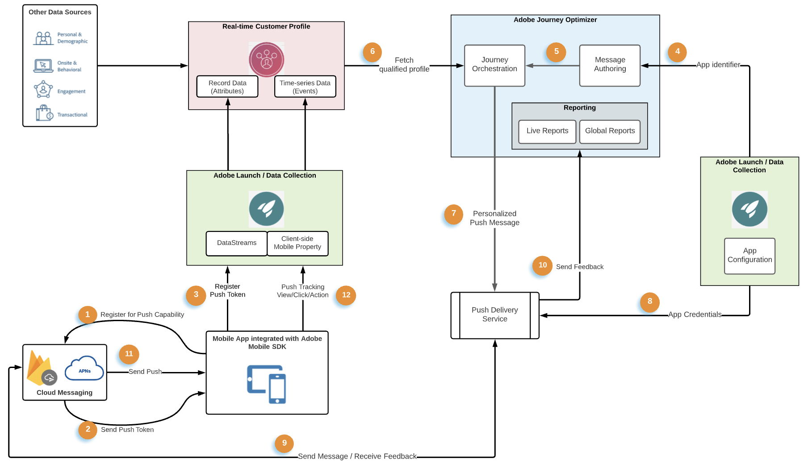

# 푸시 알림 데이터 흐름 및 구성 요소 {#get-started-push}

이 페이지에서는 의 푸시 알림과 관련된 주요 서비스 및 워크플로를 설정하고 이해할 수 있습니다. [!DNL Journey Optimizer].

>[!AVAILABILITY]
>
>새로운 **모바일 온보딩 빠른 시작 워크플로우** 을(를) 이제 사용할 수 있습니다. 이 새로운 제품 기능을 사용하여 모바일 이벤트 데이터 수집 및 유효성 검사를 시작하고 모바일 푸시 알림을 전송할 Mobile SDK를 신속하게 구성할 수 있습니다. 이 기능은 공개 Beta 중이며 [데이터 수집] 홈 페이지를 통해 액세스할 수 있습니다. [자세히 알아보기](mobile-onboarding-wf.md)
>

에서 푸시 알림을 만드는 방법 알아보기 [이 페이지](create-push.md).

에서 푸시 채널을 구성하는 단계 [!DNL Adobe Journey Optimizer] 다음에 자세히 설명됨: [이 페이지](push-configuration.md).

다음 그림은 연결된 데이터 흐름과 관련된 시스템 및 서비스를 보여줍니다. 푸시 알림이 엔드 투 엔드 서비스 관점에서 어떻게 전달되는지 강조 표시합니다.

1. Apple의 APNs 및 Google FCM 푸시 메시지 서비스에 브랜드 모바일 앱(Android 또는 iOS)을 등록합니다
1. 메시징 서비스는 다음과 같은 식별자인 푸시 토큰을 생성합니다. [!DNL Adobe Journey Optimizer] 은 을(를) 사용하여 푸시 알림으로 특정 장치를 타깃팅합니다.
1. 이전에 생성된 푸시 토큰은 Adobe Experience Platform으로 전달되고 실시간 고객 프로필과 동기화됩니다. 이 작업은 쉽게 통합할 수 있는 클라이언트 SDK를 사용하여 OOTB에서 수행됩니다
1. 푸시 메시지는에 작성됩니다. [!DNL Adobe Journey Optimizer], 푸시 메시지는 채널 표면에 대해 만들어집니다(즉, 메시지 사전 설정)
1. 푸시 메시지는 여정의 오케스트레이션 캔버스에 포함될 수 있습니다
1. 여정 게시 시 여정 조건을 기반으로 하는 고객 프로필은 푸시 알림을 수신할 자격이 있으며 이 단계에서 푸시 메시지 페이로드가 개인화됩니다
1. 개인화된 푸시 페이로드는 내부 푸시 메시지 전송 서비스로 전달됩니다
1. 그런 다음 이 내부 서비스는 메시지와 연관된 앱의 자격 증명을 확인합니다.
1. 최종 게재를 위해 Apple 및 Google 메시징 서비스에 메시지를 전송합니다.
1. 메시징 서비스의 피드백이 기록되고, 여정 라이브 및 글로벌 보고서의 보고에 대한 오류 및 성공 사례가 기록됩니다
1. 푸시 알림이 최종 사용자 장치로 전달됨
1. 최종 사용자 푸시 알림 상호 작용은 SDK 통합을 통해 최종 사용자 클라이언트에서 경험 이벤트 로 전송됩니다

## 푸시 알림의 주요 서비스 역할 {#roles-of-key-services}

* **푸시 알림 서비스 공급자** 은 원격 서버에서 모바일 앱으로 알림을 제공하는 핵심 구성 요소 웹 서비스입니다.

  [!DNL Adobe Journey Optimizer]  는 Android 및 iOS 플랫폼을 모두 지원하며 결과적으로 다음과 통합됩니다.
   * [Firebase Cloud Messaging(FCM)](https://firebase.google.com/docs/cloud-messaging) - Android 모바일 앱에 알림을 보내려면
   * [Apple 푸시 알림 서비스(APNs)](https://developer.apple.com/library/archive/documentation/NetworkingInternet/Conceptual/RemoteNotificationsPG/APNSOverview.html) - iOS 모바일 앱에 알림을 보내려면

* **Adobe Experience Platform Mobile SDK** android 및 iOS 호환 SDK를 통해 모바일에 대한 클라이언트측 통합 API를 제공합니다. SDK는 [!DNL Adobe Journey Optimizer] 푸시 메시지에 특정한 다양한 API를 노출하고 푸시 토큰을 등록하거나 푸시 추적 이벤트 또는 기타 사용자 지정 경험 이벤트를 Adobe Experience Platform에 전송하는 것과 같은 데이터 흐름을 가능하게 하는 확장. SDK는 타사 파트너 기능뿐만 아니라 다른 Adobe Experience Cloud을 사용할 수 있도록 하는 기타 다양한 확장도 제공합니다.

  SDK 통합에도 Adobe Experience Platform 설정이 필요합니다. [데이터 수집](https://experienceleague.adobe.com/docs/experience-platform/tags/home.html){target="_blank"} 다음과 같은 서비스

   * 데이터 스트림을 만들어 Adobe Experience Platform으로 유입되는 데이터가 포함된 프로필 및 경험 이벤트 데이터 세트를 구성합니다.
   * 클라이언트측 모바일 속성을 만들고 확장을 추가합니다. SDK는 이러한 확장과 긴밀하게 통합되어 원활한 데이터 수집 경험을 제공합니다.
   * 모바일 앱 번들 식별자 및 앱 자격 증명 등록

* **Adobe Experience Platform 실시간 고객 프로필**  웹, 모바일, CRM 및 서드파티를 비롯한 여러 채널의 데이터를 결합하여 각 개별 고객에 대한 거시적인 보기를 유지합니다. 프로필을 사용하면 모든 고객 인터랙션에 대해 실행 가능한 타임스탬프 계정을 제공하는 통합 보기로 고객 데이터를 통합할 수 있습니다. 주어진 앱 사용자에 대한 푸시 토큰은 사용자의 프로필에 대해 레코드 데이터로 저장되는 반면 사용자가 푸시 알림과 수행하는 상호 작용은 시계열 이벤트 데이터로 추적됩니다. [Adobe Experience Platform 실시간 고객 프로필에 대해 자세히 알아보기](https://experienceleague.adobe.com/docs/experience-platform/profile/home.html?lang=ko){target="_blank"}.

* **[!DNL Adobe Journey Optimizer]** : Adobe Experience Platform에서 위에서 언급한 구성 요소와 모바일 앱 통합이 이루어지고 고객 프로필이 형성되면 푸시 알림을 작성하고 오케스트레이션할 수 있습니다 [!DNL Adobe Journey Optimizer] 을 클릭하여 사용자와 협력하십시오.

## 기술 설정 및 실무자 워크플로우 푸시 {#push-technical-setup}

다음 그림은 푸시 데이터 흐름의 골격을 형성하는 구성 요소를 구성하는 데 포함된 다양한 단계인 엔드투엔드 (end-to-end)를 보여줍니다. 작업 항목은 구성을 수행하는 역할과 구성 중인 구성 요소를 기반으로 분류됩니다.

**관련 항목**

* [푸시 채널 구성](push-configuration.md)
* [푸시 알림 보고서](../reports/journey-global-report.md#push-global)
* [푸시 알림 만들기](create-push.md)
* [여정에 메시지 추가](../building-journeys/journeys-message.md)
* [캠페인에 메시지 추가](../campaigns/create-campaign.md)