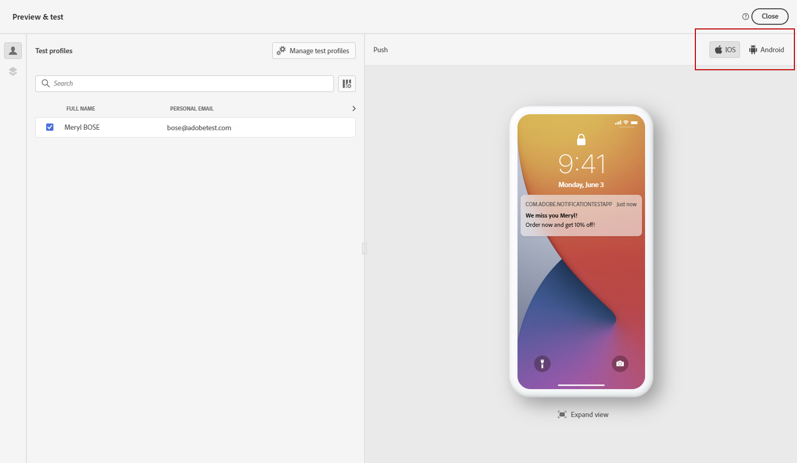

# 푸시 알림 확인 및 보내기 {#send-push}

## 푸시 알림 미리 보기 {#preview-push}

메시지 콘텐츠가 정의되면 테스트 프로필 또는 CSV/JSON 파일에서 업로드한 샘플 입력 데이터 또는 수동으로 추가한 샘플 입력 데이터를 사용하여 콘텐츠를 미리 볼 수 있습니다. 개인화된 콘텐츠를 삽입하면 이 콘텐츠가 메시지에 어떻게 표시되는지 확인할 수 있습니다. [샘플 입력 데이터를 사용하여 콘텐츠를 테스트하는 방법을 알아보세요](../test-approve/simulate-sample-input.md)

이렇게 하려면 **[!UICONTROL 콘텐츠 시뮬레이션]**&#x200B;을 클릭하세요. 그런 다음 콘텐츠를 미리 볼 장치 형식을 선택할 수 있습니다. **[!UICONTROL iOS]** 또는 **[!UICONTROL Android]**.

콘텐츠를 미리 보고 테스트하는 방법에 대한 자세한 내용은 [콘텐츠 관리](../content-management/preview-test.md) 섹션에서 확인할 수 있습니다.

## 푸시 알림 유효성 확인 {#push-validate}

편집기의 위쪽 섹션에서 경고를 확인해야 합니다. 일부는 간단한 경고이지만 일부는 메시지를 보내지 못하게 할 수 있습니다. 경고와 오류의 두 가지 경고 유형이 발생할 수 있습니다.

* **경고**&#x200B;는 권장 사항과 모범 사례를 참조합니다.

* **오류**&#x200B;로 인해 다음과 같이 여정이 해결되지 않는 한 테스트나 활성화를 수행할 수 없습니다.

   * **[!UICONTROL 메시지의 푸시 버전이 비어 있습니다]**: 푸시 알림 본문이나 제목이 누락된 경우 이 오류가 표시됩니다. [이 섹션](create-push.md)에서 푸시 알림 콘텐츠를 정의하는 방법을 알아보세요.

   * **[!UICONTROL 구성이 없습니다]**: 선택한 구성이 메시지 작성 후 삭제되면 메시지를 사용할 수 없습니다. 이 오류가 발생하면 **[!UICONTROL 속성]** 메시지에서 다른 구성을 선택하십시오. [이 섹션](../configuration/channel-surfaces.md)에서 채널 구성에 대해 자세히 알아보세요.

   * **[!UICONTROL 푸시 iOS/Android 페이로드가 4KB의 제한을 초과했습니다]**: 푸시 알림 크기는 4KB를 초과할 수 없습니다. 이 제한을 준수하려면 이미지 또는 이모지의 사용을 줄이십시오. [이 섹션](../push/create-push.md)에서 푸시 알림 콘텐츠를 관리하는 방법을 알아봅니다.

  

>[!NOTE]
>
> 더 나은 전달성을 위해 공급자가 지원하는 형식의 전화 번호를 항상 사용해야 합니다. 예를 들어 Twilio와 Sinch는 E.164 형식의 전화 번호만 지원합니다.

## 푸시 알림 보내기{#push-send}

>[!IMPORTANT]
>
> 캠페인이 승인 정책의 적용을 받는 경우 푸시 알림을 보내려면 승인을 요청해야 합니다. [자세히 알아보기](../test-approve/gs-approval.md)

푸시 메시지가 준비되면 [여정](../building-journeys/journey-gs.md) 또는 [캠페인](../campaigns/create-campaign.md)의 구성을 완료하여 보내십시오.

**관련 항목**

* [푸시 채널 구성](push-configuration.md)
* [푸시 알림 보고서](../reports/journey-global-report-cja-push.md)
* [푸시 알림 만들기](create-push.md)
* [여정에 메시지 추가](../building-journeys/journeys-message.md)
* [캠페인에 메시지 추가](../campaigns/create-campaign.md)

