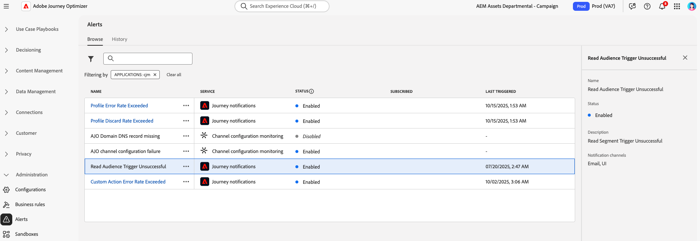

# 시스템 경고 액세스 및 구독 {#alerts}

여정 및 캠페인을 작성할 때 실행 또는 게시하기 전에 **경고** 단추를 사용하여 오류를 확인하고 해결하십시오.

* [이 페이지](../building-journeys/troubleshooting.md)에서 여정 문제를 해결하는 방법 알아보기

* [이 페이지](../campaigns/review-activate-campaign.md)에서 캠페인을 검토하는 방법을 알아보세요.

이외에도 특정 조건 세트에 도달하면 이를 구독한 조직의 모든 사용자에게 경고 메시지를 보낼 수 있습니다. 이러한 경고는 전용 **[!UICONTROL 경고]** 메뉴에서 사용할 수 있습니다. Adobe Experience Platform은 조직에 대해 활성화할 수 있는 사전 정의된 경고 규칙을 몇 가지 제공합니다. 또한 이 페이지에 자세히 설명된 대로 [!DNL Adobe Journey Optimizer]별 시스템 경고를 구독할 수 있습니다.

>[!NOTE]
>
>[Adobe Experience Platform 설명서](https://experienceleague.adobe.com/docs/experience-platform/observability/alerts/overview.html?lang=ko){target="_blank"}에서 Adobe Experience Platform의 경고에 대해 자세히 알아보세요.

왼쪽 메뉴에서 **[!UICONTROL 관리]** 아래의 **[!UICONTROL 경고]**&#x200B;를 클릭합니다. **찾아보기** 탭에서 Journey Optimizer에 대해 미리 구성된 여러 경고를 사용할 수 있습니다.

* 여정 관련 경고:

   * [여정 사용자 지정 작업 실패](#alert-custom-actions) 경고
   * [대상자 트리거 읽기 실패](#alert-read-audiences) 경고
   * [프로필 삭제 비율 초과](#alert-discard-rate) 경고
   * [사용자 지정 작업 오류율 초과](#alert-custom-action-error-rate) 경고
   * [프로필 오류율 초과](#alert-profile-error-rate) 경고

* 채널 구성과 관련된 경고:

   * [AJO 도메인 DNS 레코드 누락](#alert-dns-record-missing) 경고
   * [AJO 채널 구성 실패](#alert-channel-config-failure) 경고
     <!--* the [AJO domain certificates renewal unsuccessful](#alert-certificates-renewal) alert-->

## 경고 구독 {#subscribe-alerts}

예기치 않은 동작이 발생하고/또는 작업의 특정 조건 세트에 도달하면(예: 시스템이 임계값을 위반한 경우 발생할 수 있는 문제), 경고 알림이 이를 구독한 조직의 모든 사용자에게 전달됩니다.

사용자 인터페이스에서 각 경고를 개별적으로 구독할 수 있습니다. **[!UICONTROL 경고]** 메뉴에서 전체적으로 구독하거나([전역 구독](#global-subscription) 참조), 특정 여정에 대해 단일 경고를 구독하거나([단일 구독](#unitary-subscription) 참조).

가입자의 환경 설정에 따라 알림은 사용자 인터페이스(인앱 알림)의 오른쪽 상단 모서리에 있는 Journey Optimizer 알림 센터에서 이메일로 및/또는 직접 전송됩니다. [!DNL Adobe Experience Cloud] **[!UICONTROL 환경 설정]**&#x200B;에서 이러한 경고를 받을 방법을 선택하십시오. [자세히 알아보기](../start/user-interface.md#in-product-alerts)

경고가 해결되면 구독자에게 &quot;해결됨&quot; 알림이 전송됩니다.

### 전역 구독 {#global-subscription}

모든 여정 및 캠페인에 대한 경고를 구독/구독 취소하려면 다음 단계를 따르십시오.

1. 왼쪽 메뉴에서 **[!UICONTROL 경고]** 대시보드로 이동하여 구독하려는 경고에 대한 **[!UICONTROL 구독]** 옵션을 선택하십시오.

   {width=80%}

   >[!NOTE]
   >
   >구독은 특정 샌드박스에만 적용됩니다. 각 샌드박스에 대한 경고를 개별적으로 구독해야 합니다.

1. **[!UICONTROL 구독 취소]**&#x200B;에 동일한 방법을 사용하십시오.

[I/O 이벤트 알림](https://experienceleague.adobe.com/docs/experience-platform/observability/alerts/subscribe.html?lang=ko){target="_blank"}을 통해 구독할 수도 있습니다. 경고 규칙은 다른 구독 패키지로 구성됩니다. 특정 Journey Optimizer 경고에 해당하는 이벤트 구독은 [아래](#journey-alerts)에 자세히 설명되어 있습니다.

### 단일 구독 {#unitary-subscription}

특정 여정에 대한 경고를 구독/구독 취소하려면 다음 단계를 따르십시오.

1. 여정 인벤토리로 이동하여 특정 여정에 대한 **[!UICONTROL 경고 구독]** 옵션을 선택하십시오.

   {width=75%}

1. 경고를 선택합니다. 다음 경고를 사용할 수 있습니다. [프로필 삭제 비율 초과](#alert-discard-rate), [사용자 지정 작업 오류 비율 초과](#alert-custom-action-error-rate), [프로필 오류 비율 초과](#alert-profile-error-rate).

1. 경고 구독을 취소하려면 동일한 화면에서 경고를 선택 취소합니다.

1. **[!UICONTROL 저장]**&#x200B;을 클릭하여 확인합니다.

<!--To enable email alerting, refer to [Adobe Experience Platform documentation](https://experienceleague.adobe.com/docs/experience-platform/observability/alerts/ui.html?lang=ko#enable-email-alerts){target="_blank"}.-->

## 여정 경고 {#journey-alerts}

사용자 인터페이스에서 사용할 수 있는 모든 여정 알림이 아래에 나열되어 있습니다.

>[!CAUTION]
>
>Adobe Journey Optimizer 관련 경고는 **live** 여정에 대해서만 적용됩니다. 테스트 모드의 여정에 대해서는 경고가 트리거되지 않습니다.

### 대상자 읽기 트리거 실패 {#alert-read-audiences}

이 경고는 **대상자 읽기** 활동이 예약된 실행 시간 10분 후에 어떤 프로필도 처리하지 않은 경우 경고합니다. 이 실패는 기술 문제 또는 대상이 비어 있기 때문에 발생할 수 있습니다. 이 실패가 기술적인 문제로 인해 발생한 경우 문제 유형에 따라 다시 시도가 계속 발생할 수 있습니다(예: 내보내기 작업 만들기가 실패한 경우 최대 1시간 동안 10밀리초마다 다시 시도).

**대상자 읽기** 활동에 대한 경고는 반복 여정에 적용됩니다. **한 번** 또는 **가능한 한 빨리** 실행 일정이 있는 Live 여정의 **대상자 읽기** 활동은 무시됩니다.

프로필이 **대상자 읽기** 노드에 들어가면 **대상자 읽기**&#x200B;에 대한 경고가 해결됩니다.

**대상자 읽기 트리거 실패** 경고에 해당하는 I/O 이벤트 구독 이름은 **대상자 읽기 지연, 실패 및 오류 여정**&#x200B;입니다.

**대상 읽기** 경고 문제를 해결하려면 Experience Platform 인터페이스에서 대상 수를 확인하십시오.

### 여정 사용자 지정 작업 실패 {#alert-custom-actions}

이 경고는 사용자 지정 작업이 실패할 경우 경고합니다. 지난 5분 동안 특정 사용자 지정 작업에 대해 1% 이상의 오류가 발생한 오류가 있는 것으로 간주됩니다. 이는 30초마다 평가됩니다.

경고 세부 정보 및 구성을 확인하려면 경고 이름을 클릭합니다.

<!--
-->

사용자 지정 작업에 대한 경고는 지난 5분 동안 다음과 같은 경우에 해결됩니다.

* 해당 사용자 지정 작업에 오류가 없습니다(또는 1% 임계값 아래의 오류).

* 또는 해당 사용자 지정 작업에 도달한 프로필이 없습니다.

사용자 지정 작업 경고에 해당하는 I/O 여정 구독 이름은 **사용자 지정 작업 실패**&#x200B;입니다.

**사용자 지정 작업** 경고의 문제를 해결하려면:

* 다른 여정에서 [테스트 모드](../building-journeys/testing-the-journey.md)를 사용하여 사용자 지정 작업을 확인하세요.

* 작업에 대한 오류 이유를 보려면 [여정 보고서](../reports/journey-live-report.md)를 확인하십시오.

* 여정 stepEvents를 확인하여 &quot;failureReason&quot;에 대한 자세한 정보를 찾으십시오.

* 사용자 지정 작업 구성을 확인하고 인증이 여전히 유효한지 확인하십시오. 예를 들어 Postman을 사용하여 수동 검사를 수행합니다.

### 프로필 삭제율 초과 {#alert-discard-rate}

이 경고는 지난 5분 동안 입력한 프로필에 대한 프로필 폐기 비율이 임계값을 초과하는 경우 경고합니다. 기본 임계값이 20%로 설정되어 있지만 [사용자 지정 임계값을 정의](#custom-threshold)할 수 있습니다.

경고 세부 정보 및 구성을 확인하려면 경고 이름을 클릭합니다.

프로필을 삭제할 수 있는 몇 가지 이유가 있으며, 이는 문제 해결 방법을 알려줍니다. 몇 가지 일반적인 이유는 다음과 같습니다.

* 해당 단일 여정에서 이미 라이브되므로 시작 시 프로필이 삭제되었습니다. 이 문제를 해결하려면 프로필에 다음 이벤트가 도달하기 전에 여정을 종료할 시간이 충분한지 확인합니다.
* 프로필에 대해 ID가 설정되지 않았거나 대상자 읽기 여정에서 사용하는 네임스페이스가 해당 프로필에서 사용되지 않습니다. 이를 해결하려면 여정의 네임스페이스가 프로필에서 사용하는 ID 네임스페이스와 일치하는지 확인합니다.
* 이벤트 처리량이 초과되었습니다. 이를 해결하려면 시스템으로 들어오는 이벤트가 이러한 제한을 초과하지 않도록 하십시오.

### 사용자 정의 액션 오류율 초과 {#alert-custom-action-error-rate}

이 경고는 최근 5분 동안 성공한 HTTP 호출에 대한 사용자 지정 작업 오류의 비율이 임계값을 초과하는 경우 경고합니다. 기본 임계값이 20%로 설정되어 있지만 [사용자 지정 임계값을 정의](#custom-threshold)할 수 있습니다.

사용자 지정 작업 오류는 다양한 이유로 발생할 수 있습니다. 이러한 오류를 해결하려면 다음을 수행할 수 있습니다.

* 사용자 지정 작업이 올바르게 구성되었는지 확인
* 끝점에 연결할 수 있고 사용자 지정 작업이 사용자 지정 작업 연결 검사기를 통해 끝점에 도달할 수 있는지 확인하십시오
* 인증 자격 증명을 확인하고 인터넷 연결을 확인합니다.

### 프로필 오류율 초과 {#alert-profile-error-rate}

이 경고는 최근 5분 동안 성공한 HTTP 호출에 대한 사용자 지정 작업 오류의 비율이 임계값을 초과하는 경우 경고합니다. 기본 임계값이 20%로 설정되어 있지만 [사용자 지정 임계값을 정의](#custom-threshold)할 수 있습니다.

경고 세부 정보 및 구성을 확인하려면 경고 이름을 클릭합니다.

프로필 오류를 해결하려면 여정에서 프로필이 실패한 위치와 이유를 파악하기 위해 단계 이벤트의 데이터를 쿼리할 수 있습니다.

## 구성 경고 {#configuration-alerts}

사용자 인터페이스에서 사용할 수 있는 채널 구성 모니터링 경고 목록은 다음과 같습니다.

### AJO 도메인 DNS 레코드 누락 {#alert-dns-record-missing}

이 경고는 적절한 전달성 구성에 필요한 중요 DNS 레코드(NS 또는 CNAME)가 누락되거나 잘못 구성된 경우 알려줍니다. 이러한 레코드가 없으면 이메일 전달성이 손상될 수 있습니다.

>[!NOTE]
>
>* NS 레코드는 Adobe에 전체 하위 도메인을 위임하는 데 필수적입니다. [자세히 알아보기](../configuration/about-subdomain-delegation.md#full-subdomain-delegation)
>
>* CNAME 레코드는 CNAME 하위 도메인 설정을 지원합니다. [자세히 알아보기](../configuration/about-subdomain-delegation.md#cname-subdomain-setup)

필요한 NS 또는 CNAME 레코드가 없거나 구성 표준과 일치하지 않음을 시스템에서 감지하면 **AJO 도메인 DNS 레코드 누락** 경고가 트리거됩니다.

1. [&#x200B; 인터페이스에서 영향을 받는 &#x200B;](../configuration/delegate-subdomain.md)하위 도메인[!DNL Journey Optimizer]&#x200B;(으)로 보낼 경고를 클릭합니다.

   <!--For guidance on editing delegated subdomains, see [this section](../configuration/delegate-subdomain.md).-->

1. 레코드를 올바르게 설정하고 [하위 도메인을 제출](../configuration/delegate-subdomain.md#submit-subdomain) 위임하여 DNS 구성을 다시 수정하십시오.

   >[!NOTE]
   >
   >계속하기 전에 도메인 호스팅 솔루션에 모든 레코드가 올바르게 생성되었는지 확인하십시오.

1. 올바른 값을 모를 경우 영향을 받는 하위 도메인과 같은 이름으로 [!DNL Journey Optimizer]에 새 하위 도메인을 만들 수 있습니다. [새 하위 도메인을 설정하는 방법 알아보기](../configuration/delegate-subdomain.md#set-up-subdomain)

변경 사항으로 문제가 해결되지 않으면 다음 날 동일한 경고가 다시 트리거됩니다.

<!--The I/O event subscription name corresponding to this alert is xx. > Do we need to mention this?-->

### AJO 채널 구성 실패 {#alert-channel-config-failure}

>[!IMPORTANT]
>
>이 경고는 **사용자 지정 하위 도메인** 위임 유형을 사용하는 [전자 메일](../configuration/delegate-custom-subdomain.md) 채널 구성에만 적용됩니다. <!--Other channel types (such as SMS, push, or in-app) are not covered by this alert.-->

이 경고는 시스템 감사가 이메일 채널 구성 문제를 감지하는 경우 트리거됩니다. 이러한 문제에는 잘못 구성된 채널 설정, 잘못된 DNS 구성, 제외 목록 문제, IP 불일치 또는 이메일 게재에 영향을 줄 수 있는 기타 모든 오류가 포함될 수 있습니다.

이러한 경고를 받으면 해결 단계 가 아래에 나열됩니다.

1. [&#x200B; 인터페이스에서 영향을 받는 &#x200B;](../email/get-started-email-config.md)전자 메일 채널 구성[!DNL Journey Optimizer]&#x200B;(으)로 보낼 경고를 클릭합니다.

   채널 구성 편집에 대한 지침은 [이 섹션](../configuration/channel-surfaces.md#edit-channel-surface)을 참조하세요.

1. 제공된 구성 세부 정보 및 오류 메시지를 검토하십시오. 일반적인 실패 원인은 다음과 같습니다.

   * SPF 유효성 검사 실패
   * DKIM 유효성 검사 실패
   * MX 레코드 유효성 검사 실패
   * 잘못된 DNS 레코드

   >[!NOTE]
   >
   >가능한 구성 실패 이유는 [이 섹션](../configuration/channel-surfaces.md)에 나열되어 있습니다.

1. 문제 해결:

   * 필요에 따라 채널 구성을 업데이트합니다.
   * 경고에 언급된 특정 DNS 문제를 수정해야 할 수 있습니다.

   >[!NOTE]
   >
   >단일 도메인을 여러 채널 구성과 연결할 수 있으므로 한 채널 구성에 대한 DNS 문제를 해결하면 여러 구성에서 관련된 문제를 자동으로 해결할 수 있습니다.

변경 사항으로 문제가 해결되지 않으면 다음 날에 동일한 경고가 다시 트리거됩니다.

이메일 구성 문제를 해결할 때에는 아래 나열된 모범 사례를 염두에 두십시오.

* 즉시 조치 - 이메일 게재 중단을 방지하기 위해 구성 실패가 감지되면 즉시 해결합니다.
* 모든 구성 확인 - 경고에 영향을 받는 여러 이메일 구성이 표시되면 각각의 구성을 검토하고 수정합니다.

<!--### AJO domain certificates renewal unsuccessful {#alert-certificates-renewal}

This alert warns you if a domain certificate (CDN, tracking URL) renewal failed for a specific Journey Optimizer subdomain.-->

## 경고 관리 {#manage-alerts}

### 경고 편집

해당 줄을 클릭하여 경고의 세부 정보를 확인할 수 있습니다. 이름, 상태 및 알림 채널이 왼쪽 패널에 표시됩니다.
여정 경고의 경우 **[!UICONTROL 추가 작업]** 단추를 사용하여 편집하십시오. 그런 다음 이러한 경고에 대해 [사용자 지정 보류](#custom-threshold)를 정의할 수 있습니다.

{width=60%}

### 사용자 지정 임계값 정의 {#custom-threshold}

[여정 경고](#journey-alerts)에 대한 임계값을 설정할 수 있습니다. 위의 임계값 경고는 기본적으로 20%입니다.

임계값을 변경하려면 다음과 같이 하십시오.

1. **경고** 화면으로 이동
1. 업데이트할 경고의 **[!UICONTROL 추가 작업]** 단추를 클릭하십시오.
1. 새 임계값을 입력하고 확인합니다. 새 임계값은 **모두** 여정에 적용됩니다.

{width=60%}

>[!CAUTION]
>
>임계값 수준은 모든 여정에 걸쳐 전역적이며 각 여정에 대해 개별적으로 수정할 수 없습니다.

### 경고 비활성화

기본적으로 모든 경고가 활성화됩니다. 경고를 사용하지 않으려면 **[!UICONTROL 경고 사용 안 함]** 옵션을 선택하십시오. 이 경고에 대한 모든 구독자는 더 이상 관련 알림을 받지 않습니다.

### 경고 상태

가능한 경고 상태는 다음과 같습니다.

* **[!UICONTROL 활성화됨]** - 경고가 활성화되었으며 현재 트리거 조건을 모니터링하고 있습니다.
* **[!UICONTROL 사용 안 함]** - 경고가 사용하지 않도록 설정되어 있으며 현재 트리거 조건을 모니터링하고 있지 않습니다. 이 경고에 대한 알림이 수신되지 않습니다.
* **[!UICONTROL 트리거됨]** - 경고의 트리거 조건이 현재 충족되고 있습니다.

### 구독자 보기 및 업데이트 {#manage-subscribers}

경고를 구독한 사용자 목록을 보려면 **[!UICONTROL 경고 구독자 관리]**&#x200B;를 선택하십시오.

{width=80%}

구독자를 추가하려면 쉼표로 구분된 전자 메일을 입력하고 **[!UICONTROL 업데이트]**&#x200B;를 선택하세요.

구독자를 제거하려면 현재 구독자에서 해당 전자 메일 주소를 삭제하고 **[!UICONTROL 업데이트]**&#x200B;를 선택하세요.

## 추가 리소스 {#additional-resources-alerts}

* [이 페이지](../building-journeys/troubleshooting.md)에서 여정 문제를 해결하는 방법을 알아보세요.
* [이 페이지](../campaigns/review-activate-campaign.md)에서 캠페인을 검토하는 방법을 알아보세요.