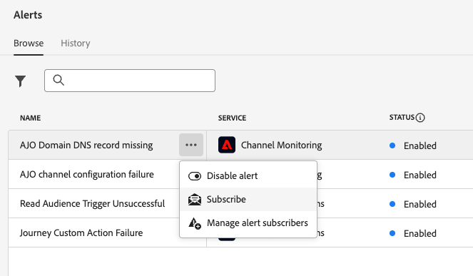
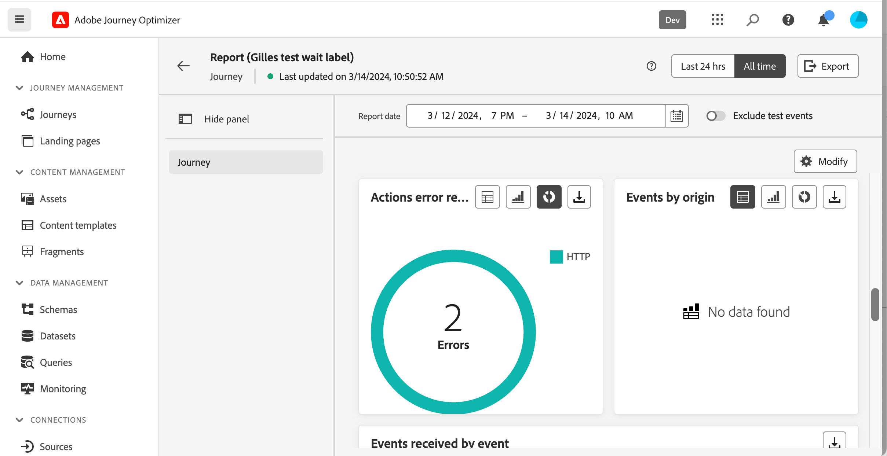

# 경고 시작 {#alerts}

## 경고 액세스 및 구독 {#alerting-capabilities}

오류가 발생하면 Journey Optimizer 알림 센터에서 시스템 경고(인앱 경고)를 받거나 이메일을 받을 수 있습니다.

다음에서 **경고** 메뉴에서 사용 가능한 경고를 보고 구독할 수 있습니다. 작업의 특정 조건 세트에 도달하면(예: 시스템이 임계값을 위반한 경우 발생할 수 있는 문제) 경고 메시지가 이를 구독한 조직의 모든 사용자에게 전달됩니다.

<!--These messages can repeat over a pre-defined time interval until the alert has been resolved.-->

에서 Adobe Experience Platform의 경고에 대해 자세히 알아봅니다. [Adobe Experience Platform 설명서](https://experienceleague.adobe.com/docs/experience-platform/observability/alerts/overview.html?lang=ko){target="_blank"}.

왼쪽 메뉴에서 **관리**, 클릭 **경고**. Journey Optimizer에 대해 두 개의 사전 구성된 경고를 사용할 수 있습니다. [여정 사용자 지정 작업 실패](#alert-custom-actions) 경고 및 [세그먼트 읽기 트리거 실패](#alert-read-audiences) 경고. 이러한 경고는 아래에 자세히 설명되어 있습니다.

사용자 인터페이스에서 다음을 선택하여 각 경고를 개별적으로 구독할 수 있습니다. **구독** 옵션에서 **경고** 대시보드입니다. 가입을 해지하려면 동일한 방법을 사용하십시오.

다음을 통해 경고에 가입할 수도 있습니다. [I/O 이벤트 알림](https://experienceleague.adobe.com/docs/experience-platform/observability/alerts/subscribe.html){target="_blank"}. 경고 규칙은 다른 구독 패키지로 구성됩니다. 특정 Journey Optimizer 경고에 해당하는 이벤트 구독은 아래에 자세히 설명되어 있습니다.

예기치 않은 동작이 발생하면 구독자에게 경고 알림이 전송됩니다. 사용자 환경 설정에 따라 경고는 이메일로 전송되거나 사용자 인터페이스의 오른쪽 상단 모서리에 있는 Journey Optimizer 알림 센터 내에서 직접 전송됩니다. 기본적으로 인앱 경고만 활성화됩니다. 이메일 경고를 활성화하려면 다음을 참조하십시오. [Adobe Experience Platform 설명서](https://experienceleague.adobe.com/docs/experience-platform/observability/alerts/ui.html#enable-email-alerts){target="_blank"}.

경고가 해결되면 구독자에게 &quot;해결됨&quot; 알림이 전송됩니다.

>[!CAUTION]
>
>Adobe Journey Optimizer 관련 경고는 다음에만 적용됩니다. **live** 여정. 테스트 모드의 여정에 대해서는 경고가 트리거되지 않습니다.

## 여정 사용자 지정 작업 실패 {#alert-custom-actions}

이 경고는 사용자 지정 작업이 실패할 경우 경고합니다. 지난 5분 동안 특정 사용자 지정 작업에 대해 1% 이상의 오류가 발생한 오류가 있는 것으로 간주됩니다. 이는 30초마다 평가됩니다.

사용자 지정 작업에 대한 경고는 지난 5분 동안 다음과 같은 경우에 해결됩니다.

* 해당 사용자 지정 작업에 오류가 없습니다(또는 1% 임계값 아래의 오류).

* 또는 해당 사용자 지정 작업에 도달한 프로필이 없습니다.

사용자 지정 작업 경고에 해당하는 I/O 이벤트 구독 이름은 입니다. **여정 사용자 지정 작업 실패**.

## 대상자 읽기 트리거 실패 {#alert-read-audiences}

이 경고는 다음과 같은 경우 경고합니다. **대상자 읽기** 활동이 예약된 실행 시간 10분 후에 어떤 프로필도 처리하지 않았습니다. 이 실패는 기술 문제 또는 대상이 비어 있기 때문에 발생할 수 있습니다.

경고 대상 **대상자 읽기** 활동은 반복 여정에만 적용됩니다. **대상자 읽기** 실행할 일정이 있는 라이브 여정의 활동 **한 번** 또는 **빠른 시일 내에** 무시합니다.

경고 대상 **대상자 읽기** 프로필이 **대상자 읽기** 노드.

에 해당하는 I/O 이벤트 구독 이름 **세그먼트 읽기 트리거 실패** 경고: **여정 읽기 세그먼트 지연, 실패 및 오류**.

## 문제 해결 {#alert-troubleshooting}

문제를 해결하려면 **대상자 읽기** 경고, Experience Platform 인터페이스에서 대상자 수를 확인합니다.

문제를 해결하려면 **사용자 지정 작업** 경고:

* 다른 여정에서 테스트 모드를 사용하여 사용자 지정 작업을 확인하십시오.

  

* 여정 보고서를 확인하여 작업에 대한 오류 원인을 확인하십시오.

  

* 여정 stepEvents를 확인하여 &quot;failureReason&quot;에 대한 자세한 정보를 찾으십시오.
* 사용자 지정 작업 구성을 확인하고 인증이 여전히 유효한지 확인합니다. 예를 들어 Postman을 사용하여 수동 검사를 수행합니다.
