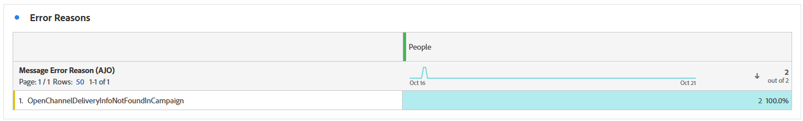

# 라이브 활동 캠페인 보고서 {#campaign-global-report-cja-activity}

>[!BEGINSHADEBOX]

캠페인에서 **[!UICONTROL 보고서]** 버튼을 클릭한 다음 **[!UICONTROL 모든 시간 보고서 보기]**&#x200B;를 선택하여 라이브 활동 캠페인 보고서에 액세스할 수 있습니다. [자세히 알아보기](report-gs-cja.md)


>[!ENDSHADEBOX]

## 전송 통계 {#sending-statistics-mobile}


**[!UICONTROL 전송 통계]** 테이블은 라이브 활동 캠페인과 관련된 주요 지표에 대한 자세한 개요를 제공합니다. 여기에는 타겟팅된 대상의 크기 및 성공적으로 전달된 라이브 활동 수와 같은 필수 정보가 표시되므로 라이브 활동의 전체 도달 및 성과를 평가하는 데 도움이 됩니다.

+++ 전송 통계 지표에 대해 자세히 알아보기

* **[!UICONTROL 타깃팅]**: 제외, 억제 또는 동의 제거가 적용되기 전에 대상에 적합한 프로필 수입니다.

* **[!UICONTROL 전송]**: 타겟팅된 프로필로 전송하려고 시도한 총 라이브 활동 이벤트 수입니다.

* **[!UICONTROL 배달됨]**: 시도된 총 전송 횟수와 관련된 실시간 활동 이벤트 수가 장치에 배달되었습니다.

* **[!UICONTROL 오류 보내기]**: 오류(예: 잘못된 토큰 또는 연결 문제)로 인해 보낼 수 없는 총 라이브 활동 이벤트 수입니다.

* **[!UICONTROL 제외 보내기]**: Adobe Journey Optimizer에서 보내는 데 제외된 프로필 수입니다(예: 옵트아웃 상태 또는 자격 규칙으로 인해).

+++

## 라이브 활동 라이프사이클 {#lifecycle}

**[!UICONTROL 라이브 활동 라이프사이클]** 표는 라이브 활동이 시간이 지남에 따라 진행되는 방식을 종합적으로 볼 수 있습니다. 활동의 시작, 업데이트 또는 종료 시기와 같은 주요 이벤트에 대한 가시성을 제공하므로 사용자 참여와 라이브 활동 캠페인의 전체 라이프사이클을 더 잘 이해할 수 있습니다.

보고는 트랜잭션 캠페인을 사용하는지 또는 마케팅 캠페인을 사용하는지에 따라 다릅니다.

### 트랜잭션 라이브 활동


트랜잭션 캠페인의 경우 라이브 활동 캠페인 보고서에는 원격 시작, 로컬 시작, 업데이트 및 종료를 포함한 모든 라이프사이클 이벤트가 표시됩니다.

+++ 트랜잭션 캠페인을 사용한 라이브 활동 라이프사이클 지표에 대해 자세히 알아보기

* **[!UICONTROL 원격 시작]**: 원격으로 시작된, 일반적으로 서버 또는 백엔드 시스템에 의해 트리거된 총 라이브 활동 시작 이벤트 수입니다.

* **[!UICONTROL 로컬 시작]**: 사용자 장치에서 로컬로 시작된 총 라이브 활동 시작 이벤트 수로, 종종 사용자 상호 작용이나 클라이언트측 트리거로 인해 발생합니다.

* **[!UICONTROL 업데이트]**: 장치로 보낸 총 라이브 활동 업데이트 수입니다. 업데이트에는 상태 변경, 새 콘텐츠 또는 진행 상황 알림이 포함될 수 있습니다.

* **[!UICONTROL 종료]**: 장치로 보낸 라이브 활동 종료 이벤트의 총 수입니다.

* **[!UICONTROL 총계 수]**: 시작, 업데이트 및 종료를 포함한 모든 라이브 활동 라이프사이클 이벤트의 전체 합계로서, 라이브 활동 볼륨의 완전한 측정을 제공합니다.

+++

### 마케팅 라이브 활동


마케팅 캠페인은 브로드캐스트 사용 사례에 라이브 활동을 사용하여 여러 디바이스에 동시에 업데이트를 전송합니다.

마케팅 캠페인의 iOS Live 활동의 경우 보고서에는 **[!UICONTROL 원격 시작]** 이벤트 및 **[!UICONTROL 원격 시작 오류]**&#x200B;만 표시됩니다. APNs에서 피드백을 제공하지 않고 모든 장치에 업데이트를 배포하므로 **[!UICONTROL 업데이트]** 및 **[!UICONTROL 종료]** 이벤트가 추적되지 않습니다. **[!UICONTROL 업데이트]** 및 **[!UICONTROL 종료]** 이벤트를 보려면 [Apple의 푸시 알림 콘솔](https://developer.apple.com/notifications/push-notifications-console/)을 사용하세요.

+++ 마케팅 캠페인을 사용한 라이브 활동 라이프사이클 지표에 대해 자세히 알아보십시오

* **[!UICONTROL 원격 시작]**: 원격으로 시작된, 일반적으로 서버 또는 백엔드 시스템에 의해 트리거된 총 라이브 활동 시작 이벤트 수입니다.

* **[!UICONTROL 원격 시작 오류]**: 실시간 활동을 원격으로 시작할 때 발생한 총 오류 수(예: 잘못된 토큰 또는 연결 문제).

+++

#### API를 통해 업데이트 및 종료 카운트 검색 {#retrieving-updates-end-api}

Apple의 푸시 알림 콘솔을 사용하는 대신 Headless API 호출을 통해 업데이트 및 종료 수를 얻을 수 있습니다.

브로드캐스트 사용 사례에 대한 업데이트 또는 종료 API 호출을 실행할 때 응답에는 라이브 활동 실행에 대해 실행된 업데이트 및 종료 호출 수를 나타내는 카운터를 제공하는 `controlBreakdown` 섹션이 포함됩니다. 라이프사이클 데이터가 없는 이전 실행에는 이 블록이 없습니다. 필요한 경우 GET 끝점을 사용하여 실행 상태를 명시적으로 검색할 수도 있습니다.

**응답 업데이트/종료(200 OK)**

```json
{
  "executionId": "HA-exec-abc",
  "campaignId": "campaign-abc-123",
  "campaignVersionId": "v1",
  "audienceId": "audience-segment-id",
  "status": "processing",
  "targetedProfileCount": 150000,
  "createdAt": "2026-02-27T10:00:00Z",
  "executionLifecycle": {
    "lastControlAt": "2026-02-27T10:45:00Z",
    "controlBreakdown": {
      "update": 5,
      "end": 1
    }
  }
}
```

**실행 상태(GET)**

```
GET /im/executions/audience/{executionId}
```

## 오류 원인 {#error-reasons}



**[!UICONTROL 오류 원인]** 테이블을 사용하면 라이브 활동의 전송 프로세스 중에 발생한 특정 오류를 식별하여 발생한 문제를 철저히 분석할 수 있습니다.

## 제외된 이유 {#excluded-reasons}


**[!UICONTROL 제외된 이유]** 표는 타깃팅된 대상에서 사용자 프로필을 제외하여 실시간 활동을 받지 못하게 한 다양한 요인을 시각적으로 보여 줍니다.
