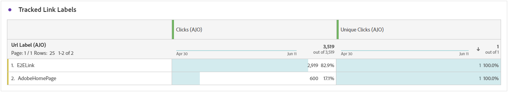

# 푸시 알림 캠페인 보고서 {#campaign-global-report-cja-push}

>[!BEGINSHADEBOX]

**이 페이지에서:** Adobe Journey Optimizer에서 푸시 알림 캠페인 보고서를 읽고 전송 및 추적 통계, 추적된 링크, 푸시 알림에 대한 반송, 오류 및 제외 이유를 검토하는 방법을 알아봅니다.

>[!ENDSHADEBOX]

>[!BEGINSHADEBOX]

캠페인에서 **[!UICONTROL 보고서]** 버튼을 클릭한 다음 **[!UICONTROL 항상 보고서 보기]**&#x200B;를 선택하여 푸시 알림 캠페인 보고서에 액세스할 수 있습니다. [자세히 알아보기](report-gs-cja.md)

>[!ENDSHADEBOX]

## 전송 통계 {#sending-statistics-push}

**[!UICONTROL 전송 통계]** 테이블은 푸시 알림 캠페인과 관련된 필수 데이터에 대한 포괄적인 요약을 제공합니다. 여기에는 타깃팅된 대상의 크기 및 성공적으로 제공된 푸시 알림의 수와 같은 주요 지표가 자세히 설명되어 있으므로 푸시 알림의 효율성과 도달에 대한 중요한 통찰력을 제공합니다.

+++ 전송 통계 지표에 대해 자세히 알아보기

* **[!UICONTROL 타깃팅]**: 제외, 억제 또는 동의 제거가 적용되기 전에 대상에 적합한 프로필 수입니다. 재입력이 활성화된 여정에서 프로필을 여러 번 타기팅할 수 있습니다.

* **[!UICONTROL 전송]**: 푸시 알림에 대한 총 전송 수입니다.

* **[!UICONTROL 배달됨]**: 보낸 총 푸시 알림 수와 관련하여 푸시 알림 수를 보냈습니다.

* **[!UICONTROL 고유 배달됨]**: 하나 이상의 푸시 알림을 성공적으로 받은 프로필 수입니다.

* **[!UICONTROL 아웃바운드 오류]**: 프로필로 보낼 수 없는 발생한 총 오류 수입니다.

* **[!UICONTROL 아웃바운드 제외]**: Adobe Journey Optimizer에서 제외된 프로필 수입니다.

+++

## 추적 통계 {#tracking-statistics-push}

**[!UICONTROL 추적 통계]** 테이블은 푸시 알림과 연결된 프로필 활동에 대한 자세한 스냅숏을 제공하여 참여 및 푸시 알림 효과에 대한 중요한 통찰력을 제공합니다.

+++ 추적 통계 지표에 대해 자세히 알아보기

* **[!UICONTROL 클릭스루 비율(CTR)]**: 푸시 알림과 상호 작용한 사용자의 비율입니다.

* **[!UICONTROL 클릭 수]**: 푸시 알림에서 콘텐츠를 클릭한 횟수입니다.

* **[!UICONTROL 고유 클릭 수]**: 푸시 알림에서 콘텐츠를 클릭한 프로필 수입니다.

* **[!UICONTROL 푸시 사용자 지정 작업]**: 푸시 알림에 대한 응답으로 프로필에서 수행한 사용자 지정 작업 수입니다.

+++

## 추적된 레이블 {#track-link-label-push}

**[!UICONTROL 추적된 링크 레이블]** 테이블은 푸시 알림 내의 링크 레이블에 대한 포괄적인 개요를 제공하여 가장 높은 방문자 트래픽을 생성하는 레이블을 강조 표시합니다. 이 기능을 사용하면 가장 인기 있는 링크를 식별하고 우선 순위를 지정할 수 있습니다.

+++ 추적된 링크 레이블 지표에 대해 자세히 알아보기

* **[!UICONTROL 고유 클릭 수]**: 푸시 알림에서 콘텐츠를 클릭한 프로필 수입니다.

* **[!UICONTROL 클릭 수]**: 푸시 알림에서 콘텐츠를 클릭한 횟수입니다.

+++

## 추적된 링크 URL {#track-link-url-push}

**[!UICONTROL 추적된 링크 URL]** 테이블은 가장 높은 방문자 트래픽을 유도하는 푸시 알림 내의 URL에 대한 포괄적인 개요를 제공합니다. 이를 통해 가장 인기 있는 링크를 식별하고 우선 순위를 지정할 수 있으므로 푸시 알림의 특정 콘텐츠와 함께 프로필 참여에 대한 이해를 높일 수 있습니다.

+++ 추적된 링크 URL 지표에 대해 자세히 알아보기

* **[!UICONTROL 고유 클릭 수]**: 푸시 알림에서 콘텐츠를 클릭한 프로필 수입니다.

* **[!UICONTROL 클릭 수]**: 푸시 알림에서 콘텐츠를 클릭한 횟수입니다.

+++

## 바운스 이유 {#bounce-reasons-push}

**[!UICONTROL 반송 원인]** 테이블은 반송된 푸시 알림과 관련된 데이터에 대한 포괄적인 개요를 제공하여 푸시 알림 반송 인스턴스의 특정 이유에 대한 중요한 통찰력을 제공합니다.

## 오류 원인 {#error-reasons-push}

**[!UICONTROL 오류 원인]** 테이블을 사용하면 푸시 알림을 보내는 동안 발생한 특정 오류를 식별할 수 있으므로 발생한 문제를 철저히 분석할 수 있습니다.

## 제외 이유 {#exclude-reasons-push}

**[!UICONTROL 제외 이유]** 표는 타깃팅된 대상에서 사용자 프로필을 제외하여 푸시 알림을 받지 못하게 한 다양한 요인을 시각적으로 보여 줍니다.

포괄적인 제외 이유 목록은 [이 페이지](exclusion-list.md)를 참조하세요.
