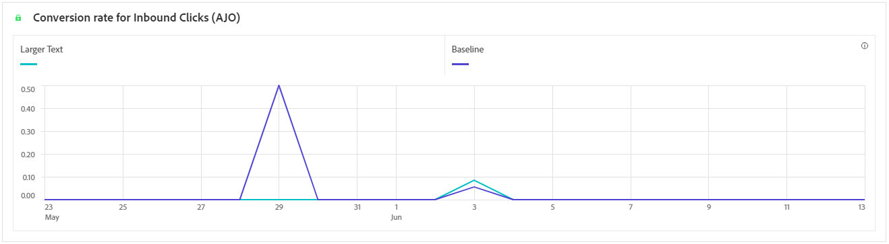

# 캠페인 보고서 {#campaign-global-report-cja}

**캠페인 보고서**&#x200B;는 포괄적인 대시보드 역할을 하며 캠페인과 관련된 주요 지표에 대한 자세한 분석을 제공합니다. 여기에는 클릭 수, 게재된 메시지, 프로필 번호 및 수행한 작업과 같은 데이터가 포함됩니다. 이 보고서는 캠페인의 효율성 및 참여 수준에 대한 완전한 개요를 제공함으로써 캠페인의 전체 성과를 철저히 파악할 수 있도록 합니다.

**[!UICONTROL 보고서]** 단추를 사용하면 Campaign 보고서에서 바로 액세스할 수 있습니다.

선택한 채널에 따라 **캠페인 보고서** 페이지에 다음 탭이 표시됩니다.

* [Campaign](#campaign-global)
* [실험](#experimentation)
* [이메일](#email-global)
* [SMS](#sms)
* [푸시 알림](#push-notification)
* [다이렉트 메일](#direct-mail)
* [웹](#web)
* [콘텐츠 카드](#content-card)

Workspace Customer Journey Analytics 및 데이터를 필터링하고 분석하는 방법에 대한 자세한 내용은 [이 페이지](https://experienceleague.adobe.com/en/docs/analytics-platform/using/cja-workspace/home)를 참조하세요.

## Campaign {#campaign-global}

### 캠페인 KPI {#campaign-kpis}

**[!UICONTROL Campaign]** KPI(주요 성과 지표)는 모든 것을 아우르는 대시보드로 작동하여 캠페인과 관련된 필수 지표에 대한 분석을 제공합니다. 여기에는 클릭 수 및 게재된 메시지 수와 같은 세부 정보가 포함되어 있어 캠페인의 효율성과 참여 수준에 대한 포괄적인 통찰력을 제공합니다.

KPI는 캠페인에 사용된 채널에 따라 달라집니다.

+++ Campaign KPI 지표에 대해 자세히 알아보기

* **[!UICONTROL 클릭스루 비율]**: 메시지와 상호 작용한 사용자의 비율입니다.

* **[!UICONTROL 클릭 수]**: 메시지에서 콘텐츠를 클릭한 횟수입니다.

* **[!UICONTROL 배달됨]**: 보낸 총 메시지 수와 관련하여 보낸 전자 메일 수입니다.

* **[!UICONTROL 표시]**: 메시지를 연 횟수입니다.

+++

### 캠페인 개요 {#delivery-global}

**[!UICONTROL 캠페인 개요]** 테이블은 포괄적인 대시보드 역할을 하며 캠페인과 관련된 주요 지표에 대한 자세한 분류를 제공합니다. 여기에는 프로필 및 게재된 작업 수와 같은 필수 정보가 포함되어 있으며, 이를 통해 캠페인의 성능과 참여를 철저히 파악할 수 있습니다.

지표는 캠페인에 사용된 채널에 따라 달라집니다.

+++ Campaign 개요 지표에 대해 자세히 알아보기

* **[!UICONTROL 사람]**: 메시지 대상 프로필로 적합한 사용자 프로필 수입니다.

* **[!UICONTROL 클릭스루 비율]**: 메시지와 상호 작용한 사용자의 비율입니다.

* **[!UICONTROL 클릭 수]**: 메시지에서 콘텐츠를 클릭한 횟수입니다.

* **[!UICONTROL 고유 클릭 수]**: 메시지에서 콘텐츠를 클릭한 프로필 수입니다.

* **[!UICONTROL 배달됨]**: 보낸 총 메시지 수와 관련하여 보낸 전자 메일 수입니다.

* **[!UICONTROL 아웃바운드 채널에 대한 바운스 수]**: 전송 프로세스 및 보낸 총 메시지 수와 관련된 자동 반환 처리 중에 누적된 총 오류 수입니다.

* **[!UICONTROL 아웃바운드 오류]**: 보내는 동안 프로필로 보낼 수 없는 총 오류 수입니다.

* **[!UICONTROL 아웃바운드 제외]**: Adobe Journey Optimizer에서 제외된 프로필 수입니다.

* **[!UICONTROL 표시]**: 메시지를 연 횟수입니다.

* **[!UICONTROL 고유 디스플레이]**: 메시지를 연 횟수이며 한 프로필의 여러 상호 작용을 고려하지 않습니다.

+++

### 캠페인 단계 결과 {#campaign-funnel}

**[!UICONTROL 캠페인 단계 결과]** 그래프는 프로필과 메시지의 참여를 자세히 분석하여 다양한 프로필이 콘텐츠와 상호 작용하는 방식에 대한 중요한 통찰력을 제공합니다.

+++ Campaign 단계 결과 지표에 대해 자세히 알아보기

* **[!UICONTROL 배달됨]**: 보낸 총 메시지 수와 관련하여 보낸 전자 메일 수입니다.

* **[!UICONTROL 클릭 수]**: 메시지에서 콘텐츠를 클릭한 횟수입니다.
+++

### 추적된 링크 레이블 {#campaign-track}

**[!UICONTROL 추적된 링크 레이블]** 테이블은 메시지에 포함된 URL과 방문자의 참여에 대한 중요한 통찰력을 제공하여 가장 많은 상호 작용을 유발하는 링크에 대한 중요한 정보를 제공합니다.

+++ 추적된 링크 레이블 지표에 대해 자세히 알아보기

* **[!UICONTROL 고유 클릭 수]**: 메시지에서 콘텐츠를 클릭한 프로필 수입니다.

* **[!UICONTROL 클릭 수]**: 메시지에서 콘텐츠를 클릭한 횟수입니다.

+++

## 실험 {#experimentation}

**[!UICONTROL 실험]** 탭은 각 변형의 성능에 대한 주요 인사이트를 제공하며 가장 성공적인 변형을 식별합니다.

최상의 수행자를 정의하는 데 약간의 시간이 걸릴 수 있습니다. 실험이 성공하지 못하면 **결론이 나지 않습니다**.

### 실험 KPI {#experimentation-kpis}

**[!UICONTROL 실험]** 주요 성과 지표(KPI)는 모든 것을 포괄하는 대시보드로 작동하여 실험과 관련된 필수 지표에 대한 분석을 제공합니다.

+++ 실험 KPI 지표에 대해 자세히 알아보기

* **[!UICONTROL 상승도]**: 기준선에 대한 해당 처리의 전환율 개선 비율을 측정합니다.

* **[!UICONTROL 신뢰도]**: 해당 처리가 기준 처리와 동일하다는 증거입니다. [자세히 알아보기](../content-management/experiment-calculations.md#understand-confidence)

+++

### 인바운드 클릭수로 변형 {#variant-inbound}

**[!UICONTROL 인바운드 클릭에 의한 변형]** 위젯은 각 변형의 성능을 자세히 설명합니다.
이러한 결과와 이를 해석하는 방법에 대한 자세한 내용은 [이 페이지](../content-management/get-started-experiment.md#interpret-results)를 참조하세요.

+++ 인바운드 클릭수로 인한 변형 지표에 대해 자세히 알아보기

* **[!UICONTROL 사람]**: 메시지 대상 프로필로 적합한 사용자 프로필 수입니다.

* **[!UICONTROL 인바운드 클릭수]**: 아웃바운드 채널의 총 클릭수.

* **[!UICONTROL 전환율]**: 실험을 만들 때 이전에 선택한 성공 지표의 총 값을 프로필 수로 나눈 값입니다.

* **[!UICONTROL 상승도]**: 기준선에 대한 해당 처리의 전환율 개선 비율을 측정합니다.

* **[!UICONTROL 신뢰도]**: 해당 처리가 기준 처리와 동일하다는 증거입니다. [자세히 알아보기](../content-management/experiment-calculations.md#understand-confidence)

<!--
* **[!UICONTROL Confidence Upper bound]**:

* **[!UICONTROL Confidence Lower bound]**:
-->
+++

### 인바운드 클릭에 대한 전환율 {#conversion-rate}

**[!UICONTROL 신뢰 구간]** 그래프는 개선과 관련된 불확실성을 측정합니다. 기준 처리와 최상의 성능 처리 사이의 성능 차이를 백분율로 자세히 설명합니다. [자세히 알아보기](../content-management/experiment-calculations.md#confidence-intervals).

## 이메일 {#email-global}

### 게재됨 및 클릭 트렌드 {#delivered-click}

**[!UICONTROL 게재됨 및 클릭 트렌드]** 그래프는 프로필과 전자 메일의 참여를 자세히 분석하여 프로필이 콘텐츠와 상호 작용하는 방법에 대한 중요한 통찰력을 제공합니다.

+++ 게재됨 및 클릭 트렌드 지표에 대해 자세히 알아보기

* **[!UICONTROL 배달됨]**: 보낸 총 전자 메일 수와 관련하여 보낸 전자 메일 수입니다.

* **[!UICONTROL 클릭 수]**: 전자 메일에서 콘텐츠를 클릭한 횟수입니다.

+++

### 게재 상태 {#delivery-status}

**[!UICONTROL 게재 상태]** 그래프는 캠페인에서 보낸 전자 메일과 관련된 데이터를 종합적으로 볼 수 있도록 해주며 게재 및 바운스 수와 같은 주요 지표에 대한 통찰력을 제공합니다. 이를 통해 이메일 전송 프로세스를 세부적으로 분석하여 캠페인의 효율성과 성능에 대한 중요한 정보를 제공할 수 있습니다.

+++ 게재 상태 지표에 대해 자세히 알아보기

* **[!UICONTROL 배달됨]**: 보낸 총 전자 메일 수와 관련하여 보낸 전자 메일 수입니다.

* **[!UICONTROL 아웃바운드 채널에 대한 바운스 수]**:전송 프로세스 및 보낸 총 메시지 수와 관련된 자동 반환 처리 중 누적된 오류의 합계입니다.

* **[!UICONTROL 아웃바운드 오류]**: 보내는 동안 프로필로 보낼 수 없는 총 오류 수입니다.

* **[!UICONTROL 아웃바운드 제외]**: Adobe Journey Optimizer에서 제외된 프로필 수입니다.

+++

### 전송 통계 {#sending-statistics-email}

**[!UICONTROL 전송 통계]** 표는 캠페인의 전자 메일에 대한 필수 데이터에 대한 포괄적인 요약을 제공합니다. 이메일과의 상호 작용 및 성공적으로 게재된 이메일 수와 같은 주요 지표를 자세히 설명하므로 이메일 및 캠페인의 효율성과 도달에 대한 중요한 통찰력을 제공합니다.

+++ 전송 통계 지표에 대해 자세히 알아보기

* **[!UICONTROL 사람]**: 메시지 대상 프로필로 적합한 사용자 프로필 수입니다.

* **[!UICONTROL 타깃팅]**: 전송 프로세스 중에 처리된 총 전자 메일 수입니다.

* **[!UICONTROL 전송]**: 전자 메일의 총 전송 수입니다.

* **[!UICONTROL 배달됨]**: 보낸 총 메시지 수와 관련하여 보낸 전자 메일 수입니다.

* **[!UICONTROL 아웃바운드 채널에 대한 바운스 수]**: 전송 프로세스 및 보낸 총 메시지 수와 관련된 자동 반환 처리 중에 누적된 총 오류 수입니다.

* **[!UICONTROL 아웃바운드 오류]**: 보내는 동안 프로필로 보낼 수 없는 총 오류 수입니다.

* **[!UICONTROL 아웃바운드 제외]**: Adobe Journey Optimizer에서 제외된 프로필 수입니다.

+++

### 추적 통계 {#tracking-statistics-email}

**[!UICONTROL 전자 메일 - 추적 통계]** 표에는 캠페인에 포함된 전자 메일과 관련된 프로필 활동에 대한 자세한 계정이 있습니다. 여기에는 열람, 클릭 수 및 기타 관련 참여 지표에 대한 지표가 포함되며 프로필이 이메일 콘텐츠와 상호 작용하는 방식에 대한 포괄적인 보기를 제공합니다.

+++ 추적 통계 지표에 대해 자세히 알아보기

* **[!UICONTROL 클릭스루 비율(CTR)]**: 전자 메일과 상호 작용한 사용자의 비율입니다.

* **[!UICONTROL 클릭스루 열람율(CTOR)]**: 이메일을 연 횟수입니다.

* **[!UICONTROL 클릭 수]**: 전자 메일에서 콘텐츠를 클릭한 횟수입니다.

* **[!UICONTROL 고유 클릭 수]**: 전자 메일의 콘텐츠를 클릭한 프로필 수입니다.

* **[!UICONTROL 전자 메일 열림]**: 캠페인에서 전자 메일을 연 횟수입니다.

* **[!UICONTROL 고유 전자 메일 열림]**: 열린 전자 메일의 비율입니다.

* **[!UICONTROL 스팸 고객 불만]**: 메시지가 스팸 또는 정크로 선언된 횟수입니다.

* **[!UICONTROL 구독 취소]**: 구독 취소 링크의 클릭 수입니다.

+++

### 이메일 도메인 {#email-domains}

**[!UICONTROL 이메일 도메인]** 표에는 도메인별로 분류된 이메일에 대한 심층적인 분류가 있어 이메일 캠페인의 성능 지표에 대한 광범위한 통찰력을 제공합니다. 이 포괄적인 분석을 통해 이메일 콘텐츠에 대한 응답으로 다양한 도메인의 동작을 이해할 수 있습니다.

+++ 이메일 도메인 지표에 대해 자세히 알아보기

* **[!UICONTROL 전송]**: 전자 메일의 총 전송 수입니다.

* **[!UICONTROL 배달됨]**: 보낸 총 전자 메일 수와 관련하여 보낸 전자 메일 수입니다.

* **[!UICONTROL 전자 메일 열림]**: 캠페인에서 전자 메일을 연 횟수입니다.

* **[!UICONTROL 클릭 수]**: 전자 메일에서 콘텐츠를 클릭한 횟수입니다.

* **[!UICONTROL 아웃바운드 채널에 대한 바운스 수]**: 보낸 전자 메일의 총 수와 관련하여 전송 프로세스 및 자동 반환 처리 중에 누적된 총 오류 수입니다.

* **[!UICONTROL 아웃바운드 오류]**: 보내는 동안 프로필로 보낼 수 없는 총 오류 수입니다.
+++

### 추적된 링크 레이블 {#track-link-label}

**[!UICONTROL 추적된 링크 레이블]** 테이블은 이메일 내의 링크 레이블에 대한 포괄적인 개요를 제공하며 가장 높은 방문자 트래픽을 생성하는 레이블을 강조 표시합니다. 이 기능을 사용하면 가장 인기 있는 링크를 식별하고 우선 순위를 지정할 수 있습니다.

+++ 추적된 링크 레이블 지표에 대해 자세히 알아보기

* **[!UICONTROL 고유 클릭 수]**: 전자 메일의 콘텐츠를 클릭한 프로필 수입니다.

* **[!UICONTROL 클릭 수]**: 전자 메일에서 콘텐츠를 클릭한 횟수입니다.

+++

### 추적된 링크 URL {#track-link-url}

**[!UICONTROL 추적된 링크 URL]** 테이블은 가장 높은 방문자 트래픽을 유도하는 전자 메일 내의 URL에 대한 포괄적인 개요를 제공합니다. 이를 통해 가장 인기 있는 링크를 식별하고 우선 순위를 지정할 수 있으므로 이메일의 특정 콘텐츠와 함께 프로필 참여를 보다 잘 이해할 수 있습니다.

+++ 추적된 링크 URL 지표에 대해 자세히 알아보기

* **[!UICONTROL 고유 클릭 수]**: 전자 메일의 콘텐츠를 클릭한 프로필 수입니다.

* **[!UICONTROL 클릭 수]**: 전자 메일에서 콘텐츠를 클릭한 횟수입니다.

* **[!UICONTROL 디스플레이]**: 이메일을 연 횟수입니다.

* **[!UICONTROL 고유 디스플레이]**: 전자 메일을 연 횟수와 한 프로필의 여러 상호 작용을 고려하지 않습니다.

+++

### 이메일 제목 {#email-subjects}

**[!UICONTROL 전자 메일 제목]** 표에는 가장 높은 방문자 트래픽을 가져온 전자 메일 제목에 대한 전체 개요가 나와 있습니다. 이 리소스는 대상 참여 역학에 대한 중요한 통찰력을 제공합니다.

+++ 이메일 주제 지표에 대해 자세히 알아보기

* **[!UICONTROL 사람]**: 전자 메일의 대상 프로필로 적합한 사용자 프로필 수입니다.

+++

### 제외된 이유 {#excluded-reasons}

**[!UICONTROL 제외된 이유]** 표에는 대상 대상에서 사용자 프로필을 제외하여 메시지가 수신되지 않는 다양한 요인에 대한 포괄적인 보기가 표시됩니다.

포괄적인 제외 이유 목록은 [이 페이지](exclusion-list.md)를 참조하세요.

### 바운스 이유 {#bounce-reasons-email}

**[!UICONTROL 반송 이유]** 테이블은 반송된 메시지와 관련된 사용 가능한 데이터를 컴파일하여 이메일 반송 이면의 특정 이유에 대한 자세한 인사이트를 제공합니다.

바운스에 대한 자세한 내용은 [제외 목록](../reports/suppression-list.md) 페이지를 참조하세요.

### 오류 원인 {#error-reasons-email}

**[!UICONTROL 오류 원인]** 표는 전송 프로세스 중에 발생한 특정 오류에 대한 가시성을 제공하여 오류의 특성 및 발생에 대한 중요한 정보를 제공합니다.

## SMS {#sms}

### 게재됨 및 클릭 트렌드 {#delivered-click-sms}

**[!UICONTROL 게재됨 및 클릭 트렌드]** 그래프는 프로필과 전자 메일의 참여를 자세히 분석하여 프로필이 콘텐츠와 상호 작용하는 방법에 대한 중요한 통찰력을 제공합니다.

+++ 게재됨 및 클릭 트렌드 지표에 대해 자세히 알아보기

* **[!UICONTROL 배달됨]**: SMS 메시지 총 수와 관련하여 SMS 메시지를 성공적으로 보낸 수

* **[!UICONTROL 클릭 수]**: SMS 메시지에서 콘텐츠를 클릭한 횟수입니다.

+++

### 게재 상태 {#delivery-status-sms}

**[!UICONTROL 게재 상태]** 표에는 SMS 캠페인과 관련된 프로필 활동에 대한 자세한 계정이 있습니다. 여기에는 게재된 지표, 클릭 수 및 기타 관련 참여 지표가 포함되며 프로필이 SMS 콘텐츠와 상호 작용하는 방식에 대한 포괄적인 보기를 제공합니다.

+++ 게재 상태 지표에 대해 자세히 알아보기

* **[!UICONTROL 배달됨]**: SMS 메시지 총 수와 관련하여 SMS 메시지를 성공적으로 보낸 수

* **[!UICONTROL 아웃바운드 채널에 대한 바운스 수]**: 보낸 SMS 메시지의 총 수와 관련하여 전송 프로세스 및 자동 반환 처리 중에 누적된 총 오류 수입니다.

* **[!UICONTROL 아웃바운드 오류]**: 프로필로 보낼 수 없는 발생한 총 오류 수입니다.

* **[!UICONTROL 아웃바운드 제외]**: Adobe Journey Optimizer에서 제외된 프로필 수입니다.

+++

### 추적된 링크 레이블 {#track-link-label-sms}

**[!UICONTROL 추적된 링크 레이블]** 표는 SMS 메시지 내의 링크 레이블에 대한 포괄적인 개요를 제공하며, 가장 높은 방문자 트래픽을 생성하는 레이블을 강조 표시합니다. 이 기능을 사용하면 가장 인기 있는 링크를 식별하고 우선 순위를 지정할 수 있습니다.

+++ 추적된 링크 레이블 지표에 대해 자세히 알아보기

* **[!UICONTROL 고유 클릭 수]**: SMS 메시지의 콘텐츠를 클릭한 프로필 수입니다.

* **[!UICONTROL 클릭 수]**: SMS 메시지에서 콘텐츠를 클릭한 횟수입니다.

+++

### 추적된 링크 URL {#track-link-url-sms}

**[!UICONTROL 추적된 링크 URL]** 테이블은 SMS 메시지 내의 URL에서 가장 높은 방문자 트래픽을 유도하는 포괄적인 개요를 제공합니다. 이를 통해 가장 인기 있는 링크를 식별하고 우선 순위를 지정할 수 있으므로 SMS 메시지의 특정 콘텐츠와 함께 프로필 참여를 보다 잘 이해할 수 있습니다.

+++ 추적된 링크 URL 지표에 대해 자세히 알아보기

* **[!UICONTROL 고유 클릭 수]**: SMS 메시지의 콘텐츠를 클릭한 프로필 수입니다.

* **[!UICONTROL 클릭 수]**: SMS 메시지에서 콘텐츠를 클릭한 횟수입니다.

* **[!UICONTROL 표시]**: 메시지를 연 횟수입니다.

* **[!UICONTROL 고유 디스플레이]**: 메시지를 연 횟수이며 한 프로필의 여러 상호 작용을 고려하지 않습니다.

+++

### SMS 인바운드 메시지 {#sms-inbound}

**[!UICONTROL SMS 인바운드 메시지]** 표에는 가장 높은 방문자 트래픽을 유도하는 SMS 메시지에 대한 전체 개요가 표시됩니다. 이 리소스는 대상 참여 역학에 대한 중요한 통찰력을 제공합니다.

+++ SMS 인바운드 메시지 지표에 대해 자세히 알아보기

* **[!UICONTROL 사용자]**: SMS 메시지의 대상 프로필로 적합한 사용자 프로필 수입니다.

+++

### SMS 메시지 유형 {#sms-message-type}

**[!UICONTROL SMS 메시지 유형]** 표에는 가장 높은 방문자 트래픽을 유도하는 SMS 메시지 유형에 대한 전체 개요가 표시됩니다. 이 리소스는 대상 참여 역학에 대한 중요한 통찰력을 제공합니다.

+++ SMS 메시지 유형 지표에 대해 자세히 알아보기

* **[!UICONTROL 사용자]**: SMS 메시지의 대상 프로필로 적합한 사용자 프로필 수입니다.

+++

### SMS 공급자 {#sms-providers}

**[!UICONTROL SMS 공급자]** 표에는 가장 높은 방문자 트래픽을 가져온 SMS 공급자에 대한 전체 개요가 표시됩니다. 이 리소스는 대상 참여 역학에 대한 중요한 통찰력을 제공합니다.

+++ SMS 공급자 지표에 대해 자세히 알아보기

* **[!UICONTROL 사용자]**: SMS 메시지의 대상 프로필로 적합한 사용자 프로필 수입니다.

+++

### 바운스 이유 {#bounce-reasons-sms}

**[!UICONTROL 반송 원인]** 표는 반송된 SMS 메시지와 관련된 데이터에 대한 포괄적인 개요를 제공하여 SMS 메시지 반송 인스턴스의 특정 이유에 대한 중요한 통찰력을 제공합니다.

### 오류 원인 {#error-reasons-sms}

**[!UICONTROL 오류 원인]** 표를 사용하면 SMS 메시지를 보내는 동안 발생한 특정 오류를 식별할 수 있으므로 발생한 문제를 철저히 분석할 수 있습니다.

### 제외 이유 {#excluded-reasons-sms}

**[!UICONTROL 제외 이유]** 표는 타깃팅된 대상자에서 사용자 프로필을 제외하여 SMS 메시지를 받지 못하게 하는 다양한 요인을 시각적으로 보여 줍니다.

포괄적인 제외 이유 목록은 [이 페이지](exclusion-list.md)를 참조하세요.

## 푸시 알림 {#push-notification}

### 전송 통계 {#sending-statistics-push}

**[!UICONTROL 전송 통계]** 테이블은 푸시 알림 캠페인과 관련된 필수 데이터에 대한 포괄적인 요약을 제공합니다. 여기에는 타깃팅된 대상의 크기 및 성공적으로 제공된 푸시 알림의 수와 같은 주요 지표가 자세히 설명되어 있으므로 푸시 알림의 효율성과 도달에 대한 중요한 통찰력을 제공합니다.

+++ 전송 통계 지표에 대해 자세히 알아보기

* **[!UICONTROL 사람]**: 푸시 알림의 대상 프로필로 적합한 사용자 프로필 수입니다.

* **[!UICONTROL 타깃팅]**: 분석 중에 처리된 총 푸시 알림 수입니다.

* **[!UICONTROL 전송]**: 푸시 알림에 대한 총 전송 수입니다.

* **[!UICONTROL 배달됨]**: 보낸 총 푸시 알림 수와 관련하여 푸시 알림 수를 보냈습니다.

* **[!UICONTROL 아웃바운드 채널에 대한 바운스 수]**: 총 푸시 알림 수와 관련하여 전송 프로세스 및 자동 반환 처리 중에 누적된 총 오류 수입니다.

* **[!UICONTROL 아웃바운드 오류]**: 프로필로 보낼 수 없는 발생한 총 오류 수입니다.

* **[!UICONTROL 아웃바운드 제외]**: Adobe Journey Optimizer에서 제외된 프로필 수입니다.

+++

### 추적 통계 {#tracking-statistics-push}

**[!UICONTROL 추적 통계]** 테이블은 푸시 알림과 연결된 프로필 활동에 대한 자세한 스냅숏을 제공하여 참여 및 푸시 알림 효과에 대한 중요한 통찰력을 제공합니다.

+++ 추적 통계 지표에 대해 자세히 알아보기

* **[!UICONTROL 클릭스루 비율(CTR)]**: 푸시 알림과 상호 작용한 사용자의 비율입니다.

* **[!UICONTROL CTOR(Click through open rate)]**: 푸시 알림을 연 횟수입니다.

* **[!UICONTROL 클릭 수]**: 푸시 알림에서 콘텐츠를 클릭한 횟수입니다.

* **[!UICONTROL 고유 클릭 수]**: 푸시 알림에서 콘텐츠를 클릭한 프로필 수입니다.

<!--
* **[!UICONTROL Push custom actions]**: 
-->
+++

### 추적된 링크 레이블 {#track-link-label-push}

**[!UICONTROL 추적된 링크 레이블]** 테이블은 푸시 알림 내의 링크 레이블에 대한 포괄적인 개요를 제공하여 가장 높은 방문자 트래픽을 생성하는 레이블을 강조 표시합니다. 이 기능을 사용하면 가장 인기 있는 링크를 식별하고 우선 순위를 지정할 수 있습니다.

+++ 추적된 링크 레이블 지표에 대해 자세히 알아보기

* **[!UICONTROL 고유 클릭 수]**: 푸시 알림에서 콘텐츠를 클릭한 프로필 수입니다.

* **[!UICONTROL 클릭 수]**: 푸시 알림에서 콘텐츠를 클릭한 횟수입니다.

+++

### 추적된 링크 URL {#track-link-url-push}

**[!UICONTROL 추적된 링크 URL]** 테이블은 가장 높은 방문자 트래픽을 유도하는 푸시 알림 내의 URL에 대한 포괄적인 개요를 제공합니다. 이를 통해 가장 인기 있는 링크를 식별하고 우선 순위를 지정할 수 있으므로 푸시 알림의 특정 콘텐츠와 함께 프로필 참여에 대한 이해를 높일 수 있습니다.

+++ 추적된 링크 URL 지표에 대해 자세히 알아보기

* **[!UICONTROL 고유 클릭 수]**: 푸시 알림에서 콘텐츠를 클릭한 프로필 수입니다.

* **[!UICONTROL 클릭 수]**: 푸시 알림에서 콘텐츠를 클릭한 횟수입니다.

+++

### 바운스 이유 {#bounce-reasons-push}

**[!UICONTROL 반송 원인]** 테이블은 반송된 푸시 알림과 관련된 데이터에 대한 포괄적인 개요를 제공하여 푸시 알림 반송 인스턴스의 특정 이유에 대한 중요한 통찰력을 제공합니다.

### 오류 원인 {#error-reasons-push}

**[!UICONTROL 오류 원인]** 테이블을 사용하면 푸시 알림을 보내는 동안 발생한 특정 오류를 식별할 수 있으므로 발생한 문제를 철저히 분석할 수 있습니다.

### 제외된 이유 {#exclude-reasons-push}

**[!UICONTROL 제외 이유]** 표는 타깃팅된 대상에서 사용자 프로필을 제외하여 푸시 알림을 받지 못하게 한 다양한 요인을 시각적으로 보여 줍니다.

포괄적인 제외 이유 목록은 [이 페이지](exclusion-list.md)를 참조하세요.

## 인앱 {#in-app}

### 노출 및 클릭 트렌드 {#impression-click-trend}

**[!UICONTROL 노출 및 클릭 트렌드]** 그래프는 인앱 메시지에 대한 프로필의 참여를 자세히 분석하여 프로필이 콘텐츠와 상호 작용하는 방법에 대한 중요한 통찰력을 제공합니다.

+++ 노출 및 클릭 트렌드 지표에 대해 자세히 알아보기

* **[!UICONTROL 클릭 수]**: 인앱 메시지에서 콘텐츠를 클릭한 횟수입니다.

* **[!UICONTROL 표시]**: 메시지를 연 횟수입니다.

+++

### 클릭수 {#clicks-inapp}

**[!UICONTROL 클릭 수]** 그래프는 총 콘텐츠 클릭 수와 콘텐츠를 클릭한 고유 프로필 수를 모두 보여 주는 인앱 클릭 지표를 표시합니다.

+++ 클릭 지표에 대해 자세히 알아보기

* **[!UICONTROL 고유 클릭 수]**: 인앱 메시지의 콘텐츠를 클릭한 프로필 수

* **[!UICONTROL 클릭 수]**: 인앱 메시지에서 콘텐츠를 클릭한 횟수입니다.

+++

### 표시 {#display-inapp}

**[!UICONTROL 디스플레이]** 그래프를 사용하면 메시지의 전체 도달 범위와 메시지와 관련된 고유 프로필의 수를 모두 이해할 수 있습니다.

+++ 디스플레이 지표에 대해 자세히 알아보기

* **[!UICONTROL 표시]**: 메시지를 연 횟수입니다.

* **[!UICONTROL 고유 디스플레이]**: 메시지를 연 횟수이며 한 프로필의 여러 상호 작용을 고려하지 않습니다.

+++

### 추적 데이터 {#tracking-data-inapp}

**[!UICONTROL 추적 데이터]** 테이블은 인앱 메시지에 연결된 프로필 활동에 대한 자세한 스냅숏을 제공하여 참여 및 인앱 메시지 효과에 대한 중요한 통찰력을 제공합니다.

+++ 데이터 지표 추적에 대해 자세히 알아보기

* **[!UICONTROL 사람]**: 인앱 메시지의 대상 프로필로 적합한 사용자 프로필 수입니다.

* **[!UICONTROL 클릭스루 비율(CTR)]**: 인앱 메시지와 상호 작용한 사용자의 비율입니다.

* **[!UICONTROL 클릭스루 열기 비율(CTOR)]**: 인앱 메시지가 열린 횟수입니다.

* **[!UICONTROL 클릭 수]**: 인앱 메시지에서 콘텐츠를 클릭한 횟수입니다.

* **[!UICONTROL 고유 클릭 수]**: 인앱 메시지의 콘텐츠를 클릭한 프로필 수입니다.

* **[!UICONTROL 표시]**: 메시지를 연 횟수입니다.

* **[!UICONTROL 고유 디스플레이]**: 메시지를 연 횟수이며 한 프로필의 여러 상호 작용을 고려하지 않습니다.

* **[!UICONTROL 전송]**: 인앱 메시지의 총 전송 수입니다.

<!--
* **[!UICONTROL Inbound triggered]**: 

* **[!UICONTROL Inbound dismisses]**: 
-->
+++

### 추적된 링크 레이블 {#track-link-label-inapp}

**[!UICONTROL 추적된 링크 레이블]** 테이블은 인앱 메시지 내의 링크 레이블에 대한 포괄적인 개요를 제공하며 가장 높은 방문자 트래픽을 생성하는 레이블을 강조 표시합니다. 이 기능을 사용하면 가장 인기 있는 링크를 식별하고 우선 순위를 지정할 수 있습니다.

+++ 추적된 링크 레이블 지표에 대해 자세히 알아보기

* **[!UICONTROL 고유 클릭 수]**: 인앱 메시지의 콘텐츠를 클릭한 프로필 수입니다.

* **[!UICONTROL 클릭 수]**: 인앱 메시지에서 콘텐츠를 클릭한 횟수입니다.

* **[!UICONTROL 표시]**: 메시지를 연 횟수입니다.

* **[!UICONTROL 고유 디스플레이]**: 메시지를 연 횟수이며 한 프로필의 여러 상호 작용을 고려하지 않습니다.

+++

### 추적된 링크 URL {#track-link-url-inapp}

**[!UICONTROL 추적된 링크 URL]** 테이블은 가장 높은 방문자 트래픽을 유도하는 인앱 메시지 내의 URL에 대한 포괄적인 개요를 제공합니다. 이를 통해 가장 인기 있는 링크를 식별하고 우선 순위를 지정할 수 있으므로 인앱 메시지의 특정 콘텐츠와 함께 프로필 참여를 보다 잘 이해할 수 있습니다.

+++ 추적된 링크 URL 지표에 대해 자세히 알아보기

* **[!UICONTROL 고유 클릭 수]**: 인앱 메시지의 콘텐츠를 클릭한 프로필 수입니다.

* **[!UICONTROL 클릭 수]**: 인앱 메시지에서 콘텐츠를 클릭한 횟수입니다.

+++

## 다이렉트 메일 {#direct-mail}

### 전송 통계 {#sending-statistics-directmail}

**[!UICONTROL 전송 통계]** 표는 DM 캠페인과 관련된 필수 데이터에 대한 포괄적인 요약을 제공합니다. 여기에는 타겟팅된 대상의 크기 및 배달된 DM 수와 같은 주요 지표가 자세히 설명되어 있으며, 이를 통해 DM 메시지의 효과 및 도달에 대한 중요한 통찰력을 얻을 수 있습니다.

+++ 전송 통계 지표에 대해 자세히 알아보기

* **[!UICONTROL 사람]**: 메시지 대상 프로필로 적합한 사용자 프로필 수입니다.

* **[!UICONTROL 대상]**: 보내는 동안 처리된 총 DM 메시지 수입니다.

* **[!UICONTROL 전송]**: DM 메시지의 총 전송 수입니다.

* **[!UICONTROL 배달됨]**: 보낸 총 메시지 수와 관련하여 보낸 DM 메시지 수입니다.

* **[!UICONTROL 아웃바운드 오류]**: 보내는 동안 프로필로 보낼 수 없는 총 오류 수입니다.

* **[!UICONTROL 아웃바운드 제외]**: Adobe Journey Optimizer에서 제외된 프로필 수입니다.

+++

### 게재 상태 {#delivery-status-directmail}

**[!UICONTROL 게재 상태]** 그래프는 캠페인에서 보낸 DM 메시지와 관련된 데이터를 종합적으로 볼 수 있도록 해주며 게재됨, 오류 등의 주요 지표에 대한 통찰력을 제공합니다. 이를 통해 DM 메시지 전송 프로세스를 자세히 분석할 수 있으므로 캠페인의 효율성과 성능에 대한 중요한 정보를 제공합니다.

+++ 게재 상태 지표에 대해 자세히 알아보기

* **[!UICONTROL 배달됨]**: 보낸 DM 메시지의 총 수와 관련하여 보낸 DM 메시지 수입니다.

* **[!UICONTROL 아웃바운드 오류]**: DM 메시지를 프로필로 보낼 수 없도록 보내는 동안 발생한 총 오류 수입니다.

* **[!UICONTROL Untbound 제외]**: Adobe Journey Optimizer에서 제외된 프로필 수입니다.

+++

### 오류 원인 {#error-reasons-directmail}

**[!UICONTROL 오류 원인]** 표를 사용하면 DM 메시지를 보내는 동안 발생한 특정 오류를 식별할 수 있으므로 발생한 문제를 철저히 분석할 수 있습니다.

### 제외된 이유 {#exclude-reasons-directmail}

**[!UICONTROL 제외 이유]** 표는 대상 대상자에서 사용자 프로필을 제외하여 DM 메시지를 받지 못하게 한 다양한 요인을 시각적으로 보여줍니다.

포괄적인 제외 이유 목록은 [이 페이지](exclusion-list.md)를 참조하세요.

## 웹 {#web}

### 노출 및 클릭 트렌드 {#impressions-web}

**[!UICONTROL 노출 및 클릭 트렌드]** 그래프는 프로필과 웹 페이지의 참여를 자세히 분석하여 프로필이 콘텐츠와 상호 작용하는 방법에 대한 중요한 통찰력을 제공합니다.

+++ 노출 및 클릭 트렌드 지표에 대해 자세히 알아보기

* **[!UICONTROL 클릭 수]**: 웹 페이지에서 콘텐츠를 클릭한 횟수입니다.

* **[!UICONTROL 표시]**: 메시지를 연 횟수입니다.

+++

### 클릭수 {#clicks-web}

**[!UICONTROL 클릭 수]** 그래프는 총 콘텐츠 클릭 수와 콘텐츠를 클릭한 고유 프로필 수를 모두 보여 주는 웹 페이지 클릭 지표를 표시합니다.

+++ 클릭 지표에 대해 자세히 알아보기

* **[!UICONTROL 고유 클릭 수]**: 웹 페이지에서 콘텐츠를 클릭한 프로필 수입니다.

* **[!UICONTROL 클릭 수]**: 웹 페이지에서 콘텐츠를 클릭한 횟수입니다.

+++

### 디스플레이 {#displays-web}

**[!UICONTROL 디스플레이]** 그래프를 사용하면 메시지의 전체 도달 범위와 메시지와 관련된 고유 프로필의 수를 모두 이해할 수 있습니다.

+++ 디스플레이 지표에 대해 자세히 알아보기

* **[!UICONTROL 표시]**: 메시지를 연 횟수입니다.

* **[!UICONTROL 고유 디스플레이]**: 메시지를 연 횟수이며 한 프로필의 여러 상호 작용을 고려하지 않습니다.

+++

### 추적 데이터 {#track-data-web}

**[!UICONTROL 추적 데이터]** 테이블은 웹 페이지에 연결된 프로필 활동에 대한 자세한 스냅숏을 제공하여 참여 및 웹 페이지 효과에 대한 중요한 통찰력을 제공합니다.

+++ 데이터 지표 추적에 대해 자세히 알아보기

* **[!UICONTROL 사람]**: 웹 페이지의 대상 프로필로 적합한 사용자 프로필 수입니다.

* **[!UICONTROL 클릭스루 비율(CTR)]**: 웹 페이지와 상호 작용한 사용자의 비율입니다.

* **[!UICONTROL 클릭 수]**: 웹 페이지에서 콘텐츠를 클릭한 횟수입니다.

* **[!UICONTROL 고유 클릭 수]**: 웹 페이지에서 콘텐츠를 클릭한 프로필 수입니다.

* **[!UICONTROL 표시]**: 웹 페이지를 연 횟수입니다.

* **[!UICONTROL 고유 디스플레이]**: 웹 페이지를 연 횟수와 한 프로필의 여러 상호 작용을 고려하지 않습니다.

+++

### 추적된 링크 레이블 {#track-link-web}

**[!UICONTROL 추적된 링크 레이블]** 테이블은 웹 페이지 내의 링크 레이블에 대한 포괄적인 개요를 제공하여 가장 높은 방문자 트래픽을 생성하는 레이블을 강조 표시합니다. 이 기능을 사용하면 가장 인기 있는 링크를 식별하고 우선 순위를 지정할 수 있습니다.

+++ 추적된 링크 레이블 지표에 대해 자세히 알아보기

* **[!UICONTROL 고유 클릭 수]**: 웹 페이지에서 콘텐츠를 클릭한 프로필 수입니다.

* **[!UICONTROL 클릭 수]**: 웹 페이지에서 콘텐츠를 클릭한 횟수입니다.

* **[!UICONTROL 표시]**: 메시지를 연 횟수입니다.

* **[!UICONTROL 고유 디스플레이]**: 메시지를 연 횟수이며 한 프로필의 여러 상호 작용을 고려하지 않습니다.

+++

### 추적된 링크 URL {#track-url-web}

**[!UICONTROL 추적된 링크 URL]** 테이블은 가장 높은 방문자 트래픽을 유도하는 웹 페이지 내 URL에 대한 포괄적인 개요를 제공합니다. 이를 통해 가장 인기 있는 링크를 식별하고 우선 순위를 지정할 수 있으므로 웹 페이지의 특정 콘텐츠와 관련한 프로필 참여에 대한 이해를 높일 수 있습니다.

+++ 추적된 링크 URL 지표에 대해 자세히 알아보기

* **[!UICONTROL 고유 클릭 수]**: 웹 페이지에서 콘텐츠를 클릭한 프로필 수입니다.

* **[!UICONTROL 클릭 수]**: 웹 페이지에서 콘텐츠를 클릭한 횟수입니다.

* **[!UICONTROL 표시]**: 메시지를 연 횟수입니다.

* **[!UICONTROL 고유 디스플레이]**: 메시지를 연 횟수이며 한 프로필의 여러 상호 작용을 고려하지 않습니다.

+++

## 콘텐츠 카드 {#content-card}

### 표시 및 클릭 트렌드 {#display-click}

**[!UICONTROL 표시 및 클릭 트렌드]** 그래프는 메시지의 전체 도달 범위와 관련된 고유 프로필의 수를 모두 이해하는 데 도움이 됩니다.

+++ 디스플레이 및 클릭 지표에 대해 자세히 알아보기

* **[!UICONTROL 클릭 수]**: 콘텐츠 카드에서 콘텐츠를 클릭한 횟수입니다.

* **[!UICONTROL 표시]**: 메시지를 연 횟수입니다.

* **[!UICONTROL 고유 디스플레이]**: 메시지를 연 횟수이며 한 프로필의 여러 상호 작용을 고려하지 않습니다.

+++

### 추적 데이터 {#tracking-data}

**[!UICONTROL 추적 데이터]** 테이블은 콘텐츠 카드에 연결된 프로필 활동에 대한 자세한 스냅숏을 제공하여 참여 및 콘텐츠 카드 효과에 대한 중요한 통찰력을 제공합니다.

+++ 데이터 지표 추적에 대해 자세히 알아보기

* **[!UICONTROL 사람]**: 콘텐츠 카드의 대상 프로필로 적합한 사용자 프로필 수입니다.

* **[!UICONTROL 클릭스루 비율(CTR)]**: 콘텐츠 카드와 상호 작용한 사용자의 비율입니다.

* **[!UICONTROL 클릭 수]**: 콘텐츠 카드에서 콘텐츠를 클릭한 횟수입니다.

* **[!UICONTROL 고유 클릭 수]**: 콘텐츠 카드에서 콘텐츠를 클릭한 프로필 수입니다.

* **[!UICONTROL 표시]**: 메시지를 연 횟수입니다.

* **[!UICONTROL 고유 디스플레이]**: 메시지를 연 횟수이며 한 프로필의 여러 상호 작용을 고려하지 않습니다.

+++

### 추적된 레이블 {#tracked-labels}

**[!UICONTROL 추적된 레이블]** 테이블은 콘텐츠 카드 내의 링크 레이블에 대한 포괄적인 개요를 제공하여 가장 높은 방문자 트래픽을 생성하는 레이블을 강조 표시합니다. 이 기능을 사용하면 가장 인기 있는 링크를 식별하고 우선 순위를 지정할 수 있습니다.

+++ 추적된 레이블 지표에 대해 자세히 알아보기

* **[!UICONTROL 고유 클릭 수]**: 콘텐츠 카드의 콘텐츠를 클릭한 프로필 수입니다.

* **[!UICONTROL 클릭 수]**: 콘텐츠 카드에서 콘텐츠를 클릭한 횟수입니다.

* **[!UICONTROL 표시]**: 메시지를 연 횟수입니다.

* **[!UICONTROL 고유 디스플레이]**: 메시지를 연 횟수이며 한 프로필의 여러 상호 작용을 고려하지 않습니다.

+++

### 추적된 링크 URL {#tracked-link-url}

**[!UICONTROL 추적된 링크 URL]** 테이블은 가장 높은 방문자 트래픽을 유도하는 콘텐츠 카드 내의 URL에 대한 포괄적인 개요를 제공합니다. 이를 통해 가장 인기 있는 링크를 식별하고 우선 순위를 지정할 수 있으므로 콘텐츠 카드의 특정 콘텐츠와 관련한 프로필 참여에 대한 이해를 높일 수 있습니다.

+++ 추적된 링크 URL 지표에 대해 자세히 알아보기

* **[!UICONTROL 고유 클릭 수]**: 콘텐츠 카드의 콘텐츠를 클릭한 프로필 수입니다.

* **[!UICONTROL 클릭 수]**: 콘텐츠 카드에서 콘텐츠를 클릭한 횟수입니다.

+++
