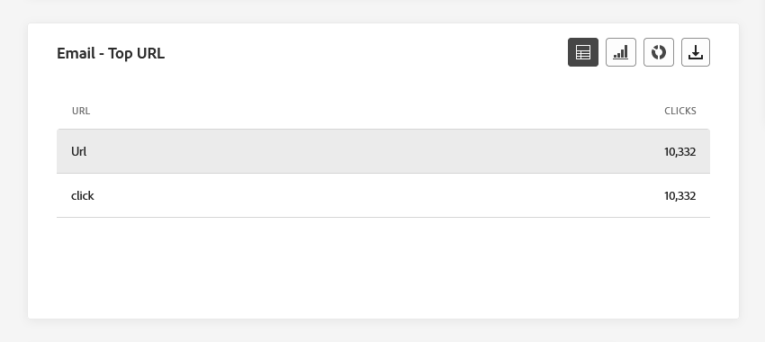
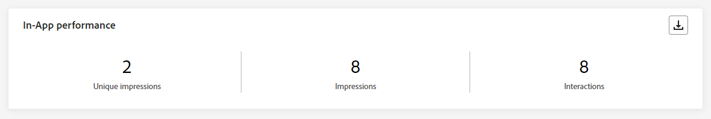
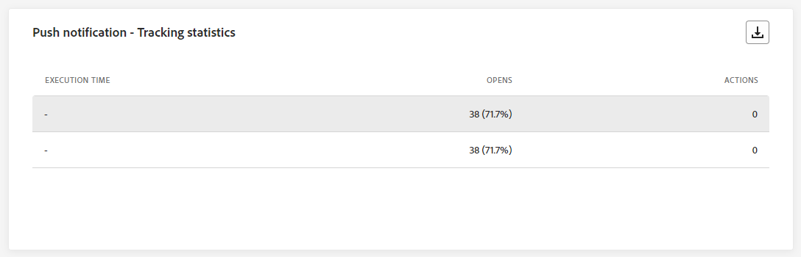
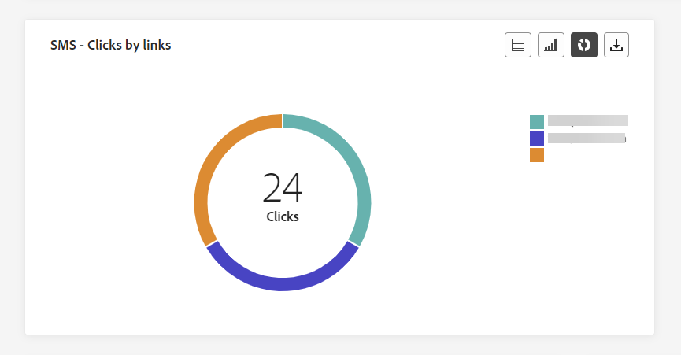

# 캠페인 글로벌 보고서 {#campaign-global-report}

>[!CONTEXTUALHELP]
>id="ajo_campaign_global_report"
>title="캠페인 글로벌 보고서"
>abstract="캠페인 글로벌 보고서를 사용하여 선택된 기간에 대해 캠페인의 영향을 측정할 수 있습니다. 보고서는 캠페인 성공 사례와 오류를 자세히 설명하는 여러 위젯으로 나눠집니다. 위젯 크기를 조정하거나 위젯을 제거하여 각 보고 대시보드를 수정할 수 있습니다."

전역 보고서, 다음에서 액세스 가능: **모든 시간** 탭에는 최소 2시간 전에 발생한 이벤트가 표시되며, 선택한 기간 동안의 이벤트도 표시됩니다. 반면 라이브 보고서는 이벤트 발생으로부터 최소 2분의 시간 간격을 가지고 지난 24시간 내에 발생한 이벤트에 중점을 둡니다.

Campaign 글로벌 보고서는 Campaign에서 **[!UICONTROL 보고서 보기]** 단추를 클릭합니다.

캠페인 **[!UICONTROL 글로벌 보고서]** 다음 탭이 있는 페이지가 표시됩니다.

* [Campaign](#campaign-global)
* [이메일](#email-global)
* [인앱](#inapp-global)
* [푸시](#push-global)
* [SMS](#sms-global)
* [웹](#web-tab)
* [DM](#direct-mail-global)

캠페인 **[!UICONTROL 글로벌 보고서]** 은 캠페인의 성공 및 오류를 자세히 설명하는 다양한 위젯으로 나뉩니다. 필요한 경우 각 위젯의 크기를 조정하고 삭제할 수 있습니다. 자세한 내용은 다음을 참조하십시오. [섹션](../reports/global-report.md#modify-dashboard).

Adobe Journey Optimizer에서 사용할 수 있는 모든 지표의 자세한 목록은 을 참조하십시오. [이 페이지](global-report.md#list-of-components-global.md)

## 캠페인 탭 {#campaign-global}

### 게재 {#delivery-global}

>[!CONTEXTUALHELP]
>id="ajo_campaign_delivery_global"
>title="캠페인 통계"
>abstract="캠페인 통계 위젯은 입력된 프로필, 전달된 작업 등 캠페인과 관련된 주요 정보를 자세히 설명합니다."

다음 **[!UICONTROL 캠페인 통계]** KPI는 포괄적인 대시보드 역할을 하며 캠페인과 관련된 주요 지표에 대한 세부 분류를 제공합니다. 여기에는 프로필 및 게재된 작업 수와 같은 필수 정보가 포함되어 있으며, 이를 통해 캠페인의 성능과 참여를 철저히 파악할 수 있습니다.

+++ Campaign의 통계 지표에 대해 자세히 알아보기

* **[!UICONTROL 대상자]**: 타겟팅된 프로필 수입니다.

* **[!UICONTROL 액션 전달됨]**: 작업이 전달된 총 고유 횟수.

* **[!UICONTROL %의 액션 실패]**: 작업이 게재된 총 고유 시간 수와 비교하여 작업이 실패한 고유 시간의 백분율입니다.

+++

<!--
### Objectives report {#objectives-global}

The **[!UICONTROL Objectives]** tab allows you to better fine-tune your deliveries' reports by targeting one specific metric.

The **[!UICONTROL Objectives]** listed are linked to **[!UICONTROL Datasets]** that define a connection to a system in order to retrieve additional information. A list of built-in **[!UICONTROL Objectives]** is available but you can add your own by adding new **[!UICONTROL Dataset]**. For the detailed procedure, refer to this [section](../campaigns/reporting-configuration.md).

After selecting the Objectives you want to target on, the two **[!UICONTROL Performance overview]** and **[!UICONTROL Campaign objective]** widgets will provide a detailed summary of your delivery performance. 

With the **[!UICONTROL Campaign objective]** widget, you can also choose to compare your main objective with another metric.
-->

### 실험 보고서 {#experimentation-global}

>[!CONTEXTUALHELP]
>id="ajo_campaigns_content_experiment_click"
>title="성공 지표"
>abstract="실험 생성 시 이전에 선택한 성공 지표의 합계 값을 프로필 수로 나눈 값입니다."

다음 **[!UICONTROL 실험]** 탭은 각 변형의 성능에 대한 주요 인사이트를 제공하며 가장 성공적인 변형을 식별합니다.

최상의 수행자를 정의하는 데 시간이 걸릴 수 있습니다. 이 아이콘으로 표시됩니다. .

+++실험 보고서에 사용할 수 있는 다양한 지표 및 위젯에 대해 자세히 알아보십시오.

다음 **[!UICONTROL 실험 결과]** 위젯은 각 변형의 성능을 자세히 설명합니다. 에서 처리 중 하나를 선택하여 기준선을 변경할 수 있습니다. **[!UICONTROL 기준선]** 드롭다운. 최고의 치료법은 별 모양 아이콘으로 표시됩니다.

이러한 결과에 대한 자세한 내용과 해석 방법은 다음을 참조하십시오. [이 페이지](../campaigns/get-started-experiment.md#interpret-results).

이 표에는 다음 지표가 나와 있습니다.

* **[!UICONTROL 기준선 위로 올림]**: 기준선에 대한 해당 처리의 전환율 개선 비율을 측정합니다.

* **[!UICONTROL 신뢰도]**: 주어진 치료가 기준 치료와 동일하다는 증거. [자세히 알아보기](../campaigns/experiment-calculations.md#understand-confidence)

* **[!UICONTROL 고유 아웃바운드 클릭수]**: 아웃바운드 채널 간 총 클릭 수.

* **[!UICONTROL 프로필]**: 이 처리의 대상으로 삼은 프로필 수입니다.

* **[!UICONTROL 고유 아웃바운드 클릭수/프로필]**: 실험을 만들 때 이전에 선택한 성공 지표의 총 값을 프로필 수로 나눈 값입니다.

다음 **[!UICONTROL 신뢰 구간]** 그래프는 개선 관련 불확실성을 측정합니다. 기준 처리와 최상의 성능 처리 사이의 성능 차이를 백분율로 자세히 설명합니다. [자세히 알아보기](../campaigns/experiment-calculations.md#confidence-intervals).

마지막 위젯은 **[!UICONTROL 성공 지표]** 이전에 치료를 선택했습니다. 다음에서 다른 타겟팅된 지표를 선택할 수 있습니다. **[!UICONTROL 지표]** 드롭다운 메뉴를 사용하여 대체 데이터를 추적할 수 있습니다.

>[!CAUTION]
>
>실험으로 필터링된 지표로 작업할 때 실험을 위해 비교 페이지의 드롭다운에서 지표 선택을 변경해도 필터 값이 유지되지 않습니다. 예를 들어 &quot;클릭 수&quot;에서 &quot;고유 클릭 수&quot;로 전환하면 적용된 필터가 손실되어 비교가 부정확하거나 유효하지 않게 됩니다.

+++

## 이메일 탭 {#email-global}

### 이메일 - 전송 통계 {#sending-statistics-email}

>[!CONTEXTUALHELP]
>id="ajo_campaign_global_email_sending_statistics"
>title="이메일 - 전송 통계"
>abstract="이메일 - 전송 통계 테이블에는 대상 지정 또는 게재됨 등과 같은 이메일에 대한 필수 데이터가 요약되어 있습니다."

다음 **[!UICONTROL 이메일 전송 통계]** 표는 이메일 캠페인과 관련된 필수 데이터에 대한 포괄적인 요약을 제공합니다. 여기에는 타겟팅된 대상의 크기 및 배달된 이메일 수와 같은 주요 지표가 자세히 설명되어 있어 이메일의 효율성과 도달에 대한 중요한 통찰력을 제공합니다.

+++ 이메일 전송 통계 지표에 대해 자세히 알아보기

* **[!UICONTROL 타깃팅됨]**: 전송 프로세스 중에 처리된 총 이메일 수입니다.

* **[!UICONTROL 전송됨]**: 이메일의 총 전송 수입니다.

* **[!UICONTROL 전달됨]**: 보낸 총 메시지 수와 관련하여 성공적으로 전송된 이메일 수입니다.

* **[!UICONTROL 게재율]**: 성공적으로 전송된 이메일의 비율입니다.

* **[!UICONTROL 바운스]**: 전송 프로세스 및 자동 반환 처리 중에 누적된 총 보낸 메시지 수와 관련된 오류의 수입니다.

* **[!UICONTROL 바운스 비율]**: 보낸 이메일과 비교하여 반송된 이메일의 비율.

* **[!UICONTROL 오류]**: 전송 프로세스 중에 발생하여 프로필로 전송되지 않은 총 오류 수입니다.

* **[!UICONTROL 오류율]**: 전송 프로세스 중에 발생하여 전송되지 않은 오류의 백분율입니다.

* **[!UICONTROL 다시 시도]**: 다시 시도 큐에 있는 이메일 수입니다.

* **[!UICONTROL 제외됨]**: Adobe Journey Optimizer에서 제외된 프로필 수입니다.

+++

### 이메일 - 추적 통계 {#tracking-statistics-email}

>[!CONTEXTUALHELP]
>id="ajo_campaign_global_email_tracking_statistics"
>title="이메일 - 추적 통계"
>abstract="이메일 - 추적 통계 테이블은 이메일의 프로필 활동에 대한 데이터를 제공합니다."

다음 **[!UICONTROL 이메일 - 추적 통계]** 표는 이메일 캠페인과 관련된 프로필 활동의 자세한 계정을 제공합니다. 여기에는 열람, 클릭 수 및 기타 관련 참여 지표에 대한 지표가 포함되며 프로필이 이메일 콘텐츠와 상호 작용하는 방식에 대한 포괄적인 보기를 제공합니다.

+++ 이메일에 대한 자세한 내용 - 추적 통계 지표

* **[!UICONTROL 열림]**: 이메일을 연 횟수입니다.

* **[!UICONTROL 고유 열람 수]**: 열린 이메일의 비율입니다.

* **[!UICONTROL 열람률]**: 배달된 이메일 수와 비교하여 열린 이메일의 총 수입니다.

* **[!UICONTROL 클릭수]**: 이메일에서 콘텐츠를 클릭한 횟수입니다.

* **[!UICONTROL 고유 클릭수]**: 이메일에서 콘텐츠를 클릭한 프로필 수입니다.

* **[!UICONTROL 고유 클릭률]**: 이메일과 상호 작용한 사용자의 비율입니다.

* **[!UICONTROL 구독 취소]**: 구독 취소 링크의 클릭 수입니다.

* **[!UICONTROL 스팸 고객 불만]**: 메시지가 스팸 또는 정크로 선언된 횟수입니다.

+++

### 이메일 - 전송 성능 {#sending-performance-email}

>[!CONTEXTUALHELP]
>id="ajo_campaign_global_email_sending_performance"
>title="이메일 - 전송 성능"
>abstract="이메일 - 전송 성능 그래프는 전송된 이메일에 관한 포괄적인 데이터를 제공하여 게재 및 바운스와 같은 주요 지표에 대한 인사이트를 제공하고 이메일 게재 프로세스를 자세하게 분석할 수 있습니다."

다음 **[!UICONTROL 이메일 - 전송 성능]** graph에서는 보낸 이메일과 관련된 데이터를 종합적으로 볼 수 있으므로 배달됨, 바운스 수 등의 주요 지표에 대한 통찰력을 얻을 수 있습니다. 이를 통해 이메일 전송 프로세스를 자세히 분석할 수 있으므로 이메일 캠페인의 효율성과 성능에 대한 중요한 정보를 제공합니다.

+++ 이메일에서 자세히 알아보기 - 성능 지표 보내기

* **[!UICONTROL 전달됨]**: 전송된 총 이메일 수와 관련하여 성공적으로 전송된 이메일 수입니다.

* **[!UICONTROL 바운스]**: 전송 프로세스 및 자동 반환 처리 중에 누적된 총 오류(전송된 이메일 수와 관련)입니다.

* **[!UICONTROL 다시 시도]**: 다시 시도 큐에 있는 이메일 수입니다.

* **[!UICONTROL 오류]**: 전송 프로세스 중에 발생하여 프로필로 전송되지 않은 총 오류 수입니다.

+++

### 이메일 - 바운스 이유 및 범주 {#bounces-email}

>[!CONTEXTUALHELP]
>id="ajo_campaign_global_email_bounce_categories"
>title="이메일 - 바운스 범주"
>abstract="이메일 - 바운스 범주 그래프와 테이블은 일시적 오류와 영구적 오류 모두에 대한 데이터를 제공합니다."

>[!CONTEXTUALHELP]
>id="ajo_campaign_global_email_bounce_reasons"
>title="이메일 - 바운스 이유"
>abstract="이메일 - 바운스 이유 그래프와 테이블에는 바운스된 메시지와 관련하여 사용 가능한 데이터가 있습니다."

다음 **[!UICONTROL 이메일 - 바운스 원인]** 및 **[!UICONTROL 이메일 - 반송 범주]** 위젯은 반송된 메시지와 관련된 사용 가능한 데이터를 컴파일하여 이메일 반송 이면의 특정 이유 및 범주에 대한 자세한 통찰력을 제공합니다.

바운스에 대한 자세한 내용은 [비표시 목록](../reports/suppression-list.md) 페이지를 가리키도록 업데이트하는 중입니다.

+++ 이메일에 대한 자세한 내용 - 바운스 범주 지표

* **[!UICONTROL 하드 바운스]**: 잘못된 이메일 주소와 같은 영구 오류의 총 수입니다. 여기에는 알 수 없는 사용자와 같이 주소가 유효하지 않다는 오류 메시지가 명시적으로 표시됩니다.

* **[!UICONTROL 소프트 바운스]**: 전체 받은 편지함과 같은 총 임시 오류 수.

* **[!UICONTROL 무시됨]**: 부재 중이거나 기술적인 오류와 같은 총 임시 항목 수(발신자 유형이 postmaster인 경우).

+++

### 이메일 - 오류 이유 {#errors-email}

>[!CONTEXTUALHELP]
>id="ajo_campaign_global_email_error_reasons"
>title="이메일 - 오류 이유"
>abstract="이메일 - 오류 이유 그래프와 테이블을 통해 전송 프로세스 중에 발생한 특정 오류를 확인할 수 있습니다."

다음 **[!UICONTROL 오류 원인]** 그래프 및 표는 전송 프로세스 중에 발생한 특정 오류에 대한 가시성을 제공하여 오류의 특성 및 발생에 대한 중요한 정보를 제공합니다.

테이블, 막대 차트 또는 도넛에서 전환하도록 선택할 수 있습니다.

### 이메일 - 제외된 이유 {#excluded-email}

>[!CONTEXTUALHELP]
>id="ajo_campaign_global_email_excluded_reasons"
>title="이메일 - 제외된 이유"
>abstract="제외된 이유 그래프와 테이블에서는 타겟팅된 대상자에서 제외된 사용자 프로필이 메시지를 받지 못하는 다양한 요인을 보여 줍니다."

다음 **[!UICONTROL 제외된 이유]** 그래프와 표는 타겟팅된 대상에서 사용자 프로필을 제외하여 메시지가 수신되지 않는 다양한 요인에 대한 포괄적인 보기를 제공합니다.

을(를) 참조하십시오 [이 페이지](exclusion-list.md) 포괄적인 제외 이유 목록.

### 도메인별로 전송 및 게재 {#sent-domains}

>[!CONTEXTUALHELP]
>id="ajo_campaign_global_email_sent_domains"
>title="도메인별로 전송 및 게재"
>abstract="도메인별로 전송 및 게재 테이블 및 그래프는 도메인별로 분류된 이메일 분석을 통해 이메일 커뮤니케이션의 전반적인 성능에 대한 심층적인 인사이트를 제공합니다."

다음 **[!UICONTROL 도메인에서 전송 및 전달]** 테이블 및 그래프는 도메인 수준에서 이메일에 대한 자세한 분류를 제공하며, 이메일 성능에 대한 포괄적인 통찰력을 제공합니다.

+++ 도메인에서 보낸 사람 및 배달한 사람 지표에 대해 자세히 알아보기

* **[!UICONTROL 전송됨]**: 이메일의 총 전송 수입니다.

* **[!UICONTROL 전달됨]**: 전송된 총 이메일 수와 관련하여 성공적으로 전송된 이메일 수입니다.

+++

### 도메인별 바운스 및 오류 {#bounces-domains}

>[!CONTEXTUALHELP]
>id="ajo_campaign_global_email_bounces_domains"
>title="도메인별 바운스 및 오류"
>abstract="도메인별 바운스 및 오류 그래프와 테이블은 도메인 수준의 세분화된 분석을 통해 이메일 전송 프로세스 중에 발생한 특정 오류에 대한 인사이트를 제공합니다."

다음 **[!UICONTROL 도메인별 바운스 및 오류]** 그래프 및 표는 전송 프로세스 중에 발생한 특정 오류에 대한 도메인 수준 분석을 제공하여 발생한 문제에 대한 자세한 분석을 제공합니다.

+++ 도메인별 바운스 및 오류에 대한 자세한 내용 지표

* **[!UICONTROL 바운스]**: 전송 프로세스 및 자동 반환 처리 중에 누적된 총 오류(전송된 이메일 수와 관련)입니다.

* **[!UICONTROL 오류]**: 전송 프로세스 중에 발생하여 이메일이 프로필로 전송되지 않은 총 오류 수입니다.

+++

### 도메인별 열기 및 클릭 {#opens-domains}

>[!CONTEXTUALHELP]
>id="ajo_campaign_global_email_open_domains"
>title="도메인별 열기 및 클릭"
>abstract="도메인별 열기 및 클릭 그래프와 테이블은 도메인 수준의 자세한 분석을 통해 대상자가 이메일에 참여하는 방식을 포괄적으로 확인할 수 있습니다."

다음 **[!UICONTROL 도메인별 열기 및 클릭]** 그래프와 표에는 프로필과 이메일의 참여도에 대한 도메인 수준의 분류가 표시되어 다양한 도메인이 콘텐츠와 상호 작용하는 방법에 대한 중요한 통찰력을 제공합니다.

+++ 도메인별 열기 및 클릭 지표에 대해 자세히 알아보기

* **[!UICONTROL 열림]**: 이메일을 연 횟수입니다.

* **[!UICONTROL 클릭수]**: 이메일에서 콘텐츠를 클릭한 횟수입니다.

+++

### 도메인별 바운스 이유 {#bounce-reasons-domains}

>[!CONTEXTUALHELP]
>id="ajo_campaign_global_email_bounces_reasons_domains"
>title="도메인별 바운스 이유"
>abstract="도메인별 바운스 이유 그래프와 테이블은 도메인 수준의 분석을 통해 일시적 오류와 영구적 오류 모두에 대한 포괄적인 인사이트를 제공합니다. 자세한 분석은 바운스된 메시지의 구체적인 이유에 대한 유용한 정보를 제공합니다."

다음 **[!UICONTROL 도메인별 바운스 원인]** 그래프 및 표는 일시적인 오류와 영구적인 오류에 관련된 데이터의 도메인 수준 분류를 제공하여, 반송된 메시지 이면의 이유에 대한 자세한 통찰력을 제공합니다.

+++ 도메인 메트릭별 바운스 이유에 대해 자세히 알아보기

* **[!UICONTROL 열림]**: 이메일을 연 횟수입니다.

* **[!UICONTROL 클릭수]**: 이메일에서 콘텐츠를 클릭한 횟수입니다.

+++

### 이메일 - 상위 URL {#top-url-email}

>[!CONTEXTUALHELP]
>id="ajo_campaign_global_email_top_url"
>title="이메일 - 상위 URL"
>abstract="이메일 - 상위 URL 그래프 및 테이블에서는 방문자 트래픽이 가장 높은 이메일 내 URL에 대한 포괄적인 개요를 제공하므로 추천 링크를 확인할 수 있습니다."

다음 **[!UICONTROL 이메일 - 상위 URL]** 그래프 및 표는 가장 높은 방문자 트래픽을 유도하는 이메일 내의 URL에 대한 포괄적인 개요를 제공합니다. 이를 통해 가장 인기 있는 링크를 식별하고 우선 순위를 지정할 수 있으므로 이메일의 특정 콘텐츠와 함께 프로필 참여를 보다 잘 이해할 수 있습니다.

### 이메일 - 최고 수신자 도메인 {#top-recipient-email}

>[!CONTEXTUALHELP]
>id="ajo_campaign_global_email_best_recipient"
>title="이메일 - 최고 수신자 도메인"
>abstract="이메일 - 최고 수신자 도메인 그래프 및 테이블에서는 수신자가 이메일을 열 때 가장 자주 사용하는 도메인에 대한 자세한 분석을 통해 수신자 동작에 대한 귀중한 인사이트를 제공합니다."

>[!CAUTION]
>
> 다음 **[!UICONTROL 이메일 - 최고 수신자 도메인]** 위젯의 정확도는 99.95%입니다.

다음 **[!UICONTROL 이메일 - 최고 수신자 도메인]** 그래프 및 표는 프로필이 이메일을 여는 데 가장 자주 사용하는 도메인에 대한 자세한 분류를 제공합니다. 이렇게 하면 프로필 동작에 대한 중요한 통찰력을 제공하여 선호하는 플랫폼을 이해하는 데 도움이 됩니다.

+++ 이메일에 대한 자세한 내용 - 최고 수신자 도메인 지표

* **[!UICONTROL 전달됨]**: 전송된 총 이메일 수와 관련하여 성공적으로 전송된 이메일 수입니다.

* **[!UICONTROL 게재율]**: 성공적으로 전송된 이메일의 비율입니다.

* **[!UICONTROL 바운스 + 오류 비율]**: 보낸 이메일과 비교하여 반송된 이메일의 비율.

+++

### 이메일 - 최적화 {#optimized-email}

>[!NOTE]
>
>다음 **[!UICONTROL 최적화 및 비최적화]** 및 **[!UICONTROL 전송 시간 최적화]** 위젯은 이메일에 대해 전송 시간 최적화 옵션이 활성화된 경우에만 사용할 수 있습니다. 전송 시간 최적화에 대한 자세한 내용은 을 참조하십시오. [이 페이지](../building-journeys/journeys-message.md#send-time-optimization).

다음 **[!UICONTROL 최적화 및 비최적화]** 및 **[!UICONTROL 전송 시간 최적화]** 위젯은 최적화 여부에 관계없이 메시지와 관련된 기본 정보를 자세히 설명합니다.

+++ 전송 시간 최적화 지표에 대해 자세히 알아보기

* **[!UICONTROL 전송됨]**: 총 전송 수입니다.

* **[!UICONTROL 열림]**: 메시지가 열린 횟수입니다.

* **[!UICONTROL 클릭수]**: 이메일에서 콘텐츠를 클릭한 횟수입니다.

* **[!UICONTROL 전달됨]**: 성공적으로 전송된 메시지 수와 총 전송된 메시지 수

* **[!UICONTROL 바운스]**: 전송 프로세스 및 자동 반환 처리 중에 누적된 총 보낸 메시지 수와 관련된 오류의 수입니다.

+++

### 이메일 - 오퍼 {#email-offers}

다음 **[!UICONTROL 오퍼 통계]**, **[!UICONTROL 시간에 따른 오퍼 통계]** 및 **[!UICONTROL 오퍼 세부 통계]** 위젯은 오퍼의 성공과 타겟팅된 대상자에 대한 영향을 측정합니다.

+++ 이메일에 대한 자세한 내용 - 오퍼 지표

* **[!UICONTROL 전송된 오퍼]**: 오퍼에 대한 총 전송 수입니다.

* **[!UICONTROL 오퍼 노출 횟수]**: 이메일에서 오퍼를 연 횟수입니다.

* **[!UICONTROL 오퍼 클릭수]**: 이메일에서 오퍼를 클릭한 횟수입니다.

* **[!UICONTROL 배치 이름]**: 오퍼를 표시하는 데 사용되는 배치의 이름입니다. 배치에 대한 자세한 내용은 다음을 참조하십시오 [페이지](../offers/offer-library/creating-placements.md).

* **[!UICONTROL 오퍼 이름]**: 게재에 추가된 오퍼의 이름입니다. 배치에 대한 자세한 내용은 다음을 참조하십시오 [페이지](../offers/offer-library/creating-personalized-offers.md).

* **[!UICONTROL 전송된 오퍼]**: 오퍼에 대한 총 전송 수입니다.

* **[!UICONTROL 오퍼 노출률]**: 전송된 오퍼 수와 비교하여 열린 오퍼의 백분율입니다.

+++

## 인앱 탭 {#inapp-global}

캠페인에서 **[!UICONTROL 글로벌 보고서]**, **[!UICONTROL 인앱]** 탭에서는 캠페인에서 보낸 인앱 메시지와 관련된 기본 정보를 자세히 설명합니다.

### 인앱 성능 {#in-app-performance}

>[!CONTEXTUALHELP]
>id="ajo_campaign_global_inapp_performance"
>title="인앱 성능"
>abstract="인앱 성능 KPI는 방문자의 인앱 메시지 참여에 대한 필수 인사이트를 제공합니다."

다음 **[!UICONTROL 인앱 성능]** KPI는 방문자의 인앱 메시지 참여에 대한 중요한 통찰력을 제공하여 인앱 캠페인의 효과와 영향을 평가하는 데 중요한 지표를 제공합니다.

+++ 인앱 성능 지표에 대해 자세히 알아보기

* **[!UICONTROL 고유 노출 횟수]**: 인앱 메시지가 전달된 고유 사용자 수.

* **[!UICONTROL 노출 횟수]**: 모든 사용자에게 전달된 총 인앱 메시지 수입니다.

* **[!UICONTROL 상호 작용]**: 인앱 메시지를 사용한 총 참여 수입니다. 여기에는 클릭, 해제 또는 기타 상호 작용과 같이 사용자가 수행한 모든 작업이 포함됩니다.

+++

### 유형별 상호 작용 {#interactions-type}

>[!CONTEXTUALHELP]
>id="ajo_campaign_global_inapp_interactions"
>title="유형별 상호 작용"
>abstract="유형별 상호 작용 그래프와 테이블에서는 클릭, 해제 또는 상호 작용을 추적하여 사용자가 인앱 메시지와 상호 작용하는 방식을 자세히 설명합니다."

다음 **[!UICONTROL 유형별 상호 작용]** 그래프 및 표는 프로필이 인앱 메시지와 상호 작용하는 방법, 클릭, 중단 등의 추적 작업 또는 기타 모든 형태의 참여에 대한 자세한 설명을 제공합니다.

### 인앱 요약 {#in-app-summary}

>[!CONTEXTUALHELP]
>id="ajo_campaign_global_inapp_summary"
>title="인앱 요약"
>abstract="인앱 요약 그래프에서는 지정된 기간 동안의 인앱 노출 횟수 및 상호 작용 진행 상황을 보여 줍니다."

다음 **[!UICONTROL 인앱 요약]** 그래프는 지정된 기간 동안 인앱 노출 횟수 및 상호 작용의 진행 상황을 보여주며 인앱 메시지 성능에 대한 포괄적인 개요를 제공합니다.

+++ 인앱 요약 지표에 대해 자세히 알아보기

* **[!UICONTROL 고유 노출 횟수]**: 인앱 메시지가 전달된 고유 사용자 수.

* **[!UICONTROL 노출 횟수]**: 모든 사용자에게 전달된 총 인앱 메시지 수입니다.

* **[!UICONTROL 상호 작용]**: 인앱 메시지를 사용한 총 참여 수입니다. 여기에는 클릭, 해제 또는 기타 상호 작용과 같이 사용자가 수행한 모든 작업이 포함됩니다.

+++

## 푸시 알림 탭 {#push-global}

캠페인에서 **[!UICONTROL 글로벌 보고서]**, **[!UICONTROL 푸시 알림]** 탭에서는 캠페인에서 전송된 푸시 알림과 관련된 기본 정보를 자세히 설명합니다.

### 푸시 알림 - 전송 통계 {#push-sending-statistics}

>[!CONTEXTUALHELP]
>id="ajo_campaign_global_push_sending_statistics"
>title="푸시 알림 - 전송 통계"
>abstract="푸시 알림 전송 통계 테이블에는 대상 지정 메시지 또는 게재된 메시지 등과 같은 푸시 알림에 대한 필수 데이터가 요약되어 있습니다."

다음 **[!UICONTROL 푸시 알림 - 전송 통계]** 표는 타깃팅된 메시지 수 및 성공적으로 전달된 메시지 수와 같은 주요 지표를 포함하여 푸시 알림과 관련된 필수 데이터에 대한 간결한 요약을 제공합니다.

+++ 푸시 알림에 대한 자세한 내용 - 통계 지표 전송

* **[!UICONTROL 실행 시간]**: 되풀이하는 푸시 알림의 모든 실행 시작 시간입니다. 하나 또는 여러 개의 반복 푸시 알림만 타겟팅하려면 **[!UICONTROL 실행 시간]** 드롭다운.

* **[!UICONTROL 타깃팅됨]**: 분석 중에 처리된 총 푸시 알림 수입니다.

* **[!UICONTROL 전송됨]**: 푸시 알림에 대한 총 전송 수입니다.

* **[!UICONTROL 전달됨]**: 전송된 총 푸시 알림 수와 관련하여 성공적으로 전송된 푸시 알림 수입니다.

* **[!UICONTROL 게재율]**: 성공적으로 전송된 푸시 알림의 비율입니다.

* **[!UICONTROL 바운스]**: 총 푸시 알림 수와 관련하여 전송 프로세스 및 자동 반환 처리 중에 누적된 총 오류 수입니다.

* **[!UICONTROL 바운스 비율]**: 전송된 푸시 알림과 비교하여 반송된 푸시 알림의 비율입니다.

* **[!UICONTROL 오류]**: 프로필로 전송되지 않도록 하여 발생한 총 오류 수입니다.

* **[!UICONTROL 오류율]**: 전송을 방지하는 동안 발생한 오류의 백분율이 전송된 푸시 알림과 비교됩니다.

* **[!UICONTROL 제외됨]**: Adobe Journey Optimizer에서 제외된 프로필 수입니다.

+++

### 푸시 알림 - 추적 통계 {#push-tracking-statistics}

>[!CONTEXTUALHELP]
>id="ajo_campaign_global_push_tracking_statistics"
>title="푸시 알림 - 추적 통계"
>abstract="푸시 추적 통계는 푸시 알림에 대한 프로필 활동 데이터를 제공합니다."

다음 **[!UICONTROL 푸시 알림 - 추적 통계]** 위젯은 푸시 알림과 연결된 프로필 활동에 대한 자세한 스냅숏을 제공하여 참여 및 푸시 알림 효과에 대한 중요한 통찰력을 제공합니다.

+++ 푸시 알림 - 추적 통계 지표에 대해 자세히 알아보기

* **[!UICONTROL 실행 시간]**: 되풀이하는 푸시 알림의 모든 실행 시작 시간입니다. 하나 또는 여러 개의 반복 푸시 알림만 타겟팅하려면 **[!UICONTROL 실행 시간]** 드롭다운.

* **[!UICONTROL 열림]**: 푸시 알림이 열린 횟수입니다.

* **[!UICONTROL 작업]**: 전달된 푸시 알림에 대한 총 작업 수(예: 버튼 클릭 또는 해제)

+++

### 푸시 알림 - 전송 요약 {#push-summary}

>[!CONTEXTUALHELP]
>id="ajo_campaign_global_push_sending_summary"
>title="푸시 알림 - 전송 요약"
>abstract="푸시 알림 전송 요약 그래프는 전송된 푸시 알림에 사용할 수 있는 데이터를 표시합니다."

다음 **[!UICONTROL 푸시 알림 - 전송 요약]** 그래프는 푸시 알림 활동의 분석을 표시하는 동적 표현을 제공합니다. 이 그래픽 표현은 전송된 푸시 알림에 대한 포괄적인 분석을 제공합니다.

+++ 푸시 알림 - 요약 지표 전송에 대해 자세히 알아보기

* **[!UICONTROL 열림]**: 푸시 알림이 열린 횟수입니다.

* **[!UICONTROL 작업]**: 전달된 푸시 알림에 대한 총 작업 수(예: 버튼 클릭 또는 해제)

* **[!UICONTROL 바운스]**: 전송된 총 푸시 알림 수와 관련하여 누적된 총 오류 및 자동 반환 처리 수입니다.

* **[!UICONTROL 전달됨]**: 전송된 총 푸시 알림 수와 관련하여 성공적으로 전송된 푸시 알림 수입니다.

* **[!UICONTROL 오류]**: 프로필로 전송되지 않도록 하여 발생한 총 오류 수입니다.

+++

### 푸시 알림 - 최적화 {#push-optimized}

>[!NOTE]
>
>다음 **[!UICONTROL 최적화 및 비최적화]** 및 **[!UICONTROL 전송 시간 최적화]** 위젯은 푸시 알림에 대해 전송 시간 최적화 옵션이 활성화된 경우에만 사용할 수 있습니다. 전송 시간 최적화에 대한 자세한 내용은 을 참조하십시오. [이 페이지](../building-journeys/journeys-message.md#send-time-optimization).

다음 **[!UICONTROL 최적화 및 비최적화]** 및 **[!UICONTROL 전송 시간 최적화]** 위젯은 최적화 여부에 관계없이 메시지와 관련된 기본 정보를 자세히 설명합니다.

+++ 푸시 알림 - 전송 시간 최적화 지표에 대해 자세히 알아보기

* **[!UICONTROL 전달됨]**: 전송된 총 푸시 알림 수와 관련하여 성공적으로 전송된 푸시 알림 수입니다.

* **[!UICONTROL 열림]**: 푸시 알림이 열린 횟수입니다.

* **[!UICONTROL 작업]**: 전달된 푸시 알림에 대한 총 작업 수(예: 버튼 클릭 또는 해제)

* **[!UICONTROL 바운스]**: 전송 프로세스 및 자동 반환 처리 중에 누적된 총 오류(전송된 푸시 알림의 총 수와 관련)입니다.

+++

### 푸시 알림 - 오류 이유 {#error-reasons-push}

>[!CONTEXTUALHELP]
>id="ajo_campaign_global_push_error_reasons"
>title="푸시 알림 - 오류 이유"
>abstract="오류 이유 그래프와 테이블을 통해 전송 프로세스 중에 발생한 특정 오류를 확인할 수 있습니다."

다음 **[!UICONTROL 오류 원인]** 테이블 및 그래프는 푸시 알림 전송 프로세스 중에 발생한 특정 오류를 식별하는 기능을 제공하며 이 과정에서 발생한 문제에 대한 자세한 통찰력을 제공합니다.

### 푸시 알림 - 제외된 이유 {#excluded-push}

>[!CONTEXTUALHELP]
>id="ajo_campaign_global_push_excluded_reasons"
>title="푸시 알림 - 제외된 이유"
>abstract="제외된 이유 그래프와 테이블에서는 타겟팅된 대상자에서 제외된 사용자 프로필이 메시지를 받지 못하는 다양한 요인을 보여 줍니다."

다음 **[!UICONTROL 제외된 이유]** 그래프와 표에는 타깃팅된 프로필에서 제외된 사용자 프로필이 푸시 알림을 받지 못하는 다양한 이유가 표시됩니다.

을(를) 참조하십시오 [이 페이지](exclusion-list.md) 포괄적인 제외 이유 목록.

### 푸시 알림 - 플랫폼별 분류 {#breakdown-platform-push}

>[!CONTEXTUALHELP]
>id="ajo_campaign_global_push_breakdown_platform"
>title="푸시 알림 - 플랫폼별 분류"
>abstract="푸시 알림 - 플랫폼별 분류 그래프 및 테이블에서는 프로필의 운영 체제를 기반으로 푸시 알림의 성공에 대한 분류를 제공합니다."

다음 **[!UICONTROL 푸시 알림 - 플랫폼별 분류]** 그래프 및 표는 푸시 알림의 성공에 대한 자세한 분석을 제공하며 프로필의 운영 체제를 기반으로 하는 통찰력을 제공합니다. 이 분류는 푸시 알림이 다양한 플랫폼에서 어떻게 작동하는지 이해하는 데 도움이 됩니다.

+++ 푸시 알림 - 플랫폼 지표별 분류에 대해 자세히 알아보기

* **[!UICONTROL 타깃팅됨]**: 분석 중에 처리된 총 푸시 알림 수입니다.

* **[!UICONTROL 전달됨]**: 전송된 총 푸시 알림 수와 관련하여 성공적으로 전송된 푸시 알림 수입니다.

* **[!UICONTROL 열림]**: 푸시 알림이 열린 횟수입니다.

* **[!UICONTROL 작업]**: 전달된 푸시 알림에 대한 총 작업 수(예: 버튼 클릭 또는 해제)

* **[!UICONTROL 바운스]**: 전송된 총 푸시 알림 수와 관련하여 누적된 총 오류 및 자동 반환 처리 수입니다.

* **[!UICONTROL 오류]**: 프로필로 전송되지 않도록 하여 발생한 총 오류 수입니다.

* **[!UICONTROL 제외됨]**: Adobe Journey Optimizer에서 제외된 프로필 수입니다.

+++

## SMS 탭 {#sms-global}

캠페인에서 **[!UICONTROL 글로벌 보고서]**, **[!UICONTROL SMS]** 탭에서는 캠페인에서 보낸 SMS 메시지와 관련된 기본 정보를 자세히 설명합니다.

### SMS - 전송 통계 {#sms-sending-statistics}

>[!CONTEXTUALHELP]
>id="ajo_campaign_global_sms_sending_statistics"
>title="SMS - 전송 통계"
>abstract="SMS - 전송 통계 테이블에는 대상 지정 메시지 또는 게재된 메시지 등과 같은 SMS 메시지에 대한 필수 데이터가 요약되어 있습니다."

다음 **[!UICONTROL SMS - 전송 통계]** 표에서는 타겟팅된 메시지 수 및 성공적으로 전달된 메시지 수와 같은 주요 지표를 포함하여 SMS 메시지와 관련된 필수 데이터에 대한 간략한 요약을 제공합니다.

+++ SMS에 대해 자세히 알아보기 - 통계 지표 보내기

* **[!UICONTROL 실행 시간]**: 반복 SMS 메시지의 모든 실행 시작 시간입니다. 하나 또는 여러 개의 반복 SMS 메시지만 타겟팅하려면 **[!UICONTROL 실행 시간]** 드롭다운.

* **[!UICONTROL 타깃팅됨]**: 타겟 프로필로 적합한 사용자 프로필 수입니다.

* **[!UICONTROL 제외됨]**: 타겟팅된 프로필에서 제외되고 메시지를 받지 못한 사용자 프로필 수입니다.

* **[!UICONTROL 전송됨]**: SMS 메시지의 총 전송 횟수입니다.

* **[!UICONTROL 바운스]**: 전송 프로세스 및 자동 반환 처리 중에 누적된 총 오류의 수를 보낸 SMS 메시지의 총 수와 연관시킵니다.

* **[!UICONTROL 오류]**: 프로필로 전송되지 않도록 하여 발생한 총 오류 수입니다.

+++

### SMS - 추적 통계 {#sms-tracking-statistics}

>[!CONTEXTUALHELP]
>id="ajo_campaign_sms_tracking_statistics"
>title="SMS - 추적 통계"
>abstract="SMS - 추적 통계 위젯은 방문자와 귀하 URL의 상호 작용과 관련된 필수 정보의 포괄적인 개요를 제공합니다."

다음 **[!UICONTROL SMS - 추적 통계]** 위젯은 방문자의 URL 참여와 관련된 주요 정보에 대한 자세한 개요를 제공하여 SMS 메시지의 효과에 대한 통찰력을 제공합니다.

+++ SMS에 대해 자세히 알아보기 - 추적 통계 지표

* **[!UICONTROL 실행 시간]**: 모든 반복 SMS 실행 시작 시간. 하나 또는 여러 개의 반복 SMS만 타겟팅하려면 **[!UICONTROL 실행 시간]** 드롭다운.

* **[!UICONTROL 클릭수]**: SMS 메시지에서 콘텐츠를 클릭한 횟수.

+++

### SMS - 날짜별 성능 {#sms-perfomance-date}

>[!CONTEXTUALHELP]
>id="ajo_campaign_global_sms_performance"
>title="SMS - 날짜별 성능"
>abstract="SMS - 날짜별 성능 위젯은 그래픽 표시를 통해 메시지에 대한 주요 정보를 제공합니다."

다음 **[!UICONTROL 일자별 SMS 성능]** 위젯은 그래프를 통해 표시되는 메시지와 관련된 주요 정보에 대한 자세한 개요를 제공하여 특정 기간에 대한 성능 트렌드에 대한 통찰력을 제공합니다.

+++ SMS에 대한 자세한 내용 - 일자별 성능 지표

* **[!UICONTROL 전송됨]**: SMS 메시지의 총 전송 횟수입니다.

* **[!UICONTROL 바운스]**: 전송 프로세스 및 자동 반환 처리 중에 누적된 총 오류의 수를 보낸 SMS 메시지의 총 수와 연관시킵니다.

* **[!UICONTROL 오류]**: 프로필로 전송되지 않도록 하여 발생한 총 오류 수입니다.

+++

### SMS - 오류 이유 {#sms-error}

>[!CONTEXTUALHELP]
>id="ajo_campaign_global_sms_error_reasons"
>title="SMS - 오류 이유"
>abstract="SMS - 오류 이유 그래프와 테이블을 통해 전송 프로세스 중에 발생한 특정 오류를 확인할 수 있습니다."

다음 **[!UICONTROL 오류 원인]** 그래프와 표를 사용하면 SMS 메시지를 보내는 동안 발생한 특정 오류를 식별할 수 있으므로 발생한 문제를 철저히 분석할 수 있습니다.

### SMS - 제외된 이유 {#sms-excluded-reasons}

>[!CONTEXTUALHELP]
>id="ajo_campaign_global_sms_excluded_reasons"
>title="SMS - 제외된 이유"
>abstract="제외된 이유 그래프와 테이블에서는 타겟팅된 대상자에서 제외된 사용자 프로필이 메시지를 받지 못하는 다양한 요인을 보여 줍니다."

다음 **[!UICONTROL 사유 제외]** 그래프 및 표는 타겟팅된 대상에서 사용자 프로필을 제외하여 SMS 메시지를 받지 못하게 한 다양한 요인을 시각적으로 보여 줍니다.

을(를) 참조하십시오 [이 페이지](exclusion-list.md) 포괄적인 제외 이유 목록.

### SMS - 바운스 이유 {#sms-bounces-reasons}

>[!CONTEXTUALHELP]
>id="ajo_campaign_global_sms_bounces_reasons"
>title="SMS - 바운스 이유"
>abstract="바운스 이유 그래프와 테이블에는 바운스된 메시지와 관련하여 사용 가능한 데이터가 있습니다."

다음 **[!UICONTROL 반송 원인]** 그래프 및 표는 반송된 SMS 메시지와 관련된 데이터에 대한 포괄적인 개요를 제공하여 SMS 메시지 반송 인스턴스의 특정 이유에 대한 중요한 통찰력을 제공합니다.

### SMS - 링크를 통한 클릭 {#sms-clicks-links}

>[!CONTEXTUALHELP]
>id="ajo_campaign_global_sms_clicks_links"
>title="SMS - 링크를 통한 클릭"
>abstract="SMS - 링크를 통한 클릭 위젯은 메시지의 URL을 사용한 방문자 참여에 대한 필수 인사이트를 제공합니다."

다음 **[!UICONTROL SMS - 링크를 통한 클릭 수]** 위젯은 메시지에 포함된 URL과 방문자의 참여도에 대한 필수 통찰력을 제공하여 가장 많은 상호 작용을 유발하는 링크에 대한 중요한 정보를 제공합니다.

## 웹 탭 {#web-tab}

캠페인에서 **[!UICONTROL 글로벌 보고서]**, **[!UICONTROL 웹]** 탭에서는 웹 페이지와 관련된 기본 정보를 자세히 설명합니다.

### 웹 성능 {#web-performance}

>[!CONTEXTUALHELP]
>id="ajo_campaign_global_web_performance"
>title="웹 성능"
>abstract="웹 성능 KPI는 방문자의 웹 경험 참여에 대한 포괄적인 정보를 제공합니다."

다음 **[!UICONTROL 웹 성능]** KPI는 노출 횟수 및 상호 작용과 같은 주요 지표를 포함하여 방문자의 웹 페이지 참여에 대한 포괄적인 통찰력을 제공합니다.

+++ 웹 성능 지표에 대해 자세히 알아보기

* **[!UICONTROL 고유 노출 횟수]**: 웹 경험이 전달된 고유 사용자 수.

* **[!UICONTROL 노출 횟수]**: 모든 사용자에게 전달된 총 웹 경험 수입니다.

* **[!UICONTROL 상호 작용 비율]**: 웹 페이지 참여 비율. 여기에는 클릭 또는 기타 상호 작용과 같이 사용자가 수행한 모든 작업이 포함됩니다.

+++

### 웹 요약 {#web-summary}

>[!CONTEXTUALHELP]
>id="ajo_campaign_global_web_summary"
>title="웹 요약"
>abstract="웹 요약 그래프는 지정된 기간 동안의 노출 횟수, 고유한 노출 횟수, 상호 작용을 포함한 웹 경험의 진행 상황을 보여 줍니다."

다음 **[!UICONTROL 웹 요약]** 그래프는 관련 기간 동안 웹 경험의 진행 상황(노출 횟수, 고유 노출 횟수 및 상호 작용)을 보여 줍니다.

+++ 웹 요약 지표에 대해 자세히 알아보기

* **[!UICONTROL 고유 노출 횟수]**: 웹 경험이 전달된 고유 사용자 수.

* **[!UICONTROL 노출 횟수]**: 모든 사용자에게 전달된 총 웹 경험 수입니다.

* **[!UICONTROL 상호 작용]**: 웹 페이지에 대한 총 참여 수입니다. 여기에는 클릭 또는 기타 상호 작용과 같이 사용자가 수행한 모든 작업이 포함됩니다.

+++

### 요소별 상호 작용 {#web-interactions}

>[!CONTEXTUALHELP]
>id="ajo_campaign_global_web_interactions"
>title="요소별 상호 작용"
>abstract="요소별 상호 작용 테이블은 웹 페이지의 다양한 요소에 대한 방문자의 참여의 주요 정보를 제공합니다."

다음 **[!UICONTROL 요소별 상호 작용]** 표에서는 웹 페이지의 다양한 요소에 대한 방문자의 참여도에 대한 포괄적인 정보를 제공하여 사용자 상호 작용 및 환경 설정에 대한 중요한 통찰력을 제공합니다.

+++ 요소 지표별 상호 작용에 대해 자세히 알아보기

* **[!UICONTROL 상호 작용]**: 웹 페이지에 대한 총 참여 수입니다. 여기에는 클릭 또는 기타 상호 작용과 같이 사용자가 수행한 모든 작업이 포함됩니다.

* **[!UICONTROL 상호 작용 비율]**: 웹 페이지 참여 비율. 여기에는 클릭 또는 기타 상호 작용과 같이 사용자가 수행한 모든 작업이 포함됩니다.

+++

## DM 탭 {#direct-mail-global}

캠페인에서 **[!UICONTROL 글로벌 보고서]**, **[!UICONTROL 다이렉트 메일]** 탭에서는 DM 메시지와 관련된 기본 정보를 자세히 설명합니다.

### 다이렉트 메일 - 전송 통계 {#direct-mail-sending-statistics}

>[!CONTEXTUALHELP]
>id="ajo_campaign_global_direct_sending_statistics"
>title="다이렉트 메일 - 전송 통계"
>abstract="다이렉트 메일 전송 통계 테이블에는 대상 지정 메시지 또는 게재된 메시지 등과 같은 다이렉트 메일 메시지에 대한 필수 데이터가 요약되어 있습니다."

다음 **[!UICONTROL DM - 전송 통계]** 표에서는 타겟팅된 메시지 수 및 성공적으로 전달된 메시지 수와 같은 주요 지표를 포함하여 DM 메시지와 관련된 필수 데이터에 대한 간결한 요약을 제공합니다.

+++ DM - 전송 통계 지표에 대해 자세히 알아보기

* **[!UICONTROL 실행 시간]**: 되풀이하는 DM의 모든 실행 시작 시간. 하나 또는 여러 개의 반복 DM만 타겟팅하려면 **[!UICONTROL 실행 시간]** 드롭다운.

* **[!UICONTROL 타깃팅됨]**: DM 메시지의 대상 프로필로 적합한 사용자 프로필 수입니다.

* **[!UICONTROL 전송됨]**: DM 메시지의 총 전송 수.

* **[!UICONTROL 오류]**: 전송 프로세스 중에 발생하여 프로필로 전송되지 않은 총 오류 수입니다.

* **[!UICONTROL 제외됨]**: 타겟팅된 프로필에서 제외되고 DM 메시지를 받지 못한 사용자 프로필 수입니다.

+++

### 다이렉트 메일 - 오류 이유 {#direct-mail-error}

>[!CONTEXTUALHELP]
>id="ajo_campaign_global_direct_error_reasons"
>title="다이렉트 메일 - 오류 이유"
>abstract="다이렉트 메일 - 오류 이유 그래프와 테이블을 통해 전송 프로세스 중에 발생한 특정 오류를 확인할 수 있습니다."

다음 **[!UICONTROL 다이렉트 메일 - 오류 원인]** 그래프와 표는 dm 메시지 전송 프로세스 중에 발생한 특정 오류를 식별하는 수단을 제공하여 발생한 모든 문제를 자세히 분석할 수 있도록 합니다.

### 다이렉트 메일 - 제외된 이유 {#direct-mail-excluded}

>[!CONTEXTUALHELP]
>id="ajo_campaign_global_direct_excluded_reasons"
>title="다이렉트 메일 - 제외된 이유"
>abstract="다이렉트 메일 제외된 이유 그래프와 테이블에서는 타겟팅된 대상자에서 제외된 사용자 프로필이 메시지를 받지 못하는 다양한 요인을 보여 줍니다."

다음 **[!UICONTROL DM - 제외된 이유]** 그래프와 표는 타겟팅된 대상에서 사용자 프로필을 제외하여 DM 메시지를 받지 못하게 한 다양한 요인을 시각적으로 보여 줍니다.

을(를) 참조하십시오 [이 페이지](exclusion-list.md) 포괄적인 제외 이유 목록.

## 추가 리소스

* [캠페인 시작](../campaigns/get-started-with-campaigns.md)
* [캠페인 만들기](../campaigns/create-campaign.md)
* [API 트리거 캠페인 만들기](../campaigns/api-triggered-campaigns.md)
* [캠페인 수정 또는 중지](../campaigns/modify-stop-campaign.md)
* [캠페인 라이브 보고서](campaign-live-report.md)
