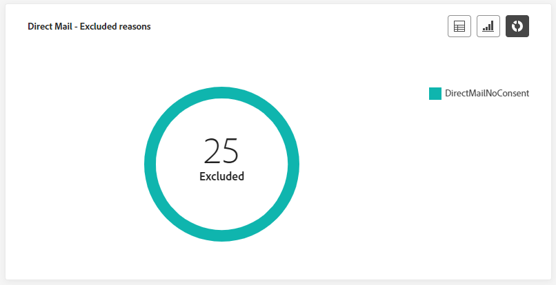

# 캠페인 라이브 보고서 {#campaign-live-report}

>[!CONTEXTUALHELP]
>id="ajo_campaign_live_report"
>title="캠페인 라이브 보고서"
>abstract="캠페인 라이브 보고서를 통해 지난 24시간의 캠페인 영향과 성과만 실시간으로 측정하고 시각화할 수 있습니다. 보고서는 캠페인 성공 사례와 오류를 자세히 설명하는 여러 위젯으로 나눠집니다. 위젯 크기를 조정하거나 위젯을 제거하여 각 보고 대시보드를 수정할 수 있습니다."

[최근 24시간] 탭에서 액세스할 수 있는 라이브 보고서에는 지난 24시간 내에 발생한 이벤트를 표시하며 이벤트 발생에서 최소 2분 간격이 있습니다. 반면 Customer Journey Analytics 보고서는 최소 2시간 전에 발생한 이벤트에 중점을 두고 선택한 기간 동안의 이벤트를 다룹니다.

**[!UICONTROL 실시간 보기]** 단추를 사용하면 캠페인에서 캠페인 실시간 보고서에 직접 액세스할 수 있습니다.

Campaign **[!UICONTROL 라이브 보고서]** 페이지가 다음 탭과 함께 표시됩니다.

* [Campaign](#campaign-live)
* [이메일](#email-live)
* [인앱](#inapp-live)
* [푸시](#push-live)
* [SMS](#sms-live)
* [웹](#web-tab)
* [다이렉트 메일](#direct-mail-tab)

Campaign **[!UICONTROL 라이브 보고서]**&#x200B;는 캠페인의 성공 및 오류를 자세히 설명하는 다양한 위젯으로 나뉩니다. 필요한 경우 각 위젯의 크기를 조정하고 삭제할 수 있습니다. 자세한 내용은 이 [섹션](../reports/live-report.md#modify-dashboard)을 참조하세요.

Adobe Journey Optimizer에서 사용할 수 있는 모든 지표의 자세한 목록은 [이 페이지](live-report.md#list-of-components-live)를 참조하세요.

## 캠페인 탭 {#campaign-live}

### 게재 {#delivery-live}

**[!UICONTROL 캠페인 통계]** KPI는 포괄적인 대시보드 역할을 하며 캠페인과 관련된 지난 24시간 동안의 주요 지표에 대한 자세한 분석을 제공합니다. 여기에는 프로필 및 게재된 작업 수와 같은 필수 정보가 포함되어 있으며, 이를 통해 캠페인의 성능과 참여를 철저히 파악할 수 있습니다.

+++ Campaign의 통계 지표에 대해 자세히 알아보기

* **[!UICONTROL 대상]**: 타깃팅된 프로필 수입니다.

* **[!UICONTROL 동작 배달]**: 동작이 배달된 총 고유 횟수입니다.

* **[!UICONTROL 오류]**: 보내는 동안 프로필로 보낼 수 없는 총 오류 수입니다.

+++

<!--
### Experimentation tab (#experimentation-live)

From your Campaign **[!UICONTROL Live report]**, the **[!UICONTROL Experimentation]** tab details the main information relative to how each variant is performing and if there is was winner during the test.
-->

## 이메일 탭 {#email-live}

**[!UICONTROL 이메일]** 탭은 Campaign **[!UICONTROL 라이브 보고서]**&#x200B;에서 캠페인에서 보낸 이메일과 관련된 기본 정보를 자세히 설명합니다.

### 이메일 - 전송 성능 {#email-sending-performance}

>[!CONTEXTUALHELP]
>id="ajo_campaign_live_email_sending_statistics"
>title="이메일 - 전송 통계"
>abstract="이메일 - 전송 통계 그래프에는 지난 24시간 동안의 대상 지정 또는 게재됨 등과 같은 이메일에 대한 필수 데이터가 요약되어 있습니다."

**[!UICONTROL 전자 메일 - 전송 성능]**&#x200B;은(는) 지난 24시간 내에 전송된 전자 메일과 관련된 데이터에 대한 자세한 개요를 제공합니다. 게재 및 바운스와 같은 필수 지표에 대한 통찰력을 제공하여 이메일 전송 프로세스를 자세히 검토할 수 있습니다.

+++ 이메일 전송 성능 지표에 대해 자세히 알아보기

* **[!UICONTROL 배달됨]**: 보낸 전자 메일 수입니다.

* **[!UICONTROL 바운스 수]**: 전송 프로세스 및 자동 반환 처리 중 누적된 총 오류 수입니다.

* **[!UICONTROL 다시 시도]**: 다시 시도 큐에 있는 전자 메일 수입니다.

* **[!UICONTROL 오류]**: 보내는 동안 프로필로 보낼 수 없는 총 오류 수입니다.
+++

### 이메일 - 통계

>[!CONTEXTUALHELP]
>id="ajo_campaign_live_email_statistics"
>title="이메일 - 통계"
>abstract="이메일 - 통계 테이블은 지난 24시간 동안 이메일의 프로필 활동에 대한 데이터를 제공합니다."

**[!UICONTROL 전자 메일로 지표 보내기]** 표에는 지난 24시간 동안의 데이터에 대한 포괄적인 요약이 제공됩니다. 타겟팅된 대상의 크기 및 성공적으로 게재된 이메일 수를 포함한 필수 지표를 간략하게 설명합니다. 이메일 캠페인의 효과와 도달 범위에 대한 중요한 통찰력을 제공합니다.

+++ 이메일에 대한 자세한 내용 - 통계 지표

* **[!UICONTROL 실행 시간]**: 되풀이하는 전자 메일의 모든 실행 시작 시간입니다. 하나 이상의 반복 전자 메일만 대상으로 지정하려면 **[!UICONTROL 실행 시간]** 드롭다운에서 선택합니다.

* **[!UICONTROL 대상]**: 보내는 동안 처리된 총 메시지 수입니다.

* **[!UICONTROL 제외됨]**: 대상 프로필에서 제외된, 메시지를 받지 못한 사용자 프로필 수입니다.

* **[!UICONTROL 전송됨]**: 총 전송 수입니다.

* **[!UICONTROL 배달됨]**: 성공적으로 보낸 메시지 수

* **[!UICONTROL 바운스 수]**: 전송 프로세스 및 자동 반환 처리 중 누적된 총 오류 수입니다.

* **[!UICONTROL 오류]**: 보내는 동안 프로필로 보낼 수 없는 총 오류 수입니다.

* **[!UICONTROL 열기]**: 메시지가 열린 횟수입니다.

* **[!UICONTROL 클릭 수]**: 콘텐츠를 클릭한 횟수입니다.

* **[!UICONTROL 구독 취소]**: 구독 취소 링크의 클릭 수입니다.

* **[!UICONTROL 스팸 고객 불만]**: 메시지가 스팸 또는 정크로 선언된 횟수입니다.

* **[!UICONTROL 다시 시도]**: 다시 시도 큐에 있는 전자 메일 수입니다.
+++

### 이메일 - 바운스 범주 및 이유 {#bounce-categories}

>[!CONTEXTUALHELP]
>id="ajo_campaign_live_email_bounce_categories"
>title="이메일 - 바운스 범주"
>abstract="이메일 - 바운스 범주 그래프와 테이블은 지난 24시간 동안의 일시적 오류와 영구적 오류에 대한 데이터를 제공합니다."

>[!CONTEXTUALHELP]
>id="ajo_campaign_live_email_bounce_reasons"
>title="이메일 - 바운스 이유"
>abstract="이메일 - 바운스 이유 그래프와 테이블에는 지난 24시간 동안 바운스된 메시지와 관련하여 사용 가능한 데이터가 포함되어 있습니다."

**[!UICONTROL 반송 이유]** 및 **[!UICONTROL 반송 범주]** 위젯은 반송된 메시지와 관련된 지난 24시간 동안의 사용 가능한 데이터를 컴파일하여 이메일 반송 이면의 특정 이유 및 범주에 대한 자세한 통찰력을 제공합니다.

바운스에 대한 자세한 내용은 [제외 목록](../reports/suppression-list.md) 페이지를 참조하세요.

+++ 이메일에서 자세히 알아보기 - 반송 범주 및 이유 지표

* **[!UICONTROL 하드 바운스]**: 잘못된 전자 메일 주소와 같은 총 영구 오류 수입니다. 여기에는 알 수 없는 사용자와 같이 주소가 유효하지 않다는 오류 메시지가 명시적으로 표시됩니다.

* **[!UICONTROL 소프트 바운스]**: 전체 받은 편지함과 같은 총 임시 오류 수입니다.

* **[!UICONTROL 무시됨]**: 부재 중과 같은 총 임시 항목 수 또는 기술적인 오류(예: 발신자 유형이 postmaster인 경우).

+++

### 이메일 - 날짜별 성능 {#email-performance-date}

>[!CONTEXTUALHELP]
>id="ajo_campaign_live_email_performance_bydate"
>title="이메일 - 날짜별 성능"
>abstract="이메일 - 날짜별 성능 그래프는 전송된 이메일에 관한 지난 24시간의 포괄적인 데이터를 제공하여 게재 및 바운스와 같은 주요 지표에 대한 인사이트를 제공하고 이메일 전송 프로세스를 자세하게 분석할 수 있습니다."

**[!UICONTROL 이메일 - 날짜별 성능]** 위젯은 그래프를 통해 표시된 메시지와 관련된 주요 정보에 대한 자세한 개요를 제공하여 지난 24시간 동안의 성능 추세에 대한 통찰력을 제공합니다.

+++ 이메일에 대한 자세한 내용 - 날짜 및 이유 지표별 성능

* **[!UICONTROL 전송됨]**: 총 전송 수입니다.

* **[!UICONTROL 배달됨]**: 성공적으로 보낸 메시지 수

* **[!UICONTROL 바운스 수]**: 전송 프로세스 및 자동 반환 처리 중 누적된 총 오류 수입니다.

* **[!UICONTROL 오류]**: 보내는 동안 프로필로 보낼 수 없는 총 오류 수입니다.

* **[!UICONTROL 열기]**: 메시지가 열린 횟수입니다.

* **[!UICONTROL 클릭 수]**: 콘텐츠를 클릭한 횟수입니다.

* **[!UICONTROL 구독 취소]**: 구독 취소 링크의 클릭 수입니다.

* **[!UICONTROL 스팸 고객 불만]**: 메시지가 스팸 또는 정크로 선언된 횟수입니다.

+++

### 오류 이유 {#email-error-reasons}

>[!CONTEXTUALHELP]
>id="ajo_campaign_live_email_error_reasons"
>title="이메일 - 오류 이유"
>abstract="이메일 - 오류 이유 그래프와 테이블을 통해 지난 24시간 동안 전송 프로세스 중에 발생한 특정 오류를 확인할 수 있습니다."

**[!UICONTROL 오류 원인]** 그래프 및 표를 통해 지난 24시간 동안 전송 프로세스 중에 발생한 특정 오류에 대한 정보를 확인할 수 있습니다. 이 정보는 오류의 본질과 빈도를 이해하는 데 유용합니다.

### 제외된 이유 {#email-exclude-reasons}

>[!CONTEXTUALHELP]
>id="ajo_campaign_live_email_excluded_reasons"
>title="이메일 - 제외된 이유"
>abstract="제외된 이유 그래프와 테이블에서는 타기팅된 대상자에서 제외된 사용자 프로필이 지난 24시간 동안 메시지를 받지 못하는 다양한 요인을 보여 줍니다."

**[!UICONTROL 제외된 이유]** 그래프 및 표는 지난 24시간 동안 타깃팅된 대상에서 사용자 프로필을 제외한 다양한 요인에 대한 포괄적인 관점을 제공합니다.

포괄적인 제외 이유 목록은 [이 페이지](exclusion-list.md)를 참조하세요.

### 이메일 - 최고 수신자 도메인 {#email-best-recipient}

>[!CONTEXTUALHELP]
>id="ajo_campaign_live_email_best_recipient"
>title="이메일 - 최고 수신자 도메인"
>abstract="이메일 - 최고 수신자 도메인 그래프 및 테이블에서는 수신자가 이메일을 열 때 가장 자주 사용하는 도메인에 대한 자세한 분석을 통해 지난 24시간의 수신자 동작에 대한 귀중한 인사이트를 제공합니다."

**[!UICONTROL 전자 메일 - 최고 수신자 도메인]** 그래프 및 표는 프로필이 지난 24시간 동안 전자 메일을 여는 데 가장 많이 사용하는 도메인을 자세히 설명합니다. 이렇게 하면 프로필 동작에 대한 중요한 통찰력을 제공하여 선호하는 플랫폼을 이해하는 데 도움이 됩니다.

### 이메일 - 오퍼 {#email-offers}

>[!NOTE]
>
>오퍼 위젯 및 지표는 결정이 이메일에 삽입된 경우에만 사용할 수 있습니다. 의사 결정 관리에 대한 자세한 내용은 이 [페이지](../offers/get-started/starting-offer-decisioning.md)를 참조하세요.

**[!UICONTROL 오퍼 통계]** 및 **[!UICONTROL 시간 경과에 따른 오퍼 통계]** 위젯은 오퍼의 성공과 타깃팅된 대상자에 대한 영향을 측정합니다. KPI를 사용하여 메시지와 관련된 기본 정보를 자세히 설명합니다.

+++ 이메일에 대한 자세한 내용 - 오퍼 지표

* **[!UICONTROL 전송된 오퍼]**: 오퍼에 대한 총 전송 수입니다.

* **[!UICONTROL 오퍼 노출]**: 전자 메일에서 오퍼를 연 횟수입니다.

* **[!UICONTROL 오퍼 클릭 수]**: 전자 메일에서 오퍼를 클릭한 횟수입니다.

+++

## 인앱 탭 {#inapp-live}

**[!UICONTROL 인앱]** 탭은 Campaign **[!UICONTROL 라이브 보고서]**&#x200B;에서 캠페인에서 보낸 인앱 메시지와 관련된 기본 정보를 자세히 설명합니다.

### 인앱 성능 {#inapp-performance}

>[!CONTEXTUALHELP]
>id="ajo_campaign_live_inapp_performance"
>title="인앱 성능"
>abstract="인앱 성능 KPI는 지난 24시간 동안 방문자의 인앱 메시지 참여에 대한 필수 인사이트를 제공합니다."

**[!UICONTROL 인앱 성과]** KPI는 지난 24시간 동안 프로필의 인앱 메시지 참여에 대한 중요한 통찰력을 제공하며 인앱 캠페인의 효과와 영향을 평가하는 데 중요한 지표를 제공합니다.

+++ 인앱 성능 지표에 대해 자세히 알아보기

* **[!UICONTROL 노출 수]**: 모든 사용자에게 보낸 인앱 메시지의 총 수입니다.

* **[!UICONTROL 상호 작용]**: 인앱 메시지의 총 참여 수입니다. 여기에는 클릭, 해제 또는 기타 상호 작용과 같이 사용자가 수행한 모든 작업이 포함됩니다.

+++

### 인앱 요약 {#inapp-summary}

>[!CONTEXTUALHELP]
>id="ajo_campaign_live_inapp_summary"
>title="인앱 요약"
>abstract="인앱 요약 그래프에서는 지난 24시간 동안의 인앱 노출 횟수 및 상호 작용 진행 상황을 보여 줍니다."

**[!UICONTROL 인앱 요약]** 그래프는 지난 24시간 동안 인앱 노출 횟수 및 상호 작용의 진행률을 보여 주며 인앱 메시지 성능에 대한 포괄적인 개요를 제공합니다.

+++ 인앱 요약 지표에 대해 자세히 알아보기

* **[!UICONTROL 노출 수]**: 모든 사용자에게 전달된 인앱 메시지의 총 수입니다.

* **[!UICONTROL 상호 작용]**: 인앱 메시지의 총 참여 수입니다. 여기에는 클릭, 해제 또는 기타 상호 작용과 같이 사용자가 수행한 모든 작업이 포함됩니다.

+++

### 유형별 상호 작용 {#inapp-interactions}

>[!CONTEXTUALHELP]
>id="ajo_campaign_live_inapp_interactions"
>title="유형별 상호 작용"
>abstract="유형별 상호 작용 그래프와 테이블에서는 지난 24시간 동안의 클릭, 해제 또는 상호 작용을 추적하여 사용자가 인앱 메시지와 상호 작용하는 방식을 자세히 설명합니다."

**[!UICONTROL 유형별 상호 작용]** 그래프와 표는 프로필이 지난 24시간 동안 인앱 메시지와 상호 작용한 방식에 대한 자세한 설명을 제공하고, 클릭 수, 해제 수와 같은 작업 또는 기타 모든 유형의 참여를 추적합니다.

## 푸시 알림 탭 {#push-live}

**[!UICONTROL 푸시 알림]** 탭은 Campaign **[!UICONTROL 라이브 보고서]**&#x200B;에서 캠페인에서 보낸 푸시 알림과 관련된 기본 정보를 자세히 설명합니다.

### 푸시 알림 - 전송 성능 {#push-sending-performance}

>[!CONTEXTUALHELP]
>id="ajo_campaign_live_push_sending_performance"
>title="푸시 알림 - 전송 성능"
>abstract="푸시 알림 전송 성능 그래프에는 지난 24시간 동안의 오류, 게재된 메시지 등 푸시 알림에 대한 필수 데이터가 요약되어 있습니다."

**[!UICONTROL 푸시 알림 전송 성능]** 그래프는 지난 24시간 내에 전송된 푸시 알림과 관련된 데이터에 대한 자세한 개요를 제공합니다. 전달 및 바운스와 같은 필수 지표에 대한 통찰력을 제공하여 푸시 알림 전송 프로세스를 자세히 검토할 수 있습니다.

+++ 푸시 알림 - 성능 지표 전송에 대해 자세히 알아보기

* **[!UICONTROL 배달됨]**: 성공적으로 보낸 메시지 수

* **[!UICONTROL 바운스 수]**: 전송 프로세스 및 자동 반환 처리 중 누적된 총 오류 수입니다.

* **[!UICONTROL 오류]**: 보내는 동안 프로필로 보낼 수 없는 총 오류 수입니다.

+++

### 푸시 알림 - 통계 {#push-statistics}

>[!CONTEXTUALHELP]
>id="ajo_campaign_live_push_statistics"
>title="푸시 알림 - 통계"
>abstract="푸시 통계 테이블은 지난 24시간 동안의 푸시 알림 수신자 활동에 대한 데이터를 제공합니다."

**[!UICONTROL 푸시 알림 - 통계]** 표에는 타깃팅된 메시지 수 및 배달된 메시지 수와 같은 주요 지표를 포함하여 지난 24시간 내에 푸시 알림과 관련된 필수 데이터에 대한 간결한 요약이 제공됩니다.

+++ 푸시 알림에 대한 자세한 내용 - 통계 지표

* **[!UICONTROL 실행 시간]**: 되풀이하는 푸시 알림의 모든 실행 시작 시간입니다. 하나 이상의 되풀이하는 푸시 알림만 대상으로 지정하려면 **[!UICONTROL 실행 시간]** 드롭다운에서 선택합니다.

* **[!UICONTROL 대상]**: 보내는 동안 처리된 총 메시지 수입니다.

* **[!UICONTROL 제외됨]**: 대상 프로필에서 제외된, 메시지를 받지 못한 사용자 프로필 수입니다.

* **[!UICONTROL 전송됨]**: 총 전송 수입니다.

* **[!UICONTROL 배달됨]**: 성공적으로 보낸 메시지 수

* **[!UICONTROL 바운스 수]**: 전송 프로세스 및 자동 반환 처리 중 누적된 총 오류 수입니다.

* **[!UICONTROL 오류]**: 보내는 동안 프로필로 보낼 수 없는 총 오류 수입니다.

* **[!UICONTROL 열기]**: 메시지가 열린 횟수입니다.

+++

### 푸시 알림 - 전송 요약 {#push-sending-summary}

>[!CONTEXTUALHELP]
>id="ajo_campaign_live_push_sending_summary"
>title="푸시 알림 - 전송 요약"
>abstract="푸시 알림 전송 요약 그래프에는 지난 24시간 동안 전송된 푸시 알림에 사용 가능한 데이터가 표시됩니다."

**[!UICONTROL 푸시 알림 - 통계]** 그래프는 지난 24시간 동안의 푸시 알림 활동에 대한 분석을 표시하는 동적 표현을 제공합니다. 이 그래픽 표현은 전송된 푸시 알림에 대한 포괄적인 분석을 제공합니다.

+++ 푸시 알림 - 요약 지표 전송에 대해 자세히 알아보기

* **[!UICONTROL 열기]**: 푸시 알림이 열린 횟수입니다.

* **[!UICONTROL 작업]**: 전달된 푸시 알림에 대한 총 작업 수(예: 단추 클릭 또는 해제).

* **[!UICONTROL 바운스 수]**: 보낸 총 메시지 수와 관련하여 누적된 총 오류와 자동 반환 처리입니다.

* **[!UICONTROL 배달됨]**: 보낸 총 메시지 수와 관련하여 성공적으로 보낸 메시지 수입니다.

* **[!UICONTROL 오류]**: 프로필로 보낼 수 없는 총 오류 수입니다.

+++

### 푸시 알림 - 제외된 이유 {#push-excluded}

>[!CONTEXTUALHELP]
>id="ajo_campaign_live_push_excluded_reasons"
>title="푸시 알림 - 제외된 이유"
>abstract="제외된 이유 그래프와 테이블에서는 타기팅된 대상자에서 제외된 사용자 프로필이 지난 24시간 동안 메시지를 받지 못하는 다양한 요인을 보여 줍니다."

**[!UICONTROL 제외된 이유]** 그래프와 표에는 타깃팅된 프로필에서 제외된 사용자 프로필이 지난 24시간 동안 푸시 알림을 받지 못한 다양한 이유가 표시됩니다.

포괄적인 제외 이유 목록은 [이 페이지](exclusion-list.md)를 참조하세요.

### 푸시 알림 - 오류 이유 {#push-error}

>[!CONTEXTUALHELP]
>id="ajo_campaign_live_push_error_reasons"
>title="푸시 알림 - 오류 이유"
>abstract="오류 이유 그래프와 테이블을 통해 전송 프로세스 중에 지난 24시간 동안 발생한 특정 오류를 확인할 수 있습니다."

**[!UICONTROL 오류 원인]** 테이블 및 그래프는 지난 24시간 내에 푸시 알림을 전송하는 동안 발생한 특정 오류를 식별하는 기능을 제공하며 이 과정에서 발생한 문제에 대한 자세한 통찰력을 제공합니다.

### 푸시 알림 - 플랫폼별 분류 {#push-breakdown-platform}

>[!CONTEXTUALHELP]
>id="ajo_campaign_live_push_breakdown_platform"
>title="푸시 알림 - 플랫폼별 분류"
>abstract="플랫폼별 분류 그래프 및 테이블은 수신자의 운영 체제를 기준으로 지난 24시간 동안의 푸시 알림 성공 분류를 제공합니다."

**[!UICONTROL 푸시 알림 - 플랫폼별 분류]** 그래프와 표에는 지난 24시간 동안 푸시 알림의 성공에 대한 자세한 분석이 나와 있으며 프로필의 운영 체제에 따른 통찰력을 제공합니다. 이 분류는 푸시 알림이 다양한 플랫폼에서 어떻게 작동하는지 이해하는 데 도움이 됩니다.

+++ 푸시 알림 - 플랫폼 지표별 분류에 대해 자세히 알아보기

* **[!UICONTROL 대상]**: 분석 중에 처리된 총 메시지 수입니다.

* **[!UICONTROL 배달됨]**: 보낸 총 메시지 수와 관련하여 성공적으로 보낸 메시지 수입니다.

* **[!UICONTROL 열기]**: 푸시 알림이 열린 횟수입니다.

* **[!UICONTROL 작업]**: 전달된 푸시 알림에 대한 총 작업 수(예: 단추 클릭 또는 해제).

* **[!UICONTROL 바운스 수]**: 보낸 총 메시지 수와 관련하여 누적된 총 오류와 자동 반환 처리입니다.

* **[!UICONTROL 오류]**: 프로필로 보낼 수 없는 총 오류 수입니다.

* **[!UICONTROL 제외됨]**: Adobe Journey Optimizer에서 제외된 프로필 수입니다.

+++

## SMS 탭 {#sms-live}

**[!UICONTROL SMS]** 탭은 Campaign **[!UICONTROL 라이브 보고서]**&#x200B;에서 캠페인에서 보낸 SMS 메시지와 관련된 기본 정보를 자세히 설명합니다.

### SMS - 통계 {#sms-statistics}

>[!CONTEXTUALHELP]
>id="ajo_campaign_live_sms_statistics"
>title="SMS - 통계"
>abstract="SMS 전송 통계 테이블에는 지난 24시간 동안의 대상 지정 메시지 또는 게재된 메시지 등과 같은 SMS 메시지에 대한 필수 데이터가 요약되어 있습니다."

**[!UICONTROL SMS - 통계]** 표에는 타겟팅된 메시지 수 및 배달된 메시지 수와 같은 주요 지표를 포함하여 지난 24시간 내에 SMS 메시지와 관련된 필수 데이터에 대한 간단한 요약이 제공됩니다.

+++ SMS에 대해 자세히 알아보기 - 통계 지표

* **[!UICONTROL 실행 시간]**: 되풀이하는 SMS 메시지를 실행할 때마다 시작 시간입니다. 하나 또는 여러 개의 반복 SMS 메시지만 대상으로 지정하려면 **[!UICONTROL 실행 시간]** 드롭다운에서 선택합니다.

* **[!UICONTROL 대상]**: 대상 프로필로 적합한 사용자 프로필 수입니다.

* **[!UICONTROL 제외됨]**: 대상 프로필에서 제외된, 메시지를 받지 못한 사용자 프로필 수입니다.

* **[!UICONTROL 전송됨]**: 총 전송 수입니다.

* **[!UICONTROL 바운스 수]**: 전송 프로세스 및 자동 반환 처리 중 누적된 총 오류 수입니다.

* **[!UICONTROL 오류]**: 보내는 동안 프로필로 보낼 수 없는 총 오류 수입니다.

* **[!UICONTROL 클릭 수]**: 총 URL 방문 수

+++

### SMS - 날짜별 성능 {#sms-perfomance-date}

>[!CONTEXTUALHELP]
>id="ajo_campaign_live_sms_performance"
>title="SMS - 날짜별 성능"
>abstract="SMS 날짜별 성능 위젯은 그래픽 표시를 통해 지난 24시간 동안의 메시지에 대한 주요 정보를 제공합니다."

**[!UICONTROL 날짜별 SMS 성능]** 위젯은 그래프를 통해 표시된 메시지와 관련된 주요 정보에 대한 자세한 개요를 제공하여 지난 24시간 동안의 성능 추세에 대한 통찰력을 제공합니다.

+++ SMS에 대한 자세한 내용 - 일자별 성능 지표

* **[!UICONTROL 전송됨]**: 총 전송 수입니다.

* **[!UICONTROL 바운스 수]**: 전송 프로세스 및 자동 반환 처리 중 누적된 총 오류 수입니다.

* **[!UICONTROL 오류]**: 보내는 동안 프로필로 보낼 수 없는 총 오류 수입니다.

+++

### SMS - 오류 이유 {#sms-error-reasons}

>[!CONTEXTUALHELP]
>id="ajo_campaign_live_sms_error_reasons"
>title="SMS - 오류 이유"
>abstract="SMS - 오류 이유 그래프와 테이블을 통해 전송 프로세스 중에 지난 24시간 동안 발생한 특정 오류를 확인할 수 있습니다."

**[!UICONTROL 제외된 이유]** 그래프와 표를 사용하면 지난 24시간 내에 SMS 메시지를 보내는 동안 발생한 특정 오류를 식별할 수 있으므로 발생한 문제를 철저히 분석할 수 있습니다.

### SMS - 제외된 이유 {#sms-excluded-reasons}

>[!CONTEXTUALHELP]
>id="ajo_campaign_live_sms_excluded_reasons"
>title="SMS - 제외된 이유"
>abstract="제외된 이유 그래프와 테이블에서는 타기팅된 대상자에서 제외된 사용자 프로필이 지난 24시간 동안 메시지를 받지 못하는 다양한 요인을 보여 줍니다."

**[!UICONTROL 제외된 이유]** 그래프 및 표는 타깃팅된 대상에서 사용자 프로필을 제외하여 지난 24시간 동안 SMS 메시지를 받지 못하게 한 다양한 요인을 시각적으로 나타냅니다.

포괄적인 제외 이유 목록은 [이 페이지](exclusion-list.md)를 참조하세요.

### SMS - 바운스 이유 {#sms-bounces-reasons}

>[!CONTEXTUALHELP]
>id="ajo_campaign_live_sms_bounces_reasons"
>title="SMS - 바운스 이유"
>abstract="바운스 이유 그래프와 테이블에는 지난 24시간 동안 바운스된 메시지와 관련하여 사용 가능한 데이터가 있습니다."

**[!UICONTROL 반송 원인]** 그래프와 표는 반송된 SMS 메시지와 관련된 데이터에 대한 포괄적인 개요를 제공하여 지난 24시간 동안 SMS 메시지 반송 인스턴스의 특정 이유에 대한 중요한 통찰력을 제공합니다.

## 웹 탭 {#web-tab}

**[!UICONTROL Web]** 탭은 Campaign **[!UICONTROL 라이브 보고서]**&#x200B;에서 웹 페이지와 관련된 기본 정보를 자세히 설명합니다.

### 웹 성능 {#web-performance}

>[!CONTEXTUALHELP]
>id="ajo_campaign_live_web_performance"
>title="웹 성능"
>abstract="웹 성능 KPI는 지난 24시간 동안 웹 경험에 대한 방문자의 참여와 관련된 포괄적인 정보를 제공합니다."

**[!UICONTROL 웹 성능]** KPI는 지난 24시간 동안 웹 페이지에 대한 방문자의 참여도에 대한 포괄적인 통찰력을 제공하며 노출 횟수 및 상호 작용과 같은 주요 지표를 포함합니다.

+++ 웹 성능 지표에 대해 자세히 알아보기

* **[!UICONTROL 노출 수]**: 모든 사용자에게 전달된 총 웹 경험 수입니다.

* **[!UICONTROL 상호 작용]**: 웹 페이지에 대한 총 참여 수입니다. 여기에는 클릭 또는 기타 상호 작용과 같이 사용자가 수행한 모든 작업이 포함됩니다.

+++

### 웹 요약 {#web-summary}

>[!CONTEXTUALHELP]
>id="ajo_campaign_live_web_summary"
>title="웹 요약"
>abstract="웹 요약 그래프는 지난 24시간 동안의 노출 횟수, 고유한 노출 횟수, 상호 작용을 포함한 웹 경험의 진행 상황을 보여 줍니다."

**[!UICONTROL 웹 요약]** 그래프는 지난 24시간 동안 웹 경험(노출 횟수, 고유 노출 횟수 및 상호 작용)이 발전한 모습을 보여 줍니다.

+++ 웹 요약 지표에 대해 자세히 알아보기

* **[!UICONTROL 노출 수]**: 모든 사용자에게 전달된 총 웹 경험 수입니다.

* **[!UICONTROL 상호 작용]**: 웹 페이지에 대한 총 참여 수입니다. 여기에는 클릭 또는 기타 상호 작용과 같이 사용자가 수행한 모든 작업이 포함됩니다.

+++

### 요소별 상호 작용 {#web-interactions}

>[!CONTEXTUALHELP]
>id="ajo_campaign_live_web_interactions"
>title="요소별 상호 작용"
>abstract="요소별 상호 작용 테이블은 지난 24시간 동안 웹 페이지의 다양한 요소에 대한 방문자의 참여의 주요 정보를 제공합니다."

**[!UICONTROL 요소별 상호 작용]** 표에는 지난 24시간 동안 웹 페이지의 다양한 요소에 대한 방문자의 참여와 관련된 포괄적인 정보가 표시되어 사용자 상호 작용 및 환경 설정에 대한 중요한 통찰력을 제공합니다.

## DM 탭 {#direct-mail-tab}

Campaign **[!UICONTROL 라이브 보고서]**&#x200B;에서 **[!UICONTROL DM]** 탭은 DM과 관련된 기본 정보를 자세히 설명합니다.

### 다이렉트 메일 - 전송 통계 {#direct-mail-sending}

>[!CONTEXTUALHELP]
>id="ajo_campaign_live_direct_sending_statistics"
>title="다이렉트 메일 - 전송 통계"
>abstract="다이렉트 메일 전송 통계 테이블에는 대상 지정 메시지 또는 게재된 메시지 등과 같은 다이렉트 메일 메시지에 대한 지난 24시간 동안의 필수 데이터가 요약되어 있습니다."

**[!UICONTROL DM - 전송 통계]** 표에는 DM 메시지와 관련된 필수 데이터에 대한 간결한 요약이 있으며, 여기에는 타겟팅된 메시지 수 및 지난 24시간 내에 성공적으로 배달된 메시지 수와 같은 주요 지표가 포함됩니다.

+++ DM - 전송 통계 지표에 대해 자세히 알아보기

* **[!UICONTROL 대상]**: 대상 프로필로 적합한 사용자 프로필 수입니다.

* **[!UICONTROL 전송됨]**: 총 전송 수입니다.

* **[!UICONTROL 오류]**: 보내는 동안 프로필로 보낼 수 없는 총 오류 수입니다.

* **[!UICONTROL 제외됨]**: 대상 프로필에서 제외되고 DM을 받지 않은 사용자 프로필 수입니다.

+++

### 다이렉트 메일 - 오류 이유 {#direct-mail-error-reasons}

>[!CONTEXTUALHELP]
>id="ajo_campaign_live_direct_error_reasons"
>title="다이렉트 메일 - 오류 이유"
>abstract="다이렉트 메일 - 오류 이유 그래프 및 테이블을 통해 지난 24시간 동안 발생한 특정 오류를 확인할 수 있습니다."

**[!UICONTROL DM - 오류 원인]** 그래프와 표는 DM 메시지를 보내는 동안 발생한 특정 오류를 식별하는 수단을 제공하여 지난 24시간 동안 발생한 모든 문제를 자세히 분석할 수 있도록 합니다.

### 다이렉트 메일 - 제외된 이유 {#direct-mail-excluded-reasons}

>[!CONTEXTUALHELP]
>id="ajo_campaign_live_direct_excluded_reasons"
>title="다이렉트 메일 - 제외된 이유"
>abstract="다이렉트 메일 제외된 이유 그래프와 테이블에서는 타기팅된 대상자에서 제외된 사용자 프로필이 지난 24시간 동안 메시지를 받지 못하는 다양한 요인을 보여 줍니다."

**[!UICONTROL DM - 제외된 이유]** 그래프와 표는 타깃팅된 대상자에서 사용자 프로필을 제외하여 지난 24시간 동안 DM 메시지를 받지 못하게 한 다양한 요인을 시각적으로 보여 줍니다.

포괄적인 제외 이유 목록은 [이 페이지](exclusion-list.md)를 참조하세요.

## 추가 리소스

* [캠페인 시작](../campaigns/get-started-with-campaigns.md)
* [캠페인 만들기](../campaigns/create-campaign.md)
* [API 트리거 캠페인 만들기](../campaigns/api-triggered-campaigns.md)
* [캠페인 수정 또는 중지](../campaigns/modify-stop-campaign.md)
* [캠페인 보고서](campaign-global-report-cja.md)
