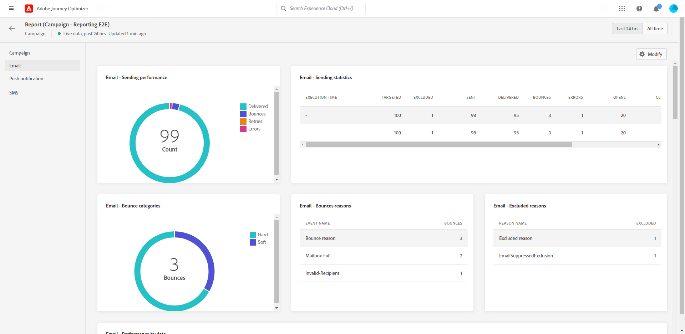

# 캠페인 라이브 보고서 {#campaign-live-report}

>[!CONTEXTUALHELP]
>id="ajo_campaign_live_report"
>title="캠페인 라이브 보고서"
>abstract="캠페인 라이브 보고서를 통해 지난 24시간의 캠페인 영향과 성과만 실시간으로 측정하고 시각화할 수 있습니다. 보고서는 캠페인 성공 사례와 오류를 자세히 설명하는 여러 위젯으로 나눠집니다. 위젯 크기를 조정하거나 위젯을 제거하여 각 보고 대시보드를 수정할 수 있습니다."

Campaign 라이브 보고서는 캠페인에서 **[!UICONTROL 라이브 뷰]** 단추를 클릭합니다.

캠페인 **[!UICONTROL 라이브 보고서]** 다음 탭이 있는 페이지가 표시됩니다.

* [Campaign](#campaign-live)
* [이메일](#email-live)
* [푸시](#push-live)
* [SMS](#sms-live)
* [웹](#web-tab)

캠페인 **[!UICONTROL 라이브 보고서]** 은 캠페인의 성공 및 오류를 자세히 설명하는 다양한 위젯으로 나뉩니다. 필요한 경우 각 위젯의 크기를 조정하고 삭제할 수 있습니다. 자세한 내용은 다음을 참조하십시오. [섹션](../reports/live-report.md#modify-dashboard).

Adobe Journey Optimizer에서 사용할 수 있는 모든 지표의 자세한 목록은 을 참조하십시오. [이 페이지](live-report.md#list-of-components-live).

## 캠페인 탭 {#campaign-global}

### 게재 {#delivery-global}

다음 **[!UICONTROL 캠페인 통계]** 위젯은 캠페인과 관련된 기본 정보를 자세히 설명합니다.

* **[!UICONTROL 입력된 프로필]**: 여정을 시작한 프로필 수입니다.

<!--
### Experimentation tab (#experimentation-live)

From your Campaign **[!UICONTROL Live report]**, the **[!UICONTROL Experimentation]** tab details the main information relative to how each variant is performing and if there is was winner during the test.
-->

## 이메일 탭 {#email-live}

캠페인에서 **[!UICONTROL 라이브 보고서]**, **[!UICONTROL 이메일]** 탭에서는 캠페인에 전송된 이메일 게재와 관련된 기본 정보를 자세히 설명합니다.

+++이메일 보고서에 사용할 수 있는 다양한 지표 및 위젯에 대해 자세히 알아보십시오.

다음 **[!UICONTROL 이메일 전송 통계]** 위젯은 메시지와 관련된 기본 정보를 자세히 설명합니다.

* **[!UICONTROL 전달됨]**: 성공적으로 전송된 메시지 수입니다.

* **[!UICONTROL 바운스]**: 게재 및 자동 반환 처리 중 누적된 총 오류.

* **[!UICONTROL 오류]**: 게재 중에 발생하여 프로필로 전송되지 않은 총 오류 수입니다.

다음 **[!UICONTROL 이메일로 지표 보내기]** 테이블 및 **[!UICONTROL 이메일 요약]** 그래프는 게재의 성공을 자세히 설명합니다.

* **[!UICONTROL 전송됨]**: 게재에 대한 총 전송 수입니다.

* **[!UICONTROL 전달됨]**: 성공적으로 전송된 메시지 수입니다.

* **[!UICONTROL 바운스]**: 게재 및 자동 반환 처리 중 누적된 총 오류.

* **[!UICONTROL 오류]**: 게재 중에 발생하여 프로필로 전송되지 않은 총 오류 수입니다.

* **[!UICONTROL 열림]**: 게재 시 메시지가 열린 횟수입니다.

* **[!UICONTROL 클릭수]**: 게재 시 콘텐츠를 클릭한 횟수입니다.

* **[!UICONTROL 구독 취소]**: 구독 취소 링크의 클릭 수입니다.

* **[!UICONTROL 스팸 고객 불만]**: 메시지가 스팸 또는 정크로 선언된 횟수입니다.

다음 **[!UICONTROL 바운스 이유]**, **[!UICONTROL 바운스 범주]** 및 **[!UICONTROL 하드 및 바운스 - 이메일별]** 위젯에는 다음과 같이 반송된 메시지와 관련하여 사용할 수 있는 데이터가 포함됩니다.

* **[!UICONTROL 하드 바운스]**: 잘못된 이메일 주소와 같은 영구 오류의 총 수입니다. 여기에는 알 수 없는 사용자와 같이 주소가 유효하지 않다는 오류 메시지가 명시적으로 표시됩니다.

* **[!UICONTROL 소프트 바운스]**: 전체 받은 편지함과 같은 총 임시 오류 수.

* **[!UICONTROL 무시됨]**: 부재 중이거나 기술적인 오류와 같은 총 임시 항목 수(발신자 유형이 postmaster인 경우).

다음 **[!UICONTROL 오류 원인]** 및 **[!UICONTROL 제외 이유]** 그래프 및 표를 사용하면 게재 중에 발생한 오류 및 제외 사항을 확인할 수 있습니다.

다음 **[!UICONTROL 이메일 - 상위 수신자 도메인]** 그래프 및 표는 수신자가 이메일을 여는 데 가장 많이 사용하는 도메인을 자세히 설명합니다.
+++

## 푸시 알림 탭 {#push-live}

캠페인에서 **[!UICONTROL 라이브 보고서]**, **[!UICONTROL 푸시 알림]** 탭에서는 캠페인에 전송된 푸시 게재와 관련된 기본 정보를 자세히 설명합니다.

+++푸시 보고서에 사용할 수 있는 다양한 지표 및 위젯에 대해 자세히 알아보십시오.

**[!UICONTROL 푸시 알림 전송 성능]**, **[!UICONTROL 푸시 알림 요약]** 및 **[!UICONTROL 전송 지표 - 푸시별]** 위젯은 메시지와 관련된 기본 정보를 자세히 설명합니다.

* **[!UICONTROL 전송됨]**: 게재에 대한 총 전송 수입니다.

* **[!UICONTROL 전달됨]**: 성공적으로 전송된 메시지 수입니다.

* **[!UICONTROL 바운스]**: 게재 및 자동 반환 처리 중 누적된 총 오류.

* **[!UICONTROL 오류]**: 게재 중에 발생하여 프로필로 전송되지 않은 총 오류 수입니다.

* **[!UICONTROL 열림]**: 게재 시 메시지가 열린 횟수입니다.

* **[!UICONTROL 작업]**: 전달된 푸시 알림에 대한 총 작업 수(예: 버튼 클릭 또는 해제)

* **[!UICONTROL 참여 횟수]**: 이 푸시 알림에 대한 총 열기 및 작업 수(프로필에서 푸시를 열었거나 버튼을 클릭한 경우)

다음 **[!UICONTROL 오류 원인]** 및 **[!UICONTROL 제외 이유]** 그래프 및 표를 사용하면 게재 중에 발생한 오류 및 제외 사항을 확인할 수 있습니다.

다음 **[!UICONTROL 전송 통계 - 실패]** 위젯을 통해 발생한 오류 및 바운스 수를 볼 수 있습니다.

다음 **[!UICONTROL 플랫폼을 통한 추적]**, **[!UICONTROL 플랫폼을 통한 전송]** 및 **[!UICONTROL 플랫폼별 분류]** 그래프 및 표는 운영 체제에 따라 푸시 알림의 성공 여부를 자세히 설명합니다.
+++

## SMS 탭 {#sms-live}

캠페인에서 **[!UICONTROL 라이브 보고서]**, **[!UICONTROL SMS]** 탭에서는 캠페인에 전송된 SMS 게재와 관련된 기본 정보를 자세히 설명합니다.

+++SMS 보고서에 사용할 수 있는 다양한 지표 및 위젯에 대해 자세히 알아보십시오.

다음 **[!UICONTROL SMS - 통계]** 게재의 성공 여부를 보여 주는 표는 다음과 같습니다.

* **[!UICONTROL 타깃팅됨]**: 이 게재에 대한 타겟 프로필로 적합한 사용자 프로필 수입니다.

* **[!UICONTROL 제외됨]**: 타겟팅된 프로필에서 제외되고 메시지를 받지 못한 사용자 프로필 수입니다.

* **[!UICONTROL 전송됨]**: 게재에 대한 총 전송 수입니다.

* **[!UICONTROL 전달됨]**: 성공적으로 전송된 메시지 수입니다.

* **[!UICONTROL 바운스]**: 게재 및 자동 반환 처리 중 누적된 총 오류.

* **[!UICONTROL 오류]**: 게재 중에 발생하여 프로필로 전송되지 않은 총 오류 수입니다.

* **[!UICONTROL 클릭수]**: 총 URL 방문 수

다음 **[!UICONTROL 일자별 SMS 성능]** 위젯은 그래프로 메시지와 관련된 기본 정보를 자세히 설명합니다.

* **[!UICONTROL 전송됨]**: 게재에 대한 총 전송 수입니다.

* **[!UICONTROL 전달됨]**: 성공적으로 전송된 메시지 수입니다.

* **[!UICONTROL 바운스]**: 게재 및 자동 반환 처리 중 누적된 총 오류.

* **[!UICONTROL 오류]**: 게재 중에 발생하여 프로필로 전송되지 않은 총 오류 수입니다.

다음 **[!UICONTROL 제외 이유]**, **[!UICONTROL 반송 원인]** 및 **[!UICONTROL 오류 원인]** 그래프 및 표를 사용하면 게재 중에 발생한 오류 및 제외 사항을 확인할 수 있습니다.
+++

## 웹 탭 {#web-tab}

캠페인에서 **[!UICONTROL 글로벌 보고서]**, **[!UICONTROL 웹]** 탭에서는 웹 페이지와 관련된 기본 정보를 자세히 설명합니다.

+++웹 보고서에 사용할 수 있는 다양한 지표 및 위젯에 대해 자세히 알아보십시오.

다음 **[!UICONTROL 웹 성능]** KPI는 다음과 같이 방문자의 웹 경험 참여와 관련된 주요 정보를 자세히 설명합니다.

* **[!UICONTROL 고유 노출 횟수]**: 웹 경험이 전달된 고유 사용자 수.

* **[!UICONTROL 노출 횟수]**: 모든 사용자에게 전달된 총 웹 경험 수입니다.

* **[!UICONTROL 클릭수]**: 총 URL 방문 수

다음 **[!UICONTROL 웹 요약]** 그래프는 관련 기간에 대한 웹 경험(노출 횟수, 고유 노출 횟수 및 클릭 수)의 발전을 보여 줍니다.

다음 **[!UICONTROL 요소별 클릭 수]** 표에서는 웹 페이지의 다양한 요소에 대한 방문자의 참여도와 관련된 기본 정보를 자세히 설명합니다.
+++

## 추가 리소스

* [캠페인 시작](../campaigns/get-started-with-campaigns.md)
* [캠페인 만들기](../campaigns/create-campaign.md)
* [API 트리거 캠페인 만들기](../campaigns/api-triggered-campaigns.md)
* [캠페인 수정 또는 중지](../campaigns/modify-stop-campaign.md)
* [캠페인 글로벌 보고서](campaign-global-report.md)
