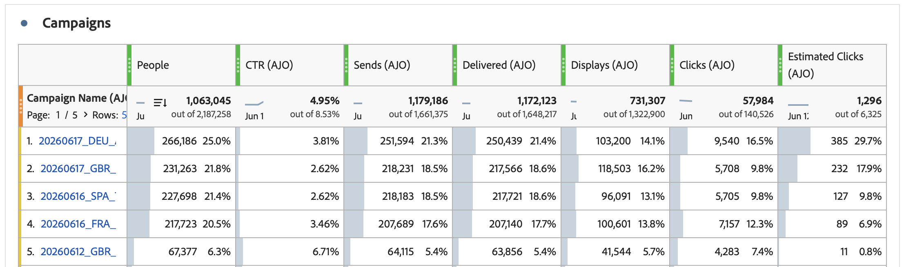
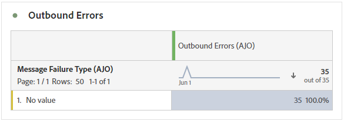
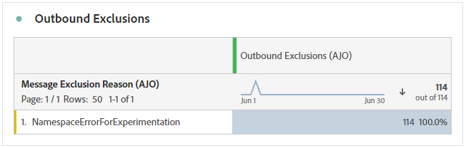

# 개요 보고서 {#channel-report-cja}

개요 보고서는 환경 내의 모든 캠페인 및 여정에 대한 트래픽 및 참여 지표에 대한 철저한 요약을 사용자에게 제공합니다. 이러한 지표는 다양한 캠페인 및 여정을 포함하여 다양한 채널에서 오는 작업에 대해 통합된 값을 제공하기 위해 결합됩니다.

**여정 관리** 섹션 내의 **보고서** 메뉴로 이동하여 개요 보고서에 액세스할 수 있습니다.

보고서 페이지가 다음 탭과 함께 표시됩니다.

* [여정](#journey)
* [캠페인](#campaign)
* [채널](#channel)
* [규칙 세트](#rule-sets)
* [최적화 모델](#optimization-models)

Customer Journey Analytics Workspace과 데이터를 필터링하고 분석하는 방법에 대한 자세한 내용은 [이 페이지](https://experienceleague.adobe.com/ko/docs/analytics-platform/using/cja-workspace/home)를 참조하세요.

## 강조 표시 {#highlights}

**[!UICONTROL 주요 특징]** KPI는 포괄적인 대시보드 역할을 하며, 환경 내의 모든 캠페인과 여정에 대한 주요 지표의 세부 분류를 제공하므로 신속하게 성능을 평가하고 개선 가능한 영역을 식별할 수 있습니다.

+++ 하이라이트 지표에 대해 자세히 알아보기

* **[!UICONTROL 여정 참여]**: 여정에서 보낸 메시지를 받은 총 고유 개인 수로, 여정에서 지정된 작업 지점에 도달한 고유한 프로필을 나타냅니다.

* **[!UICONTROL 여정 입력]**: 여정의 시작 이벤트에 도달한 총 개인 수입니다.

* **[!UICONTROL 여정 실패]**: 실행되지 않은 총 개별 여정 수입니다.

* **[!UICONTROL 클릭스루 비율]**: 메시지 클릭수의 비율입니다.

* **[!UICONTROL 클릭스루 열기 비율(CTOR)]**: 메시지가 열린 횟수입니다.

* **[!UICONTROL 사람]**: 메시지 대상 프로필로 적합한 사용자 프로필 수입니다.

* **[!UICONTROL 클릭 수]**: 메시지에서 콘텐츠를 클릭한 횟수입니다.

* **[!UICONTROL 스팸 고객 불만]**: 메시지가 스팸 또는 정크로 선언된 횟수입니다.

* **[!UICONTROL 구독 취소]**: 구독 취소 링크의 클릭 수입니다.

+++

## 여정 {#journey}

**[!UICONTROL 여정]** 테이블은 포괄적인 대시보드 역할을 하며 여정과 관련된 주요 지표를 분석할 수 있도록 합니다. 여기에는 입력된 프로필 수 및 실패한 개별 여정의 인스턴스 등 세부 정보가 포함되어 있어 여정의 효율성 및 참여 수준을 철저히 파악할 수 있습니다.

이 표에 나열된 여정 이름을 클릭하면 각 여정을 개별적으로 쉽게 탐색할 수 있으므로, 새 탭에서 포괄적인 보고서에 즉시 액세스할 수 있습니다.

+++ 여정 지표에 대해 자세히 알아보기

* **[!UICONTROL 여정 입력]**: 여정의 시작 이벤트에 도달한 총 개인 수입니다.

* **[!UICONTROL 여정 종료]**: 여정을 종료한 총 개인 수

* **[!UICONTROL 여정 실패]**: 실행되지 않은 총 개별 여정 수입니다.

+++

## 캠페인 {#campaign}

**[!UICONTROL Campaign]** 테이블은 모든 항목을 포함하는 대시보드로 작동하며 캠페인에 대한 중요한 지표에 대한 자세한 개요를 제공합니다. 여기에는 프로필 및 전송 수와 같은 필수 데이터가 포함되어 있어 캠페인의 성능 및 참여 수준에 대한 포괄적인 insight을 제공합니다.

이 표에 나열된 캠페인 이름을 클릭하면 각 캠페인을 개별적으로 쉽게 탐색할 수 있으며, 새 탭에서 포괄적인 보고서에 즉시 액세스할 수 있습니다.

+++ Campaign 지표에 대해 자세히 알아보기

* **[!UICONTROL 사람]**: 메시지 대상 프로필로 적합한 사용자 프로필 수입니다.

* **[!UICONTROL 클릭스루 비율(CTR)]**: 메시지 클릭의 비율입니다.

* **[!UICONTROL 전송]**: 각 캠페인에 대한 총 전송 수입니다.

* **[!UICONTROL 배달됨]**: 성공적으로 보낸 메시지 수

* **[!UICONTROL 표시]**: 메시지를 연 횟수입니다.

* **[!UICONTROL 클릭 수]**: 메시지에서 콘텐츠를 클릭한 횟수입니다.

+++

## 채널 {#channel}

### 채널

**[!UICONTROL 채널]** 표에는 채널 수준에서 프로필의 메시지 참여에 대한 자세한 분류가 나와 있습니다. 이를 통해 다양한 채널의 성능에 대해 보다 심층적인 통찰력을 얻을 수 있습니다.

+++ 채널 지표에 대해 자세히 알아보기

* **[!UICONTROL 사람]**: 메시지 대상 프로필로 적합한 사용자 프로필 수입니다.

* **[!UICONTROL 클릭스루 비율(CTR)]**: 메시지 클릭의 비율입니다.

* **[!UICONTROL 배달됨]**: 성공적으로 보낸 메시지 수

* **[!UICONTROL 표시]**: 메시지를 연 횟수입니다.

* **[!UICONTROL 클릭 수]**: 메시지에서 콘텐츠를 클릭한 횟수입니다.

+++

### 아웃바운드 오류

**[!UICONTROL 아웃바운드 오류]** 테이블을 사용하면 전송 프로세스 전체에서 발생한 정확한 오류를 정확하게 파악하여 발생한 문제를 명확하게 이해할 수 있습니다.

### 아웃바운드 제외

**[!UICONTROL 아웃바운드 제외]** 테이블은 대상 대상에서 사용자 프로필을 제외하여 메시지가 수신되지 않는 다양한 요인을 포괄적으로 보여 줍니다.

## 여정 한도 및 충돌 {#rule-sets}

**[!UICONTROL 여정 제한 및 충돌]** 표는 여정 중재 규칙 집합이 수행되는 방식에 대한 통찰력을 제공하여 여정에 적용된 제한 규칙 및 우선 순위 점수를 기반으로 여정 시작 및 제외를 표시합니다.

+++ 규칙 세트 지표에 대해 자세히 알아보기

**[!UICONTROL 여정 집합별 여정 항목]** 열은 규칙을 입력한 프로필의 수를 표시합니다. 세 가지 유형의 시작이 있습니다.

* **&#x200B;**&#x200B;[!UICONTROL 충돌 없음]&#x200B;**&#x200B;**: 프로필이 규칙 집합 충돌 없이 여정에 들어갔습니다. 이 항목을 막을 수 있는 활성 규칙 집합이 없으며 중재 규칙에 관계없이 여정 항목이 발생했습니다.

* **높은 우선 순위**: 프로필이 다른 경쟁 여정에 비해 높은 우선 순위로 인해 여정에 들어갔습니다. 충돌(여러 여정에 적합한 프로필)이 있어도 우선순위 점수가 더 높아 이 여정을 선택했습니다.

* **강제 적용되지 않음**: 프로필이 여정을 입력했지만 규칙 집합이 활성화되지 않았거나 입력 시 이 여정 항목에 적용되지 않았습니다.

**[!UICONTROL 제외]** 열은 여정 입력에서 제외된 프로필 수를 표시합니다. 프로필은 다음 두 가지 이유로 제외될 수 있습니다.

* **상한 도달**: 프로필이 최대 가용량 규칙에 허용된 최대 여정 항목 수 또는 동시 여정 수에 도달했습니다.

* **낮은 우선 순위**: 상한에 도달하지 않았지만 다른 높은 우선 순위 여정이 제약 조건을 충족합니다. 프로필이 이 여정에서 제외되었고 대신 우선순위가 더 높은 여정으로 입력되었습니다.

+++

➡️ [여정 한도 및 중재에 대해 자세히 알아보기](../conflict-prioritization/journey-capping.md)

## 최적화 모델 {#optimization-models}

**[!UICONTROL 전송 시간 최적화]** 테이블을 통해 최적화 및 제어 전자 메일 또는 푸시 메시지의 수행 방식에 대한 통찰력을 얻을 수 있습니다. 이를 사용하여 전송, 열기, 클릭 수 및 바운스와 같은 주요 지표를 비교하므로 각 변형이 수행하는 방식을 확인하고 최적화 결정을 알릴 수 있습니다.

**[!UICONTROL 상승도]** 및 **[!UICONTROL 신뢰도]**&#x200B;를 포함한 이 보고서의 지표는 전송 및 참여의 **60일**&#x200B;부터 계산됩니다.

+++ 전송 시간 최적화 지표에 대해 자세히 알아보기

* **[!UICONTROL 전송]**: 각 메시지 변형을 전송한 총 횟수입니다.

* **[!UICONTROL 열기]**: 메시지에 대해 기록된 총 열린 이벤트 수입니다.

* **[!UICONTROL 열람율]**: 프로필에서 메시지를 한 번 이상 열어 본 보낸 메시지의 비율입니다.

* **[!UICONTROL 상승도]**: 기준선 변형과 관련하여 주어진 처리에서 전환율이 개선되었습니다. 상승도는 차이의 크기를 정량화합니다. **[!UICONTROL 신뢰도]**&#x200B;와 함께 해석하십시오.

* **[!UICONTROL 신뢰도]**: Send-Time Optimized 변형의 열기 또는 클릭률이 제어 변형(무작위로 할당된 전송 시간)과 다르다는 통계적 증거입니다. 이는 두 비율 Z 테스트로 계산됩니다.

+++
