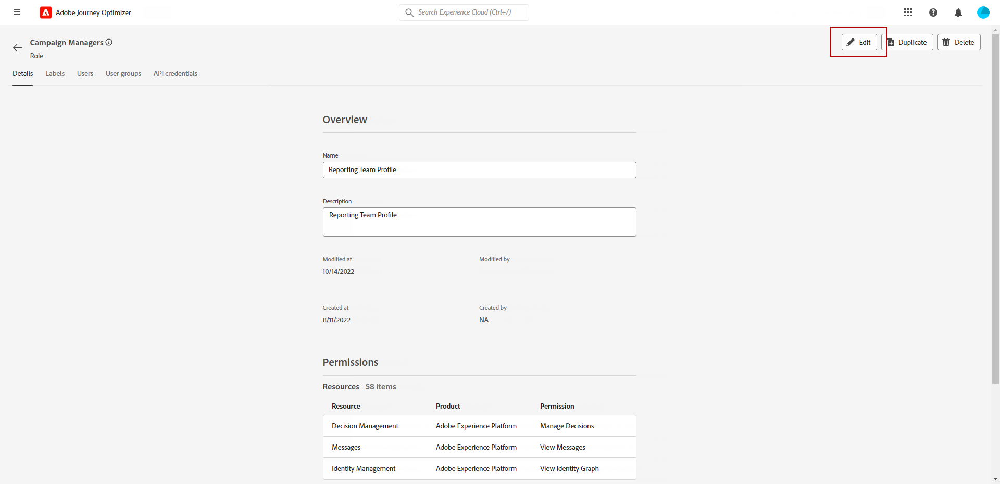

# 채널 보고서 시작 {#channel-report-gs}

채널 보고서는 모든 캠페인 및 여정의 모든 작업을 포함하여 트래픽 및 참여 지표에 대한 포괄적인 개요를 각 채널용 통합 보고서에 제공하는 강력한 도구입니다. 각각 캠페인 또는 여정 성능의 특정 보기를 제공하는 다양한 위젯으로 나뉩니다.

채널 보고서는 완전히 맞춤화가 가능하므로 위젯의 크기를 조정하거나 제거하여 특정 요구 사항을 충족하는 대시보드를 만들 수 있습니다. 추가 분석을 위해 보고서 데이터를 PDF 또는 CSV 파일로 내보낼 수도 있습니다.

여기에서 채널 보고서에 사용할 수 있는 다양한 지표 및 위젯에 대해 자세히 알아보십시오. [페이지](channel-report.md).

## 시작하기 전 {#manage-reports-prereq}

시작하기 전에 다음에 대한 액세스 권한이 있는지 확인하십시오. **[!UICONTROL 보고서]** 메뉴 아래의 제품에서 사용할 수 있습니다.

다음을 볼 수 없는 경우 **[!UICONTROL 보고서]** 메뉴에서 액세스 권한을 확장하여 **[!UICONTROL 채널 보고서 보기]** 권한. Adobe Experience Platform에 액세스할 수 있는 경우 자체 권한을 확장할 수 있습니다 [권한](https://experienceleague.adobe.com/docs/experience-platform/access-control/home.html?lang=ko){target="_blank"} 을 참조하십시오. 그렇지 않은 경우 Adobe Journey Optimizer 관리자에게 문의하십시오.

+++보고서 권한 할당 방법 알아보기

이 권한은 다음 기본 기능에 포함되어 있습니다 **[!UICONTROL 역할]**: 캠페인 관리자, 캠페인 승인자, 캠페인 뷰어 및 캠페인 관리자.

에 해당 권한을 할당하려면 **[!UICONTROL 역할]**:

1. 다음에서 [!DNL Permissions] product에서 **[!UICONTROL 역할]** 을(를) 메뉴로 만들고 새 역할로 업데이트할 역할을 선택합니다 **[!UICONTROL 채널 보고서 보기]** 권한.

1. 출처: **[!UICONTROL 역할]** 대시보드, 클릭 **[!UICONTROL 편집]**.

   

1. 을(를) 끌어다 놓습니다. **[!UICONTROL 보고서]** 권한을 할당할 리소스입니다.

   다음에서 **[!UICONTROL 보고서]** 리소스 드롭다운에서 **[!UICONTROL 채널 보고서 보기]** 권한.

   

1. **[!UICONTROL 저장]**&#x200B;을 클릭합니다.

이에 할당된 사용자 **[!UICONTROL 역할]** 은(는) 이제 다음에 액세스할 수 있습니다. **[!UICONTROL 보고서]** 메뉴 아래의 제품에서 사용할 수 있습니다.

+++

## 보고서 대시보드 관리 {#manage-reports}

채널 보고서에 액세스하고 관리하려면 다음 단계를 수행합니다.

1. 다음 위치로 이동 **[!UICONTROL 보고서]** 내 메뉴 **[!UICONTROL 여정 관리]** 섹션.

   

1. 대시보드에서 을(를) 선택합니다 **시작** 및 **[!UICONTROL 종료 시간]** 특정 데이터를 대상으로 지정합니다.

1. 다음에서 **[!UICONTROL 다음에서 작업]** 드롭다운에서 캠페인, 여정 또는 둘 다를 타겟팅하려면 을 선택합니다.

   

1. 클릭 **[!UICONTROL 수정]** 위젯의 크기를 조정하거나 제거하여 특정 요구 사항을 충족하는 대시보드를 만듭니다.

   

1. 표시 순서 및 위젯 크기에 만족하면 을 클릭합니다. **[!UICONTROL 저장]**.

1. 위젯에 따라 표, 막대 차트 또는 도넛에서 전환하도록 선택할 수 있습니다.

1. 백분율 아이콘을 클릭하여 데이터를 비율로 표시합니다.

   

## 보고서 내보내기 {#export-reports}

서로 다른 보고서를 PDF 또는 CSV 형식으로 쉽게 내보내 공유, 조작 또는 인쇄할 수 있습니다. 채널 보고서를 내보내는 자세한 단계는 다음 탭에서 확인할 수 있습니다.

>[!BEGINTABS]

>[!TAB 보고서를 PDF 파일로 내보내기]

1. 보고서에서 **[!UICONTROL 내보내기]** 및 선택 **[!UICONTROL PDF 파일]**.

1. 인쇄 창에서 필요에 따라 문서를 구성합니다. 선택 사항은 브라우저에 따라 다를 수 있습니다.

1. 보고서를 PDF으로 인쇄 또는 저장하도록 선택합니다.

1. 파일을 저장할 폴더를 찾아 필요한 경우 이름을 변경한 다음 [저장]을 클릭합니다.

이제 PDF 파일에서 보고서를 보거나 공유할 수 있습니다.

>[!TAB 보고서를 CSV 파일로 내보내기]

1. 보고서에서 **[!UICONTROL 내보내기]** 및 선택 **[!UICONTROL CSV 파일]** 전체 보고서 수준에서 CSV 파일을 생성합니다.

1. 특정 위젯에서 데이터를 내보내도록 선택할 수도 있습니다. 클릭 **[!UICONTROL 위젯 데이터를 CSV로 내보내기]** 선택한 위젯 옆에 있습니다.

1. 파일은 자동으로 다운로드되며 로컬 파일에서 찾을 수 있습니다.

   보고서 수준에서 파일을 생성한 경우, 여기에는 제목 및 데이터를 포함하여 각 위젯에 대한 자세한 정보가 포함됩니다.

   위젯 수준에서 파일을 생성한 경우 선택한 위젯에 대한 데이터가 특별히 제공됩니다.

>[!ENDTABS]
