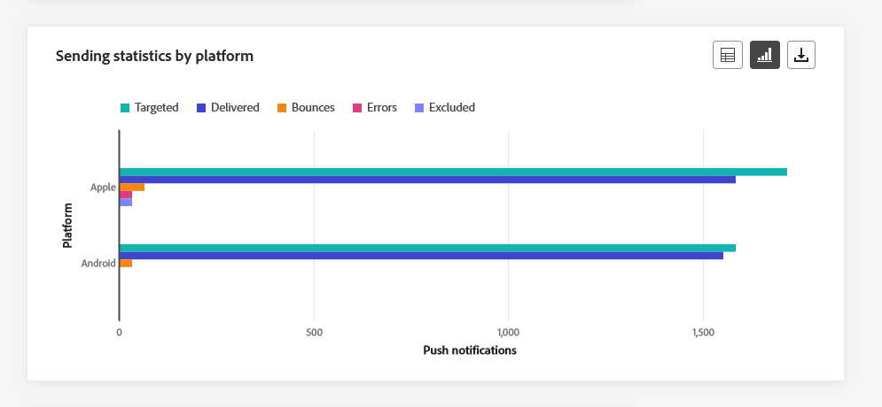
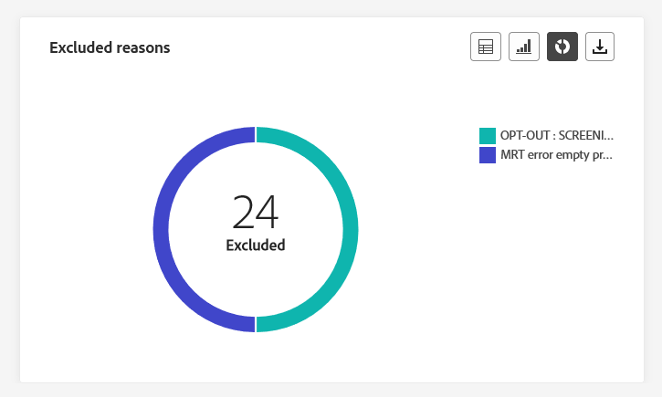

# 채널 보고서 {#channel-report}

>[!CONTEXTUALHELP]
>id="ajo_channel_level_report"
>title="채널 수준 보고서"
>abstract="채널 보고서는 모든 채널의 트래픽 및 참여 지표에 대한 포괄적 개요를 제공합니다. 보고서는 캠페인 및 여정의 성공 사례와 오류를 자세히 설명하는 여러 위젯으로 나눠집니다. 위젯 크기를 조정하거나 위젯을 제거하여 각 보고 대시보드를 수정할 수 있습니다."

>[!IMPORTANT]
>
> 에 액세스하려면 **보고서** 메뉴, 다음 항목이 있어야 합니다. **[!UICONTROL 채널 보고서 보기]** 권한. [자세히 알아보기](channel-report-gs.md#before-starting-manage-reports-prereq)

채널 보고서는 채널 수준의 트래픽 및 참여 지표에 대한 포괄적인 개요를 사용자에게 제공합니다. 지표는 다양한 캠페인 및 여정에 걸쳐 선택된 채널에서 시작된 작업에 대한 통합 값을 제시하기 위해 집계됩니다.

다음으로 이동하여 채널 보고서에 액세스할 수 있습니다. **보고서** 내 메뉴 **여정 관리** 섹션. 완전히 사용자 지정할 수 있으며 보고서 날짜 또는 작업에 따라 데이터를 필터링할 수 있습니다. [자세히 알아보기](channel-report-gs.md)

보고서 페이지가 다음 탭과 함께 표시됩니다.

* [이메일](#email)
* [푸시 알림](#push)
* [SMS](#sms)
* [인앱](#inapp)
* [웹](#web)
* [다이렉트 메일](#direct-mail)

➡️ [비디오에서 이 기능 살펴보기](#channel-report-video)

## 이메일 {#email}

채널 보고서에서 이메일 메뉴는 캠페인 및 여정에서 보낸 이메일과 관련된 기본 정보를 자세히 설명합니다. 지표는 아래에 자세히 설명되어 있습니다.

### 이메일 - 총 전송 통계 {#email-total-sending}

>[!CONTEXTUALHELP]
>id="ajo_channel_email_sending_statistics"
>title="이메일 - 총 전송 통계"
>abstract="이메일 - 총 전송 통계 KPI는 대상 지정 메시지 또는 게재된 메시지 등과 같은 이메일에 대한 필수 데이터를 요약합니다."

다음 **[!UICONTROL 이메일 총 전송 통계]** 위젯은 이메일에 대한 필수 데이터를 요약하는 주요 성능 지표(KPI)를 표시하여 이메일 성능에 대한 포괄적인 개요를 제공합니다.

+++ 이메일 총 전송 통계 지표에 대해 자세히 알아보기

* **[!UICONTROL 타깃팅됨]**: 처리된 총 이메일 수입니다.

* **[!UICONTROL 전송됨]**: 총 전송 수입니다.

* **[!UICONTROL 전달됨]**: 보낸 총 메시지 수와 관련하여 성공적으로 전송된 이메일 수입니다.

* **[!UICONTROL 게재율]**: 성공적으로 전송된 이메일의 비율입니다.

* **[!UICONTROL 바운스]**: 총 보낸 메시지 수와 관련하여 누적된 총 오류 및 자동 반환 처리 수입니다.

* **[!UICONTROL 바운스 비율]**: 보낸 이메일과 비교하여 반송된 이메일의 비율.

* **[!UICONTROL 오류]**: 프로필로 전송되지 않도록 하여 발생한 총 오류 수입니다.

* **[!UICONTROL 오류율]**: 보낸 이메일과 비교하여 보내지 못하게 하는 발생한 오류의 백분율입니다.

* **[!UICONTROL 제외됨]**: Adobe Journey Optimizer에서 제외된 프로필 수입니다.

* **[!UICONTROL 제외 비율]**: Adobe Journey Optimizer에서 제외된 프로필의 비율입니다.

+++

### 이메일 - 총 추적 통계 {#email-total-tracking}

>[!CONTEXTUALHELP]
>id="ajo_channel_email_tracking_statistics"
>title="이메일 - 총 추적 통계"
>abstract="이메일 - 총 추적 통계 KPI는 이메일에 대한 프로필 활동 데이터를 제공합니다."

다음 **[!UICONTROL 이메일 총 추적 통계]** 위젯은 이메일에 연결된 프로필 활동에 대한 자세한 스냅샷을 제공하여 참여 및 이메일 효과에 대한 필수 통찰력을 제공합니다.

+++ 이메일 총 추적 통계 지표에 대해 자세히 알아보기

* **[!UICONTROL 열림]**: 메시지가 열린 횟수입니다.

* **[!UICONTROL 열람률]**: 배달된 이메일 수와 비교하여 열린 이메일의 총 수입니다.

* **[!UICONTROL 클릭수]**: 메시지에서 콘텐츠가 클릭된 횟수입니다.

* **[!UICONTROL 클릭률]**: 이메일과 상호 작용한 사용자의 비율입니다.

* **[!UICONTROL 스팸 고객 불만]**: 메시지가 스팸 또는 정크로 선언된 횟수입니다.

* **[!UICONTROL 스팸 고객 불만 비율]**: 보낸 이메일 수와 비교하여 스팸 또는 정크로 선언된 메시지의 비율입니다.

* **[!UICONTROL 구독 취소]**: 구독 링크 클릭 수.

* **[!UICONTROL 구독 취소율]**: 보낸 이메일 수와 비교한 구독 취소 비율.

+++

### 이메일 - 시간에 따른 전송 통계 {#email-sending-statistics-overtime}

>[!CONTEXTUALHELP]
>id="ajo_channel_email_sending_statistics_overtime"
>title="이메일 - 시간에 따른 전송 통계"
>abstract="이메일 - 시간에 따른 전송 통계 그래프는 전송된 이메일에 관한 데이터를 시간별, 일별, 주별 또는 월별 기준으로 분류하여 표시합니다."

다음 **[!UICONTROL 이메일 - 시간 경과에 따른 전송 통계]** 그래프는 이메일 활동 분석을 표시하는 동적 표현을 제공합니다. 이 그래픽 표현은 전송된 이메일에 대한 포괄적인 분석을 제공하여 시간별, 일별, 주별 또는 월별 단위로 트렌드와 패턴을 관찰할 수 있도록 합니다.

+++ 이메일에 대한 자세한 내용 - 시간 측정 단위 통계 보내기

* **[!UICONTROL 전송됨]**: 총 전송 수입니다.

* **[!UICONTROL 전달됨]**: 전송된 총 이메일 수와 관련하여 성공적으로 전송된 이메일 수입니다.

* **[!UICONTROL 바운스]**: 전송된 총 이메일 수와 관련하여 누적된 총 오류 및 자동 반환 처리 수입니다.

* **[!UICONTROL 오류]**: 프로필로 전송되지 않도록 하여 발생한 총 오류 수입니다.

+++

### 이메일 - 시간에 따른 추적 통계 {#email-tracking-statistics-overtime}

>[!CONTEXTUALHELP]
>id="ajo_channel_email_tracking_statistics_overtime"
>title="이메일 - 시간에 따른 추적 통계"
>abstract="이메일 - 시간에 따른 추적 통계 그래프는 이메일의 프로필 활동에 대한 데이터를 시간별, 일별, 주별 또는 월별 기준으로 분류하여 제공합니다."

다음 **[!UICONTROL 이메일 - 시간 경과에 따른 추적 통계]** graph는 이메일과 관련된 프로필 활동에 대한 자세한 개요를 제공합니다. 이 그래픽 표현은 시간별, 일별, 주별 또는 월별 기준으로 데이터를 분류하므로 수신자 참여가 다양한 시간 간격으로 어떻게 전개되는지에 대한 중요한 통찰력을 제공합니다.

+++ 이메일에 대해 자세히 알아보기 - 시간 지표에 따른 추적 통계

* **[!UICONTROL 열림]**: 메시지가 열린 횟수입니다.

* **[!UICONTROL 클릭수]**: 메시지에서 콘텐츠가 클릭된 횟수입니다.

+++

### 이메일 - 바운스 범주 및 이유 {#bounce-categories}

>[!CONTEXTUALHELP]
>id="ajo_channel_email_bounce_categories"
>title="바운스 범주"
>abstract="바운스 범주 그래프와 테이블은 일시적 오류와 영구적 오류 모두에 대한 데이터를 제공합니다."

>[!CONTEXTUALHELP]
>id="ajo_channel_email_bounce_reasons"
>title="바운스 이유"
>abstract="바운스 이유 그래프와 테이블에는 바운스된 메시지와 관련하여 사용 가능한 데이터가 있습니다."

다음 **[!UICONTROL 바운스 범주]** 및 **[!UICONTROL 바운스 원인]** 위젯은 반송된 메시지와 관련된 데이터를 캡슐화하여 다양한 카테고리와 메시지 반송 이면의 특정 이유에 대한 포괄적인 개요를 제공합니다

바운스에 대한 자세한 내용은 [비표시 목록](../reports/suppression-list.md) 페이지를 가리키도록 업데이트하는 중입니다.

+++ 바운스 범주 지표에 대해 자세히 알아보기

* **[!UICONTROL 하드 바운스]**: 잘못된 이메일 주소와 같은 영구 오류의 총 수입니다. 여기에는 알 수 없는 사용자와 같이 주소가 유효하지 않다는 오류 메시지가 명시적으로 표시됩니다.

* **[!UICONTROL 소프트 바운스]**: 전체 받은 편지함과 같은 총 임시 오류 수.

* **[!UICONTROL 무시됨]**: 부재 중이거나 기술적인 오류와 같은 총 임시 항목 수(발신자 유형이 postmaster인 경우).

+++

### 오류 원인 {#error-reasons}

>[!CONTEXTUALHELP]
>id="ajo_channel_email_error_reasons"
>title="오류 원인"
>abstract="오류 이유 그래프와 테이블을 통해 전송 프로세스 중에 발생한 특정 오류를 확인할 수 있습니다."

다음 **[!UICONTROL 오류 원인]** 그래프와 표를 통해 전송 프로세스 전체에서 발생한 정확한 오류를 정확히 파악할 수 있으므로 발생한 문제를 명확하게 파악할 수 있습니다.

### 제외된 이유 {#excluded-reasons}

>[!CONTEXTUALHELP]
>id="ajo_channel_email_excluded_reasons"
>title="제외된 이유"
>abstract="제외된 이유 그래프와 테이블에서는 타겟팅된 대상자에서 제외된 사용자 프로필이 메시지를 받지 못하는 다양한 요인을 보여 줍니다."

다음 **[!UICONTROL 제외된 이유]** 그래프와 표는 타겟팅된 대상에서 사용자 프로필을 제외하여 메시지가 수신되지 않는 다양한 요인에 대한 포괄적인 보기를 제공합니다.

을(를) 참조하십시오 [이 페이지](exclusion-list.md) 포괄적인 제외 이유 목록.

### 도메인별로 전송 및 게재 {#sent-delivered-domains}

>[!CONTEXTUALHELP]
>id="ajo_channel_email_sending_delivered_domains"
>title="도메인별로 전송 및 게재"
>abstract="도메인별로 전송 및 게재 그래프와 테이블에서는 모든 중요한 이메일 전송 데이터의 도메인 수준 분류를 나타냅니다."

다음 **[!UICONTROL 도메인에서 전송 및 전달]** 표 및 그래프는 도메인 수준에서 이메일 게재의 세부 분류를 제공하여 이메일 성능에 대한 포괄적인 통찰력을 제공합니다.

+++ 도메인에서 보낸 사람 및 배달한 사람 지표에 대해 자세히 알아보기

* **[!UICONTROL 전송됨]**: 이메일의 총 전송 수입니다.

* **[!UICONTROL 전달됨]**: 성공적으로 전송된 메시지 수와 총 전송된 메시지 수

+++

### 도메인별 바운스 및 오류 {#bounces-errors-domains}

>[!CONTEXTUALHELP]
>id="ajo_channel_email_bounces_errors_domains"
>title="도메인별 바운스 및 오류"
>abstract="도메인별 바운스 및 오류 그래프와 테이블은 전송 프로세스 중에 발생한 특정 오류에 대한 도메인 수준 분류를 나타냅니다."

다음 **[!UICONTROL 도메인별 바운스 및 오류]** 그래프 및 표는 전송 프로세스 중에 발생한 특정 오류에 대한 도메인 수준 분석을 제공하여 발생한 문제에 대한 자세한 분석을 제공합니다.

+++ 도메인별 바운스 및 오류에 대한 자세한 내용 지표

* **[!UICONTROL 바운스]**: 전송 프로세스 및 자동 반환 처리 중에 누적된 총 보낸 메시지 수와 관련된 오류의 수입니다.

* **[!UICONTROL 오류]**: 전송 프로세스 중에 발생하여 프로필로 전송되지 않은 총 오류 수입니다.

+++

### 도메인별 열기 및 클릭 {#open-clicks-domains}

>[!CONTEXTUALHELP]
>id="ajo_channel_email_open_clicks_domains"
>title="도메인별 열기 및 클릭"
>abstract="도메인별 열기 및 클릭 그래프와 테이블은 방문자의 이메일 참여에 대한 도메인 수준 분석을 나타냅니다."

다음 **[!UICONTROL 도메인별 열기 및 클릭]** 그래프와 표에는 방문자의 이메일에 대한 참여도에 대한 도메인 수준 분류가 표시되어 다양한 도메인이 콘텐츠와 상호 작용하는 방법에 대한 중요한 통찰력을 제공합니다.

+++ 도메인별 열기 및 클릭 지표에 대해 자세히 알아보기

* **[!UICONTROL 열림]**: 이메일을 연 횟수입니다.

* **[!UICONTROL 클릭수]**: 이메일에서 콘텐츠를 클릭한 횟수입니다.

+++

### 도메인별 바운스 이유 {#bounce-reasons-domains}

>[!CONTEXTUALHELP]
>id="ajo_channel_email_bounce_reasons_domains"
>title="도메인별 바운스 이유"
>abstract="도메인별 바운스 이유 그래프 및 테이블은 일시적 오류와 영구적 오류 모두에 대한 데이터의 도메인 수준 분류를 나타냅니다."

다음 **[!UICONTROL 도메인별 바운스 원인]** 그래프 및 표는 일시적인 오류와 영구적인 오류에 관련된 데이터의 도메인 수준 분류를 제공하여, 반송된 메시지 이면의 이유에 대한 자세한 통찰력을 제공합니다.

바운스에 대한 자세한 내용은 [비표시 목록](../reports/suppression-list.md) 페이지를 가리키도록 업데이트하는 중입니다.

## 푸시 알림 {#push}

채널 보고서에서 **푸시 알림** 메뉴에서는 캠페인 및 여정에서 전송된 푸시 알림과 관련된 기본 정보를 자세히 설명합니다. 지표는 아래에 자세히 설명되어 있습니다.

### 푸시 알림 - 총 전송 통계 {#push-total-sending}

>[!CONTEXTUALHELP]
>id="ajo_channel_push_sending_statistics"
>title="푸시 알림 - 총 전송 통계"
>abstract="푸시 알림 - 총 전송 통계 KPI는 대상 지정 또는 게재됨 등과 같은 푸시 알림에 대한 필수 데이터를 요약합니다."

다음 **[!UICONTROL 푸시 알림 - 총 전송 통계]** KPI는 푸시 알림과 관련된 필수 데이터를 캡슐화하는 포괄적인 요약 역할을 합니다. 이러한 지표에는 타깃팅된 대상 및 실제 게재 상태에 대한 자세한 인사이트가 포함되어 있어 푸시 알림의 효율성과 도달에 대한 포괄적인 보기를 제공합니다.

+++ 푸시 알림에 대해 자세히 알아보기 - 총 전송 통계 지표

* **[!UICONTROL 타깃팅됨]**: 처리된 총 푸시 알림 수입니다.

* **[!UICONTROL 전송됨]**: 전송된 총 푸시 알림 수입니다.

* **[!UICONTROL 전달됨]**: 전송된 총 푸시 알림 수와 관련하여 성공적으로 전송된 푸시 알림 수입니다.

* **[!UICONTROL 게재율]**: 성공적으로 전송된 푸시 알림의 비율입니다.

* **[!UICONTROL 바운스]**: 총 보낸 메시지 수와 관련하여 누적된 총 오류 및 자동 반환 처리 수입니다.

* **[!UICONTROL 바운스 비율]**: 전송된 푸시 알림과 비교하여 반송된 푸시 알림의 비율입니다.

* **[!UICONTROL 오류]**: 프로필로 전송되지 않도록 하여 발생한 총 오류 수입니다.

* **[!UICONTROL 오류율]**: 전송되지 않도록 발생한 오류의 비율이 전송된 푸시 알림과 비교 시 백분율입니다.

* **[!UICONTROL 제외됨]**: Adobe Journey Optimizer에서 제외된 프로필 수입니다.

* **[!UICONTROL 제외 비율]**: Adobe Journey Optimizer에서 제외된 프로필의 비율입니다.

+++

### 푸시 알림 - 총 추적 통계 {#push-total-tracking}

>[!CONTEXTUALHELP]
>id="ajo_channel_push_tracking_statistics"
>title="푸시 알림 - 총 추적 통계"
>abstract="푸시 알림 - 총 추적 통계는 푸시 알림에 대한 프로필 활동 데이터를 제공합니다."

다음 **[!UICONTROL 푸시 알림 - 총 추적 통계]** 위젯은 푸시 알림과 연결된 프로필 활동에 대한 자세한 스냅숏을 제공하여 참여 및 푸시 알림 효과에 대한 중요한 통찰력을 제공합니다.

+++ 푸시 알림에 대한 자세한 내용 - 총 추적 통계 지표

* **[!UICONTROL 열림]**: 푸시 알림이 열린 횟수입니다.

* **[!UICONTROL 열람률]**: 열린 푸시 알림의 백분율입니다.

* **[!UICONTROL 작업]**: 전달된 푸시 알림에 대한 총 작업 수(예: 버튼 클릭 또는 해제)

* **[!UICONTROL 작업률]**: 전송된 푸시 알림과 비교하여 전달된 푸시 알림에 대한 작업의 비율입니다.

+++

### 푸시 알림 - 시간에 따른 전송 통계 {#push-sending-overtime}

>[!CONTEXTUALHELP]
>id="ajo_channel_push_sending_statistics_overtime"
>title="푸시 알림 - 시간에 따른 전송 통계"
>abstract="푸시 알림 - 시간에 따른 전송 통계 그래프는 전송된 푸시 알림에 관한 데이터를 시간별, 일별, 주별 또는 월별 기준으로 분류하여 표시합니다."

다음 **[!UICONTROL 푸시 알림 - 시간에 따른 통계 전송]** 그래프는 푸시 알림 활동의 분석을 표시하는 동적 표현을 제공합니다. 이 그래픽 표현은 전송된 푸시 알림에 대한 포괄적인 분석을 제공하여 시간별, 일별, 주별 또는 월별 단위의 트렌드와 패턴을 관찰할 수 있도록 합니다.

+++ 푸시 알림에 대해 자세히 알아보기 - 시간 지표에 따른 통계 전송

* **[!UICONTROL 전송됨]**: 전송된 총 푸시 알림 수입니다.

* **[!UICONTROL 전달됨]**: 전송된 총 푸시 알림 수와 관련하여 성공적으로 전송된 푸시 알림 수입니다.

* **[!UICONTROL 바운스]**: 총 보낸 메시지 수와 관련하여 누적된 총 오류 및 자동 반환 처리 수입니다.

* **[!UICONTROL 오류]**: 프로필로 전송되지 않도록 하여 발생한 총 오류 수입니다.

+++

### 푸시 알림 - 시간에 따른 추적 통계 {#push-tracking-overtime}

>[!CONTEXTUALHELP]
>id="ajo_channel_push_tracking_statistics_overtime"
>title="푸시 알림 - 시간에 따른 추적 통계"
>abstract="푸시 알림 - 시간에 따른 추적 통계 그래프는 푸시 알림의 프로필 활동에 대한 데이터를 시간별, 일별, 주별 또는 월별 기준으로 분류하여 제공합니다."

다음 **[!UICONTROL 푸시 알림 - 시간 경과에 따른 추적 통계]** 그래프는 푸시 알림과 관련된 프로필 활동에 대한 자세한 개요를 제공합니다. 이 그래픽 표현은 시간별, 일별, 주별 또는 월별 기준으로 데이터를 분류하므로 수신자 참여가 다양한 시간 간격으로 어떻게 전개되는지에 대한 중요한 통찰력을 제공합니다.

+++ 푸시 알림에 대한 자세한 내용 - 시간 지표에 따른 통계 추적

* **[!UICONTROL 열림]**: 푸시 알림이 열린 횟수입니다.

* **[!UICONTROL 작업]**: 전달된 푸시 알림에 대한 총 작업 수(예: 버튼 클릭 또는 해제)

+++

### 푸시 알림 - 제외된 이유 {#push-excluded-reasons}

>[!CONTEXTUALHELP]
>id="ajo_channel_push_excluded_reasons"
>title="제외된 이유"
>abstract="제외된 이유 그래프와 테이블에서는 타겟팅된 대상자에서 제외된 사용자 프로필이 메시지를 받지 못하는 다양한 요인을 보여 줍니다."

다음 **[!UICONTROL 제외된 이유]** 그래프와 표에는 타깃팅된 프로필에서 제외된 사용자 프로필에서 푸시 알림을 받을 수 없는 다양한 이유가 표시됩니다.

을(를) 참조하십시오 [이 페이지](exclusion-list.md) 포괄적인 제외 이유 목록.

### 푸시 알림 - 오류 이유 {#push-error-reasons}

>[!CONTEXTUALHELP]
>id="ajo_channel_push_error_reasons"
>title="오류 원인"
>abstract="오류 이유 그래프와 테이블을 통해 전송 프로세스 중에 발생한 특정 오류를 확인할 수 있습니다."

다음 **[!UICONTROL 오류 원인]** 그래프 및 표는 푸시 알림의 전송 프로세스 중에 발생한 특정 오류를 식별하는 기능을 제공하며, 이를 통해 발생하는 모든 문제에 대한 자세한 통찰력을 제공합니다.

### 푸시 알림 - 플랫폼을 통한 추적 {#push-tracking-platform}

>[!CONTEXTUALHELP]
>id="ajo_channel_push_tracking_statistics_platform"
>title="플랫폼별 추적 통계"
>abstract="플랫폼별 추적 통계 그래프 및 테이블에서는 프로필 운영 체제에 따라 푸시 알림에 대한 프로필 활동 데이터를 제공합니다."

다음 **[!UICONTROL 푸시 알림 - 플랫폼을 통한 추적]** 그래프 및 표는 프로필의 운영 체제에 따라 푸시 알림에 대한 수신자 활동을 자세히 설명합니다.

### 푸시 알림 - 플랫폼을 통한 전송 {#push-sending-platform}

>[!CONTEXTUALHELP]
>id="ajo_channel_push_sending_statistics_platform"
>title="플랫폼별 전송 통계"
>abstract="플랫폼별 전송 통계 그래프 및 테이블은 전송된 푸시 알림에 대한 데이터를 표시합니다."

다음 **[!UICONTROL 푸시 알림 - 플랫폼을 통한 전송]** 그래프 및 표는 프로필의 운영 체제와 관련된 푸시 알림의 성공 여부를 자세히 설명하는 포괄적인 분류를 제공합니다. 이러한 철저한 분석은 다양한 플랫폼에서 푸시 알림의 효과에 대한 중요한 통찰력을 제공합니다.

## SMS {#sms}

출처: **채널** 보고서, SMS 메뉴는 캠페인 및 여정에서 전송된 SMS와 관련된 기본 정보를 자세히 설명합니다. 지표는 아래에 자세히 설명되어 있습니다.

### SMS - 총 전송 통계 {#sms-sending-statistics}

>[!CONTEXTUALHELP]
>id="ajo_channel_sms_sending_statistics"
>title="SMS - 총 전송 통계"
>abstract="SMS - 총 전송 통계 KPI는 대상 지정 또는 게재됨 등과 같은 SMS 메시지에 대한 필수 데이터를 요약합니다."

다음 **[!UICONTROL SMS - 총 전송 통계]** KPI는 SMS와 관련된 필수 데이터를 캡슐화하는 포괄적인 요약 역할을 합니다. 이러한 지표에는 타겟팅된 대상 및 실제 게재 상태에 대한 자세한 통찰력이 포함되어 있어 SMS 메시지의 효율성과 도달에 대한 포괄적인 보기를 제공합니다.

+++ 푸시 알림에 대해 자세히 알아보기 - 총 전송 통계 지표

* **[!UICONTROL 타깃팅됨]**: SMS 채널의 대상 프로필로 적합한 사용자 프로필 수입니다.

* **[!UICONTROL 전송됨]**: 보낸 총 SMS 메시지 수

* **[!UICONTROL 전달됨]**: 성공적으로 전송된 SMS 메시지 수와 총 전송된 SMS 메시지 수

* **[!UICONTROL 게재율]**: 성공적으로 전송된 SMS 메시지의 비율입니다.

* **[!UICONTROL 바운스]**: 전송된 SMS 메시지의 총 수와 관련하여 누적된 오류 및 자동 반환 처리의 합계입니다.

* **[!UICONTROL 바운스 비율]**: 전송된 SMS 메시지와 비교하여 반송된 SMS 메시지의 백분율입니다.

* **[!UICONTROL 오류]**: 프로필로 전송되지 않도록 하여 발생한 총 오류 수입니다.

* **[!UICONTROL 오류율]**: 보낸 SMS 메시지와 비교하여 보내지 못하게 하는 오류 비율입니다.

* **[!UICONTROL 제외됨]**: 타겟팅된 프로필에서 제외되고 메시지를 받지 못한 사용자 프로필 수입니다.

* **[!UICONTROL 제외 비율]**: Adobe Journey Optimizer에서 제외된 프로필의 비율입니다.

+++

### SMS - 총 추적 통계 {#sms-tracking-statistics}

>[!CONTEXTUALHELP]
>id="ajo_channel_sms_tracking_statistics"
>title="SMS - 총 추적 통계"
>abstract="SMS - 총 추적 통계는 SMS 메시지에 대한 프로필 활동 데이터를 제공합니다."

다음 **[!UICONTROL SMS - 총 추적 통계]** 위젯은 방문자의 URL 참여와 관련된 주요 정보에 대한 자세한 개요를 제공하여 SMS 메시지의 효과에 대한 통찰력을 제공합니다.

* **[!UICONTROL 클릭수]**: SMS 메시지에서 콘텐츠를 클릭한 횟수.

### SMS - 시간에 따른 전송 통계 {#sms-sending-statistics-overtime}

>[!CONTEXTUALHELP]
>id="ajo_channel_sms_sending_statistics_overtime"
>title="SMS - 시간에 따른 전송 통계"
>abstract="SMS - 시간에 따른 전송 통계 그래프는 전송된 SMS 메시지에 관한 데이터를 시간별, 일별, 주별 또는 월별 기준으로 분류하여 표시합니다."

다음 **[!UICONTROL SMS - 시간 경과에 따른 통계 전송]** graph는 전송된 SMS 메시지에 대한 포괄적인 보기를 제공하여 시간별, 일별, 주별 또는 월별 기준으로 분류된 데이터를 제공합니다. 이 그래픽 표현을 사용하면 다양한 시간 간격에 따른 SMS 메시지 활동의 트렌드를 추적하고 분석할 수 있습니다.

+++ SMS에 대해 자세히 알아보기 - 시간 지표에 따른 통계 전송

* **[!UICONTROL 전송됨]**: 보낸 총 SMS 메시지 수

* **[!UICONTROL 바운스]**: 전송된 SMS 메시지의 총 수와 관련하여 누적된 오류 및 자동 반환 처리의 합계입니다.

* **[!UICONTROL 오류]**: 프로필로 전송되지 않도록 하여 발생한 총 오류 수입니다.

+++

### SMS - 시간에 따른 추적 통계 {#sms-tracking-statistics-overtime}

>[!CONTEXTUALHELP]
>id="ajo_channel_sms_tracking_statistics_overtime"
>title="SMS - 시간에 따른 추적 통계"
>abstract="SMS - 시간에 따른 추적 통계 그래프는 SMS 메시지의 프로필 활동에 대한 데이터를 시간별, 일별, 주별 또는 월별 기준으로 분류하여 제공합니다."

다음 **[!UICONTROL SMS - 시간 경과에 따른 통계 추적]** graph는 SMS 메시지와 관련된 프로필 활동에 대한 데이터를 제공하여 시간별, 일별, 주별 또는 월별 단위로 세부 분류를 제공합니다. 이 그래픽 표현을 사용하면 다양한 시간 간격에 따른 사용자 참여의 패턴을 분석하고 이해할 수 있습니다.

* **[!UICONTROL 클릭수]**: SMS 메시지에서 콘텐츠를 클릭한 횟수.

### 제외된 이유 {#sms-excluded-reasons}

>[!CONTEXTUALHELP]
>id="ajo_channel_sms_excluded_reasons"
>title="제외된 이유"
>abstract="제외된 이유 그래프와 테이블에서는 타겟팅된 대상자에서 제외된 사용자 프로필이 메시지를 받지 못하는 다양한 요인을 보여 줍니다."

다음 **[!UICONTROL 사유 제외]** 그래프 및 표는 타겟팅된 대상에서 사용자 프로필을 제외하여 SMS 메시지를 받지 못하게 한 다양한 요인을 시각적으로 보여 줍니다.

을(를) 참조하십시오 [이 페이지](exclusion-list.md) 포괄적인 제외 이유 목록.

### 바운스 이유 {#sms-bounce-reasons}

>[!CONTEXTUALHELP]
>id="ajo_channel_sms_bounce_reasons"
>title="바운스 이유"
>abstract="바운스 이유 그래프와 테이블에는 바운스된 메시지와 관련하여 사용 가능한 데이터가 있습니다."

다음 **[!UICONTROL 반송 원인]** 그래프 및 표는 반송된 SMS 메시지와 관련된 데이터에 대한 포괄적인 개요를 제공하여 SMS 메시지 반송 인스턴스의 특정 이유에 대한 중요한 통찰력을 제공합니다.

### 오류 원인 {#sms-error-reasons}

>[!CONTEXTUALHELP]
>id="ajo_channel_sms_error_reasons"
>title="오류 원인"
>abstract="오류 이유 그래프와 테이블을 통해 전송 프로세스 중에 발생한 특정 오류를 확인할 수 있습니다."

다음 **[!UICONTROL 오류 원인]** 그래프와 표를 사용하면 SMS 메시지를 보내는 동안 발생한 특정 오류를 식별할 수 있으므로 발생한 문제를 철저히 분석할 수 있습니다.

## 다이렉트 메일 {#direct-mail}

출처: **채널** 보고서, **다이렉트 메일** 메뉴에서는에서 보낸 DM 메시지와 관련된 기본 정보를 자세히 설명합니다. **캠페인** 및 **여정**. 지표는 아래에 자세히 설명되어 있습니다.

### 다이렉트 메일 - 총 전송 통계 {#direct-mail-total-sending}

>[!CONTEXTUALHELP]
>id="ajo_channel_direct_sending_statistics"
>title="다이렉트 메일 - 총 전송 통계"
>abstract="다이렉트 메일 - 총 전송 통계 KPI는 대상 지정 또는 게재됨 등과 같은 다이렉트 메일 메시지에 대한 필수 데이터를 요약합니다."

다음 **[!UICONTROL DM - 총 전송 통계]** 위젯은 dm 메시지의 성능에 대한 포괄적인 개요를 제공하며, dm 메시지에 대한 필수 데이터를 요약하는 주요 성능 지표(KPI)를 표시합니다.

+++ DM에 대한 자세한 내용 - 총 전송 통계 지표

* **[!UICONTROL 타깃팅됨]**: DM 메시지의 대상 프로필로 적합한 사용자 프로필 수입니다.

* **[!UICONTROL 전송됨]**: 총 전송 수입니다.

* **[!UICONTROL 오류]**: 프로필로 전송되지 않도록 하여 발생한 총 오류 수입니다.

* **[!UICONTROL 오류율]**: 전송되지 않도록 발생한 오류의 비율이 전송된 푸시 알림과 비교 시 백분율입니다.

* **[!UICONTROL 제외됨]**: 타겟팅된 프로필에서 제외되고 메시지를 받지 못한 사용자 프로필 수입니다.

* **[!UICONTROL 제외 비율]**: Adobe Journey Optimizer에서 제외된 프로필의 비율입니다.

+++

### 제외된 이유 {#direct-mail-excluded-reasons}

>[!CONTEXTUALHELP]
>id="ajo_channel_direct_excluded_reasons"
>title="제외된 이유"
>abstract="제외된 이유 그래프와 테이블에서는 타겟팅된 대상자에서 제외된 사용자 프로필이 메시지를 받지 못하는 다양한 요인을 보여 줍니다."

다음 **[!UICONTROL DM - 제외된 이유]** 그래프와 표는 타겟팅된 대상에서 사용자 프로필을 제외하여 DM 메시지를 받지 못하게 한 다양한 요인을 시각적으로 보여 줍니다.

을(를) 참조하십시오 [이 페이지](exclusion-list.md) 포괄적인 제외 이유 목록.

### 오류 원인 {#direct-mail-error-reasons}

>[!CONTEXTUALHELP]
>id="ajo_channel_direct_error_reasons"
>title="오류 원인"
>abstract="오류 이유 그래프와 테이블을 통해 전송 프로세스 중에 발생한 특정 오류를 확인할 수 있습니다."

다음 **[!UICONTROL 다이렉트 메일 - 오류 원인]** dm 메시지 전송 프로세스 중에 발생한 특정 오류를 식별할 수 있는 수단을 제공하여 발생한 문제를 자세히 분석할 수 있도록 합니다.

## 인앱 {#in-app}

채널 보고서에서 인앱 메뉴는 캠페인 및 여정에서 보낸 인앱 메시지와 관련된 기본 정보를 자세히 설명합니다. 지표는 아래에 자세히 설명되어 있습니다.

### 인앱 총 참여 수 {#inapp-total-engagement}

>[!CONTEXTUALHELP]
>id="ajo_channel_inapp_engagement"
>title="인앱 - 총 참여 수"
>abstract="인앱 - 총 참여 수 KPI는 노출 횟수 및 상호 작용과 같은 지표를 포함하여 방문자의 인앱 메시지 참여에 대한 포괄적인 정보를 제공합니다."

다음 **[!UICONTROL 인앱 총 참여]** KPI는 다음과 같은 주요 지표를 포함하여 방문자의 인앱 메시지 참여에 대한 포괄적인 통찰력을 제공합니다. **노출 횟수** 및 **상호 작용**.

+++ 인앱 총 참여 지표에 대해 자세히 알아보기

* **[!UICONTROL 노출 횟수]**: 모든 사용자에게 전달된 총 인앱 메시지 수입니다.

* **[!UICONTROL 상호 작용]**: 인앱 메시지의 총 참여 수입니다. 여기에는 클릭, 해제 또는 기타 상호 작용과 같이 사용자가 수행한 모든 작업이 포함됩니다.

+++

### 인앱 참여 시간 초과 {#inapp-engagement-overtime}

>[!CONTEXTUALHELP]
>id="ajo_channel_inapp_engagement_overtime"
>title="인앱 - 참여 시간 초과"
>abstract="인앱 - 참여 시간 초과 그래프는 인앱 노출 횟수 및 상호 작용을 추적하여 시간별, 일별, 주별 및 월별 분석을 제공합니다."

다음 **[!UICONTROL 인앱 참여 초과 작업]** 그래프는 노출, 무시 또는 상호 작용을 추적하여 관련 기간 동안 인앱 노출 및 상호 작용의 진행 상황을 보여 줍니다.

+++ 인앱 참여 초과 작업 지표에 대해 자세히 알아보기

* **[!UICONTROL 노출 횟수]**: 모든 사용자에게 전달된 총 인앱 메시지 수입니다.

* **[!UICONTROL 상호 작용]**: 인앱 메시지의 총 참여 수입니다. 여기에는 클릭, 해제 또는 기타 상호 작용과 같이 사용자가 수행한 모든 작업이 포함됩니다.

+++

## 웹 {#web}

출처: **채널** 보고서에서는 웹 메뉴에 포함된 웹 페이지와 관련된 기본 정보를 자세히 설명합니다. **캠페인** 및 **여정**. 지표는 아래에 자세히 설명되어 있습니다.

### 웹 - 총 참여 수 {#web-engagement-total}

>[!CONTEXTUALHELP]
>id="ajo_channel_web_engagement"
>title="웹 - 총 참여 수"
>abstract="웹 - 총 참여 수 KPI는 노출 횟수 및 상호 작용과 같은 지표를 포함하여 방문자의 웹 페이지 참여에 대한 포괄적인 정보를 제공합니다."

다음 **[!UICONTROL 웹 총 참여]** KPI는 노출 횟수 및 상호 작용과 같은 주요 지표를 포함하여 방문자의 웹 페이지 참여에 대한 포괄적인 통찰력을 제공합니다.

+++ 웹 총 참여 지표에 대해 자세히 알아보기

* **[!UICONTROL 노출 횟수]**: 모든 사용자에게 전달된 총 웹 경험 수입니다.

* **[!UICONTROL 상호 작용]**: 웹 페이지에 대한 총 참여 수입니다. 여기에는 클릭 또는 기타 상호 작용과 같이 사용자가 수행한 모든 작업이 포함됩니다.

+++

### 웹 - 총 참여 시간 초과 {#web-engagement-total-overtime}

>[!CONTEXTUALHELP]
>id="ajo_channel_web_engagement_overtime"
>title="웹 - 총 참여 시간 초과"
>abstract="웹 - 참여 시간 초과 그래프는 웹 페이지 노출 횟수 및 상호 작용을 추적하여 시간별, 일별, 주별 및 월별 분석을 제공합니다."

다음 **[!UICONTROL 웹 참여 초과 작업]** 그래프에서 다음을 모니터링 **노출 횟수** 및 **상호 작용** 을 사용하여 시간별, 일별, 주별 및 월별 단위로 세부 분류를 제공합니다.

+++ 웹 참여 초과 작업 지표에 대해 자세히 알아보기

* **[!UICONTROL 노출 횟수]**: 모든 사용자에게 전달된 총 웹 경험 수입니다.

* **[!UICONTROL 상호 작용]**: 웹 페이지에 대한 총 참여 수입니다. 여기에는 클릭 또는 기타 상호 작용과 같이 사용자가 수행한 모든 작업이 포함됩니다.

+++

## 채널 보고서(비디오) {#channel-report-video}

이 비디오에서는 채널 수준에서 보고서에 액세스, 탐색 및 내보내는 방법을 알아봅니다

>[!VIDEO](https://video.tv.adobe.com/v/3424537?quality=12)
