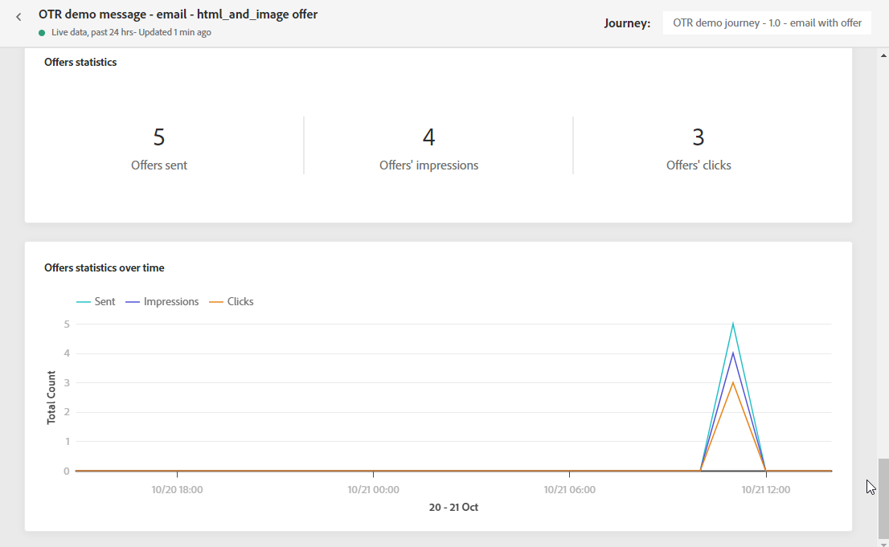

# 이메일 라이브 보고서 {#email-live-report}

이메일 **[!UICONTROL Live report]** 특정 이메일 게재만 타겟팅합니다.

에서 **[!UICONTROL Executions]** 의 탭 **[!UICONTROL Messages]** 메뉴, 선택 **[!UICONTROL Live view]** 그런 다음 선택한 게재의 고급 메뉴에서 을(를) 선택합니다 **[!UICONTROL Live report]**.

이메일 **[!UICONTROL Live report]** 은 게재의 성공 및 오류를 설명하는 다른 위젯으로 구분됩니다. 필요한 경우 각 위젯의 크기를 조정하고 삭제할 수 있습니다. 자세한 정보는 다음을 참조하십시오 [섹션](live-report.md#modify-dashboard).

**[!UICONTROL Email performance]** 및 **[!UICONTROL Email summary]** 위젯은 그래프 및 KPI를 사용하여 메시지에 대한 기본 정보를 자세히 설명합니다.

* **[!UICONTROL Targeted]**: 이 게재의 타겟 프로필로 자격을 얻은 사용자 프로필 수입니다.

* **[!UICONTROL Sent]**: 게재에 대한 총 전송 수입니다.

* **[!UICONTROL Delivered]**: 보낸 총 메시지 수와 관련하여 성공적으로 보낸 메시지 수입니다.

* **[!UICONTROL Opens]**: 게재에서 메시지를 연 횟수입니다.

* **[!UICONTROL Clicks]**: 게재에서 콘텐츠를 클릭한 횟수입니다.

* **[!UICONTROL Bounces]**: 총 보낸 메시지 수와 관련하여 게재 및 자동 반환 처리 중에 누적된 총 오류 수입니다.

* **[!UICONTROL Errors]**: 게재 중에 발생한 총 오류로 인해 프로필이 전송되지 않았습니다.

* **[!UICONTROL Spam complaints]**: 스팸으로 분류된 메시지 수입니다.

* **[!UICONTROL Unsubscriptions]**: 구독 취소 링크에 대한 클릭 수입니다.

* **[!UICONTROL Excluded]**: 타겟팅된 프로필에서 제외되고 메시지를 받지 못한 사용자 프로필 수입니다.

다음 **[!UICONTROL Sending Statistics]** 위젯은 게재의 성공을 세부적으로 설명합니다.

* **[!UICONTROL Delivered]**: 보낸 총 메시지 수와 관련하여 성공적으로 보낸 메시지 수입니다.

* **[!UICONTROL Bounces]**: 총 보낸 메시지 수와 관련하여 게재 및 자동 반환 처리 중에 누적된 총 오류 수입니다.

* **[!UICONTROL Errors]**: 게재 중에 발생한 총 오류로 인해 프로필이 전송되지 않았습니다.

다음 **[!UICONTROL Error Reasons]** 그래프 및 표를 사용하면 게재 중에 발생한 오류를 확인할 수 있습니다.

다음 **[!UICONTROL Bounce Reasons]** 및 **[!UICONTROL Bounce categories]** 위젯에는 다음과 같이 바운스된 메시지와 관련하여 사용할 수 있는 데이터가 포함되어 있습니다.

* **[!UICONTROL Hard bounce]**: 잘못된 이메일 주소와 같은 총 영구 오류 수입니다. 여기에는 알 수 없는 사용자와 같이 주소가 유효하지 않다는 오류 메시지가 명시적으로 표시됩니다.

* **[!UICONTROL Soft bounce]**: 전체 받은 편지함과 같은 총 임시 오류 수입니다.

* **[!UICONTROL Ignored]**: 부재 중 또는 기술 오류(예: 발신자 유형이 postmaster인 경우)와 같은 총 임시 수입니다.

<!--

>[!NOTE]
>
>The Offers widgets and metrics are only available if a decision was inserted in an email. For more information on Decision Management, refer to this [page](../offers/get-started/starting-offer-decisioning.md).

The **[!UICONTROL Offers statistic]** and **[!UICONTROL Offers statistics]** over time widgets measure your offer's success and impact on your targeted audience. It detail the main information relative to your message with KPIs:

* **[!UICONTROL Offer sent]**: Total number of sends for the offer.

* **[!UICONTROL Offer impression]**: Number of times the offer was opened in a delivery.

* **[!UICONTROL Offer clicks]**: Number of times an offer was clicked on in a delivery.
-->
>[!NOTE]
>
>다음 포함 **[!UICONTROL Suppressed]** 또는 **[!UICONTROL Not allowed]** 상태는 메시지 전송 프로세스 중에 제외됩니다. 따라서 **여정 보고서** 은(는) 이러한 프로필을 여정을 통해 이동했음을 나타냅니다([세그먼트 읽기](../building-journeys/read-segment.md) 및 [메시지](../building-journeys/journeys-message.md) 활동), **이메일 보고서** 에는 이러한 매개 변수가 포함되지 않습니다. **[!UICONTROL Sent]** 지표는 이메일 전송 전에 필터링됩니다.
>
>추가 정보 [제외 목록](../suppression-list.md) 및 [허용 목록](../allow-list.md). 모든 제외 사례에 대한 이유를 알아보려면 [Adobe Experience Platform 쿼리 서비스](https://experienceleague.adobe.com/docs/experience-platform/query/api/getting-started.html){target=&quot;_blank&quot;}.
