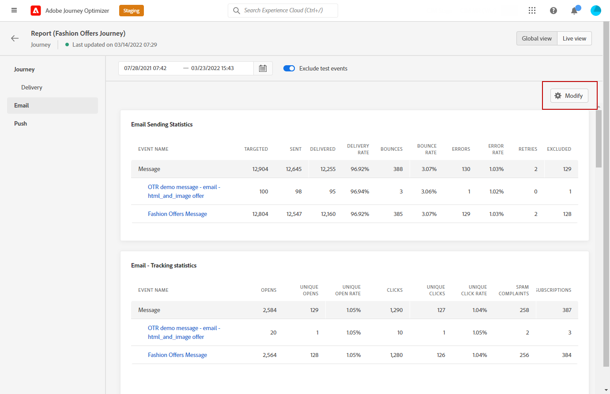
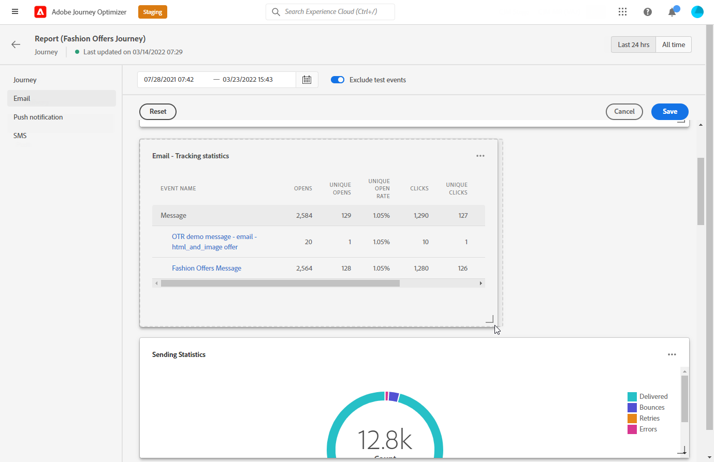

# 글로벌 보고서 시작 {#global-report}

>[!NOTE]
>
> 쿼리 서비스를 사용할 때 API를 통해 사용자 지정 쿼리가 만들어지는 경우 보고서에 약간의 지연이 있을 것으로 예상하십시오.

사용 **[!UICONTROL 글로벌 보고서]** 을 사용하여 선택한 기간 동안 여정 및 게재의 영향을 측정합니다.

* 여정 컨텍스트에서 여정 또는 게재를 타겟팅하려면 **[!UICONTROL 여정]** 메뉴에서 여정에 액세스하고 **[!UICONTROL 보고서 보기]** 단추를 클릭합니다. 그런 다음 여정, 이메일, SMS 및 푸시 글로벌 보고서를 찾을 수 있습니다.

  

* 캠페인을 타깃팅하려면 **[!UICONTROL 캠페인]** 메뉴에서 캠페인에 액세스하고 **[!UICONTROL 보고서]** 단추를 클릭합니다.

  

* 에서 전환하려면 다음을 수행하십시오. **[!UICONTROL 라이브 보고서]** (으)로 **[!UICONTROL 글로벌 보고서]** 게재를 위해 **[!UICONTROL 모든 시간]** ( 탭 전환기에서)

  

Adobe Journey Optimizer에서 사용할 수 있는 모든 지표의 자세한 목록은 을 참조하십시오. [이 페이지](#list-of-components-global)

## 대시보드 맞춤화 {#modify-dashboard}

기간을 변경하고 위젯의 크기를 조정하거나 제거하여 각 보고 대시보드를 수정할 수 있습니다. 위젯을 변경하는 것은 현재 사용자의 대시보드에만 영향을 줍니다. 다른 사용자는 자신의 대시보드 또는 기본적으로 설정된 대시보드를 볼 수 있습니다.

1. 글로벌 보고서에서 특정 데이터를 타겟팅할 시작 및 종료 시간을 선택합니다.

   

1. 여러 개의 구성이 포함된 여정 보고서의 경우 **[!UICONTROL 작업]**, 특정 선택 **[!UICONTROL 작업]** 드롭다운 메뉴에서 을(를) 선택합니다.

1. 하나 또는 여러 개의 반복 메시지만 타겟팅하려면 **[!UICONTROL 실행 시간]** 드롭다운.

   

1. 토글 막대를 사용하여 보고서에서 테스트 이벤트를 제외하려면 선택합니다. 테스트 이벤트에 대한 자세한 내용은 다음을 참조하십시오. [이 페이지](../building-journeys/testing-the-journey.md).

   다음 사항에 주의하십시오. **[!UICONTROL 테스트 이벤트 제외]** 옵션은 여정 보고서에만 사용할 수 있습니다.

   

1. 클릭 **[!UICONTROL 수정]** 을 클릭하여 대시보드 맞춤화를 시작할 수 있습니다.

   

1. 오른쪽 아래 모서리를 끌어 위젯 크기를 조정합니다.

   

1. 클릭 **[!UICONTROL 제거]** 필요하지 않은 위젯을 제거합니다.

   

1. 표시 순서 및 위젯 크기에 만족하면 을 클릭합니다. **[!UICONTROL 저장]**.

1. 데이터 표시 방식을 사용자 정의하기 위해 그래프, 표, 도넛 차트 등 다양한 시각화 옵션에서 전환할 수 있습니다.

   

이제 대시보드가 저장되었습니다. 다른 변경 사항은 나중에 라이브 보고서를 사용할 수 있도록 다시 적용됩니다. 필요한 경우 **[!UICONTROL 재설정]** 기본 위젯 및 위젯의 순서를 복원하는 옵션입니다.

## 보고서 내보내기 {#export-reports}

서로 다른 보고서를 PDF 또는 CSV 형식으로 쉽게 내보내 공유하거나 인쇄할 수 있습니다. 보고서를 내보내는 단계는 아래 탭에 자세히 설명되어 있습니다.

➡️ [비디오에서 이 기능 살펴보기](#video-csv)

>[!BEGINTABS]

>[!TAB 보고서를 CSV 파일로 내보내기]

1. 보고서에서 **[!UICONTROL 내보내기]** 및 선택 **[!UICONTROL CSV 파일]** 전체 보고서 수준에서 CSV 파일을 생성합니다.

   

1. 특정 위젯에서 데이터를 내보내도록 선택할 수도 있습니다. 클릭 **[!UICONTROL 위젯 데이터를 CSV로 내보내기]** 선택한 위젯 옆에 있습니다.

   

1. 파일은 자동으로 다운로드되며 로컬 파일에서 찾을 수 있습니다.

   보고서 수준에서 파일을 생성한 경우, 여기에는 제목 및 데이터를 포함하여 각 위젯에 대한 자세한 정보가 포함됩니다.

   위젯 수준에서 파일을 생성한 경우 선택한 위젯에 대한 데이터가 특별히 제공됩니다.

>[!TAB 보고서를 PDF 파일로 내보내기]

1. 보고서에서 **[!UICONTROL 내보내기]** 및 선택 **[!UICONTROL PDF 파일]**.

   

1. 인쇄 창에서 필요에 따라 문서를 구성합니다. 선택 사항은 브라우저에 따라 다를 수 있습니다.

1. 보고서를 PDF으로 인쇄 또는 저장하도록 선택합니다.

1. 파일을 저장할 폴더를 찾아 필요한 경우 이름을 변경한 다음 [저장]을 클릭합니다.

이제 PDF 파일에서 보고서를 보거나 공유할 수 있습니다.

>[!ENDTABS]

### 보고서 내보내기(비디오) {#video-csv}

다음 방법 비디오에서 보고서 및 단일 위젯에 대한 CSV 보고서를 다운로드하는 방법을 알아봅니다.

>[!VIDEO](https://video.tv.adobe.com/v/3424603?quality=12)

