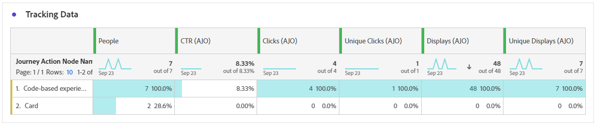

# 콘텐츠 카드 여정 보고서 {#journey-global-report}

>[!BEGINSHADEBOX]

여정 내의 **[!UICONTROL 보고서 보기]** 단추를 클릭하여 콘텐츠 카드 여정 보고서에 액세스할 수 있습니다. [자세히 알아보기](report-gs-cja.md)

>[!ENDSHADEBOX]

## 표시 및 클릭 {#displays-content-card}

**[!UICONTROL 표시 및 클릭]** 그래프는 프로필과 콘텐츠 카드의 참여를 자세히 분석하여 프로필이 콘텐츠와 상호 작용하는 방법에 대한 중요한 통찰력을 제공합니다.

+++ 디스플레이 및 클릭 지표에 대해 자세히 알아보기

* **[!UICONTROL 고유 클릭 수]**: 콘텐츠 카드의 콘텐츠를 클릭한 프로필 수입니다.

* **[!UICONTROL 클릭 수]**: 콘텐츠 카드에서 콘텐츠를 클릭한 횟수입니다.

* **[!UICONTROL 디스플레이]**: 콘텐츠 카드를 연 횟수입니다.

* **[!UICONTROL 고유 디스플레이]**: 콘텐츠 카드를 연 횟수입니다. 한 프로필의 여러 상호 작용을 고려하지 않습니다.

+++

## 추적 데이터 {#track-data-content}

**[!UICONTROL 추적 데이터]** 테이블은 콘텐츠 카드에 연결된 프로필 활동에 대한 자세한 스냅숏을 제공하여 참여 및 경험 효과에 대한 중요한 통찰력을 제공합니다.

+++ 데이터 지표 추적에 대해 자세히 알아보기

* **[!UICONTROL 사람]**: 콘텐츠 카드의 대상 프로필로 적합한 사용자 프로필 수입니다.

* **[!UICONTROL 클릭스루 비율(CTR)]**: 콘텐츠 카드와 상호 작용한 사용자의 비율입니다.

* **[!UICONTROL 클릭 수]**: 콘텐츠 카드에서 콘텐츠를 클릭한 횟수입니다.

* **[!UICONTROL 고유 클릭 수]**: 콘텐츠 카드의 콘텐츠를 클릭한 프로필 수입니다.

* **[!UICONTROL 디스플레이]**: 콘텐츠 카드를 연 횟수입니다.

* **[!UICONTROL 고유 디스플레이]**: 콘텐츠 카드를 연 횟수입니다. 한 프로필의 여러 상호 작용을 고려하지 않습니다.

+++

## 추적된 링크 레이블 {#track-link-content}

**[!UICONTROL 추적된 링크 레이블]** 테이블은 가장 높은 방문자 트래픽을 생성하는 링크 레이블을 강조 표시하여 콘텐츠 카드 내의 링크 레이블에 대한 포괄적인 개요를 제공합니다. 이 기능을 사용하면 가장 인기 있는 링크를 식별하고 우선 순위를 지정할 수 있습니다.

+++ 추적된 링크 레이블 지표에 대해 자세히 알아보기

* **[!UICONTROL 고유 클릭 수]**: 콘텐츠 카드의 콘텐츠를 클릭한 프로필 수입니다.

* **[!UICONTROL 클릭 수]**: 콘텐츠 카드에서 콘텐츠를 클릭한 횟수입니다.

* **[!UICONTROL 디스플레이]**: 콘텐츠 카드를 연 횟수입니다.

* **[!UICONTROL 고유 디스플레이]**: 콘텐츠 카드를 연 횟수입니다. 한 프로필의 여러 상호 작용을 고려하지 않습니다.

+++
