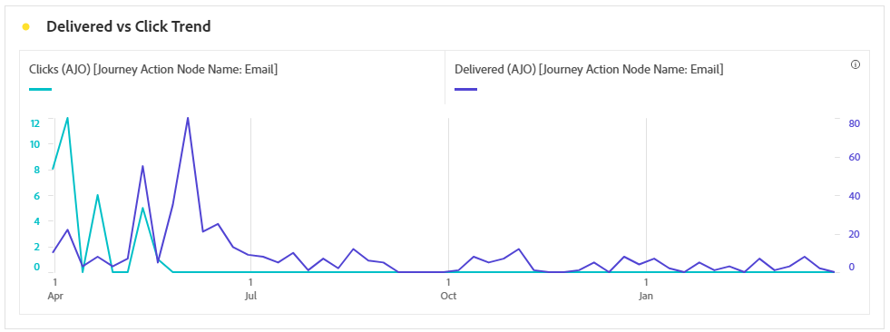
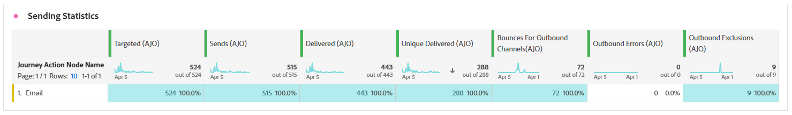

# 이메일 여정 보고서 {#journey-global-report}

>[!INFO]
>
>Apple에서 메일 개인 정보 보호 기능을 포함하여 기본 메일 앱에 새로운 개인 정보 보호 기능을 도입했기 때문에, 발신자는 더 이상 Apple의 메일 개인 정보 보호를 사용하도록 설정한 프로필의 데이터를 수집하기 위해 추적 픽셀을 사용할 수 없습니다. 따라서 추적 픽셀을 사용하여 이메일 열기를 추적하는 Adobe Journey Optimizer 기능에 영향을 줄 수 있습니다.
> [Apple iOS 개인 정보 보호 변경이 이메일 마케팅에 미치는 영향에 대해 자세히 알아보세요](https://experienceleaguecommunities.adobe.com/t5/adobe-campaign-classic-blogs/the-impact-of-apple-ios-privacy-changes-on-email-marketing-and/ba-p/699780?profile.language=ko).
> 
> 보다 정확한 통찰력을 위해 오픈율 대신 클릭 및 전환 지표에 집중하는 것이 좋습니다.

>[!BEGINSHADEBOX]

여정 내의 **[!UICONTROL 보고서 보기]** 단추를 클릭하여 전자 메일 여정 보고서에 액세스할 수 있습니다. [자세히 알아보기](report-gs-cja.md)

>[!ENDSHADEBOX]

## 게재됨 및 클릭 트렌드 {#delivered-click}

**[!UICONTROL 게재됨 및 클릭 트렌드]** 그래프는 프로필과 전자 메일의 참여를 자세히 분석하여 다양한 도메인이 콘텐츠와 상호 작용하는 방법에 대한 중요한 통찰력을 제공합니다.

+++ 게재됨 및 클릭 트렌드 지표에 대해 자세히 알아보기

* **[!UICONTROL 배달됨]**: 보낸 총 전자 메일 수와 관련하여 보낸 전자 메일 수입니다.

* **[!UICONTROL 클릭 수]**: 전자 메일에서 콘텐츠를 클릭한 횟수입니다.

+++

## 게재 상태 {#delivery-status}

**[!UICONTROL 게재 상태]** 그래프를 통해 전자 메일의 성능을 한눈에 확인할 수 있습니다. 게재 및 바운스와 같은 주요 지표를 추적하여 이메일 여정의 효율성을 빠르게 이해할 수 있습니다.

+++ 게재 상태 지표에 대해 자세히 알아보기

* **[!UICONTROL 배달됨]**: 보낸 총 전자 메일 수와 관련하여 보낸 전자 메일 수입니다.

* **[!UICONTROL 아웃바운드 채널에 대한 바운스 수]**: 전송 프로세스 및 보낸 총 메시지 수와 관련된 자동 반환 처리 중에 누적된 총 오류 수입니다.

* **[!UICONTROL 아웃바운드 오류]**: 보내는 동안 프로필로 보낼 수 없는 총 오류 수입니다.

* **[!UICONTROL 제외됨]**: Adobe Journey Optimizer에서 제외된 프로필 수입니다.

+++

## 전송 통계 {#email-sending-statistics}

**[!UICONTROL 전송 통계]** 표에는 여정 내에서 전자 메일이 수행되는 방식에 대한 명확한 보기가 제공됩니다. 게재 비율 및 상호 작용과 같은 주요 지표를 추적하여 이메일 전략을 최적화하여 도달 범위와 참여를 개선할 수 있는 귀중한 통찰력을 제공합니다.

+++ 전송 통계 지표에 대해 자세히 알아보기

* **[!UICONTROL 타깃팅]**: 전송 프로세스 중에 처리된 총 전자 메일 수입니다.

* **[!UICONTROL 전송]**: 전자 메일의 총 전송 수입니다.

* **[!UICONTROL 배달됨]**: 보낸 총 메시지 수와 관련하여 보낸 전자 메일 수입니다.

* **[!UICONTROL 고유 배달됨]**: 하나 이상의 전자 메일을 성공적으로 받은 프로필 수입니다.

* **[!UICONTROL 아웃바운드 채널에 대한 바운스 수]**: 전송 프로세스 및 보낸 총 메시지 수와 관련된 자동 반환 처리 중에 누적된 총 오류 수입니다.

* **[!UICONTROL 아웃바운드 오류]**: 보내는 동안 프로필로 보낼 수 없는 총 오류 수입니다.

* **[!UICONTROL 아웃바운드 제외]**: Adobe Journey Optimizer에서 제외된 프로필 수입니다.

+++

## 이메일 - 추적 통계 {#email-tracking}

**[!UICONTROL 전자 메일 - 추적 통계]** 표에는 여정에 포함된 전자 메일과 관련된 프로필 활동에 대한 자세한 계정이 있습니다. 여기에는 열람, 클릭 수 및 기타 관련 참여 지표에 대한 지표가 포함되며 프로필이 이메일 콘텐츠와 상호 작용하는 방식에 대한 포괄적인 보기를 제공합니다.

+++ 추적 통계 지표에 대해 자세히 알아보기

* **[!UICONTROL 클릭스루 비율(CTR)]**: 전자 메일과 상호 작용한 사용자의 비율입니다.

* **[!UICONTROL 클릭스루 열람율(CTOR)]**: 이메일을 연 횟수입니다.

* **[!UICONTROL 클릭 수]**: 전자 메일에서 콘텐츠를 클릭한 횟수입니다.

* **[!UICONTROL 고유 클릭 수]**: 전자 메일의 콘텐츠를 클릭한 프로필 수입니다.

* **[!UICONTROL 전자 메일 열림]**: 캠페인에서 전자 메일을 연 횟수입니다.

* **[!UICONTROL 고유 전자 메일 열림]**: 전자 메일을 연 프로필 수입니다.

* **[!UICONTROL 스팸 고객 불만]**: 메시지가 스팸 또는 정크로 선언된 횟수입니다.

* **[!UICONTROL 구독 취소]**: 구독 취소 링크의 클릭 수입니다.

* **[!UICONTROL 고유 이메일 구독 취소]**: 이메일 구독을 취소한 프로필 수입니다.
+++

## 이메일 도메인 {#email-domains}

**[!UICONTROL 전자 메일 여정]** 표에는 도메인별로 분류된 전자 메일에 대한 자세한 분류가 있으므로 전자 메일 도메인의 성능 지표에 대한 광범위한 통찰력을 제공합니다. 이 포괄적인 분석을 통해 이메일 콘텐츠에 대한 응답으로 다양한 도메인의 동작을 이해할 수 있습니다.

+++ 이메일 도메인 지표에 대해 자세히 알아보기

* **[!UICONTROL 전송]**: 전자 메일의 총 전송 수입니다.

* **[!UICONTROL 배달됨]**: 보낸 총 전자 메일 수와 관련하여 보낸 전자 메일 수입니다.

* **[!UICONTROL 전자 메일 열림]**: 여정에서 전자 메일을 연 횟수입니다.

* **[!UICONTROL 클릭 수]**: 전자 메일에서 콘텐츠를 클릭한 횟수입니다.

* **[!UICONTROL 아웃바운드 채널에 대한 바운스 수]**: 보낸 전자 메일의 총 수와 관련하여 전송 프로세스 및 자동 반환 처리 중에 누적된 총 오류 수입니다.

* **[!UICONTROL 아웃바운드 오류]**: 보내는 동안 프로필로 보낼 수 없는 총 오류 수입니다.

* **[!UICONTROL 아웃바운드 제외]**: Adobe Journey Optimizer에서 제외된 프로필 수입니다.

+++

## 추적된 링크 레이블 {#track-link-label}

**[!UICONTROL 추적된 링크 레이블]** 테이블은 이메일 내의 링크 레이블에 대한 포괄적인 개요를 제공하며 가장 높은 방문자 트래픽을 생성하는 레이블을 강조 표시합니다. 이 기능을 사용하면 가장 인기 있는 링크를 식별하고 우선 순위를 지정할 수 있습니다.

+++ 추적된 링크 레이블 지표에 대해 자세히 알아보기

* **[!UICONTROL 고유 클릭 수]**: 전자 메일의 콘텐츠를 클릭한 프로필 수입니다.

* **[!UICONTROL 클릭 수]**: 전자 메일에서 콘텐츠를 클릭한 횟수입니다.

+++

## 추적된 링크 URL {#track-link-url}

**[!UICONTROL 추적된 링크 URL]** 테이블은 가장 높은 방문자 트래픽을 유도하는 전자 메일 내의 URL에 대한 포괄적인 개요를 제공합니다. 이를 통해 가장 인기 있는 링크를 식별하고 우선 순위를 지정할 수 있으므로 이메일의 특정 콘텐츠와 함께 프로필 참여를 보다 잘 이해할 수 있습니다.

+++ 추적된 링크 URL 지표에 대해 자세히 알아보기

* **[!UICONTROL 고유 클릭 수]**: 전자 메일의 콘텐츠를 클릭한 프로필 수입니다.

* **[!UICONTROL 클릭 수]**: 전자 메일에서 콘텐츠를 클릭한 횟수입니다.

+++

## 이메일 제목 {#email-subject}

**[!UICONTROL 전자 메일 제목]** 표에는 가장 높은 방문자 트래픽을 가져온 전자 메일 제목에 대한 전체 개요가 나와 있습니다. 이 리소스는 대상 참여 역학에 대한 중요한 통찰력을 제공합니다.

+++ 이메일 주제 지표에 대해 자세히 알아보기

* **[!UICONTROL 배달됨]**: 보낸 총 전자 메일 수와 관련하여 보낸 전자 메일 수입니다.

* **[!UICONTROL 고유 배달됨]**: 중복이 계산되지 않도록 하기 위해 하나 이상의 전자 메일을 성공적으로 받은 고유 프로필 수입니다.
+++

## 바운스 이유 {#email-bounce-reasons}

**[!UICONTROL 반송 이유]** 테이블은 반송된 메시지와 관련된 사용 가능한 데이터를 컴파일하여 이메일 반송 이면의 특정 이유에 대한 자세한 인사이트를 제공합니다.

바운스에 대한 자세한 내용은 [제외 목록](../reports/suppression-list.md) 페이지를 참조하세요.

## 제외된 이유 {#email-excluded}

**[!UICONTROL 제외된 이유]** 표에는 대상 대상에서 사용자 프로필을 제외하여 메시지가 수신되지 않는 다양한 요인에 대한 포괄적인 보기가 표시됩니다.

포괄적인 제외 이유 목록은 [이 페이지](exclusion-list.md)를 참조하세요.

## 오류 원인 {#email-errors}

**[!UICONTROL 오류 원인]** 표는 전송 프로세스 중에 발생한 특정 오류에 대한 가시성을 제공하여 오류의 특성 및 발생에 대한 중요한 정보를 제공합니다.
