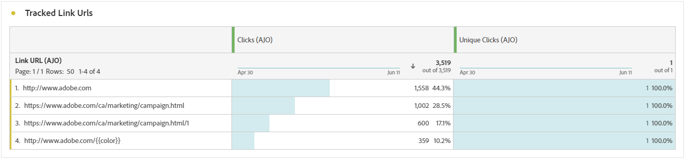

# 여정 보고서 {#journey-global-report}

다음 **여정 보고서** 는 모든 요소를 포함하는 대시보드로서 작동하여 여정과 관련된 필수 지표에 대한 분석을 제공합니다. 여기에는 입력된 프로필 수 및 실패한 개별 여정의 인스턴스 등 세부 정보가 포함되며, 이를 통해 여정의 효율성과 참여 수준에 대한 포괄적인 통찰력을 제공합니다.

**여정 보고서** 을(를) 사용하여 여정에서 직접 액세스할 수 있습니다. **[!UICONTROL 보고서 보기]** 단추를 클릭합니다.

다음 **[!UICONTROL 여정 보고서]** 여정의 메시지 활동에 따라 다음과 같은 탭이 표시됩니다.

* [여정](#journey-global)
* [이메일](#email-global)
* [푸시](#push-global)
* [SMS](#sms-global)
* [인앱](#in-app-global)
* [웹](#web-cja)
* [다이렉트 메일](#direct-mail-cja)

Workspace Customer Journey Analytics 및 데이터를 필터링하고 분석하는 방법에 대한 자세한 내용은 을 참조하십시오. [이 페이지](https://experienceleague.adobe.com/en/docs/analytics-platform/using/cja-workspace/home).

## 여정 개요 {#journey-global}

다음 **[!UICONTROL 여정]** 보고서는 여정에 대해 가장 중요한 추적 데이터를 명확하게 볼 수 있도록 합니다.

### 여정 KPI {#journey-perfomance}

다음 **[!UICONTROL 여정]** 주요 성과 지표(KPI)는 모든 것을 아우르는 대시보드로 작동하여 여정과 관련된 필수 지표에 대한 분석을 제공합니다. 여기에는 입력된 프로필 수 및 실패한 개별 여정 인스턴스 등의 세부 정보가 포함되며, 이를 통해 여정의 효율성 및 참여 수준에 대한 포괄적인 통찰력을 제공합니다.

+++ 여정 KPI 지표에 대해 자세히 알아보기

* **[!UICONTROL 여정 참여]**: 여정에서 보낸 메시지와 상호 작용한 총 개인 수

* **[!UICONTROL 여정 입력]**: 여정의 시작 이벤트에 도달한 총 개인 수입니다.

* **[!UICONTROL 여정 종료]**: 여정을 종료한 총 개인 수

* **[!UICONTROL 여정 실패]**: 성공적으로 실행되지 않은 총 개별 여정 수입니다.

+++

### 여정 통계 {#journey-stats}

다음 **[!UICONTROL 여정 통계]** 표는 여정에 대한 중요한 데이터에 대한 자세한 요약을 제공합니다. 여기에는 실패 및 성공 항목 수와 같은 주요 지표가 포함되어 있어 이메일과 여정의 성능과 도달에 대한 중요한 통찰력을 제공합니다.

+++ 여정 통계 지표에 대해 자세히 알아보기

* **[!UICONTROL 여정 참여]**: 여정에서 보낸 메시지와 상호 작용한 총 개인 수

* **[!UICONTROL 여정 입력]**: 여정의 시작 이벤트에 도달한 총 개인 수입니다.

* **[!UICONTROL 여정 종료]**: 여정을 종료한 총 개인 수

* **[!UICONTROL 여정 실패]**: 성공적으로 실행되지 않은 총 개별 여정 수입니다.

* **[!UICONTROL 고유 여정 입력]**: 여정의 시작 이벤트에 도달한 개인 총 수, 한 프로필의 여러 상호 작용을 고려하지 않습니다.

* **[!UICONTROL 고유 여정 종료]**: 프로필을 종료한 총 개인 수, 한 여정의 여러 상호 작용을 고려하지 않습니다.

* **[!UICONTROL 고유 여정 실패]**: 성공적으로 실행되지 않은 총 개별 여정 수입니다. 한 프로필의 여러 상호 작용을 고려하지 않습니다.

+++

## 여정 캔버스 {#journey-canvas}

다음 **[!UICONTROL 여정 캔버스]** 위젯을 사용하면 타겟팅된 프로필이 여정을 탐색할 때의 궤적을 시각적으로 추적할 수 있습니다.

다음 옵션을 사용하여 캔버스 사용자 지정을 개선합니다.

* 에서 메시지 또는 조건과 같은 원하는 활동 유형을 추가하거나 제거합니다. **[!UICONTROL 노드 유형]** 드롭다운 메뉴.
* 조정 **[!UICONTROL 백분율 값]** 다른 여정 경로 간의 플로우 분포를 확인합니다.
* 사용자 정의 **[!UICONTROL 화살표 설정]** 레이블, 조건을 포함하거나 깨끗한 표시를 선택합니다.
* 활성화 **[!UICONTROL 폴아웃 표시]** 캔버스에서 직접 여정을 종료한 프로필을 시각화하는 옵션.

## 액션 성능 {#action-performance}

### 시간에 따른 성능 {#action-overtime}

다음 **[!UICONTROL 시간 경과에 따른 성능]** 그래프를 통해 작업 대상 프로필로 간주되는 기준을 충족하는 프로필 수를 식별하고 분석할 수 있습니다. 이 시각화는 전략의 효과에 대한 중요한 통찰력을 제공하고 성능을 최적화하기 위해 데이터 기반의 결정을 내리는 데 도움이 됩니다.

### 작업 개요 {#action-overview}

다음 **[!UICONTROL 작업 개요]** 표는 포괄적인 대시보드 역할을 하며, 여정의 작업과 관련된 주요 지표의 분석을 제공합니다. 여기에는 상호 작용 횟수 및 클릭스루 비율 등 중요한 세부 정보가 포함됩니다

+++ 작업 개요 지표에 대해 자세히 알아보기

* **[!UICONTROL 사람]**: 작업에 대한 타겟 프로필로 적합한 사용자 프로필 수입니다.

* **[!UICONTROL 클릭률]**: 작업과 상호 작용한 사용자의 비율입니다.

* **[!UICONTROL 클릭수]**: 작업에서 콘텐츠를 클릭한 횟수입니다.

* **[!UICONTROL 전달됨]**: 전송된 총 작업 수와 관련하여 성공적으로 전송된 작업 수입니다.

+++

## 이벤트 성능 {#events-performance}

### 시간에 따른 성능 {#event-overtime}

다음 **[!UICONTROL 시간에 따른 성능]** 그래프를 사용하면 이벤트에 대한 대상 프로필로 적합한 프로필 수를 식별하고 분석할 수 있습니다. 이 강력한 도구는 시간 경과에 따른 트렌드 및 패턴을 추적하는 데 도움이 되며 이벤트 전략을 최적화하는 데 유용한 통찰력을 제공합니다.

### 이벤트 개요 {#event-overview}

다음 **[!UICONTROL 이벤트 개요]** 시간 경과에 따라 이벤트 기준을 충족하는 프로필의 수를 보여 주는 표입니다. 이 도구를 사용하면 자격률의 패턴을 식별하여 이벤트 전략을 구체화할 수 있습니다.

+++ 여정 통계 지표에 대해 자세히 알아보기

* **[!UICONTROL 사람]**: 이벤트에 대한 타겟 프로필로 적합한 사용자 프로필 수입니다.

+++

## 이메일 세부 정보 {#email-global}

여정 보고서에서 **[!UICONTROL 이메일]** 탭은 여정에 전송된 이메일과 관련된 기본 정보를 자세히 설명합니다.

### 게재됨 및 클릭 트렌드 {#delivered-click}

다음 **[!UICONTROL 게재됨 및 클릭 트렌드]** 그래프는 프로필과 이메일의 참여를 자세히 분석하여 다양한 도메인이 콘텐츠와 상호 작용하는 방법에 대한 중요한 통찰력을 제공합니다.

+++ 게재됨 및 클릭 트렌드 지표에 대해 자세히 알아보기

* **[!UICONTROL 전달됨]**: 전송된 총 이메일 수와 관련하여 성공적으로 전송된 이메일 수입니다.

* **[!UICONTROL 클릭수]**: 이메일에서 콘텐츠를 클릭한 횟수입니다.

+++

### 게재 상태 {#delivery-status}

다음 **[!UICONTROL 게재 상태]** 그래프를 통해 이메일이 어떻게 작동하는지 한눈에 확인할 수 있습니다. 게재 및 바운스와 같은 주요 지표를 추적하여 이메일 여정의 효율성을 빠르게 이해할 수 있습니다.

+++ 게재 상태 지표에 대해 자세히 알아보기

* **[!UICONTROL 전달됨]**: 전송된 총 이메일 수와 관련하여 성공적으로 전송된 이메일 수입니다.

* **[!UICONTROL 아웃바운드 채널에 대한 바운스]**: 전송 프로세스 및 자동 반환 처리 중에 누적된 총 보낸 메시지 수와 관련된 오류의 수입니다.

* **[!UICONTROL 아웃바운드 오류]**: 전송 프로세스 중에 발생하여 프로필로 전송되지 않은 총 오류 수입니다.

* **[!UICONTROL 제외됨]**: Adobe Journey Optimizer에서 제외된 프로필 수입니다.

+++

### 전송 통계 {#email-sending-statistics}

다음 **[!UICONTROL 전송 통계]** 표는 여정 내에서 이메일이 수행되는 방식에 대한 명확한 보기를 제공합니다. 게재 비율 및 상호 작용과 같은 주요 지표를 추적하여 이메일 전략을 최적화하여 도달 범위와 참여를 개선할 수 있는 귀중한 통찰력을 제공합니다.

+++ 전송 통계 지표에 대해 자세히 알아보기

* **[!UICONTROL 사람]**: 메시지의 타겟 프로필로 적합한 사용자 프로필 수입니다.

* **[!UICONTROL 타깃팅됨]**: 전송 프로세스 중에 처리된 총 이메일 수입니다.

* **[!UICONTROL 전송 횟수]**: 이메일의 총 전송 수입니다.

* **[!UICONTROL 전달됨]**: 보낸 총 메시지 수와 관련하여 성공적으로 전송된 이메일 수입니다.

* **[!UICONTROL 바운스]**: 전송 프로세스 및 자동 반환 처리 중에 누적된 총 보낸 메시지 수와 관련된 오류의 수입니다.

* **[!UICONTROL 아웃바운드 오류]**: 전송 프로세스 중에 발생하여 프로필로 전송되지 않은 총 오류 수입니다.

* **[!UICONTROL 아웃바운드 제외]**: Adobe Journey Optimizer에서 제외된 프로필 수입니다.

+++

### 이메일 - 추적 통계 {#email-tracking}

다음 **[!UICONTROL 이메일 - 추적 통계]** 표는 여정에 포함된 이메일과 관련된 프로필 활동에 대한 자세한 계정을 제공합니다. 여기에는 열람, 클릭 수 및 기타 관련 참여 지표에 대한 지표가 포함되며 프로필이 이메일 콘텐츠와 상호 작용하는 방식에 대한 포괄적인 보기를 제공합니다.

+++ 추적 통계 지표에 대해 자세히 알아보기

* **[!UICONTROL 클릭스루 비율(CTR)]**: 이메일과 상호 작용한 사용자의 비율입니다.

* **[!UICONTROL 클릭스루 열람율(CTOR)]**: 이메일을 연 횟수입니다.

* **[!UICONTROL 클릭수]**: 이메일에서 콘텐츠를 클릭한 횟수입니다.

* **[!UICONTROL 고유 클릭수]**: 이메일에서 콘텐츠를 클릭한 프로필 수입니다.

* **[!UICONTROL 이메일 열람수]**: 여정에서 이메일을 연 횟수입니다.

* **[!UICONTROL 고유 이메일 열람수]**: 열린 이메일의 비율입니다.

* **[!UICONTROL 스팸 고객 불만]**: 메시지가 스팸 또는 정크로 선언된 횟수입니다.

* **[!UICONTROL 구독 취소]**: 구독 취소 링크의 클릭 수입니다.

+++

### 이메일 도메인 {#email-domains}

다음 **[!UICONTROL 이메일 도메인]** 표는 도메인별로 분류된 이메일에 대한 심층적인 분류를 제공하여 이메일 여정의 성능 지표에 대한 광범위한 통찰력을 제공합니다. 이 포괄적인 분석을 통해 이메일 콘텐츠에 대한 응답으로 다양한 도메인의 동작을 이해할 수 있습니다.

+++ 이메일 도메인 지표에 대해 자세히 알아보기

* **[!UICONTROL 전송 횟수]**: 이메일의 총 전송 수입니다.

* **[!UICONTROL 전달됨]**: 전송된 총 이메일 수와 관련하여 성공적으로 전송된 이메일 수입니다.

* **[!UICONTROL 이메일 열람수]**: 여정에서 이메일을 연 횟수입니다.

* **[!UICONTROL 클릭수]**: 이메일에서 콘텐츠를 클릭한 횟수입니다.

* **[!UICONTROL 아웃바운드 채널에 대한 바운스]**: 전송 프로세스 및 자동 반환 처리 중에 누적된 총 오류 수(전송된 이메일 수와 관련)입니다.

* **[!UICONTROL 아웃바운드 오류]**: 전송 프로세스 중에 발생하여 프로필로 전송되지 않은 총 오류 수입니다.
+++

### 추적된 링크 레이블 {#track-link-label}

다음 **[!UICONTROL 추적된 링크 레이블]** 표는 이메일 내의 링크 레이블에 대한 포괄적인 개요를 제공하며, 가장 높은 방문자 트래픽을 생성하는 레이블을 강조 표시합니다. 이 기능을 사용하면 가장 인기 있는 링크를 식별하고 우선 순위를 지정할 수 있습니다.

+++ 추적된 링크 레이블 지표에 대해 자세히 알아보기

* **[!UICONTROL 고유 클릭수]**: 이메일에서 콘텐츠를 클릭한 프로필 수입니다.

* **[!UICONTROL 클릭수]**: 이메일에서 콘텐츠를 클릭한 횟수입니다.

+++

### 추적된 링크 URL {#track-link-url}

다음 **[!UICONTROL 추적된 링크 URL]** 표에서는 가장 높은 방문자 트래픽을 유도하는 이메일 내의 URL에 대한 포괄적인 개요를 제공합니다. 이를 통해 가장 인기 있는 링크를 식별하고 우선 순위를 지정할 수 있으므로 이메일의 특정 콘텐츠와 함께 프로필 참여를 보다 잘 이해할 수 있습니다.

+++ 추적된 링크 URL 지표에 대해 자세히 알아보기

* **[!UICONTROL 고유 클릭수]**: 이메일에서 콘텐츠를 클릭한 프로필 수입니다.

* **[!UICONTROL 클릭수]**: 이메일에서 콘텐츠를 클릭한 횟수입니다.

* **[!UICONTROL 표시]**: 메시지가 열린 횟수입니다.

* **[!UICONTROL 고유 디스플레이]**: 메시지가 열린 횟수로서, 한 프로필의 여러 상호 작용을 고려하지 않습니다.

+++

### 이메일 제목 {#email-subject}

다음 **[!UICONTROL 전자 메일 제목]**  표에는 가장 높은 방문자 트래픽을 가져온 이메일 주제에 대한 전체 개요가 나와 있습니다. 이 리소스는 대상 참여 역학에 대한 중요한 통찰력을 제공합니다.

+++ 이메일 주제 지표에 대해 자세히 알아보기

* **[!UICONTROL 사람]**: 이메일에 대한 타겟 프로필로 적합한 사용자 프로필 수입니다.

+++

### 바운스 이유 {#email-bounce-reasons}

다음 **[!UICONTROL 바운스 이유]** 표는 반송된 메시지와 관련된 사용 가능한 데이터를 컴파일하여 이메일 반송 이면의 특정 이유에 대한 자세한 통찰력을 제공합니다.

바운스에 대한 자세한 내용은 [비표시 목록](../reports/suppression-list.md) 페이지를 가리키도록 업데이트하는 중입니다.

### 제외된 이유 {#email-excluded}

다음 **[!UICONTROL 제외된 이유]** 표에는 대상 대상에서 사용자 프로필을 제외하여 메시지가 수신되지 않은 다양한 요인에 대한 포괄적인 보기가 나와 있습니다.

을(를) 참조하십시오 [이 페이지](exclusion-list.md) 포괄적인 제외 이유 목록.

### 오류 원인 {#email-errors}

다음 **[!UICONTROL 오류 원인]** 표는 전송 프로세스 중에 발생한 특정 오류를 시각화하여 오류의 특성 및 발생에 대한 중요한 정보를 제공합니다.

## 푸시 알림 탭 {#push-global}

여정 보고서에서 **[!UICONTROL 푸시 알림]** 탭에서는 여정에서 보낸 푸시 알림과 관련된 기본 정보를 자세히 설명합니다.

## 푸시 알림 {#push-notification}

### 전송 통계 {#sending-statistics-push}

다음 **[!UICONTROL 전송 통계]** 표는 푸시 알림의 수행 방식을 이해하는 데 도움이 됩니다. 게재율 및 대상 크기와 같은 주요 지표가 포함되어 있어 여정의 효율성과 도달 범위에 대한 중요한 통찰력을 제공합니다.

+++ 전송 통계 지표에 대해 자세히 알아보기

* **[!UICONTROL 사람]**: SMS 메시지의 타겟 프로필로 적합한 사용자 프로필 수입니다.

* **[!UICONTROL 타깃팅됨]**: 분석 중에 처리된 총 푸시 알림 수입니다.

* **[!UICONTROL 전송 횟수]**: 푸시 알림에 대한 총 전송 수입니다.

* **[!UICONTROL 전달됨]**: 전송된 총 푸시 알림 수와 관련하여 성공적으로 전송된 푸시 알림 수입니다.

* **[!UICONTROL 아웃바운드 채널에 대한 바운스]**: 총 푸시 알림 수와 관련하여 전송 프로세스 및 자동 반환 처리 중에 누적된 총 오류 수입니다.

* **[!UICONTROL 아웃바운드 오류]**: 프로필로 전송되지 않도록 하여 발생한 총 오류 수입니다.

* **[!UICONTROL 아웃바운드 제외]**: Adobe Journey Optimizer에서 제외된 프로필 수입니다.

+++

### 추적 통계 {#tracking-statistics-push}

다음 **[!UICONTROL 추적 통계]** 표는 푸시 알림과 연결된 프로필 활동의 세부 스냅샷을 제공하여 참여 및 푸시 알림 효과에 대한 중요한 통찰력을 제공합니다.

+++ 추적 통계 지표에 대해 자세히 알아보기

* **[!UICONTROL 클릭스루 비율(CTR)]**: 푸시 알림과 상호 작용한 사용자의 비율입니다.

* **[!UICONTROL 클릭스루 열람율(CTOR)]**: 푸시 알림이 열린 횟수입니다.

* **[!UICONTROL 클릭수]**: 푸시 알림에서 콘텐츠를 클릭한 횟수입니다.

* **[!UICONTROL 고유 클릭수]**: 푸시 알림에서 콘텐츠를 클릭한 프로필 수입니다.

<!--
* **[!UICONTROL Push custom actions]**: 
-->
+++

### 추적된 링크 레이블 {#track-link-label-push}

다음 **[!UICONTROL 추적된 링크 레이블]** 표에서는 가장 높은 방문자 트래픽을 생성하는 링크를 강조 표시하여 푸시 알림 내의 링크 레이블에 대한 포괄적인 개요를 제공합니다. 이 기능을 사용하면 가장 인기 있는 링크를 식별하고 우선 순위를 지정할 수 있습니다.

+++ 추적된 링크 레이블 지표에 대해 자세히 알아보기

* **[!UICONTROL 고유 클릭수]**: 푸시 알림에서 콘텐츠를 클릭한 프로필 수입니다.

* **[!UICONTROL 클릭수]**: 푸시 알림에서 콘텐츠를 클릭한 횟수

+++

### 추적된 링크 URL {#track-link-url-push}

다음 **[!UICONTROL 추적된 링크 URL]** 표에서는 가장 높은 방문자 트래픽을 유도하는 푸시 알림 내의 URL에 대한 포괄적인 개요를 제공합니다. 이를 통해 가장 인기 있는 링크를 식별하고 우선 순위를 지정할 수 있으므로 푸시 알림의 특정 콘텐츠와 함께 프로필 참여에 대한 이해를 높일 수 있습니다.

+++ 추적된 링크 URL 지표에 대해 자세히 알아보기

* **[!UICONTROL 고유 클릭수]**: 푸시 알림에서 콘텐츠를 클릭한 프로필 수입니다.

* **[!UICONTROL 클릭수]**: 푸시 알림에서 콘텐츠를 클릭한 횟수

+++

### 바운스 이유 {#bounce-reasons-push}

다음 **[!UICONTROL 반송 원인]** 표는 바운스된 푸시 알림과 관련된 데이터에 대한 포괄적인 개요를 제공하며 푸시 알림 바운스 인스턴스의 특정 이유에 대한 중요한 통찰력을 제공합니다.

### 오류 원인 {#error-reasons-push}

다음 **[!UICONTROL 오류 원인]** 표를 사용하면 푸시 알림 전송 프로세스 중에 발생한 특정 오류를 식별할 수 있으므로 발생한 문제를 손쉽게 분석할 수 있습니다.

### 제외된 이유 {#exclude-reasons-push}

다음 **[!UICONTROL 제외 이유]** 표는 타깃팅된 대상에서 사용자 프로필을 제외하여 푸시 알림을 받지 못하게 한 다양한 요인을 시각적으로 보여 줍니다.

을(를) 참조하십시오 [이 페이지](exclusion-list.md) 포괄적인 제외 이유 목록.

## SMS {#sms}

### 게재됨 및 클릭 트렌드 {#delivered-click-sms}

다음 **[!UICONTROL 게재됨 및 클릭 트렌드]** 그래프는 프로필의 SMS 메시지 참여에 대한 자세한 분석을 제공하며 다양한 도메인이 콘텐츠와 상호 작용하는 방법에 대한 중요한 통찰력을 제공합니다.

+++ 게재됨 및 클릭 트렌드 지표에 대해 자세히 알아보기

* **[!UICONTROL 전달됨]**: 총 SMS 메시지 수와 관련하여 성공적으로 전송된 SMS 메시지 수입니다.

* **[!UICONTROL 클릭수]**: SMS 메시지에서 콘텐츠를 클릭한 횟수입니다.

+++

### 게재 상태 {#delivery-status-sms}

다음 **[!UICONTROL 게재 상태]** 표에는 SMS 메시지와 관련된 프로필 활동에 대한 자세한 계정이 나와 있습니다. 여기에는 게재된 지표, 클릭 수 및 기타 관련 참여 지표가 포함되며 프로필이 SMS 콘텐츠와 상호 작용하는 방식에 대한 포괄적인 보기를 제공합니다.

+++ 게재 상태 지표에 대해 자세히 알아보기

* **[!UICONTROL 전달됨]**: 총 SMS 메시지 수와 관련하여 성공적으로 전송된 SMS 메시지 수입니다.

* **[!UICONTROL 아웃바운드 채널에 대한 바운스]**: 전송 프로세스 및 자동 반환 처리 중에 누적된 총 오류의 수를 보낸 SMS 메시지의 총 수와 연관시킵니다.

* **[!UICONTROL 아웃바운드 오류]**: 프로필로 전송되지 않도록 하여 발생한 총 오류 수입니다.

* **[!UICONTROL 아웃바운드 제외]**: Adobe Journey Optimizer에서 제외된 프로필 수입니다.

+++

### 추적된 링크 레이블 {#track-link-label-sms}

다음 **[!UICONTROL 추적된 링크 레이블]** 표에서는 가장 높은 방문자 트래픽을 생성하는 링크를 강조 표시하여 SMS 메시지 내의 링크 레이블에 대한 포괄적인 개요를 제공합니다. 이 기능을 사용하면 가장 인기 있는 링크를 식별하고 우선 순위를 지정할 수 있습니다.

+++ 추적된 링크 레이블 지표에 대해 자세히 알아보기

* **[!UICONTROL 고유 클릭수]**: SMS 메시지에서 콘텐츠를 클릭한 프로필 수입니다.

* **[!UICONTROL 클릭수]**: SMS 메시지에서 콘텐츠를 클릭한 횟수입니다.

+++

### 추적된 링크 URL {#track-link-url-sms}

다음 **[!UICONTROL 추적된 링크 URL]** 표에서는 가장 높은 방문자 트래픽을 유도하는 SMS 메시지 내의 URL에 대한 포괄적인 개요를 제공합니다. 이를 통해 가장 인기 있는 링크를 식별하고 우선 순위를 지정할 수 있으므로 SMS 메시지의 특정 콘텐츠와 함께 프로필 참여를 보다 잘 이해할 수 있습니다.

+++ 추적된 링크 URL 지표에 대해 자세히 알아보기

* **[!UICONTROL 고유 클릭수]**: SMS 메시지에서 콘텐츠를 클릭한 프로필 수입니다.

* **[!UICONTROL 클릭수]**: SMS 메시지에서 콘텐츠를 클릭한 횟수입니다.

* **[!UICONTROL 표시]**: 메시지가 열린 횟수입니다.

* **[!UICONTROL 고유 디스플레이]**: 메시지가 열린 횟수로서, 한 프로필의 여러 상호 작용을 고려하지 않습니다.

+++

### SMS 인바운드 메시지 {#sms-inbound}

다음 **[!UICONTROL SMS 인바운드 메시지]** 표에는 가장 높은 방문자 트래픽을 유도하는 SMS 메시지에 대한 전체 개요가 나와 있습니다. 이 리소스는 대상 참여 역학에 대한 중요한 통찰력을 제공합니다.

+++ SMS 인바운드 메시지 지표에 대해 자세히 알아보기

* **[!UICONTROL 사람]**: SMS 메시지의 타겟 프로필로 적합한 사용자 프로필 수입니다.

+++

### SMS 메시지 유형 {#sms-message-type}

다음 **[!UICONTROL SMS 메시지 유형]** 표에는 가장 높은 방문자 트래픽을 유도하는 SMS 메시지 유형에 대한 전체 개요가 나와 있습니다. 이 리소스는 대상 참여 역학에 대한 중요한 통찰력을 제공합니다.

+++ SMS 메시지 유형 지표에 대해 자세히 알아보기

* **[!UICONTROL 사람]**: SMS 메시지의 타겟 프로필로 적합한 사용자 프로필 수입니다.

+++

### SMS 공급자 {#sms-providers}

다음 **[!UICONTROL SMS 공급자]** 표에는 가장 높은 방문자 트래픽을 유도하는 SMS 공급자에 대한 전체 개요가 나와 있습니다. 이 리소스는 대상 참여 역학에 대한 중요한 통찰력을 제공합니다.

+++ SMS 공급자 지표에 대해 자세히 알아보기

* **[!UICONTROL 사람]**: SMS 메시지의 타겟 프로필로 적합한 사용자 프로필 수입니다.

+++

### 바운스 이유 {#bounce-reasons-sms}

다음 **[!UICONTROL 반송 원인]** 표는 반송된 SMS 메시지와 관련된 데이터에 대한 포괄적인 개요를 제공하여 SMS 메시지 반송 인스턴스의 특정 이유에 대한 중요한 통찰력을 제공합니다.

### 오류 원인 {#error-reasons-sms}

다음 **[!UICONTROL 오류 원인]** 표를 사용하면 SMS 메시지를 보내는 동안 발생한 특정 오류를 식별할 수 있으므로 발생한 문제를 철저히 분석할 수 있습니다.

### 제외 이유 {#excluded-reasons-sms}

다음 **[!UICONTROL 제외 이유]** 표는 타겟팅된 대상에서 사용자 프로필을 제외하여 사용자가 SMS 메시지를 받지 못하게 하는 다양한 요인을 시각적으로 보여 줍니다.

을(를) 참조하십시오 [이 페이지](exclusion-list.md) 포괄적인 제외 이유 목록.

## 인앱

### 노출 및 클릭 트렌드 {#impression-click-trend}

다음 **[!UICONTROL 노출 및 클릭 트렌드]** 그래프는 인앱 메시지에 대한 프로필의 참여를 자세히 분석하여 프로필이 콘텐츠와 상호 작용하는 방법에 대한 중요한 통찰력을 제공합니다.

+++ 노출 및 클릭 트렌드 지표에 대해 자세히 알아보기

* **[!UICONTROL 클릭수]**: 인앱 메시지에서 콘텐츠를 클릭한 횟수입니다.

* **[!UICONTROL 표시]**: 메시지가 열린 횟수입니다.

+++

### 클릭수 {#clicks-inapp}

다음 **[!UICONTROL 클릭수]** 그래프는 총 콘텐츠 클릭 수와 콘텐츠를 클릭한 고유 프로필 수를 모두 보여 주는 인앱 클릭 지표를 표시합니다.

+++ 클릭 지표에 대해 자세히 알아보기

* **[!UICONTROL 고유 클릭수]**: 인앱 메시지의 콘텐츠를 클릭한 프로필 수

* **[!UICONTROL 클릭수]**: 인앱 메시지에서 콘텐츠를 클릭한 횟수입니다.

+++

### 표시 {#display-inapp}

다음 **[!UICONTROL 표시]** 그래프는 메시지의 전체 도달 범위와 메시지와 관련된 고유 프로필의 수를 모두 이해하는 데 도움이 됩니다.

+++ 디스플레이 지표에 대해 자세히 알아보기

* **[!UICONTROL 표시]**: 메시지가 열린 횟수입니다.

* **[!UICONTROL 고유 디스플레이]**: 메시지가 열린 횟수로서, 한 프로필의 여러 상호 작용을 고려하지 않습니다.

+++

### 추적 데이터 {#tracking-data-inapp}

다음 **[!UICONTROL 추적 데이터]** 표는 인앱 메시지에 연결된 프로필 활동에 대한 자세한 스냅숏을 제공하며, 참여 및 인앱 메시지 효과에 대한 중요한 통찰력을 제공합니다.

+++ 데이터 지표 추적에 대해 자세히 알아보기

* **[!UICONTROL 사람]**: 인앱 메시지에 대한 타겟 프로필로 적합한 사용자 프로필 수입니다.

* **[!UICONTROL 클릭스루 비율(CTR)]**: 인앱 메시지와 상호 작용한 사용자의 비율입니다.

* **[!UICONTROL 클릭스루 열람율(CTOR)]**: 인앱 메시지가 열린 횟수입니다.

* **[!UICONTROL 클릭수]**: 인앱 메시지에서 콘텐츠를 클릭한 횟수입니다.

* **[!UICONTROL 고유 클릭수]**: 인앱 메시지의 콘텐츠를 클릭한 프로필 수입니다.

* **[!UICONTROL 표시]**: 메시지가 열린 횟수입니다.

* **[!UICONTROL 고유 디스플레이]**: 메시지가 열린 횟수로서, 한 프로필의 여러 상호 작용을 고려하지 않습니다.

* **[!UICONTROL 전송 횟수]**: 인앱 메시지의 총 전송 수입니다.

<!--
* **[!UICONTROL Inbound triggered]**: 

* **[!UICONTROL Inbound dismisses]**: 
-->
+++

### 추적된 링크 레이블 {#track-link-label-inapp}

다음 **[!UICONTROL 추적된 링크 레이블]** 표는 인앱 메시지 내의 링크 레이블에 대한 포괄적인 개요를 제공하며, 가장 높은 방문자 트래픽을 생성하는 링크를 강조 표시합니다. 이 기능을 사용하면 가장 인기 있는 링크를 식별하고 우선 순위를 지정할 수 있습니다.

+++ 추적된 링크 레이블 지표에 대해 자세히 알아보기

* **[!UICONTROL 고유 클릭수]**: 인앱 메시지의 콘텐츠를 클릭한 프로필 수입니다.

* **[!UICONTROL 클릭수]**: 인앱 메시지에서 콘텐츠를 클릭한 횟수입니다.

* **[!UICONTROL 표시]**: 메시지가 열린 횟수입니다.

* **[!UICONTROL 고유 디스플레이]**: 메시지가 열린 횟수로서, 한 프로필의 여러 상호 작용을 고려하지 않습니다.

+++

### 추적된 링크 URL {#track-link-url-inapp}

다음 **[!UICONTROL 추적된 링크 URL]** 표에서는 가장 높은 방문자 트래픽을 유도하는 인앱 메시지 내의 URL에 대한 포괄적인 개요를 제공합니다. 이를 통해 가장 인기 있는 링크를 식별하고 우선 순위를 지정할 수 있으므로 인앱 메시지의 특정 콘텐츠와 함께 프로필 참여를 보다 잘 이해할 수 있습니다.

+++ 추적된 링크 URL 지표에 대해 자세히 알아보기

* **[!UICONTROL 고유 클릭수]**: 인앱 메시지의 콘텐츠를 클릭한 프로필 수

* **[!UICONTROL 클릭수]**: 인앱 메시지에서 콘텐츠를 클릭한 횟수입니다.

+++

## 웹 {#web-cja}

### 노출 및 클릭 트렌드 {#impressions-web}

다음 **[!UICONTROL 노출 및 클릭 트렌드]** 그래프는 프로필과 웹 페이지의 참여를 자세히 분석하여 프로필이 콘텐츠와 상호 작용하는 방법에 대한 중요한 통찰력을 제공합니다.

+++ 노출 및 클릭 트렌드 지표에 대해 자세히 알아보기

* **[!UICONTROL 클릭수]**: 웹 페이지에서 콘텐츠를 클릭한 횟수입니다.

* **[!UICONTROL 표시]**: 메시지가 열린 횟수입니다.

+++

### 클릭수 {#clicks-web}

다음 **[!UICONTROL 클릭수]** 그래프는 총 콘텐츠 클릭 수와 콘텐츠를 클릭한 고유 프로필 수를 모두 보여 주는 웹 페이지 클릭 지표를 표시합니다.

+++ 클릭 지표에 대해 자세히 알아보기

* **[!UICONTROL 고유 클릭수]**: 웹 페이지에서 콘텐츠를 클릭한 프로필 수입니다.

* **[!UICONTROL 클릭수]**: 웹 페이지에서 콘텐츠를 클릭한 횟수입니다.

+++

### 디스플레이 {#displays-web}

다음 **[!UICONTROL 표시]** 그래프는 메시지의 전체 도달 범위와 메시지와 관련된 고유 프로필의 수를 모두 이해하는 데 도움이 됩니다.

+++ 디스플레이 지표에 대해 자세히 알아보기

* **[!UICONTROL 표시]**: 메시지가 열린 횟수입니다.

* **[!UICONTROL 고유 디스플레이]**: 메시지가 열린 횟수로서, 한 프로필의 여러 상호 작용을 고려하지 않습니다.

+++

### 추적 데이터 {#track-data-web}

다음 **[!UICONTROL 추적 데이터]** 표는 웹 페이지에 연결된 프로필 활동에 대한 자세한 스냅숏을 제공하여 참여 및 웹 페이지 효과에 대한 중요한 통찰력을 제공합니다.

+++ 데이터 지표 추적에 대해 자세히 알아보기

* **[!UICONTROL 사람]**: 웹 페이지에 대한 타겟 프로필로 적합한 사용자 프로필 수입니다.

* **[!UICONTROL 클릭스루 비율(CTR)]**: 웹 페이지와 상호 작용한 사용자의 비율입니다.

* **[!UICONTROL 클릭수]**: 웹 페이지에서 콘텐츠를 클릭한 횟수입니다.

* **[!UICONTROL 고유 클릭수]**: 웹 페이지에서 콘텐츠를 클릭한 프로필 수입니다.

* **[!UICONTROL 표시]**: 웹 페이지를 연 횟수입니다.

* **[!UICONTROL 고유 디스플레이]**: 웹 페이지를 연 횟수입니다. 한 프로필의 여러 상호 작용을 고려하지 않습니다.

+++

### 추적된 링크 레이블 {#track-link-web}

다음 **[!UICONTROL 추적된 링크 레이블]** 표에서는 가장 높은 방문자 트래픽을 생성하는 링크 레이블을 강조 표시하여 웹 페이지 내의 링크 레이블에 대한 포괄적인 개요를 제공합니다. 이 기능을 사용하면 가장 인기 있는 링크를 식별하고 우선 순위를 지정할 수 있습니다.

+++ 추적된 링크 레이블 지표에 대해 자세히 알아보기

* **[!UICONTROL 고유 클릭수]**: 웹 페이지에서 콘텐츠를 클릭한 프로필 수입니다.

* **[!UICONTROL 클릭수]**: 웹 페이지에서 콘텐츠를 클릭한 횟수입니다.

* **[!UICONTROL 표시]**: 메시지가 열린 횟수입니다.

* **[!UICONTROL 고유 디스플레이]**: 메시지가 열린 횟수로서, 한 프로필의 여러 상호 작용을 고려하지 않습니다.

+++

### 추적된 링크 URL {#track-url-web}

다음 **[!UICONTROL 추적된 링크 URL]** 표에서는 가장 높은 방문자 트래픽을 유도하는 웹 페이지 내의 URL에 대한 포괄적인 개요를 제공합니다. 이를 통해 가장 인기 있는 링크를 식별하고 우선 순위를 지정할 수 있으므로 웹 페이지의 특정 콘텐츠와 관련한 프로필 참여에 대한 이해를 높일 수 있습니다.

+++ 추적된 링크 URL 지표에 대해 자세히 알아보기

* **[!UICONTROL 고유 클릭수]**: 웹 페이지에서 콘텐츠를 클릭한 프로필 수입니다.

* **[!UICONTROL 클릭수]**: 웹 페이지에서 콘텐츠를 클릭한 횟수입니다.

* **[!UICONTROL 표시]**: 메시지가 열린 횟수입니다.

* **[!UICONTROL 고유 디스플레이]**: 메시지가 열린 횟수로서, 한 프로필의 여러 상호 작용을 고려하지 않습니다.

+++

## 다이렉트 메일 {#direct-mail-cja}

### 전송 통계 {#sending-statistics-directmail}

다음 **[!UICONTROL 전송 통계]** 표에서는 dm 여정의 성능에 대한 통찰력을 제공합니다. 타겟팅된 수신자 및 성공적으로 배달된 부분 수와 같은 주요 지표를 참조하여 우편물의 도달 범위와 효과를 측정할 수 있습니다.

+++ 전송 통계 지표에 대해 자세히 알아보기

* **[!UICONTROL 사람]**: 메시지의 타겟 프로필로 적합한 사용자 프로필 수입니다.

* **[!UICONTROL 타깃팅됨]**: 전송 프로세스 중에 처리된 총 DM 메시지 수입니다.

* **[!UICONTROL 전송 횟수]**: DM 메시지의 총 전송 수.

* **[!UICONTROL 전달됨]**: 보낸 총 메시지 수와 관련하여 성공적으로 보낸 DM 메시지 수.

* **[!UICONTROL 아웃바운드 오류]**: 전송 프로세스 중에 발생하여 프로필로 전송되지 않은 총 오류 수입니다.

* **[!UICONTROL 아웃바운드 제외]**: Adobe Journey Optimizer에서 제외된 프로필 수입니다.

+++

### 게재 상태 {#delivery-status-directmail}

다음 **[!UICONTROL 게재 상태]** graph에서는 여정에서 보낸 dm 메시지와 관련된 데이터를 종합적으로 볼 수 있으므로 게재 및 오류와 같은 주요 지표에 대한 통찰력을 제공합니다. 이를 통해 DM 메시지 전송 프로세스를 자세히 분석할 수 있으므로 여정의 효율성과 성능에 대한 중요한 정보를 제공합니다.

+++ 게재 상태 지표에 대해 자세히 알아보기

* **[!UICONTROL 전달됨]**: 보낸 DM 메시지의 총 수와 관련하여 보낸 DM 메시지 수.

* **[!UICONTROL 아웃바운드 오류]**: DM 메시지를 프로필로 보낼 수 없는 전송 프로세스 중 발생한 총 오류 수입니다.

* **[!UICONTROL 아웃바운드 제외]**: Adobe Journey Optimizer에서 제외된 프로필 수입니다.

+++

### 오류 원인 {#error-reasons-directmail}

다음 **[!UICONTROL 오류 원인]** 표를 사용하면 dm 메시지 전송 프로세스 중에 발생한 특정 오류를 식별할 수 있으므로 발생한 문제를 철저히 분석할 수 있습니다.

### 제외된 이유 {#exclude-reasons-directmail}

다음 **[!UICONTROL 제외 이유]** 표는 타겟팅된 대상에서 사용자 프로필을 제외하여 DM 메시지를 받지 못하게 한 다양한 요인을 시각적으로 보여 줍니다.

을(를) 참조하십시오 [이 페이지](exclusion-list.md) 포괄적인 제외 이유 목록.
