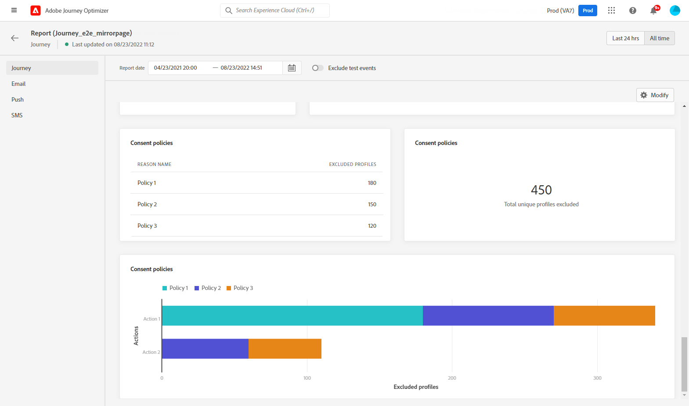
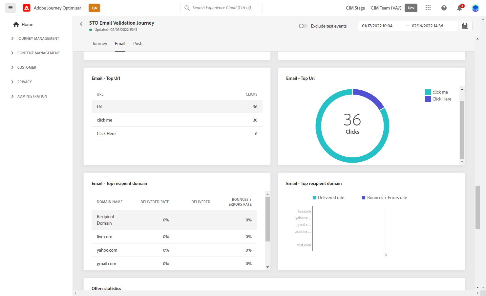
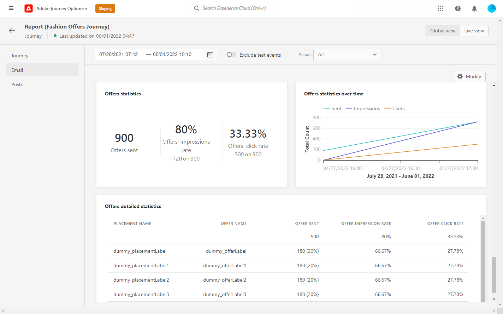
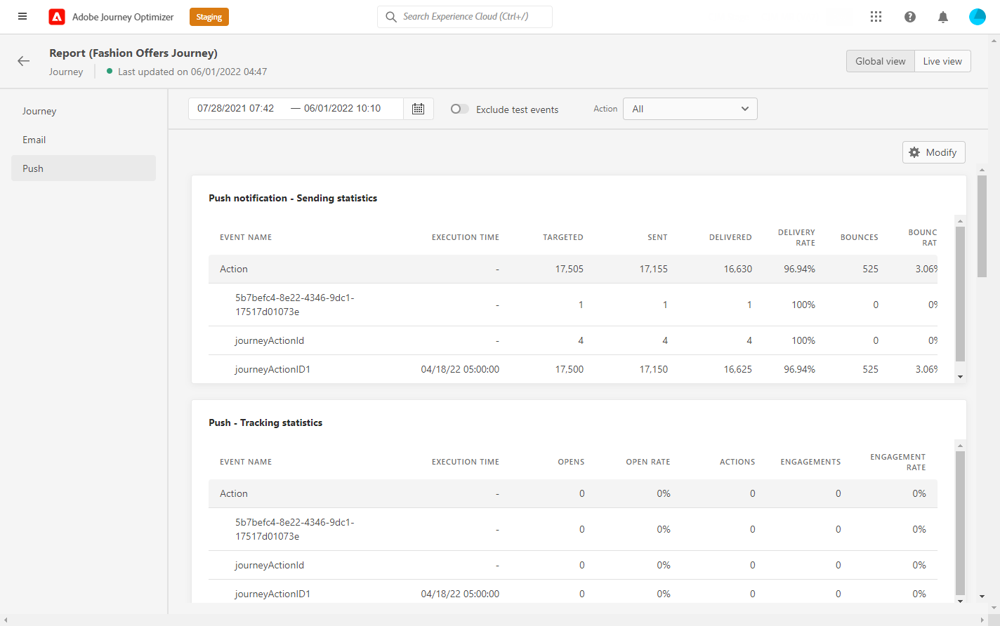

# 여정 글로벌 보고서 {#journey-global-report}

여정 글로벌 보고서는 **[!UICONTROL Global report]** 버튼을 클릭합니다.

여정 **[!UICONTROL Global report]** 페이지는 다음 탭에 표시됩니다.

* [여정](#journey-global)
* [이메일](#email-global)
* [푸시](#push-global)
* [SMS](#sms-global)

여정 **[!UICONTROL Global report]** 은 여정의 성공 및 오류를 자세히 설명하는 서로 다른 위젯으로 구분됩니다. 필요한 경우 각 위젯의 크기를 조정하고 삭제할 수 있습니다. 자세한 내용은 다음을 참조하십시오 [섹션](global-report.md#modify-dashboard).

## 여정 탭 {#journey-global}

여정에서 **[!UICONTROL Global report]**, **[!UICONTROL Journey]** 탭에서는 여정에 대해 가장 중요한 추적 데이터에 대한 명확한 보기를 제공합니다.

다음 **[!UICONTROL Journey Performance]** 위젯을 사용하면 타겟팅된 프로필의 경로를 여정을 단계별로 볼 수 있습니다.

다음 **[!UICONTROL Journey Statistics]** 위젯에는 다음 KPI가 표시됩니다.

* **[!UICONTROL Entered profiles]**: 여정의 시작 이벤트에 도달한 총 개인 수입니다.

* **[!UICONTROL Exited profiles]**: 여정을 종료한 총 개인 수입니다.

* **[!UICONTROL Failed individual journey]**: 성공적으로 실행되지 않은 개별 여정의 총 수입니다.

다음 **[!UICONTROL Events received by event]**, **[!UICONTROL Events by origin]** 및 **[!UICONTROL Top events]** 위젯을 사용하면 **[!UICONTROL Events]** 이(가) 그래프와 테이블을 통해 실행되었습니다.

**[!UICONTROL Action Performance]**, **[!UICONTROL Action Error Reasons]** 및 **[!UICONTROL Top Actions]** 위젯은 **[!UICONTROL Actions]** 이 트리거되었습니다.

다음 **[!UICONTROL Top Actions]** 변수에는 **[!UICONTROL Actions]**, 예:

* **[!UICONTROL Actions successfully executed]**: 총 개수 **[!UICONTROL Actions]** 여정에 대해 성공적으로 실행되었습니다.

* **[!UICONTROL Error in action]**: 에 대해 발생한 총 오류 수 **[!UICONTROL Actions]**.

다음 **[!UICONTROL Consent policies]** 표 및 그래프는 사용자 지정 작업에서 각 정책에서 제외된 프로필 수를 표시합니다.
사용자 지정 작업에 대한 자세한 내용은 [자세한 설명서](../action/about-custom-action-configuration.md).

이러한 위젯이 여정 보고서에 표시되려면 대시보드를 재설정해야 합니다. 이렇게 하려면 을(를) 클릭합니다. **[!UICONTROL Modify]** 그런 다음 **[!UICONTROL Reset]** 를 클릭합니다.

## 이메일 탭 {#email-global}

여정에서 **[!UICONTROL Global report]**, **[!UICONTROL Email]** 탭에서는 여정에서 전송된 이메일 게재와 관련된 주요 정보를 자세히 설명합니다.

다음 **[!UICONTROL Email Sending Statistics]** 그래프는 게재 성공에 대해 자세히 설명합니다.

* **[!UICONTROL Targeted]**: 이메일 또는 SMS 보내기 등의 작업을 위해 Adobe Journey Orchestration이 타겟팅한 프로필 수입니다.

* **[!UICONTROL Sent]**: 게재에 대한 총 전송 수입니다.

* **[!UICONTROL Delivered]**: 보낸 총 메시지 수와 관련하여 성공적으로 보낸 메시지 수입니다.

* **[!UICONTROL Delivery Rate]**: 성공적으로 보낸 메시지 비율입니다.

* **[!UICONTROL Bounces]**: 총 보낸 메시지 수와 관련하여 게재 및 자동 반환 처리 중에 누적된 총 오류 수입니다.

* **[!UICONTROL Bounce Rate]**: 전송된 이메일과 비교하여 바운스된 이메일의 비율입니다.

* **[!UICONTROL Errors]**: 게재 중에 발생한 총 오류로 인해 프로필이 전송되지 않았습니다.

* **[!UICONTROL Error Rate]**: 전송 중에 발생한 오류로 인해 전송된 이메일과 비교하여 전송되지 못했습니다.

다음 **[!UICONTROL Email - Tracking statistics]** 게재에 대해 수신자 활동에 사용할 수 있는 데이터를 포함합니다.

* **[!UICONTROL Opens]**: 게재에서 게재를 연 횟수입니다.

* **[!UICONTROL Unique Opens]**: 연 게재의 백분율입니다.

* **[!UICONTROL Unique Open Rate]**: 연 총 이메일 수와 배달된 이메일 수 비교

* **[!UICONTROL Clicks]**: 이메일에서 콘텐츠를 클릭한 횟수입니다.

* **[!UICONTROL Unique Clicks]**: 이메일의 콘텐츠를 클릭한 수신자 수입니다.

* **[!UICONTROL Click through rate]**: 여정과 상호 작용한 사용자의 비율입니다.

* **[!UICONTROL Unsubscribe]**: 구독 취소 링크에 대한 클릭 수입니다.

* **[!UICONTROL Spam complaints]**: 메시지가 스팸 또는 정크 메일로 선언된 횟수입니다.

다음 **[!UICONTROL Sending Statistics]** 그래프에는 다음과 같이 전송된 이메일에 사용할 수 있는 데이터가 포함되어 있습니다.

* **[!UICONTROL Delivered]**: 보낸 총 메시지 수와 관련하여 성공적으로 보낸 메시지 수입니다.

* **[!UICONTROL Bounces]**: 총 보낸 메시지 수와 관련하여 게재 및 자동 반환 처리 중에 누적된 총 오류 수입니다.

* **[!UICONTROL Errors]**: 게재 중에 발생한 총 오류로 인해 프로필이 전송되지 않았습니다.

다음 **[!UICONTROL Bounce Reasons]** 및 **[!UICONTROL Bounce categories]** 위젯에는 다음과 같이 바운스된 메시지와 관련하여 사용할 수 있는 데이터가 포함되어 있습니다.

* **[!UICONTROL Hard bounce]**: 잘못된 이메일 주소와 같은 총 영구 오류 수입니다. 여기에는 알 수 없는 사용자와 같이 주소가 유효하지 않다는 오류 메시지가 명시적으로 표시됩니다.

* **[!UICONTROL Soft bounce]**: 전체 받은 편지함과 같은 총 임시 오류 수입니다.

* **[!UICONTROL Ignored]**: 부재 중 또는 기술 오류(예: 발신자 유형이 postmaster인 경우)와 같은 총 임시 수입니다.

바운스에 대한 자세한 내용은 [제외 목록](../reports/suppression-list.md) 페이지.

다음 **[!UICONTROL Error Reasons]** 그래프 및 표를 사용하면 게재 중에 발생한 오류를 확인할 수 있습니다.

다음 **[!UICONTROL Excluded reasons]** 그래프와 테이블에는 타겟팅된 프로필에서 제외된 사용자 프로필이 메시지를 받지 못한 다양한 이유가 표시됩니다.

다음 **[!UICONTROL Email - Top Url]** 가장 많이 방문한 게재 URL을 그래프 및 표 세부 사항으로 설명합니다.

다음 **[!UICONTROL Email - Top recipient domain]** 전자 메일을 여는 데 받는 사람이 가장 많이 사용하는 도메인을 그래프 및 표 세부 사항입니다.

>[!NOTE]
>
>다음 **[!UICONTROL Optimized vs non optimized]** 및 **[!UICONTROL Send time optimization]**  위젯은 전송에 대해 전송 시간 최적화 옵션이 활성화된 경우에만 사용할 수 있습니다. 전송 시간 최적화에 대한 자세한 내용은 [이 페이지](../messages/send-time-optimization.md).

다음 **[!UICONTROL Optimized vs non optimized]** 그래프는 메시지가 최적화되었는지 여부에 따라 메시지에 대한 기본 정보를 자세히 설명합니다.

* **[!UICONTROL Sent]**: 게재에 대한 총 전송 수입니다.
* **[!UICONTROL Opens]**: 게재에서 게재를 연 횟수입니다.
* **[!UICONTROL Clicks]**: 이메일에서 콘텐츠를 클릭한 횟수입니다.

다음 **[!UICONTROL Send time optimization]** 전송 방법에 따라 게재 성공 여부를 자세히 설명합니다. 최적화되었습니다.

* **[!UICONTROL Delivered]**: 보낸 총 메시지 수와 관련하여 성공적으로 보낸 메시지 수입니다.
* **[!UICONTROL Bounces]**: 총 보낸 메시지 수와 관련하여 게재 및 자동 반환 처리 중에 누적된 총 오류 수입니다.

>[!NOTE]
>
>오퍼 위젯 및 지표는 이메일에 결정을 삽입한 경우에만 사용할 수 있습니다. 의사 결정 관리에 대한 자세한 내용은 다음을 참조하십시오 [페이지](../offers/get-started/starting-offer-decisioning.md).

다음 **[!UICONTROL Offers statistic]** 및 **[!UICONTROL Offers statistics]** 시간 경과에 따라 위젯은 오퍼의 성공과 타깃팅된 대상에 미치는 영향을 측정합니다. KPI를 사용하여 메시지에 대한 주요 정보를 자세히 설명합니다.

* **[!UICONTROL Offer sent]**: 오퍼에 대한 총 전송 수입니다.

* **[!UICONTROL Offer impression]**: 게재에서 오퍼를 연 횟수입니다.

* **[!UICONTROL Offer clicks]**: 게재에서 오퍼를 클릭한 횟수입니다.

다음 **[!UICONTROL Offers detailed statistic]** 표에는 오퍼가 있는 수신자 활동에 사용할 수 있는 데이터가 포함되어 있습니다.

* **[!UICONTROL Placement name]**: 오퍼를 표시하는 데 사용되는 배치의 이름입니다. 배치에 대한 자세한 내용은 다음을 참조하십시오 [페이지](../offers/offer-library/creating-placements.md).

* **[!UICONTROL Offer name]**: 게재에 추가된 오퍼의 이름입니다. 배치에 대한 자세한 내용은 다음을 참조하십시오 [페이지](../offers/offer-library/creating-personalized-offers.md).

* **[!UICONTROL Offer sent]**: 오퍼에 대한 총 전송 수입니다.

* **[!UICONTROL Offer impression rate]**: 열린 오퍼의 백분율로, 보낸 오퍼 수와 비교됩니다.

* **[!UICONTROL Offer click rate]**: 오퍼와 상호 작용한 사용자의 비율입니다.

## 푸시 탭 {#push-global}

여정에서 **[!UICONTROL Global report]**, **[!UICONTROL Push]** 탭에서 여정에 전송된 푸시 게재와 관련된 기본 정보를 자세히 설명합니다.

다음 **[!UICONTROL Push notification - Sending statistics]** 표는 그래프 및 KPI를 사용하여 푸시 알림에 대한 기본 정보를 자세히 설명합니다.

* **[!UICONTROL Targeted]**: 이메일 또는 SMS 보내기 등의 작업을 위해 Adobe Journey Orchestration이 타겟팅한 프로필 수입니다.

* **[!UICONTROL Sent]**: 게재에 대한 총 전송 수입니다.

* **[!UICONTROL Delivered]**: 보낸 총 메시지 수와 관련하여 성공적으로 보낸 메시지 수입니다.

* **[!UICONTROL Delivery Rate]**: 성공적으로 보낸 메시지 비율입니다.

* **[!UICONTROL Bounces]**: 총 보낸 메시지 수와 관련하여 게재 및 자동 반환 처리 중에 누적된 총 오류 수입니다.

* **[!UICONTROL Bounce Rate]**: 전송된 푸시 알림과 비교하여 바운스된 푸시 알림의 비율입니다.

* **[!UICONTROL Errors]**: 게재 중에 발생한 총 오류로 인해 프로필이 전송되지 않았습니다.

* **[!UICONTROL Error Rate]**: 전송 중에 발생한 오류로 인해 전송된 푸시 알림과 비교하여 전송되지 못했습니다.

다음 **[!UICONTROL Push - Tracking statistics]** 게재에 대해 수신자 활동에 사용할 수 있는 데이터를 포함합니다.

* **[!UICONTROL Opens]**: 게재에서 메시지를 연 횟수입니다.

* **[!UICONTROL Open Rate]**: 열린 푸시 알림의 비율입니다.

* **[!UICONTROL Actions]**: 전달된 푸시 알림에 대한 총 작업 수(예: 단추 클릭 또는 취소)

* **[!UICONTROL Engagements]**: 이 푸시 알림에 대한 총 열기 및 작업 수(즉, 프로필이 푸시를 열었는지 또는 단추를 클릭했는지 여부)입니다.

* **[!UICONTROL Engagement Rate]**: 이 푸시 알림에 대한 열기 및 작업의 비율(즉, 프로필이 푸시를 열었는지 또는 단추를 클릭했는지 여부)입니다.

다음 **[!UICONTROL Push notification summary]** 그래프에는 다음과 같이 전송된 푸시 알림에 사용할 수 있는 데이터가 포함되어 있습니다.

* **[!UICONTROL Opens]**: 게재에서 메시지를 연 횟수입니다.

* **[!UICONTROL Actions]**: 전달된 푸시 알림에 대한 총 작업 수(예: 단추 클릭 또는 취소)

* **[!UICONTROL Bounces]**: 총 보낸 메시지 수와 관련하여 게재 및 자동 반환 처리 중에 누적된 총 오류 수입니다.

* **[!UICONTROL Delivered]**: 보낸 총 메시지 수와 관련하여 성공적으로 보낸 메시지 수입니다.

* **[!UICONTROL Errors]**: 게재 중에 발생한 총 오류로 인해 프로필이 전송되지 않았습니다.

>[!NOTE]
>
>다음 **[!UICONTROL Optimized vs non optimized]** 및 **[!UICONTROL Send time optimization]**  위젯은 전송에 대해 전송 시간 최적화 옵션이 활성화된 경우에만 사용할 수 있습니다. 전송 시간 최적화에 대한 자세한 내용은 [이 페이지](../messages/send-time-optimization.md).

다음 **[!UICONTROL Optimized vs non optimized]** 그래프는 메시지가 최적화되었는지 여부에 따라 메시지에 대한 기본 정보를 자세히 설명합니다.

* **[!UICONTROL Delivered]**: 보낸 총 메시지 수와 관련하여 성공적으로 보낸 메시지 수입니다.
* **[!UICONTROL Opens]**: 게재에서 게재를 연 횟수입니다.
* **[!UICONTROL Actions]**: 전달된 푸시 알림에 대한 총 작업 수(예: 단추 클릭 또는 취소)

다음 **[!UICONTROL Send time optimization]** 전송 방법에 따라 게재 성공 여부를 자세히 설명합니다. 최적화되었습니다.

* **[!UICONTROL Delivered]**: 보낸 총 메시지 수와 관련하여 성공적으로 보낸 메시지 수입니다.
* **[!UICONTROL Bounces]**: 총 보낸 메시지 수와 관련하여 게재 및 자동 반환 처리 중에 누적된 총 오류 수입니다.

다음 **[!UICONTROL Error Reasons]** 그래프 및 표를 사용하면 게재 중에 발생한 오류를 확인할 수 있습니다.

다음 **[!UICONTROL Excluded reasons]** 그래프와 테이블에는 타겟팅된 프로필에서 제외된 사용자 프로필이 메시지를 받지 못한 다양한 이유가 표시됩니다.

다음 **[!UICONTROL Tracking by platform]**, **[!UICONTROL Sending by platform]** 및 **[!UICONTROL Breakdown by platform]** 그래프 및 표는 수신자의 운영 시스템에 따라 푸시 알림의 성공을 자세히 설명합니다.

SMS **[!UICONTROL Global report]** 은 게재의 성공 및 오류를 설명하는 다른 위젯으로 구분됩니다. 필요한 경우 각 위젯의 크기를 조정하고 삭제할 수 있습니다. 자세한 정보는 다음을 참조하십시오 [섹션](global-report.md#modify-dashboard).

## SMS 탭 {#sms-global}

다음 **[!UICONTROL SMS - Sending statistics]** 표는 게재의 성공에 대해 자세히 설명합니다.

* **[!UICONTROL Targeted]**: 이 게재의 타겟 프로필로 자격을 얻은 사용자 프로필 수입니다.

* **[!UICONTROL Excluded]**: 타겟팅된 프로필에서 제외되고 메시지를 받지 못한 사용자 프로필 수입니다.

* **[!UICONTROL Sent]**: 게재에 대한 총 전송 수입니다.

* **[!UICONTROL Delivered]**: 보낸 총 메시지 수와 관련하여 성공적으로 보낸 메시지 수입니다.

* **[!UICONTROL Bounces]**: 총 보낸 메시지 수와 관련하여 게재 및 자동 반환 처리 중에 누적된 총 오류 수입니다.

* **[!UICONTROL Errors]**: 게재 중에 발생한 총 오류로 인해 프로필이 전송되지 않았습니다.

다음 **[!UICONTROL SMS summary]** 위젯은 그래프와 함께 메시지에 대한 주요 정보를 자세히 설명합니다.

* **[!UICONTROL Sent]**: 게재에 대한 총 전송 수입니다.

* **[!UICONTROL Delivered]**: 보낸 총 메시지 수와 관련하여 성공적으로 보낸 메시지 수입니다.

* **[!UICONTROL Bounces]**: 총 보낸 메시지 수와 관련하여 게재 및 자동 반환 처리 중에 누적된 총 오류 수입니다.

* **[!UICONTROL Errors]**: 게재 중에 발생한 총 오류로 인해 프로필이 전송되지 않았습니다.

다음 **[!UICONTROL Exclude Reasons]** 그래프 및 표를 사용하면 게재 중에 발생한 오류와 제외를 확인할 수 있습니다.
