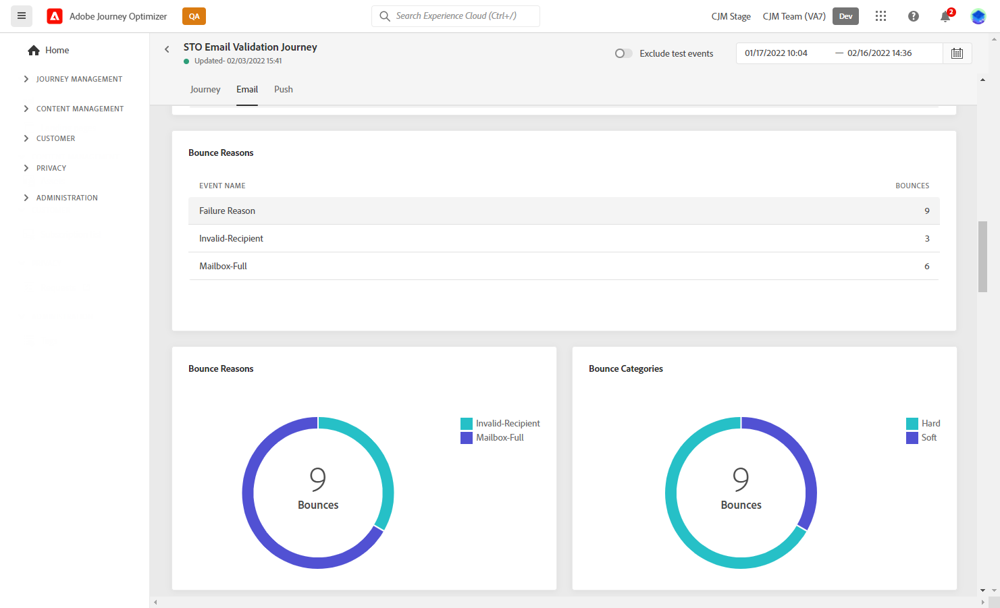
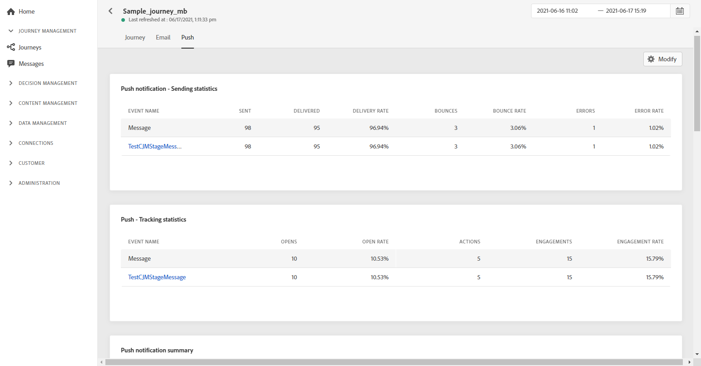

# 여정 글로벌 보고서 {#journey-global-report}

여정 글로벌 보고서는 **[!UICONTROL Global report]** 버튼을 사용하여 여정에서 직접 액세스할 수 있습니다.

여정 **[!UICONTROL Global report]** 페이지가 다음 탭으로 표시됩니다.

* [여정](#journey-global)
* [이메일](#email-global)
* [푸시](#push-global)

여정 **[!UICONTROL Global report]**&#x200B;은 여정의 성공 및 오류를 설명하는 다른 위젯으로 나누어집니다. 필요한 경우 각 위젯의 크기를 조정하고 삭제할 수 있습니다. 자세한 내용은 이 [섹션](global-report.md#modify-dashboard)을 참조하십시오.

## 여정 탭 {#journey-global}

여정 **[!UICONTROL Global report]**&#x200B;에서 **[!UICONTROL Journey]** 탭에서는 여정에 대한 가장 중요한 추적 데이터에 대한 명확한 보기를 제공합니다.

**[!UICONTROL Journey Performance]** 위젯을 사용하면 여정을 단계별로 타겟팅된 프로필의 경로를 볼 수 있습니다.

**[!UICONTROL Journey Statistics]** 위젯에는 다음 KPI가 표시됩니다.

* **[!UICONTROL Entered profiles]**:여정의 시작 이벤트에 도달한 총 개인 수입니다.

* **[!UICONTROL Exited profiles]**:여정을 종료한 총 개인 수입니다.

* **[!UICONTROL Failed individual journey]**:성공적으로 실행되지 않은 개별 여정의 총 수입니다.

**[!UICONTROL Events received by event]**, **[!UICONTROL Events by origin]** 및 **[!UICONTROL Top events]** 위젯을 사용하면 그래프와 테이블을 통해 성공적으로 실행된 **[!UICONTROL Events]** 중 하나를 확인할 수 있습니다.

**[!UICONTROL Action Performance]**,  **[!UICONTROL Action Error Reasons]** 및  **[!UICONTROL Top Actions]** 위젯은 트리거될 때 발생한 가장 성공적인 작업 및 오류를  **[!UICONTROL Actions]** 나타냅니다.

**[!UICONTROL Top Actions]** 테이블에는 **[!UICONTROL Actions]**&#x200B;에 사용할 수 있는 다음과 같은 데이터가 포함되어 있습니다.

* **[!UICONTROL Actions successfully executed]**:여정에 대해  **[!UICONTROL Actions]** 성공적으로 실행된 총 횟수입니다.

* **[!UICONTROL Error in action]**:에 대해 발생한 총 오류 수입니다 **[!UICONTROL Actions]**.

## 이메일 탭 {#email-global}

여정 **[!UICONTROL Global report]**&#x200B;에서 **[!UICONTROL Email]** 탭은 여정에서 전송된 이메일 게재와 관련된 기본 정보를 자세히 설명합니다.

특정 전자 메일 게재에 대한 자세한 보고서는 [전자 메일 글로벌 보고서](#email-global-report) 섹션을 참조하십시오.

**[!UICONTROL Email Sending Statistics]** 그래프는 게재의 성공에 대해 자세히 설명합니다.

* **[!UICONTROL Sent]**:게재에 대한 총 전송 수입니다.

* **[!UICONTROL Delivered]**:보낸 총 메시지 수와 관련하여 성공적으로 보낸 메시지 수입니다.

* **[!UICONTROL Delivery Rate]**:성공적으로 보낸 메시지 비율입니다.

* **[!UICONTROL Bounces]**:총 보낸 메시지 수와 관련하여 게재 및 자동 반환 처리 중에 누적된 총 오류 수입니다.

* **[!UICONTROL Bounce Rate]**:전송된 이메일과 비교하여 바운스된 이메일의 비율입니다.

* **[!UICONTROL Errors]**:게재 중에 발생한 총 오류로 인해 프로필이 전송되지 않았습니다.

* **[!UICONTROL Error Rate]**:전송 중에 발생한 오류로 인해 전송된 이메일과 비교하여 전송되지 못했습니다.

**[!UICONTROL Email - Tracking statistics]**&#x200B;에는 게재에 사용할 수 있는 수신자 활동이 포함되어 있습니다.

* **[!UICONTROL Opens]**:게재에서 게재를 연 횟수입니다.

* **[!UICONTROL Unique Opens]**:연 게재의 백분율입니다.

* **[!UICONTROL Open Rate]**:연 총 이메일 수와 배달된 이메일 수 비교

* **[!UICONTROL Clicks]**:이메일에서 콘텐츠를 클릭한 횟수입니다.

* **[!UICONTROL Unique Clicks]**: 이메일의 콘텐츠를 클릭한 수신자 수입니다.

* **[!UICONTROL Click through rate]**:여정과 상호 작용한 사용자의 비율입니다.

* **[!UICONTROL Unsubscribe]**:구독 취소 링크에 대한 클릭 수입니다.

* **[!UICONTROL Spam complaints]**:메시지가 스팸 또는 정크 메일로 선언된 횟수입니다.

**[!UICONTROL Sending Statistics]** 그래프에는 다음과 같이 전송된 이메일에 사용할 수 있는 데이터가 포함되어 있습니다.

* **[!UICONTROL Delivered]**:보낸 총 메시지 수와 관련하여 성공적으로 보낸 메시지 수입니다.

* **[!UICONTROL Bounces]**:총 보낸 메시지 수와 관련하여 게재 및 자동 반환 처리 중에 누적된 총 오류 수입니다.

* **[!UICONTROL Errors]**:게재 중에 발생한 총 오류로 인해 프로필이 전송되지 않았습니다.

**[!UICONTROL Bounce Reasons]** 및 **[!UICONTROL Bounce categories]** 위젯에는 다음과 같이 바운스된 메시지와 관련하여 사용할 수 있는 데이터가 포함됩니다.

* **[!UICONTROL Hard bounce]**:잘못된 이메일 주소와 같은 총 영구 오류 수입니다. 여기에는 알 수 없는 사용자와 같이 주소가 유효하지 않다는 오류 메시지가 명시적으로 표시됩니다.

* **[!UICONTROL Soft bounce]**:전체 받은 편지함과 같은 총 임시 오류 수입니다.

* **[!UICONTROL Ignored]**:부재 중 또는 기술 오류(예: 발신자 유형이 postmaster인 경우)와 같은 총 임시 수입니다.

바운스에 대한 자세한 내용은 [억제 목록](../suppression-list.md) 페이지를 참조하십시오.

**[!UICONTROL Email - Top Url]** 그래프 및 표는 게재에서 가장 많이 방문한 URL을 자세히 설명합니다.

**[!UICONTROL Email - Top recipient domain]** 그래프 및 표는 수신자가 이메일을 여는 데 가장 많이 사용하는 도메인을 자세히 설명합니다.

## 푸시 탭 {#push-global}

여정 **[!UICONTROL Global report]**&#x200B;에서 **[!UICONTROL Push]** 탭은 여정에서 전송된 푸시 게재와 관련된 기본 정보를 자세히 설명합니다.

특정 푸시 게재에 대한 자세한 보고서는 이 [푸시 글로벌 보고서](#push-global-report)를 참조하십시오.

**[!UICONTROL Push notification - Sending statistics]** 테이블은 그래프 및 KPI를 사용하여 푸시 알림에 대한 기본 정보를 자세히 설명합니다.

* **[!UICONTROL Sent]**:게재에 대한 총 전송 수입니다.

* **[!UICONTROL Delivered]**:보낸 총 메시지 수와 관련하여 성공적으로 보낸 메시지 수입니다.

* **[!UICONTROL Delivery Rate]**:성공적으로 보낸 메시지 비율입니다.

* **[!UICONTROL Bounces]**:총 보낸 메시지 수와 관련하여 게재 및 자동 반환 처리 중에 누적된 총 오류 수입니다.

* **[!UICONTROL Bounce Rate]**:전송된 푸시 알림과 비교하여 바운스된 푸시 알림의 비율입니다.

* **[!UICONTROL Errors]**:게재 중에 발생한 총 오류로 인해 프로필이 전송되지 않았습니다.

* **[!UICONTROL Error Rate]**:전송 중에 발생한 오류로 인해 전송된 푸시 알림과 비교하여 전송되지 못했습니다.

**[!UICONTROL Push - Tracking statistics]**&#x200B;에는 게재에 사용할 수 있는 수신자 활동이 포함되어 있습니다.

* **[!UICONTROL Opens]**:게재에서 메시지를 연 횟수입니다.

* **[!UICONTROL Open Rate]**:열린 푸시 알림의 비율입니다.

* **[!UICONTROL Actions]**:전달된 푸시 알림에 대한 총 작업 수(예: 단추 클릭 또는 취소)

* **[!UICONTROL Engagements]**:이 푸시 알림에 대한 총 열기 및 작업 수(즉, 프로필이 푸시를 열었는지 또는 단추를 클릭했는지 여부)입니다.

* **[!UICONTROL Engagement Rate]**:이 푸시 알림에 대한 열기 및 작업의 비율(즉, 프로필이 푸시를 열었는지 또는 단추를 클릭했는지 여부)입니다.

**[!UICONTROL Push notification summary]** 그래프에는 다음과 같이 전송된 푸시 알림에 사용할 수 있는 데이터가 포함되어 있습니다.

* **[!UICONTROL Opens]**:게재에서 메시지를 연 횟수입니다.

* **[!UICONTROL Actions]**:전달된 푸시 알림에 대한 총 작업 수(예: 단추 클릭 또는 취소)

* **[!UICONTROL Bounces]**:총 보낸 메시지 수와 관련하여 게재 및 자동 반환 처리 중에 누적된 총 오류 수입니다.

* **[!UICONTROL Delivered]**:보낸 총 메시지 수와 관련하여 성공적으로 보낸 메시지 수입니다.

* **[!UICONTROL Errors]**:게재 중에 발생한 총 오류로 인해 프로필이 전송되지 않았습니다.

**[!UICONTROL Error Reasons]** 그래프 및 표를 사용하면 게재 중에 발생한 오류를 확인할 수 있습니다.

**[!UICONTROL Tracking by platform]**, **[!UICONTROL Sending by platform]** 및 **[!UICONTROL Breakdown by platform]** 그래프 및 표는 수신자의 운영 시스템에 따라 푸시 알림의 성공을 자세히 설명합니다.
