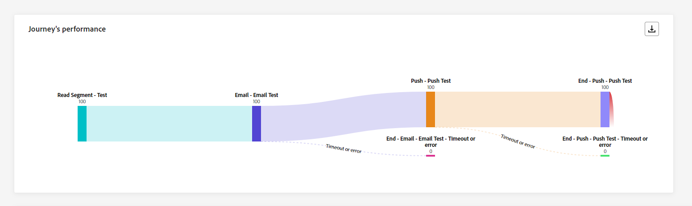
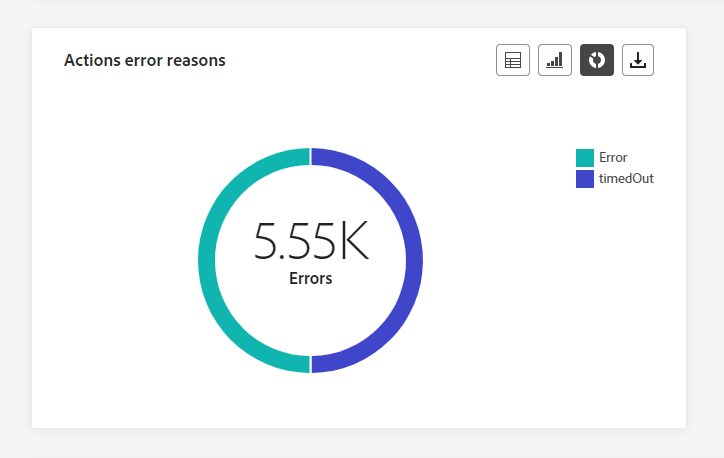
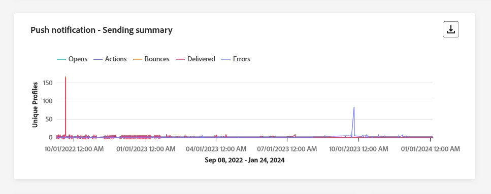
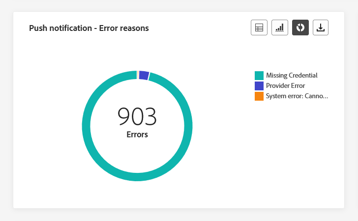
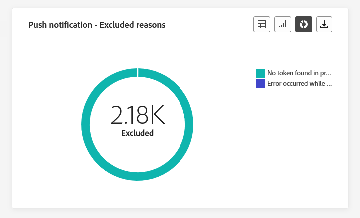

# 여정 글로벌 보고서 {#journey-global-report}

>[!CONTEXTUALHELP]
>id="ajo_journey_global_report"
>title="여정 글로벌 보고서"
>abstract="여정 글로벌 보고서를 사용하여 선택된 기간에 대해 여정의 영향을 측정할 수 있습니다. 보고서는 여정 성공 사례와 오류를 자세히 설명하는 여러 위젯으로 나눠집니다. 위젯 크기를 조정하거나 위젯을 제거하여 각 보고 대시보드를 수정할 수 있습니다."

>[!AVAILABILITY]
>
>현재 보고 경험은 10월 릴리스부터 종료됩니다. 이 날짜 이후, 새로운 보고 환경이 표준이 됩니다. 원활한 전환을 위해 새로운 기능을 숙지하는 것이 좋습니다. [Journey Optimizer 새 보고 인터페이스를 시작합니다.](report-gs-cja.md)

모든 시간 탭에서 액세스할 수 있는 글로벌 보고서에는 최소 2시간 전에 발생한 이벤트와 선택한 기간 동안의 이벤트가 표시됩니다. 반면 라이브 보고서는 이벤트 발생으로부터 최소 2분의 시간 간격을 가지고 지난 24시간 내에 발생한 이벤트에 중점을 둡니다.

여정 글로벌 보고서는 **[!UICONTROL 보고서 보기]** 단추를 사용하여 여정에서 직접 액세스할 수 있습니다.

여정 **[!UICONTROL 전역 보고서]** 페이지가 다음 탭과 함께 표시됩니다.

* [여정](#journey-global)
* [이메일](#email-global)
* [푸시](#push-global)
* [SMS](#sms-global)
* [인앱](#in-app-global)

여정 **[!UICONTROL 글로벌 보고서]**&#x200B;는 여정의 성공 및 오류를 자세히 설명하는 다양한 위젯으로 나뉩니다. 필요한 경우 각 위젯의 크기를 조정하고 삭제할 수 있습니다. 자세한 내용은 이 [섹션](global-report.md#modify-dashboard)을 참조하세요.

Adobe Journey Optimizer에서 사용할 수 있는 모든 지표의 자세한 목록은 [이 페이지](global-report.md#list-of-components-global)를 참조하세요.

## 여정 탭 {#journey-global}

여정 **[!UICONTROL 전역 보고서]**&#x200B;에서 **[!UICONTROL 여정]** 탭은 여정에 대한 가장 중요한 추적 데이터를 명확하게 볼 수 있도록 합니다.

### 여정 성능 {#journey-perfomance}

>[!CONTEXTUALHELP]
>id="ajo_journey_performance"
>title="여정 성능"
>abstract="여정 성능 위젯을 사용하면 여정이 진행되는 동안 타겟팅된 프로필 경로를 시각적으로 추적할 수 있습니다."

**[!UICONTROL 여정 성능]** 위젯을 사용하면 타겟팅된 프로필이 여정을 탐색할 때의 궤적을 시각적으로 추적할 수 있습니다.

노드에 대한 프로필 수는 노드가 완료된 후에만 업데이트되며, 노드를 입력할 때는 업데이트되지 않습니다. 예를 들어 **대기** 노드의 프로필은 지정된 날짜에 도달하고 해당 프로필이 노드를 종료한 후에만 계산됩니다.

### 여정 통계 {#journey-statistics}

>[!CONTEXTUALHELP]
>id="ajo_journey_statistics"
>title="여정 통계"
>abstract="여정 통계 주요 성과 지표(KPI)는 여정과 관련된 필수 지표에 대한 심층 분석을 제공하는 포괄적인 대시보드 역할을 합니다."

**[!UICONTROL 여정 통계]** 주요 성과 지표(KPI)는 모든 것을 포괄하는 대시보드로 작동하여 여정과 관련된 필수 지표에 대한 분석을 제공합니다. 여기에는 입력된 프로필 수 및 실패한 개별 여정 인스턴스 등의 세부 정보가 포함되며, 이를 통해 여정의 효율성 및 참여 수준에 대한 포괄적인 통찰력을 제공합니다.

+++ 여정 통계 지표에 대해 자세히 알아보기

* **[!UICONTROL 입력한 프로필]**: 여정의 시작 이벤트에 도달한 총 개인 수.

* **[!UICONTROL 종료된 프로필]**: 여정을 종료한 총 개인 수

* **[!UICONTROL 개별 여정 실패]**: 실행되지 않은 총 개별 여정 수입니다.

+++

### 액션 성능 {#action-performance}

>[!CONTEXTUALHELP]
>id="ajo_journey_action_performance"
>title="액션 성능"
>abstract="액션 성능 위젯은 액션이 시작되었을 때 발생한 가장 성공적인 액션을 보여 줍니다."

**[!UICONTROL 작업 성능]** 위젯은 **[!UICONTROL 작업]**&#x200B;이 트리거될 때 발생한 가장 성공적인 작업을 나타냅니다.

### 상위 액션 {#top-actions}

>[!CONTEXTUALHELP]
>id="ajo_journey_top_actions"
>title="상위 액션"
>abstract="상위 액션 테이블에는 액션에 대한 중요 정보를 통합하여 각 액션 빈도와 효과가 간결하게 정리되어 있습니다."

**[!UICONTROL 상위 작업]** 테이블은 **[!UICONTROL 작업]**&#x200B;에서 필수 데이터를 컴파일합니다. 각 작업의 빈도와 성능에 대한 간결한 통찰력을 제공합니다.

+++ 상위 작업 지표에 대해 자세히 알아보기

* **[!UICONTROL 작업이 실행됨]**: 여정에 대해 실행된 총 **[!UICONTROL 작업]** 수입니다.

* **[!UICONTROL 작업 중 오류]**: **[!UICONTROL 작업]**&#x200B;에 대해 발생한 총 오류 수

+++

### 액션 오류 이유 {#action-error}

>[!CONTEXTUALHELP]
>id="ajo_journey_actions_error_reasons"
>title="액션 오류 이유"
>abstract="액션 오류 이유 테이블과 그래프는 액션 실행 중에 발생한 오류에 대한 자세한 요약을 제공하며 발생했을 수 있는 문제에 대한 포괄적인 개요를 제공합니다."

**[!UICONTROL 작업 오류 이유]** 테이블 및 그래프는 **[!UICONTROL 작업]**&#x200B;을 실행하는 동안 발생한 오류에 대한 포괄적인 개요를 제공합니다.

### 원본을 통한 이벤트 {#events-origin}

>[!CONTEXTUALHELP]
>id="ajo_journey_events_origin"
>title="원본을 통한 이벤트"
>abstract="원본을 통한 이벤트 테이블과 그래프는 이벤트의 성공적인 수신에 대한 보기를 제공합니다. 이러한 시각적 표현을 통해 효과적으로 수신된 이벤트를 정확하게 확인하고, 여정 내 각 이벤트의 성능과 영향에 대한 유용한 인사이트를 제공할 수 있습니다."

**[!UICONTROL 원본별 이벤트]** 테이블 및 그래프는 **[!UICONTROL 이벤트]**&#x200B;의 성공적인 수신에 대한 자세한 관점을 제공합니다. 이러한 시각적 표현을 통해 효과적으로 받은 **[!UICONTROL 이벤트]**&#x200B;를 정확하게 식별할 수 있으므로 여정 내 개별 이벤트의 성능 및 영향에 대한 중요한 통찰력을 제공할 수 있습니다.

### 이벤트에 의해 수신된 이벤트 {#events-received}

>[!CONTEXTUALHELP]
>id="ajo_journey_events_received"
>title="이벤트에 의해 수신된 이벤트"
>abstract="이벤트에 의해 수신된 이벤트 그래프를 사용하면 여정 내에서 효과적으로 실행된 특정 이벤트를 확인하고 분석하여 개별 이벤트의 성능 및 성공률에 대한 유용한 인사이트를 제공할 수 있습니다."

**[!UICONTROL 이벤트에 의해 수신된 이벤트]** 그래프를 통해 여정 내에서 효과적으로 실행된 특정 **[!UICONTROL 이벤트]**&#x200B;을(를) 식별하고 분석할 수 있으므로 개별 이벤트의 성능 및 성공률에 대한 중요한 통찰력을 제공합니다.

### 상위 이벤트 {#top-events}

>[!CONTEXTUALHELP]
>id="ajo_journey_top_events"
>title="상위 이벤트"
>abstract="상위 이벤트 테이블에는 이벤트에 대한 필수 데이터를 통합하여 각 개별 이벤트의 빈도와 성능이 간결하게 정리되어 있습니다."

**[!UICONTROL 상위 이벤트]** 테이블은 **[!UICONTROL 이벤트]**&#x200B;에서 필수 데이터를 컴파일합니다. 각 **[!UICONTROL 이벤트]**&#x200B;의 빈도와 성능에 대한 간결한 통찰력을 제공합니다.

### 동의 정책 {#consent-policies}

>[!CONTEXTUALHELP]
>id="ajo_journey_consent_policies"
>title="동의 정책"
>abstract="동의 정책 테이블과 그래프에는 사용자 정의 액션 내의 각 정책에서 제외된 프로필 수가 표시됩니다. 이를 통해 프로필 제외에 대한 각 동의 정책 영향의 인사이트를 명확하게 제공합니다."

**[!UICONTROL 동의 정책]** 테이블 및 그래프는 사용자 지정 작업 내에서 각 정책에서 제외된 프로필 수를 표시합니다. 이는 프로필 제외에 대한 각 동의 정책의 영향에 대한 명확한 통찰력을 제공합니다.

사용자 지정 작업에 대한 자세한 내용은 [자세한 설명서](../action/about-custom-action-configuration.md)를 참조하세요.

이러한 위젯이 여정 보고서에 표시되도록 하려면 대시보드를 재설정해야 합니다. 이렇게 하려면 보고서 상단에서 **[!UICONTROL 수정]**&#x200B;을 클릭한 다음 **[!UICONTROL 재설정]**&#x200B;을 클릭합니다.

## 이메일 탭 {#email-global}

**[!UICONTROL 전역 보고서]** 여정에서 **[!UICONTROL 전자 메일]** 탭에는 여정에서 보낸 전자 메일과 관련된 기본 정보가 자세히 표시됩니다.

### 이메일 - 전송 통계 {#email-sending-statistics}

>[!CONTEXTUALHELP]
>id="ajo_journey_email_sending_statistics"
>title="이메일 - 전송 통계"
>abstract="이메일 - 전송 통계 테이블에는 대상 지정 또는 게재됨 등과 같은 이메일에 대한 필수 데이터가 요약되어 있습니다."

**[!UICONTROL 전자 메일 전송 통계]** 표에는 여정의 전자 메일과 관련된 필수 데이터에 대한 포괄적인 요약이 나와 있습니다. 여기에는 타겟팅된 대상의 크기 및 성공적으로 전달된 이메일 수와 같은 주요 지표가 자세히 설명되어 있으며, 이를 통해 이메일 및 여정의 효율성 및 도달 가능성에 대한 중요한 통찰력을 제공합니다.

+++ 이메일 전송 통계 지표에 대해 자세히 알아보기

* **[!UICONTROL 실행 시간]**: 되풀이하는 여정의 경우 모든 여정 실행의 시작 시간입니다. 하나 이상의 반복만 대상으로 지정하려면 **[!UICONTROL 실행 시간]** 드롭다운에서 선택합니다.

* **[!UICONTROL 타깃팅]**: 전자 메일 또는 SMS 전송과 같은 모든 작업에 타깃팅된 프로필 수입니다.

* **[!UICONTROL 전송됨]**: 여정에 대해 전송된 총 전자 메일 수입니다.

* **[!UICONTROL 배달됨]**: 보낸 총 전자 메일 수와 관련하여 보낸 전자 메일 수입니다.

* **[!UICONTROL 게재율]**: 전자 메일을 성공적으로 보낸 비율입니다.

* **[!UICONTROL 바운스 수]**: 보낸 전자 메일의 총 수와 관련하여 전송 프로세스 및 자동 반환 처리 중에 누적된 총 오류 수입니다.

* **[!UICONTROL 바운스 비율]**: 보낸 전자 메일과 비교하여 반송된 전자 메일의 비율입니다.

* **[!UICONTROL 오류]**: 보내는 동안 프로필로 보낼 수 없는 총 오류 수입니다.

* **[!UICONTROL 오류율]**: 보낸 전자 메일과 비교하여 보내지 못하게 하는 전송 프로세스 중 발생한 오류의 비율입니다.

* **[!UICONTROL 다시 시도]**: 다시 시도 큐에 있는 전자 메일 수입니다.

* **[!UICONTROL 제외됨]**: Adobe Journey Optimizer에서 제외된 프로필 수입니다.

+++

### 이메일 - 추적 통계 {#email-tracking}

>[!CONTEXTUALHELP]
>id="ajo_journey_email_tracking_statistics"
>title="이메일 - 추적 통계"
>abstract="이메일 - 추적 통계 테이블은 이메일의 프로필 활동에 대한 데이터를 제공합니다."

**[!UICONTROL 전자 메일 - 추적 통계]** 표에는 여정에 포함된 전자 메일과 관련된 프로필 활동에 대한 자세한 계정이 있습니다. 여기에는 열람, 클릭 수 및 기타 관련 참여 지표에 대한 지표가 포함되며 프로필이 이메일 콘텐츠와 상호 작용하는 방식에 대한 포괄적인 보기를 제공합니다.

+++ 이메일에 대한 자세한 내용 - 추적 통계 지표

* **[!UICONTROL 실행 시간]**: 여정에서 되풀이하는 전자 메일의 모든 실행 시작 시간입니다. 하나 이상의 반복 전자 메일만 대상으로 지정하려면 **[!UICONTROL 실행 시간]** 드롭다운에서 선택합니다.

* **[!UICONTROL 열기]**: 여정에서 이메일을 연 횟수입니다.

* **[!UICONTROL 고유 열기 수]**: 열린 전자 메일의 비율입니다.

* **[!UICONTROL 고유 열람율]**: 배달된 전자 메일 수와 비교하여 열린 총 전자 메일 수입니다.

* **[!UICONTROL 클릭 수]**: 전자 메일에서 콘텐츠를 클릭한 횟수입니다.

* **[!UICONTROL 고유 클릭 수]**:전자 메일의 내용을 클릭한 수신자 수입니다.

* **[!UICONTROL 클릭스루 비율]**: 여정과 상호 작용한 사용자의 비율입니다.

* **[!UICONTROL 구독 취소]**: 구독 취소 링크의 클릭 수입니다.

* **[!UICONTROL 스팸 고객 불만]**: 이메일이 스팸 또는 정크로 선언된 횟수입니다.

+++

### 이메일 - 전송 성능 {#email-performance}

>[!CONTEXTUALHELP]
>id="ajo_journey_email_sending_performance"
>title="이메일 - 전송 성능"
>abstract="이메일 - 전송 성능 그래프는 전송된 이메일에 관한 포괄적인 데이터를 제공하여 게재 및 바운스와 같은 주요 지표에 대한 인사이트를 제공하고 이메일 게재 프로세스를 자세하게 분석할 수 있습니다."

**[!UICONTROL 전자 메일 - 전송 성능]** 그래프는 여정에서 전송된 전자 메일과 관련된 데이터를 종합적으로 볼 수 있도록 해주며, 배달됨 및 바운스 수와 같은 주요 지표에 대한 통찰력을 제공합니다. 이를 통해 이메일 전송 프로세스를 자세히 분석할 수 있으므로 여정의 효율성과 성능에 대한 중요한 정보를 제공합니다.

+++ 이메일에 대한 자세한 내용 - 성능 지표 보내기

* **[!UICONTROL 배달됨]**: 보낸 총 전자 메일 수와 관련하여 보낸 전자 메일 수입니다.

* **[!UICONTROL 바운스 수]**: 보낸 총 메시지 수와 관련하여 보내는 프로세스 및 자동 반환 처리 중에 누적된 총 오류 수입니다.

* **[!UICONTROL 다시 시도]**: 다시 시도 큐에 있는 전자 메일 수입니다.

* **[!UICONTROL 오류]**: 보내는 동안 프로필로 보낼 수 없는 총 오류 수입니다.

+++

### 이메일 - 바운스 범주 및 이유 {#email-bounce-categories}

>[!CONTEXTUALHELP]
>id="ajo_journey_email_bounces"
>title="이메일 - 바운스 범주 및 이유"
>abstract="이메일 - 바운스 범주 및 이유 위젯은 바운스된 메시지와 관련 데이터를 집계하여 이메일 바운스의 원인이 되는 특정 이유와 범주에 대한 심층적인 인사이트를 제공합니다."

**[!UICONTROL 반송 이유]** 및 **[!UICONTROL 반송 범주]** 위젯은 반송된 메시지와 관련된 사용 가능한 데이터를 컴파일하여 이메일 반송 이면의 특정 이유 및 범주에 대한 자세한 통찰력을 제공합니다.

바운스에 대한 자세한 내용은 [제외 목록](../reports/suppression-list.md) 페이지를 참조하세요.

+++ 이메일에 대한 자세한 내용 - 바운스 범주 지표

* **[!UICONTROL 하드 바운스]**: 잘못된 전자 메일 주소와 같은 총 영구 오류 수입니다. 여기에는 알 수 없는 사용자와 같이 주소가 유효하지 않다는 오류 메시지가 명시적으로 표시됩니다.

* **[!UICONTROL 소프트 바운스]**: 전체 받은 편지함과 같은 총 임시 오류 수입니다.

* **[!UICONTROL 무시됨]**: 부재 중과 같은 총 임시 항목 수 또는 기술적인 오류(예: 발신자 유형이 postmaster인 경우).

+++

### 이메일 - 오류 이유 {#email-errors}

>[!CONTEXTUALHELP]
>id="ajo_journey_email_error_reasons"
>title="이메일 - 오류 이유"
>abstract="이메일 - 오류 이유 그래프와 테이블을 통해 전송 프로세스 중에 발생한 특정 오류를 확인할 수 있습니다."

**[!UICONTROL 오류 원인]** 그래프 및 표는 전송 프로세스 중에 발생한 특정 오류에 대한 가시성을 제공하여 오류의 특성 및 발생에 대한 중요한 정보를 제공합니다.

### 이메일 - 제외된 이유 {#email-excluded}

>[!CONTEXTUALHELP]
>id="ajo_journey_email_excluded_reasons"
>title="이메일 - 제외된 이유"
>abstract="제외된 이유 그래프와 테이블에서는 타겟팅된 대상자에서 제외된 사용자 프로필이 메시지를 받지 못하는 다양한 요인을 보여 줍니다."

**[!UICONTROL 제외된 이유]** 그래프와 표는 타깃팅된 대상에서 사용자 프로필을 제외하여 메시지가 수신되지 않는 다양한 요인을 포괄적으로 보여 줍니다.

포괄적인 제외 이유 목록은 [이 페이지](exclusion-list.md)를 참조하세요.

### 도메인별로 전송 및 게재 {#sent-domains}

>[!CONTEXTUALHELP]
>id="ajo_journey_email_sent_delivered_domains"
>title="도메인별로 전송 및 게재"
>abstract="도메인별로 전송 및 게재 테이블 및 그래프는 도메인별로 분류된 이메일 분석을 통해 이메일 커뮤니케이션의 전반적인 성능에 대한 심층적인 인사이트를 제공합니다."

**[!UICONTROL 도메인에서 보낸 사람 및 배달]** 테이블 및 그래프는 도메인 수준에서 전자 메일의 세부 분류를 제공하여 전자 메일 성능에 대한 포괄적인 통찰력을 제공합니다.

+++ 도메인에서 보낸 사람 및 배달한 사람 지표에 대해 자세히 알아보기

* **[!UICONTROL 전송됨]**: 전자 메일의 총 전송 수입니다.

* **[!UICONTROL 배달됨]**: 보낸 총 전자 메일 수와 관련하여 보낸 전자 메일 수입니다.

+++

### 도메인별 열기 및 클릭 {#open-domains}

>[!CONTEXTUALHELP]
>id="ajo_journey_email_open_clicks_domains"
>title="도메인별 열기 및 클릭"
>abstract="도메인별 열기 및 클릭 그래프와 테이블은 도메인 수준의 자세한 분석을 통해 대상자가 이메일에 참여하는 방식을 포괄적으로 확인할 수 있습니다."

**[!UICONTROL 도메인별 열기 및 클릭 수]** 그래프 및 표에는 프로필과 사용자의 전자 메일 참여에 대한 도메인 수준의 분류가 표시되어 다양한 도메인이 콘텐츠와 상호 작용하는 방식에 대한 중요한 통찰력을 제공합니다.

+++ 도메인별 열기 및 클릭 지표에 대해 자세히 알아보기

* **[!UICONTROL 열기]**: 이메일을 연 횟수입니다.

* **[!UICONTROL 클릭 수]**: 전자 메일에서 콘텐츠를 클릭한 횟수입니다.

+++

### 도메인별 바운스 및 오류 {#bounces-domains}

>[!CONTEXTUALHELP]
>id="ajo_journey_email_bounces_errors_domains"
>title="도메인별 바운스 및 오류"
>abstract="도메인별 바운스 및 오류 그래프와 테이블은 도메인 수준의 세분화된 분석을 통해 이메일 전송 프로세스 중에 발생한 특정 오류에 대한 인사이트를 제공합니다."

**[!UICONTROL 도메인별 바운스 및 오류]** 그래프 및 표는 전송 프로세스 중에 발생한 특정 오류에 대한 도메인 수준 분석을 제공하여 발생한 문제에 대한 자세한 분석을 제공합니다.

+++ 도메인별 바운스 및 오류에 대한 자세한 내용 지표

* **[!UICONTROL 바운스 수]**: 보낸 전자 메일의 총 수와 관련하여 전송 프로세스 및 자동 반환 처리 중에 누적된 총 오류 수입니다.

* **[!UICONTROL 오류]**: 보내는 동안 프로필로 보낼 수 없는 총 오류 수입니다.

+++

### 도메인별 바운스 이유 {#bounce-reasons-domains}

>[!CONTEXTUALHELP]
>id="ajo_journey_email_bounces_reasons_domains"
>title="도메인별 바운스 이유"
>abstract="도메인별 바운스 이유 그래프와 테이블은 도메인 수준의 분석을 통해 일시적 오류와 영구적 오류 모두에 대한 포괄적인 인사이트를 제공합니다. 자세한 분석은 바운스된 메시지의 구체적인 이유에 대한 유용한 정보를 제공합니다."

**[!UICONTROL 도메인별 바운스 이유]** 그래프 및 표는 일시적인 오류와 영구적인 오류에 대한 도메인 수준의 데이터 분석을 제공하여 반송 메시지의 발생 원인에 대한 자세한 통찰력을 제공합니다.

### 이메일 - 상위 URL {#email-top}

>[!CONTEXTUALHELP]
>id="ajo_journey_email_top_url"
>title="이메일 - 상위 URL"
>abstract="이메일 - 상위 URL 그래프 및 테이블에서는 방문자 트래픽이 가장 높은 이메일 내 URL에 대한 포괄적인 개요를 제공하므로 추천 링크를 확인할 수 있습니다."

**[!UICONTROL 이메일 - 상위 URL]** 그래프 및 표는 가장 높은 방문자 트래픽을 유도하는 이메일 내 URL에 대한 포괄적인 개요를 제공합니다. 이를 통해 가장 인기 있는 링크를 식별하고 우선 순위를 지정할 수 있으므로 이메일의 특정 콘텐츠와 함께 프로필 참여를 보다 잘 이해할 수 있습니다.

### 이메일 - 최적화 {#email-sto}

>[!CONTEXTUALHELP]
>id="ajo_journey_email_optimization"
>title="이메일 - 최적화"
>abstract="전송 시간 최적화와 최적화 및 비 최적화 위젯은 메시지에 대한 자세한 정보를 제공하며 최적화 여부를 강조합니다."

>[!NOTE]
>
>**[!UICONTROL 전송 시간 최적화]** 및 **[!UICONTROL 최적화 대 비최적화]** 위젯은 게재에 대해 전송 시간 최적화 옵션이 활성화된 경우에만 사용할 수 있습니다. 전송 시간 최적화에 대한 자세한 내용은 [이 페이지](../building-journeys/journeys-message.md#send-time-optimization)를 참조하세요.

**[!UICONTROL 전송 시간 최적화]** 및 **[!UICONTROL 최적화 대 비최적화]** 위젯은 전송 방법에 따라 전자 메일의 성공 여부를 자세히 설명합니다(최적화 또는 일반).

+++ 전송 시간 최적화 및 최적화 대 비최적화 지표에 대해 자세히 알아보기

* **[!UICONTROL 배달됨]**: 보낸 총 메시지 수와 관련하여 성공적으로 보낸 메시지 수입니다.
* **[!UICONTROL 바운스 수]**: 보낸 총 메시지 수와 관련하여 보내는 프로세스 및 자동 반환 처리 중에 누적된 총 오류 수입니다.

* **[!UICONTROL 전송됨]**: 여정에 대해 전송된 총 전자 메일 수입니다.

* **[!UICONTROL 열기]**: 여정에서 이메일을 연 횟수입니다.

* **[!UICONTROL 클릭 수]**: 전자 메일에서 콘텐츠를 클릭한 횟수입니다.

+++

### 이메일 - 오퍼 {#email-offers}

>[!CONTEXTUALHELP]
>id="ajo_journey_email_offers"
>title="이메일 - 오퍼"
>abstract="오퍼 통계 및 오퍼 상세 통계 위젯은 오퍼 성과에 대한 포괄적인 인사이트를 통해 시간 경과에 따른 영향을 자세히 분석하고 심층적인 이해를 위한 자세한 통계를 제공합니다."

>[!NOTE]
>
>오퍼 위젯 및 지표는 결정이 이메일에 삽입된 경우에만 사용할 수 있습니다. 의사 결정 관리에 대한 자세한 내용은 이 [페이지](../offers/get-started/starting-offer-decisioning.md)를 참조하세요.

**[!UICONTROL 오퍼 통계]** 및 **[!UICONTROL 오퍼 세부 통계]** 기간 위젯은 오퍼의 성공과 타깃팅된 대상자에 대한 영향을 측정합니다. KPI를 사용하여 메시지와 관련된 기본 정보를 자세히 설명합니다.

+++ 이메일에 대한 자세한 내용 - 오퍼 지표

* **[!UICONTROL 전송된 오퍼]**: 오퍼에 대한 총 전송 수입니다.

* **[!UICONTROL 오퍼 노출]**: 전자 메일에서 오퍼를 연 횟수입니다.

* **[!UICONTROL 오퍼 클릭 수]**: 전자 메일에서 오퍼를 클릭한 횟수입니다.

* **[!UICONTROL 배치 이름]**: 오퍼를 표시하는 데 사용되는 배치 이름입니다. 배치에 대한 자세한 내용은 이 [페이지](../offers/offer-library/creating-placements.md)를 참조하세요.

* **[!UICONTROL 오퍼 이름]**: 전자 메일에 추가된 오퍼의 이름입니다. 배치에 대한 자세한 내용은 이 [페이지](../offers/offer-library/creating-personalized-offers.md)를 참조하세요.

* **[!UICONTROL 전송된 오퍼]**: 오퍼에 대한 총 전송 수입니다.

* **[!UICONTROL 오퍼 노출률]**: 전송된 오퍼 수와 비교하여 열린 오퍼의 비율입니다.

* **[!UICONTROL 오퍼 클릭률]**: 오퍼와 상호 작용한 사용자의 비율입니다.

+++

## 푸시 알림 탭 {#push-global}

여정 **[!UICONTROL 전역 보고서]**&#x200B;에서 **[!UICONTROL 푸시 알림]** 탭은 여정에서 보낸 푸시 알림과 관련된 기본 정보를 자세히 설명합니다.

### 푸시 알림 - 전송 통계 {#push-sending-stat}

>[!CONTEXTUALHELP]
>id="ajo_journey_push_sending_statistics"
>title="푸시 알림 - 전송 통계"
>abstract="푸시 알림 전송 통계 테이블에는 대상 지정 메시지 또는 게재된 메시지 등과 같은 푸시 알림에 대한 필수 데이터가 요약되어 있습니다."

**[!UICONTROL 푸시 알림 - 전송 통계]** 표에는 타깃팅된 메시지 수 및 배달된 메시지 수와 같은 주요 지표를 포함하여 푸시 알림과 관련된 필수 데이터에 대한 간결한 요약이 제공됩니다.

+++ 푸시 알림에 대한 자세한 내용 - 통계 지표 전송

* **[!UICONTROL 실행 시간]**: 되풀이하는 여정의 경우 모든 여정 실행의 시작 시간입니다. 하나 이상의 반복만 대상으로 지정하려면 **[!UICONTROL 실행 시간]** 드롭다운에서 선택합니다.

* **[!UICONTROL 타깃팅]**: 전자 메일 또는 SMS 전송과 같은 모든 작업에 타깃팅된 프로필 수입니다.

* **[!UICONTROL 전송됨]**: 전송된 총 푸시 알림 수입니다.

* **[!UICONTROL 배달됨]**: 보낸 총 푸시 알림 수와 관련하여 푸시 알림 수를 보냈습니다.

* **[!UICONTROL 게재 속도]**: 푸시 알림이 성공적으로 전송된 비율입니다.

* **[!UICONTROL 바운스 수]**: 보낸 총 푸시 알림 수와 관련하여 전송 프로세스 및 자동 반환 처리 중에 누적된 총 오류 수입니다.

* **[!UICONTROL 바운스 비율]**: 보낸 푸시 알림과 비교하여 반송된 푸시 알림의 비율입니다.

* **[!UICONTROL 오류]**: 보내는 동안 프로필로 보낼 수 없는 총 오류 수입니다.

* **[!UICONTROL 오류율]**: 보내는 동안 오류가 발생하여 보내지 못하는 비율과 보내는 푸시 알림의 비율입니다.

* **[!UICONTROL 제외됨]**: Adobe Journey Optimizer에서 제외된 프로필 수입니다.

+++

### 푸시 알림 - 추적 통계 {#push-tracking-stat}

>[!CONTEXTUALHELP]
>id="ajo_journey_push_tracking_statistics"
>title="푸시 알림 - 추적 통계"
>abstract="푸시 추적 통계는 푸시 알림에 대한 프로필 활동 데이터를 제공합니다."

**[!UICONTROL 푸시 - 추적 통계]** 위젯은 푸시 알림과 연결된 프로필 활동에 대한 자세한 스냅숏을 제공하여 참여 및 푸시 알림 효과에 대한 중요한 통찰력을 제공합니다.

+++ 푸시 알림 - 추적 통계 지표에 대해 자세히 알아보기

* **[!UICONTROL 실행 시간]**: 되풀이하는 여정의 경우 모든 여정 실행의 시작 시간입니다. 하나 이상의 반복만 대상으로 지정하려면 **[!UICONTROL 실행 시간]** 드롭다운에서 선택합니다.

* **[!UICONTROL 열기]**: 푸시 알림이 여정에서 열린 횟수입니다.

* **[!UICONTROL 작업]**: 전달된 푸시 알림에 대한 총 작업 수(예: 단추 클릭 또는 해제).

+++

### 푸시 알림 - 전송 요약 {#push-summary}

>[!CONTEXTUALHELP]
>id="ajo_journey_push_sending_summary"
>title="푸시 알림 - 전송 요약"
>abstract="푸시 알림 전송 요약 그래프는 전송된 푸시 알림에 사용할 수 있는 데이터를 표시합니다."

**[!UICONTROL 푸시 알림 - 전송 요약]** 그래프는 푸시 알림 활동에 대한 분석을 표시하는 동적 표현을 제공합니다. 이 그래픽 표현은 전송된 푸시 알림에 대한 포괄적인 분석을 제공합니다.

+++ 푸시 알림 - 요약 지표 전송에 대해 자세히 알아보기

* **[!UICONTROL 열기]**: 푸시 알림이 여정에서 열린 횟수입니다.

* **[!UICONTROL 작업]**: 전달된 푸시 알림에 대한 총 작업 수(예: 단추 클릭 또는 해제).

* **[!UICONTROL 바운스 수]**: 보낸 총 푸시 알림 수와 관련하여 전송 프로세스 및 자동 반환 처리 중에 누적된 총 오류 수입니다.

* **[!UICONTROL 배달됨]**: 보낸 총 푸시 알림 수와 관련하여 푸시 알림 수를 보냈습니다.

* **[!UICONTROL 오류]**: 보내는 동안 프로필로 보낼 수 없는 총 오류 수입니다.

+++

### 푸시 알림 - 오류 이유 {#push-error-reasons}

>[!CONTEXTUALHELP]
>id="ajo_journey_push_error_reasons"
>title="푸시 알림 - 오류 이유"
>abstract="오류 이유 그래프와 테이블을 통해 전송 프로세스 중에 발생한 특정 오류를 확인할 수 있습니다."

**[!UICONTROL 오류 원인]** 테이블 및 그래프는 푸시 알림 전송 프로세스 중에 발생한 특정 오류를 식별하는 기능을 제공하므로 이 과정에서 발생한 문제에 대한 자세한 통찰력을 제공합니다.

### 푸시 알림 - 제외된 이유 {#push-excluded}

>[!CONTEXTUALHELP]
>id="ajo_journey_push_excluded_reasons"
>title="푸시 알림 - 제외된 이유"
>abstract="제외된 이유 그래프와 테이블에서는 타겟팅된 대상자에서 제외된 사용자 프로필이 메시지를 받지 못하는 여러 요인을 보여 줍니다."

**[!UICONTROL 제외된 이유]** 그래프와 표에는 타깃팅된 프로필에서 제외된 사용자 프로필이 푸시 알림을 받지 못하는 다양한 이유가 표시됩니다.

포괄적인 제외 이유 목록은 [이 페이지](exclusion-list.md)를 참조하세요.

### 푸시 알림 - 플랫폼별 분류 {#push-breakdown}

>[!CONTEXTUALHELP]
>id="ajo_journey_push_breakdown_platform"
>title="푸시 알림 - 플랫폼별 분류"
>abstract="푸시 알림 - 플랫폼별 분류 그래프 및 테이블에서는 프로필의 운영 체제를 기반으로 푸시 알림의 성공에 대한 분류를 제공합니다."

**[!UICONTROL 플랫폼별 분류]** 그래프 및 표는 푸시 알림의 성공에 대한 자세한 분석을 제공하여 프로필의 운영 체제에 따른 통찰력을 제공합니다. 이 분류는 푸시 알림이 다양한 플랫폼에서 어떻게 작동하는지 이해하는 데 도움이 됩니다.

### 푸시 알림 - 최적화 {#push-sto}

>[!NOTE]
>
>**[!UICONTROL 최적화 및 비최적화]** 및 **[!UICONTROL 전송 시간 최적화]** 위젯은 게재에 대해 전송 시간 최적화 옵션이 활성화된 경우에만 사용할 수 있습니다. 전송 시간 최적화에 대한 자세한 내용은 [이 페이지](../building-journeys/journeys-message.md#send-time-optimization)를 참조하세요.

**[!UICONTROL 최적화 및 비최적화]** 및 **[!UICONTROL 전송 시간 최적화]** 위젯은 최적화 여부에 관계없이 메시지와 관련된 기본 정보를 자세히 설명합니다.

+++ 푸시 알림 - 최적화 지표에 대해 자세히 알아보기

* **[!UICONTROL 배달됨]**: 보낸 총 메시지 수와 관련하여 성공적으로 보낸 메시지 수입니다.

* **[!UICONTROL 열기]**: 푸시 알림이 여정에서 열린 횟수입니다.

* **[!UICONTROL 작업]**: 전달된 푸시 알림에 대한 총 작업 수(예: 단추 클릭 또는 해제).

* **[!UICONTROL 배달됨]**: 보낸 총 메시지 수와 관련하여 성공적으로 보낸 메시지 수입니다.

* **[!UICONTROL 바운스 수]**: 보낸 총 메시지 수와 관련하여 보내는 프로세스 및 자동 반환 처리 중에 누적된 총 오류 수입니다.

+++

## SMS 탭 {#sms-global}

### SMS - 전송 통계 {#sms-sending-stat}

>[!CONTEXTUALHELP]
>id="ajo_journey_sms_sending_statistics"
>title="SMS - 전송 통계"
>abstract="SMS - 전송 통계 테이블에는 대상 지정 메시지 또는 게재된 메시지 등과 같은 SMS 메시지에 대한 필수 데이터가 요약되어 있습니다."

**[!UICONTROL SMS - 전송 통계]** 표에는 SMS 메시지와 관련된 필수 데이터에 대한 간략한 요약이 있으며, 여기에는 타겟팅된 메시지 수 및 배달된 메시지 수와 같은 주요 지표가 포함되어 있습니다.

+++ SMS에 대해 자세히 알아보기 - 통계 지표 보내기

* **[!UICONTROL 실행 시간]**: 되풀이하는 여정의 경우 모든 여정 실행의 시작 시간입니다. 하나 이상의 반복만 대상으로 지정하려면 **[!UICONTROL 실행 시간]** 드롭다운에서 선택합니다.

* **[!UICONTROL 대상]**: SMS 메시지의 대상 프로필로 적합한 사용자 프로필 수입니다.

* **[!UICONTROL 제외됨]**: 타겟팅된 프로필에서 제외된 SMS 메시지를 받지 못한 사용자 프로필 수입니다.

* **[!UICONTROL 전송됨]**: 여정에 대해 보낸 총 SMS 메시지 수

* **[!UICONTROL 바운스 수]**: 보낸 SMS 메시지의 총 수와 관련하여 전송 프로세스 및 자동 반환 처리 중에 누적된 총 오류 수입니다.

* **[!UICONTROL 오류]**: 보내는 동안 프로필로 보낼 수 없는 총 오류 수입니다.

+++

### SMS - 추적 통계 {#sms-tracking-stat}

>[!CONTEXTUALHELP]
>id="ajo_journey_sms_tracking_statistics"
>title="SMS - 추적 통계"
>abstract="SMS - 추적 통계 위젯은 방문자와 귀하 URL의 상호 작용과 관련된 필수 정보의 포괄적인 개요를 제공합니다."

**[!UICONTROL SMS - 추적 통계]** 위젯은 방문자의 URL 참여와 관련된 주요 정보에 대한 자세한 개요를 제공하여 SMS 메시지의 효과에 대한 통찰력을 제공합니다.

* **[!UICONTROL 실행 시간]**: 되풀이하는 SMS를 실행할 때마다 시작 시간입니다. 하나 또는 여러 개의 반복 SMS만 대상으로 지정하려면 **[!UICONTROL 실행 시간]** 드롭다운에서 선택합니다.

* **[!UICONTROL 클릭 수]**: SMS 메시지에서 콘텐츠를 클릭한 횟수입니다.

### SMS - 날짜별 성능 {#sms-performance-date}

>[!CONTEXTUALHELP]
>id="ajo_journey_sms_perfomance_date"
>title="SMS - 날짜별 성능"
>abstract="SMS - 날짜별 성능 위젯은 그래픽 표시를 통해 메시지에 대한 주요 정보를 제공합니다."

**[!UICONTROL SMS - 날짜별 성능]** 위젯에서는 그래프로 표시된 메시지와 관련된 주요 정보에 대한 자세한 개요를 제공하여 특정 기간에 대한 성능 추세에 대한 통찰력을 제공합니다.

+++ SMS에 대한 자세한 내용 - 일자별 성능 지표

* **[!UICONTROL 전송됨]**: 여정에 대해 보낸 총 SMS 메시지 수

* **[!UICONTROL 바운스 수]**: 보낸 SMS 메시지의 총 수와 관련하여 전송 프로세스 및 자동 반환 처리 중에 누적된 총 오류 수입니다.

* **[!UICONTROL 오류]**: 보내는 동안 프로필로 보낼 수 없는 총 오류 수입니다.

+++

### SMS - 바운스 이유 {#sms-bounce}

>[!CONTEXTUALHELP]
>id="ajo_journey_sms_bounces_reasons"
>title="SMS - 바운스 이유"
>abstract="바운스 이유 그래프와 테이블에는 바운스된 메시지와 관련하여 사용 가능한 데이터가 있습니다."

**[!UICONTROL 반송 원인]** 그래프와 표는 반송된 SMS 메시지와 관련된 데이터에 대한 포괄적인 개요를 제공하여 SMS 메시지 반송 인스턴스의 특정 이유에 대한 중요한 통찰력을 제공합니다.

### SMS - 오류 이유 {#sms-error}

>[!CONTEXTUALHELP]
>id="ajo_journey_sms_error_reasons"
>title="SMS - 오류 이유"
>abstract="SMS - 오류 이유 그래프와 테이블을 통해 전송 프로세스 중에 발생한 특정 오류를 확인할 수 있습니다."

**[!UICONTROL 오류 원인]** 그래프와 표를 사용하면 SMS 메시지를 보내는 동안 발생한 특정 오류를 식별할 수 있으므로 발생한 문제를 철저히 분석할 수 있습니다.

### SMS - 제외된 이유 {#sms-excluded}

>[!CONTEXTUALHELP]
>id="ajo_journey_sms_excluded_reasons"
>title="SMS - 제외된 이유"
>abstract="제외된 이유 그래프와 테이블에서는 타겟팅된 대상자에서 제외된 사용자 프로필이 메시지를 받지 못하는 다양한 요인을 보여 줍니다."

**[!UICONTROL 제외된 이유]** 그래프 및 표는 타깃팅된 대상자에서 사용자 프로필을 제외하여 사용자가 SMS 메시지를 받지 못하게 하는 다양한 요인을 시각적으로 나타냅니다.

포괄적인 제외 이유 목록은 [이 페이지](exclusion-list.md)를 참조하세요.

### SMS - 링크를 통한 클릭 {#sms-clicks}

>[!CONTEXTUALHELP]
>id="ajo_journey_sms_clicks"
>title="SMS - 링크를 통한 클릭"
>abstract="SMS - 링크를 통한 클릭 위젯은 메시지의 URL을 사용한 방문자 참여에 대한 필수 인사이트를 제공합니다."

**[!UICONTROL SMS - 링크를 통한 클릭 수]** 위젯은 메시지에 포함된 URL에 대한 방문자의 참여에 대한 중요한 통찰력을 제공하여 가장 많은 상호 작용을 유발하는 링크에 대한 중요한 정보를 제공합니다.

## 인앱 탭 {#in-app-global}

**[!UICONTROL 인앱]** 탭은 여정 **[!UICONTROL 전역 보고서]**&#x200B;에서 여정에 보낸 인앱 메시지와 관련된 기본 정보를 자세히 설명합니다.

### 인앱 성능 {#inapp-performance}

>[!CONTEXTUALHELP]
>id="ajo_journey_inapp_performance"
>title="인앱 성능"
>abstract="인앱 성능 KPI는 방문자의 인앱 메시지 참여에 대한 필수 인사이트를 제공합니다."

**[!UICONTROL 인앱 성과]** KPI는 프로필의 인앱 메시지 참여에 대한 중요한 통찰력을 제공하며, 여정에 포함된 인앱 메시지의 효과와 영향을 평가하는 데 중요한 지표를 제공합니다.

+++ 인앱 - 일자별 성능 지표에 대해 자세히 알아보기

* **[!UICONTROL 고유 노출 수]**: 인앱 메시지가 표시된 고유 사용자 수입니다.

* **[!UICONTROL 노출 수]**: 모든 사용자에게 표시되는 인앱 메시지의 총 수입니다.

  >[!NOTE]
  >
  >노출이 카운트되도록 하려면 사용자가 다음 두 가지 기준을 충족해야 합니다.
  >* 여정 내 특정 인앱 활동에 도달하여 달성되는 인앱 경험 내 자격 조건.
  >* 트리거 규칙에 지정된 조건을 충족합니다.
  > 
  >제2 기준으로 인해, 타겟팅된 프로필의 수와 고유 노출의 수 간에 주목할 만한 변동이 있을 수 있다.

* **[!UICONTROL 상호 작용]**: 인앱 메시지를 사용한 참여 수입니다. 여기에는 클릭, 해제 또는 기타 상호 작용과 같이 사용자가 수행한 모든 작업이 포함됩니다.
+++

### 인앱 요약 {#inapp-summary}

>[!CONTEXTUALHELP]
>id="ajo_journey_inapp_summary"
>title="인앱 요약"
>abstract="인앱 요약 그래프에서는 지정된 기간 동안의 인앱 노출 횟수 및 상호 작용 진행 상황을 보여 줍니다."

**[!UICONTROL 인앱 요약]** 그래프는 지정된 기간 동안 인앱 노출 횟수 및 상호 작용의 진행률을 보여 주며 인앱 메시지 성능에 대한 포괄적인 개요를 제공합니다.

### 유형별 상호 작용 {#interactions-type}

>[!CONTEXTUALHELP]
>id="ajo_journey_inapp_interactions"
>title="유형별 상호 작용"
>abstract="유형별 상호 작용 그래프와 테이블에서는 클릭, 해제 또는 상호 작용을 추적하여 사용자가 인앱 메시지와 상호 작용하는 방식을 자세히 설명합니다."

**[!UICONTROL 유형별 상호 작용]** 그래프와 표는 프로필이 인앱 메시지와 상호 작용하는 방법, 클릭, 해제 등의 추적 작업 또는 기타 모든 유형의 상호 작용에 대한 자세한 설명을 제공합니다.
