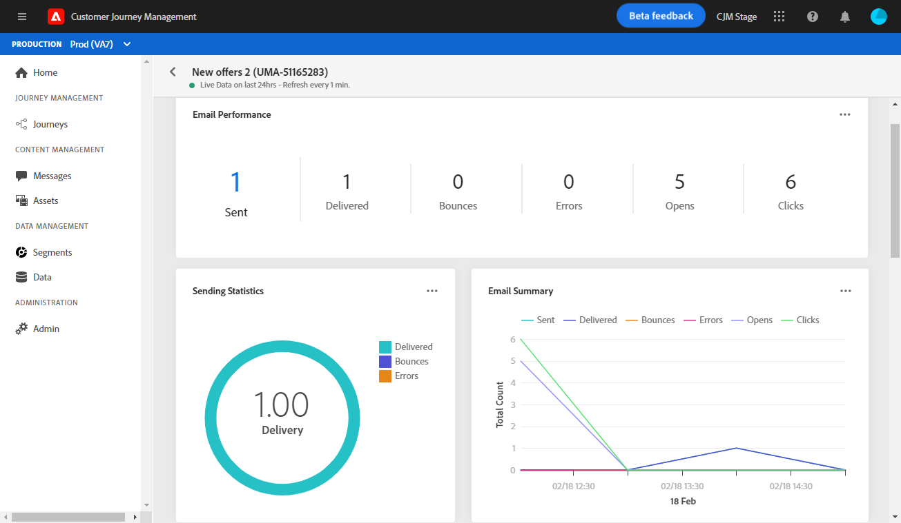

# 여정 라이브 보고서 {#journey-live-report}

여정 라이브 보고서는 **[!UICONTROL Live report]** 버튼을 클릭합니다.

여정 **[!UICONTROL Live report]** 페이지는 다음 탭에 표시됩니다.

* [여정](#journey-live)
* [이메일](#email-live)
* [푸시](#push-live)

여정 **[!UICONTROL Live report]** 은 여정의 성공 및 오류를 자세히 설명하는 서로 다른 위젯으로 구분됩니다. 필요한 경우 각 위젯의 크기를 조정하고 삭제할 수 있습니다. 자세한 내용은 다음을 참조하십시오 [섹션](live-report.md#modify-dashboard).

## 여정 탭 {#journey-live}

여정에서 **[!UICONTROL Live report]**, **[!UICONTROL Journey]** 탭에서는 여정에 대해 가장 중요한 추적 데이터에 대한 명확한 보기를 제공합니다.

**[!UICONTROL Journey Performance]** 여정을 단계별로 타겟팅된 프로필의 경로를 확인할 수 있습니다.

다음 **[!UICONTROL Journey Statistics]** 위젯에는 다음 KPI가 표시됩니다.

* **[!UICONTROL Entered profiles]**: 여정의 시작 이벤트에 도달한 총 개인 수입니다.

* **[!UICONTROL Exited profiles]**: 여정을 종료한 총 개인 수입니다.

* **[!UICONTROL Failed individual journeys]**: 성공적으로 실행되지 않은 개별 여정의 총 수입니다.

다음 **[!UICONTROL Event executed over the last 24 hours]** 및 **[!UICONTROL Events]** 위젯을 사용하면 요약 번호, 그래프 및 표를 통해 성공적으로 실행된 이벤트 중 하나를 확인할 수 있습니다.

다음 **[!UICONTROL Action executed over the last 24 hours]** 및 **[!UICONTROL Actions executed and errors]** 위젯은 작업이 트리거될 때 발생한 가장 성공적인 작업 및 오류를 나타냅니다. 작업 그래프, 표 및 요약 번호에는 다음과 같은 작업에 사용할 수 있는 데이터가 포함되어 있습니다.

* **[!UICONTROL Actions executed]**: 여정에 대해 성공적으로 실행된 총 작업 수입니다.

* **[!UICONTROL Error in actions]**: 작업에 대해 발생한 총 오류 수입니다.

<!--

>[!NOTE]
>
>The Offers widgets and metrics are only available if a decision was inserted in an email. For more information on Decision Management, refer to this [page](../offers/get-started/starting-offer-decisioning.md).

The **[!UICONTROL Offers statistic]** and **[!UICONTROL Offers statistics]** over time widgets measure your offer's success and impact on your targeted audience. It detail the main information relative to your message with KPIs:

* **[!UICONTROL Offer sent]**: Total number of sends for the offer.

* **[!UICONTROL Offer impression]**: Number of times the offer was opened in a delivery.

* **[!UICONTROL Offer clicks]**: Number of times an offer was clicked on in a delivery.
-->

## 이메일 탭 {#email-live}

여정에서 **[!UICONTROL Live report]**, **[!UICONTROL Email]** 탭에서는 여정에서 전송된 이메일 게재와 관련된 주요 정보를 자세히 설명합니다.

특정 이메일 게재에 대한 자세한 내용은 [이메일 라이브 보고서](email-live-report.md) 섹션을 참조하십시오.

다음 **[!UICONTROL Email Sending Statistics]** 위젯은 메시지에 대한 주요 정보를 자세히 설명합니다.

* **[!UICONTROL Delivered]**: 보낸 총 메시지 수와 관련하여 성공적으로 보낸 메시지 수입니다.

* **[!UICONTROL Bounces]**: 총 보낸 메시지 수와 관련하여 게재 및 자동 반환 처리 중에 누적된 총 오류 수입니다.

* **[!UICONTROL Errors]**: 게재 중에 발생한 총 오류로 인해 프로필이 전송되지 않았습니다.

다음 **[!UICONTROL Sending metrics by Email]** 테이블 및 **[!UICONTROL Email Summary]** 그래프는 게재 성공에 대해 자세히 설명합니다.

* **[!UICONTROL Sent]**: 게재에 대한 총 전송 수입니다.

* **[!UICONTROL Delivered]**: 보낸 총 메시지 수와 관련하여 성공적으로 보낸 메시지 수입니다.

* **[!UICONTROL Bounces]**: 총 보낸 메시지 수와 관련하여 게재 및 자동 반환 처리 중에 누적된 총 오류 수입니다.

* **[!UICONTROL Errors]**: 게재 중에 발생한 총 오류로 인해 프로필이 전송되지 않았습니다.

* **[!UICONTROL Opens]**: 게재에서 메시지를 연 횟수입니다.

* **[!UICONTROL Clicks]**: 게재에서 콘텐츠를 클릭한 횟수입니다.

* **[!UICONTROL Unsubscribe]**: 구독 취소 링크에 대한 클릭 수입니다.

* **[!UICONTROL Spam complaints]**: 메시지가 스팸 또는 정크 메일로 선언된 횟수입니다.

다음 **[!UICONTROL Bounce Reasons]**, **[!UICONTROL Bounce categories]** 및 **[!UICONTROL Hard and bounce - by Email]** 위젯에는 다음과 같이 바운스된 메시지와 관련하여 사용할 수 있는 데이터가 포함되어 있습니다.

* **[!UICONTROL Hard bounce]**: 잘못된 이메일 주소와 같은 총 영구 오류 수입니다. 여기에는 알 수 없는 사용자와 같이 주소가 유효하지 않다는 오류 메시지가 명시적으로 표시됩니다.

* **[!UICONTROL Soft bounce]**: 전체 받은 편지함과 같은 총 임시 오류 수입니다.

* **[!UICONTROL Ignored]**: 부재 중 또는 기술 오류(예: 발신자 유형이 postmaster인 경우)와 같은 총 임시 수입니다.

다음 **[!UICONTROL Error Reasons]** 그래프 및 표를 사용하면 게재 중에 발생한 오류를 확인할 수 있습니다.

## 푸시 탭 {#push-live}

여정에서 **[!UICONTROL Live report]**, **[!UICONTROL Push]** 탭에서 여정에 전송된 푸시 게재와 관련된 기본 정보를 자세히 설명합니다.

특정 푸시 게재에 대한 자세한 내용은 [라이브 보고서 푸시](push-live-report.md) 섹션을 참조하십시오.

**[!UICONTROL Push notification sending performance]**, **[!UICONTROL Push notification summary]** 및 **[!UICONTROL Sending metrics - by Push]** 위젯은 메시지에 대한 기본 정보를 자세히 설명합니다.

* **[!UICONTROL Sent]**: 게재에 대한 총 전송 수입니다.

* **[!UICONTROL Delivered]**: 보낸 총 메시지 수와 관련하여 성공적으로 보낸 메시지 수입니다.

* **[!UICONTROL Bounces]**: 총 보낸 메시지 수와 관련하여 게재 및 자동 반환 처리 중에 누적된 총 오류 수입니다.

* **[!UICONTROL Errors]**: 게재 중에 발생한 총 오류로 인해 프로필이 전송되지 않았습니다.

* **[!UICONTROL Opens]**: 게재에서 메시지를 연 횟수입니다.

* **[!UICONTROL Actions]**: 전달된 푸시 알림에 대한 총 작업 수(예: 단추 클릭 또는 취소)

* **[!UICONTROL Engagements]**: 이 푸시 알림에 대한 총 열기 및 작업 수(즉, 프로필이 푸시를 열었는지 또는 단추를 클릭했는지 여부)입니다.

다음 **[!UICONTROL Error Reasons]** 그래프 및 표를 사용하면 게재 중에 발생한 오류를 확인할 수 있습니다.

다음 **[!UICONTROL Tracking by platform]**, **[!UICONTROL Sending by platform]** 및 **[!UICONTROL Breakdown by platform]** 그래프 및 표는 운영 시스템에 따라 푸시 알림의 성공을 자세히 설명합니다.

다음 **[!UICONTROL Sending statistics - Failed]** 위젯을 사용하면 발생한 오류 및 바운스 수를 확인할 수 있습니다.
