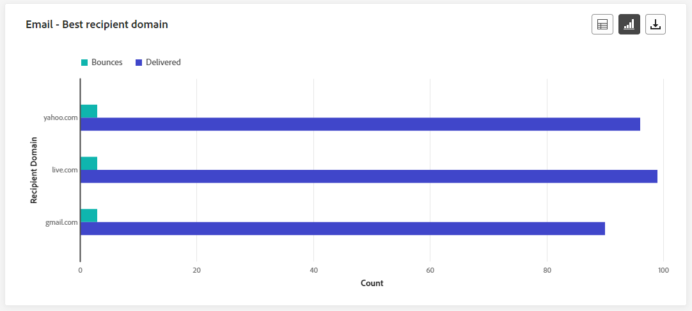

# 여정 라이브 보고서 {#journey-live-report}

>[!CONTEXTUALHELP]
>id="ajo_journey_live_report"
>title="여정 라이브 보고서"
>abstract="여정 라이브 보고서를 통해 지난 24시간의 여정 영향과 성과만 실시간으로 측정하고 시각화할 수 있습니다. 보고서는 여정 성공 사례와 오류를 자세히 설명하는 여러 위젯으로 나눠집니다. 위젯 크기를 조정하거나 위젯을 제거하여 각 보고 대시보드를 수정할 수 있습니다."

[최근 24시간] 탭에서 액세스할 수 있는 라이브 보고서에는 지난 24시간 내에 발생한 이벤트를 표시하며 이벤트 발생에서 최소 2분 간격이 있습니다. 이에 비해 글로벌 보고서는 최소 2시간 전에 발생한 이벤트에 중점을 두며 선택한 기간 동안의 이벤트를 다룹니다.

여정 라이브 보고서는 여정에서 **[!UICONTROL 보고서 보기]** 단추를 클릭합니다.

여정 **[!UICONTROL 라이브 보고서]** 다음 탭이 있는 페이지가 표시됩니다.

* [여정](#journey-live)
* [이메일](#email-live)
* [푸시](#push-live)
* [SMS](#sms-live)
* [인앱](#in-app-live)

여정 **[!UICONTROL 라이브 보고서]** 은 여정의 성공 및 오류를 자세히 설명하는 다양한 위젯으로 나뉩니다. 필요한 경우 각 위젯의 크기를 조정하고 삭제할 수 있습니다. 자세한 내용은 다음을 참조하십시오. [섹션](live-report.md#modify-dashboard).

Adobe Journey Optimizer에서 사용할 수 있는 모든 지표의 자세한 목록은 을 참조하십시오. [이 페이지](live-report.md#list-of-components-live).

## 여정 탭 {#journey-live}

여정에서 **[!UICONTROL 라이브 보고서]**, **[!UICONTROL 여정]** 탭에서는 여정에 대한 가장 중요한 추적 데이터를 명확하게 볼 수 있습니다.

### 여정 성능 {#journey-performance}

>[!CONTEXTUALHELP]
>id="ajo_journey_performance_live"
>title="여정 성능"
>abstract="여정 성능 위젯을 사용하여 지난 24시간 동안 여정을 진행하는 동안 타겟팅된 프로필 경로를 시각적으로 추적할 수 있습니다."

**[!UICONTROL 여정 성능]** 에서는 여정을 단계별로 타겟팅된 프로필의 경로를 볼 수 있습니다.

### 여정 통계 {#journey-statistics}

>[!CONTEXTUALHELP]
>id="ajo_journey_statistics_live"
>title="여정 통계"
>abstract="여정 통계 주요 성과 지표(KPI)는 여정과 관련된 지난 24시간 동안의 필수 지표에 대한 심층 분석을 제공하는 포괄적인 대시보드 역할을 합니다."

다음 **[!UICONTROL 여정 통계]** 주요 성과 지표(KPI)는 모든 것을 아우르는 대시보드로 작동하여 지난 24시간 동안 여정과 연결된 필수 지표에 대한 분석을 제공합니다. 여기에는 입력된 프로필 수 및 실패한 개별 여정의 인스턴스 등 세부 정보가 포함되며, 이를 통해 여정의 효율성과 참여 수준에 대한 포괄적인 통찰력을 제공합니다.

+++ 여정 통계 지표에 대해 자세히 알아보기

* **[!UICONTROL 입력된 프로필]**: 여정의 시작 이벤트에 도달한 총 개인 수입니다.

* **[!UICONTROL 종료된 프로필]**: 여정을 종료한 총 개인 수

* **[!UICONTROL 실패한 개별 여정]**: 성공적으로 실행되지 않은 총 개별 여정 수입니다.
+++

### 지난 24시간 동안 실행된 액션 {#action-executed}

>[!CONTEXTUALHELP]
>id="ajo_journey_actions_executed_live"
>title="지난 24시간 동안 실행된 액션"
>abstract="지난 24시간 동안 실행된 액션 위젯은 최근 성능의 스냅샷을 통해 지난 24시간 동안 실행된 액션의 효율성을 보여 줍니다."

다음 **[!UICONTROL 지난 24시간 동안 실행된 액션]** 위젯은 작업이 트리거될 때 발생한 가장 성공적인 작업을 나타냅니다.

+++ 지난 24시간 지표 동안 실행된 작업에 대해 자세히 알아보기

* **[!UICONTROL 실행된 액션]**: 여정에 대해 성공적으로 실행된 총 작업 수입니다.

* **[!UICONTROL 액션 도중 오류 발생]**: 작업에 대해 발생한 총 오류 수입니다.

+++

### 실행된 액션 및 오류 {#actions-errors}

>[!CONTEXTUALHELP]
>id="ajo_journey_actions_executed__errors_live"
>title="실행된 액션 및 오류"
>abstract="실행된 액션 및 오류 위젯은 지난 24시간 동안 액션을 트리거하는 동안 발생한 가장 성공적인 액션과 오류를 보여 줍니다. 이 위젯은 성공적인 실행과 발생한 오류에 대한 포괄적인 개요를 통해 최근 액션 성능에 대한 유용한 인사이트를 제공합니다."

다음 **[!UICONTROL 실행된 액션 및 오류]** 위젯은 지난 24시간 동안 작업이 트리거될 때 발생한 가장 성공적인 작업 및 오류를 나타냅니다.

+++ 실행된 액션 및 오류 지표에 대해 자세히 알아보기

* **[!UICONTROL 실행된 액션]**: 여정에 대해 성공적으로 실행된 총 작업 수입니다.

* **[!UICONTROL 액션 도중 오류 발생]**: 작업에 대해 발생한 총 오류 수입니다.

+++

### 액션 오류 이유 {#actions-error-reasons}

>[!CONTEXTUALHELP]
>id="ajo_journey_actions_errors_live"
>title="액션 오류 이유"
>abstract="액션 오류 이유 테이블과 그래프는 액션 실행 중에 발생한 오류에 대한 자세한 요약을 제공하며 지난 24시간 동안 발생했을 수 있는 문제에 대한 포괄적인 개요를 제공합니다."

다음 **[!UICONTROL 액션 오류 이유]** 표 및 그래프는 지난 24시간 내에 작업을 실행하는 동안 발생한 오류에 대한 포괄적인 개요를 제공합니다.

### 액션별 오류 유형 {#error-type-actions}

>[!CONTEXTUALHELP]
>id="ajo_journey_actions_error_type_live"
>title="액션별 오류 유형"
>abstract="액션별 오류 유형 테이블과 그래프는 지난 24시간 동안 액션을 실행할 때마다 발생한 오류에 대한 자세한 개요를 제공합니다."

다음 **[!UICONTROL 액션에 의한 오류 유형]** 표 및 그래프는 지난 24시간 이내에 작업의 각 실행에 대해 발생한 오류에 대한 포괄적인 개요를 제공합니다.

### 지난 24시간 동안 실행된 이벤트 {#event-executed-24hours}

>[!CONTEXTUALHELP]
>id="ajo_journey_event_24hours_live"
>title="지난 24시간 동안 실행된 이벤트"
>abstract="지난 24시간 동안 실행된 이벤트 위젯을 사용하여 지난 24시간 동안 성공적으로 실행된 이벤트를 확인할 수 있습니다. "

다음 **[!UICONTROL 지난 24시간 동안 실행된 이벤트]** 위젯을 사용하면 지난 24시간 이내에 성공적으로 실행된 이벤트를 식별할 수 있습니다.

### 이벤트 {#events}

>[!CONTEXTUALHELP]
>id="ajo_journey_events_live"
>title="이벤트"
>abstract="이벤트 위젯을 통해 성공적으로 실행된 이벤트를 포괄적으로 볼 수 있으며 24시간 동안의 자세한 인사이트에 대한 요약 번호, 그래프 및 표를 제공합니다."

다음 **[!UICONTROL 이벤트]** 위젯을 사용하면 요약 번호, 그래프 및 표를 통해 어떤 이벤트가 성공적으로 실행되었는지 확인할 수 있습니다.

### 원본을 통한 이벤트 {#events-origin}

>[!CONTEXTUALHELP]
>id="ajo_journey_events_origin_live"
>title="원본을 통한 이벤트"
>abstract="원본을 통한 이벤트 테이블과 그래프는 지난 24시간 동안 이벤트가 성공적으로 수신되었는지를 보여 줍니다. 이러한 시각적 표현을 통해 효과적으로 수신된 이벤트를 정확하게 확인하고, 여정 내 각 이벤트의 성능과 영향에 대한 유용한 인사이트를 제공할 수 있습니다."

다음 **[!UICONTROL 원본을 통한 이벤트]** 표와 그래프는 지난 24시간 동안 이벤트를 성공적으로 수신한 것에 대한 자세한 관점을 제공합니다. 이러한 시각적 표현을 통해 효과적으로 수신된 이벤트를 정확하게 식별할 수 있으므로, 여정 내 개별 이벤트의 성능과 영향에 대한 중요한 통찰력을 제공할 수 있습니다.

## 이메일 탭 {#email-live}

여정에서 **[!UICONTROL 라이브 보고서]**, **[!UICONTROL 이메일]** 탭은 여정에 전송된 이메일과 관련된 기본 정보를 자세히 설명합니다.

### 이메일 - 전송 성능 {#email-sending-performance}

>[!CONTEXTUALHELP]
>id="ajo_journey_email_sending_performance_live"
>title="이메일 - 전송 성능"
>abstract="이메일 - 전송 통계 그래프에는 지난 24시간 동안의 대상 지정 또는 게재됨 등과 같은 이메일에 대한 필수 데이터가 요약되어 있습니다."

다음 **[!UICONTROL 이메일 - 전송 성능]** graph에서는 여정에서 보낸 이메일과 관련된 데이터를 종합적으로 볼 수 있으므로 지난 24시간 동안 발생한 게재 및 바운스 수와 같은 주요 지표에 대한 통찰력을 얻을 수 있습니다. 이를 통해 이메일 전송 프로세스를 자세히 분석할 수 있으므로 여정의 효율성과 성능에 대한 중요한 정보를 제공합니다.

+++ 이메일에 대한 자세한 내용 - 성능 지표 보내기

* **[!UICONTROL 전달됨]**: 성공적으로 전송된 이메일 수입니다.

* **[!UICONTROL 바운스]**: 전송 프로세스 및 자동 반환 처리 중에 누적된 총 오류입니다.

* **[!UICONTROL 오류]**: 전송 프로세스 중에 발생하여 프로필로 전송되지 않은 총 오류 수입니다.

* **[!UICONTROL 다시 시도]**: 다시 시도 큐에 있는 이메일 수입니다.

+++

### 이메일 - 통계 {#email-stat}

>[!CONTEXTUALHELP]
>id="ajo_journey_email_statistics_live"
>title="이메일 - 통계"
>abstract="이메일 - 통계 테이블은 지난 24시간 동안 이메일의 프로필 활동에 대한 데이터를 제공합니다."

다음 **[!UICONTROL 이메일 - 통계]** 표는 지난 24시간 동안 여정의 이메일과 관련된 필수 데이터에 대한 포괄적인 요약을 제공합니다. 여기에는 타겟팅된 대상의 크기 및 성공적으로 전달된 이메일 수와 같은 주요 지표가 자세히 설명되어 있으며, 이를 통해 이메일 및 여정의 효율성 및 도달 가능성에 대한 중요한 통찰력을 제공합니다.

+++ 이메일 전송 통계 지표에 대해 자세히 알아보기

* **[!UICONTROL 타깃팅됨]**: 전송 프로세스 중에 처리된 총 메시지 수입니다.

* **[!UICONTROL 제외됨]**: Adobe Journey Optimizer에서 제외된 프로필 수입니다.

* **[!UICONTROL 전송됨]**: 전송된 총 이메일 수입니다.

* **[!UICONTROL 전달됨]**: 보낸 총 메시지 수와 관련하여 성공적으로 전송된 이메일 수입니다.

* **[!UICONTROL 바운스]**: 전송 프로세스 및 자동 반환 처리 중에 누적된 총 보낸 메시지 수와 관련된 오류의 수입니다.

* **[!UICONTROL 오류]**: 전송 프로세스 중에 발생하여 프로필로 전송되지 않은 총 오류 수입니다.

* **[!UICONTROL 열림]**: 이메일을 연 횟수입니다.

* **[!UICONTROL 클릭수]**: 이메일에서 클릭한 콘텐츠 수입니다.

* **[!UICONTROL 구독 취소]**: 구독 취소 링크의 클릭 수입니다.

* **[!UICONTROL 스팸 고객 불만]**: 메시지가 스팸 또는 정크로 선언된 횟수입니다.

* **[!UICONTROL 다시 시도]**: 다시 시도 큐에 있는 이메일 수입니다.

+++

### 이메일 - 날짜별 성능 {#email-perf-date}

>[!CONTEXTUALHELP]
>id="ajo_journey_email_performance_bydate_live"
>title="이메일 - 날짜별 성능"
>abstract="이메일 - 날짜별 성능 그래프는 전송된 이메일에 관한 지난 24시간의 포괄적인 데이터를 제공하여 게재 및 바운스와 같은 주요 지표에 대한 인사이트를 제공하고 이메일 전송 프로세스를 자세하게 분석할 수 있습니다."

다음 **[!UICONTROL 이메일 - 일자별 성능]** 위젯은 그래프를 통해 제공되는 이메일과 관련된 주요 정보에 대한 자세한 개요를 제공하여 지난 24시간 동안의 성능 트렌드에 대한 통찰력을 제공합니다.

+++ 이메일에서 자세히 알아보기 - 일자별 성능 지표

* **[!UICONTROL 전송됨]**: 전송된 총 이메일 수입니다.

* **[!UICONTROL 전달됨]**: 성공적으로 전송된 이메일 수입니다.

* **[!UICONTROL 바운스]**: 전송 프로세스 및 자동 반환 처리 중에 누적된 총 오류입니다.

* **[!UICONTROL 오류]**: 전송 프로세스 중에 발생하여 프로필로 전송되지 않은 총 오류 수입니다.

* **[!UICONTROL 열림]**: 이메일을 연 횟수입니다.

* **[!UICONTROL 클릭수]**: 이메일에서 콘텐츠를 클릭한 횟수입니다.

* **[!UICONTROL 구독 취소]**: 구독 취소 링크의 클릭 수입니다.

* **[!UICONTROL 스팸 고객 불만]**: 메시지가 스팸 또는 정크로 선언된 횟수입니다.

+++

### 이메일 - 바운스 범주 및 이유 {#email-bounce-categories}

>[!CONTEXTUALHELP]
>id="ajo_journey_email_bounces_live"
>title="이메일 - 바운스 범주 및 이유"
>abstract="XX"

다음 **[!UICONTROL 바운스 이유]** 및 **[!UICONTROL 바운스 범주]** 위젯은 바운스된 메시지와 관련된 사용 가능한 데이터를 컴파일하여 지난 24시간 동안 이메일 바운스 뒤에 있는 특정 이유 및 범주에 대한 자세한 통찰력을 제공합니다.

바운스에 대한 자세한 내용은 [비표시 목록](../reports/suppression-list.md) 페이지를 가리키도록 업데이트하는 중입니다.

+++ 이메일에서 자세히 알아보기 - 반송 범주 및 이유 지표

* **[!UICONTROL 하드 바운스]**: 잘못된 이메일 주소와 같은 영구 오류의 총 수입니다. 여기에는 알 수 없는 사용자와 같이 주소가 유효하지 않다는 오류 메시지가 명시적으로 표시됩니다.

* **[!UICONTROL 소프트 바운스]**: 전체 받은 편지함과 같은 총 임시 오류 수.

* **[!UICONTROL 무시됨]**: 부재 중이거나 기술적인 오류와 같은 총 임시 항목 수(발신자 유형이 postmaster인 경우).

+++

### 이메일 - 오류 이유 {#email-error-reasons}

>[!CONTEXTUALHELP]
>id="ajo_journey_email_errors_live"
>title="이메일 - 오류 이유"
>abstract="이메일 - 오류 이유 그래프와 테이블을 통해 지난 24시간 동안 전송 프로세스 중에 발생한 특정 오류를 확인할 수 있습니다."

다음 **[!UICONTROL 오류 원인]** 그래프 및 표는 지난 24시간 동안의 전송 프로세스 동안 발생한 특정 오류에 대한 가시성을 제공하여 오류의 특성 및 발생에 대한 중요한 정보를 제공합니다.

### 이메일 - 제외된 이유 {#email-excluded}

>[!CONTEXTUALHELP]
>id="ajo_journey_email_excluded_live"
>title="이메일 - 제외된 이유"
>abstract="제외된 이유 그래프와 테이블에서는 타겟팅된 대상자에서 제외된 사용자 프로필이 지난 24시간 동안 메시지를 받지 못하는 다양한 요인을 보여 줍니다."

다음 **[!UICONTROL 제외된 이유]** 그래프와 표는 타겟팅된 대상에서 사용자 프로필을 제외하여 지난 24시간 동안 메시지가 수신되지 않은 다양한 요인에 대한 포괄적인 보기를 제공합니다.

을(를) 참조하십시오 [이 페이지](exclusion-list.md) 포괄적인 제외 이유 목록.

### 이메일 - 최고 수신자 도메인 {#email-best-recipient}

>[!CONTEXTUALHELP]
>id="ajo_journey_email_best_recipient_live"
>title="이메일 - 최고 수신자 도메인"
>abstract="이메일 - 최고 수신자 도메인 그래프 및 테이블에서는 수신자가 이메일을 열 때 가장 자주 사용하는 도메인에 대한 자세한 분석을 통해 지난 24시간의 수신자 동작에 대한 귀중한 인사이트를 제공합니다."

다음 **[!UICONTROL 이메일 - 최고 수신자 도메인]** 그래프 및 표는 프로필이 지난 24시간 이내에 이메일을 여는 데 가장 많이 사용하는 도메인에 대한 자세한 분류를 제공합니다. 이렇게 하면 프로필 동작에 대한 중요한 통찰력을 제공하여 선호하는 플랫폼을 이해하는 데 도움이 됩니다.

### 이메일 - 오퍼 {#email-offers}

>[!CONTEXTUALHELP]
>id="ajo_journey_email_offers_live"
>title="이메일 - 오퍼"
>abstract="오퍼 통계 및 오퍼 상세 통계 위젯은 지난 24시간의 오퍼 성과에 대한 포괄적인 인사이트를 통해 시간 경과에 따른 영향을 자세히 분석하고 심층적인 이해를 위한 자세한 통계를 제공합니다."

>[!NOTE]
>
>오퍼 위젯 및 지표는 결정이 이메일에 삽입된 경우에만 사용할 수 있습니다. 의사 결정 관리에 대한 자세한 내용은 다음을 참조하십시오. [페이지](../offers/get-started/starting-offer-decisioning.md).

다음 **[!UICONTROL 오퍼 통계]** 및 **[!UICONTROL 시간에 따른 오퍼 통계]** 위젯은 오퍼의 성공과 타겟팅된 대상자에 대한 영향을 측정합니다. KPI를 사용하여 메시지와 관련된 기본 정보를 자세히 설명합니다.

+++ 이메일에 대한 자세한 내용 - 오퍼 지표

* **[!UICONTROL 전송된 오퍼]**: 오퍼에 대한 총 전송 수입니다.

* **[!UICONTROL 오퍼 노출 횟수]**: 이메일에서 오퍼를 연 횟수입니다.

* **[!UICONTROL 오퍼 클릭수]**: 이메일에서 오퍼를 클릭한 횟수입니다.

+++

### 이메일 - 최적화 {#email-sto}

>[!CONTEXTUALHELP]
>id="ajo_journey_email_optimization_live"
>title="이메일 - 최적화"
>abstract="전송 시간 최적화와 최적화 및 비 최적화 위젯은 메시지에 대한 지난 24시간의 자세한 정보를 제공하며 최적화 여부를 강조합니다."

>[!NOTE]
>
>다음 **[!UICONTROL 전송 시간 최적화]** 및 **[!UICONTROL 최적화 및 비최적화]** 위젯은 게재에 대해 전송 시간 최적화 옵션이 활성화된 경우에만 사용할 수 있습니다. 전송 시간 최적화에 대한 자세한 내용은 을 참조하십시오. [이 페이지](../building-journeys/journeys-message.md#send-time-optimization).

다음 **[!UICONTROL 전송 시간 최적화]** 및 **[!UICONTROL 최적화 및 비최적화]** 위젯은 전송 방식에 따라 이메일의 성공 여부를 자세히 설명합니다(최적화 또는 일반).

+++ 전송 시간 최적화 및 최적화 대 비최적화 지표에 대해 자세히 알아보기

* **[!UICONTROL 전달됨]**: 성공적으로 전송된 메시지 수와 총 전송된 메시지 수
* **[!UICONTROL 바운스]**: 전송 프로세스 및 자동 반환 처리 중에 누적된 총 보낸 메시지 수와 관련된 오류의 수입니다.

* **[!UICONTROL 전송됨]**: 여정에 대해 전송된 총 이메일 수입니다.

* **[!UICONTROL 열림]**: 여정에서 이메일이 열린 횟수입니다.

* **[!UICONTROL 클릭수]**: 이메일에서 클릭한 콘텐츠 수입니다.

+++

## 푸시 알림 탭 {#push-live}

여정에서 **[!UICONTROL 라이브 보고서]**, **[!UICONTROL 푸시 알림]** 탭에서는 여정에서 보낸 푸시 알림과 관련된 기본 정보를 자세히 설명합니다.

### 푸시 알림 - 전송 성능 {#push-sending-performance}

>[!CONTEXTUALHELP]
>id="ajo_journey_push_sending_performance_live"
>title="푸시 알림 - 전송 성능"
>abstract="푸시 알림 전송 성능 그래프에는 지난 24시간 동안의 오류, 게재된 메시지 등 푸시 알림에 대한 필수 데이터가 요약되어 있습니다."

다음 **[!UICONTROL 푸시 알림 전송 성능]** 그래프는 지난 24시간 이내에 전송된 푸시 알림과 관련된 데이터에 대한 완전한 개요를 제공합니다. 전달 및 바운스와 같은 필수 지표에 대한 통찰력을 제공하여 푸시 알림 전송 프로세스를 자세히 검토할 수 있습니다.

+++ 푸시 알림 - 성능 지표 전송에 대해 자세히 알아보기

* **[!UICONTROL 전달됨]**: 성공적으로 전송된 메시지 수입니다.

* **[!UICONTROL 바운스]**: 전송 프로세스 및 자동 반환 처리 중에 누적된 총 오류입니다.

* **[!UICONTROL 오류]**: 전송 프로세스 중에 발생하여 프로필로 전송되지 않은 총 오류 수입니다.

+++

### 푸시 알림 - 통계 {#push-statistics}

>[!CONTEXTUALHELP]
>id="ajo_journey_push_statistics_live"
>title="푸시 알림 - 통계"
>abstract="푸시 통계 테이블은 지난 24시간 동안의 푸시 알림 수신자 활동에 대한 데이터를 제공합니다."

**[!UICONTROL 푸시 알림 - 통계]** 표는 지난 24시간 내에 타겟팅된 메시지 수 및 성공적으로 전달된 메시지 수와 같은 주요 지표를 포함하여 푸시 알림과 관련된 필수 데이터에 대한 간결한 요약을 제공합니다.

+++ 푸시 알림에 대한 자세한 내용 - 통계 지표

* **[!UICONTROL 타깃팅됨]**: 이메일 또는 SMS 전송과 같은 작업을 타겟팅한 프로필 수입니다.

* **[!UICONTROL 제외됨]**: Adobe Journey Optimizer에서 제외된 프로필 수입니다.

* **[!UICONTROL 전송됨]**: 전송된 총 푸시 알림 수입니다.

* **[!UICONTROL 전달됨]**: 정상적으로 전송된 푸시 알림 수입니다.

* **[!UICONTROL 바운스]**: 전송 프로세스 및 자동 반환 처리 중에 누적된 총 오류입니다.

* **[!UICONTROL 오류]**: 전송 프로세스 중에 발생하여 프로필로 전송되지 않은 총 오류 수입니다.

* **[!UICONTROL 열림]**: 푸시 알림이 열린 횟수입니다.
+++

### 푸시 알림 - 플랫폼별 분류 {#push-breakdown}

>[!CONTEXTUALHELP]
>id="ajo_journey_push_breakdown_live"
>title="푸시 알림 - 플랫폼별 분류"
>abstract="플랫폼별 분류 그래프 및 테이블은 수신자의 운영 체제를 기준으로 지난 24시간 동안의 푸시 알림 성공 분류를 제공합니다."

다음 **[!UICONTROL 푸시 알림 - 플랫폼별 분류]** 그래프 및 표는 푸시 알림의 성공에 대한 자세한 분석을 제공하며 프로필의 운영 체제를 기반으로 하는 통찰력을 제공합니다. 이 분류는 푸시 알림이 다양한 플랫폼에서 어떻게 작동하는지 이해하는 데 도움이 됩니다.

### 푸시 알림 - 전송 요약 {#push-sending-summary}

>[!CONTEXTUALHELP]
>id="ajo_journey_push_sending_summary_live"
>title="푸시 알림 - 전송 요약"
>abstract="푸시 알림 전송 요약 그래프에는 지난 24시간 동안 전송된 푸시 알림에 사용 가능한 데이터가 표시됩니다."

다음 **[!UICONTROL 푸시 알림 요약]** 그래프는 지난 24시간 내에 푸시 알림 활동에 대한 분석을 표시하는 동적 표현을 제공합니다. 이 그래픽 표현은 전송된 푸시 알림에 대한 포괄적인 분석을 제공합니다.

+++ 푸시 알림 - 요약 지표 전송에 대해 자세히 알아보기

* **[!UICONTROL 전송됨]**: 전송된 총 푸시 알림 수입니다.

* **[!UICONTROL 전달됨]**: 정상적으로 전송된 푸시 알림 수입니다.

* **[!UICONTROL 바운스]**: 전송 프로세스 및 자동 반환 처리 중에 누적된 총 오류입니다.

* **[!UICONTROL 오류]**: 전송 프로세스 중에 발생하여 프로필로 전송되지 않은 총 오류 수입니다.

* **[!UICONTROL 열림]**: 푸시 알림이 열린 횟수입니다.

* **[!UICONTROL 클릭수]**: 푸시 알림에서 콘텐츠를 클릭한 횟수

+++

### 푸시 알림 - 오류 이유 {#push-error}

>[!CONTEXTUALHELP]
>id="ajo_journey_push_error_reasons_live"
>title="푸시 알림 - 오류 이유"
>abstract="오류 이유 그래프와 테이블을 통해 전송 프로세스 중에 지난 24시간 동안 발생한 특정 오류를 확인할 수 있습니다."

다음 **[!UICONTROL 오류 원인]** 표 및 그래프는 푸시 알림 전송 프로세스 중에 발생한 특정 오류를 식별하는 기능을 제공하며 지난 24시간 동안 발생한 모든 문제에 대한 자세한 통찰력을 제공합니다.

### 푸시 알림 - 제외된 이유 {#push-excluded}

>[!CONTEXTUALHELP]
>id="ajo_journey_push_excluded_reasons_live"
>title="푸시 알림 - 제외된 이유"
>abstract="제외된 이유 그래프와 테이블에서는 타겟팅된 대상자에서 제외된 사용자 프로필이 지난 24시간 동안 메시지를 받지 못하는 다양한 요인을 보여 줍니다."

다음 **[!UICONTROL 제외된 이유]** 그래프 및 표에는 타겟팅된 프로필에서 제외된 사용자 프로필이 지난 24시간 내에 푸시 알림을 받지 못한 다양한 이유가 표시됩니다.

을(를) 참조하십시오 [이 페이지](exclusion-list.md) 포괄적인 제외 이유 목록.

## SMS 탭 {#sms-live}

### SMS - 통계 {#sms-statistics}

>[!CONTEXTUALHELP]
>id="ajo_journey_sms_statistics_live"
>title="SMS - 통계"
>abstract="SMS 전송 통계 테이블에는 지난 24시간 동안의 대상 지정 메시지 또는 게재된 메시지 등과 같은 SMS 메시지에 대한 필수 데이터가 요약되어 있습니다."

다음 **[!UICONTROL SMS - 통계]** 표는 타겟팅된 메시지 수 및 지난 24시간 동안 성공적으로 전달된 메시지 수와 같은 주요 지표를 포함하여 SMS 메시지와 관련된 필수 데이터에 대한 간결한 요약을 제공합니다.

+++ SMS에 대해 자세히 알아보기 - 통계 지표

* **[!UICONTROL 타깃팅됨]**: 타겟 프로필로 적합한 사용자 프로필 수입니다.

* **[!UICONTROL 제외됨]**: 타겟팅된 프로필에서 제외되고 메시지를 받지 못한 사용자 프로필 수입니다.

* **[!UICONTROL 전송됨]**: 전송된 총 SMS 메시지 수

* **[!UICONTROL 열림]**: SMS 메시지를 연 횟수입니다.

* **[!UICONTROL 클릭수]**: SMS 메시지에서 콘텐츠를 클릭한 횟수입니다.

* **[!UICONTROL 바운스]**: 전송 프로세스 및 자동 반환 처리 중 누적된 총 오류 수입니다.

* **[!UICONTROL 오류]**: 전송 프로세스 중에 발생하여 프로필로 전송되지 않은 총 오류 수입니다.

+++

### SMS - 날짜별 성능 {#sms-performance}

>[!CONTEXTUALHELP]
>id="ajo_journey_sms_performance_live"
>title="SMS - 날짜별 성능"
>abstract="SMS 날짜별 성능 위젯은 그래픽 표시를 통해 지난 24시간 동안의 메시지에 대한 주요 정보를 제공합니다."

다음 **[!UICONTROL SMS - 일자별 성능]** 위젯은 그래프를 통해 제공되는 메시지와 관련된 주요 정보에 대한 자세한 개요를 제공하여 지난 24시간 동안의 성능 트렌드에 대한 통찰력을 제공합니다.

+++ SMS에 대한 자세한 내용 - 일자별 성능 지표

* **[!UICONTROL 전송됨]**: 전송된 총 SMS 메시지 수

* **[!UICONTROL 바운스]**: 전송 프로세스 및 자동 반환 처리 중에 누적된 총 오류입니다.

* **[!UICONTROL 오류]**: 전송 프로세스 중에 발생하여 프로필로 전송되지 않은 총 오류 수입니다.

+++

### SMS - 바운스 이유 {#sms-bounces}

>[!CONTEXTUALHELP]
>id="ajo_journey_sms_bounces_live"
>title="SMS - 바운스 이유"
>abstract="바운스 이유 그래프와 테이블에는 지난 24시간 동안 바운스된 메시지와 관련하여 사용 가능한 데이터가 있습니다."

다음 **[!UICONTROL SMS - 반송 원인]** 그래프 및 표는 반송된 SMS 메시지와 관련된 데이터에 대한 포괄적인 개요를 제공하여 지난 24시간 동안 SMS 메시지 반송 인스턴스가 발생한 구체적 이유에 대한 중요한 통찰력을 제공합니다.

### SMS - 오류 이유 {#sms-error}

>[!CONTEXTUALHELP]
>id="ajo_journey_sms_error_live"
>title="SMS - 오류 이유"
>abstract="SMS - 오류 이유 그래프와 테이블을 통해 전송 프로세스 중에 지난 24시간 동안 발생한 특정 오류를 확인할 수 있습니다."

다음 **[!UICONTROL SMS - 오류 원인]** 그래프 및 표를 사용하면 SMS 메시지를 전송하는 동안 발생한 특정 오류를 식별할 수 있으므로 지난 24시간 동안 발생한 문제를 철저히 분석할 수 있습니다.

### SMS - 제외된 이유 {#sms-excluded}

>[!CONTEXTUALHELP]
>id="ajo_journey_sms_excluded_live"
>title="SMS - 제외된 이유"
>abstract="제외된 이유 그래프와 테이블에서는 타겟팅된 대상자에서 제외된 사용자 프로필이 지난 24시간 동안 메시지를 받지 못하는 다양한 요인을 보여 줍니다."

다음 **[!UICONTROL SMS - 제외된 이유]** 그래프 및 표는 타겟팅된 대상에서 사용자 프로필을 제외하여 SMS 메시지를 받지 못하게 한 다양한 요인을 시각적으로 보여 줍니다.

을(를) 참조하십시오 [이 페이지](exclusion-list.md) 포괄적인 제외 이유 목록.

<!--
### SMS - Clicks by links {#sms-clicks}

The **[!UICONTROL SMS - Clicks by links]** widget offers essential insights into your visitors' engagement with the URLs included in your messages, providing valuable information about which links attract the most interaction within the last 24 hours.
-->

## 인앱 탭 {#in-app-live}

### 인앱 성능 {#inapp-performance}

>[!CONTEXTUALHELP]
>id="ajo_journey_inapp_performance_live"
>title="인앱 성능"
>abstract="인앱 성능 KPI는 지난 24시간 동안 방문자의 인앱 메시지 참여에 대한 필수 인사이트를 제공합니다."

다음 **[!UICONTROL 인앱 성능]** KPI는 지난 24시간 동안 프로필의 인앱 메시지 참여에 대한 중요한 통찰력을 제공하며, 여정에 포함된 인앱 메시지의 효과와 영향을 평가하는 데 중요한 지표를 제공합니다.

+++ 인앱 - 성능 지표에 대해 자세히 알아보기

* **[!UICONTROL 노출 횟수]**: 모든 사용자에게 전달된 총 인앱 메시지 수입니다.

  >[!NOTE]
  >
  >노출이 카운트되도록 하려면 사용자가 다음 두 가지 기준을 충족해야 합니다.
  >* 여정 내 특정 인앱 활동에 도달하여 달성되는 인앱 경험 내 자격 조건.
  >* 트리거 규칙에 지정된 조건을 충족합니다.
  > 
  >제2 기준으로 인해, 타겟팅된 프로필의 수와 고유 노출의 수 간에 주목할 만한 변동이 있을 수 있다.

* **[!UICONTROL 상호 작용]**: 인앱 메시지를 사용한 총 참여 수입니다. 여기에는 클릭, 해제 또는 기타 상호 작용과 같이 사용자가 수행한 모든 작업이 포함됩니다.

+++

### 인앱 요약 {#inapp-summary}

>[!CONTEXTUALHELP]
>id="ajo_journey_inapp_summary_live"
>title="인앱 요약"
>abstract="인앱 요약 그래프에서는 지난 24시간 동안의 인앱 노출 횟수 및 상호 작용 진행 상황을 보여 줍니다."

다음 **[!UICONTROL 인앱 요약]** 그래프는 지난 24시간 동안 인앱 노출 횟수 및 상호 작용의 진행 상황을 보여주며 인앱 메시지 성능에 대한 포괄적인 개요를 제공합니다.

+++ 인앱 요약 지표에 대해 자세히 알아보기

* **[!UICONTROL 노출 횟수]**: 모든 사용자에게 전달된 총 인앱 메시지 수입니다.

  >[!NOTE]
  >
  >노출이 카운트되도록 하려면 사용자가 다음 두 가지 기준을 충족해야 합니다.
  >* 여정 내 특정 인앱 활동에 도달하여 달성되는 인앱 경험 내 자격 조건.
  >* 트리거 규칙에 지정된 조건을 충족합니다.
  > 
  >제2 기준으로 인해, 타겟팅된 프로필의 수와 고유 노출의 수 간에 주목할 만한 변동이 있을 수 있다.

* **[!UICONTROL 상호 작용]**: 인앱 메시지를 사용한 총 참여 수입니다. 여기에는 클릭, 해제 또는 기타 상호 작용과 같이 사용자가 수행한 모든 작업이 포함됩니다.

+++

### 유형별 상호 작용 {#interactions-type}

>[!CONTEXTUALHELP]
>id="ajo_journey_inapp_interactions_live"
>title="유형별 상호 작용"
>abstract="유형별 상호 작용 그래프와 테이블에서는 지난 24시간 동안의 클릭, 해제 또는 상호 작용을 추적하여 사용자가 인앱 메시지와 상호 작용하는 방식을 자세히 설명합니다."

다음 **[!UICONTROL 유형별 상호 작용]** 그래프 및 표는 사용자가 클릭, 무시 또는 상호 작용을 추적하여 인앱 메시지와 상호 작용하는 방법을 자세히 설명합니다.
