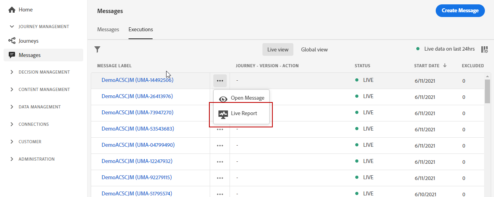

# 라이브 보고서 시작 {#live-report}

를 사용하십시오 **[!UICONTROL Live report]** 기본 제공 대시보드에서 여정 및 메시지의 영향과 성과를 실시간으로 측정하고 시각화할 수 있습니다.
데이터는 **[!UICONTROL Live report]** 게재가 전송되거나 여정이 실행되는 즉시.

* 여정 컨텍스트에서 여정 또는 게재를 타깃팅하려면 **[!UICONTROL Journeys]** 메뉴에서 여정에 액세스하여 **[!UICONTROL Live report]** 아이콘. 그런 다음 여정, 이메일 및 푸시 라이브 보고서를 찾을 수 있습니다.

   

* 특정 게재를 타깃팅하려면 **[!UICONTROL Live view]** 의 **[!UICONTROL Executions]** 메시지의 탭을 선택합니다. **[!UICONTROL Live Report]** 선택한 게재의 고급 메뉴에서 을 클릭합니다.

   

## 대시보드 사용자 지정 {#modify-dashboard}

위젯의 크기 조정 또는 제거를 통해 각 보고 대시보드를 수정할 수 있습니다. 위젯을 변경하면 현재 사용자의 대시보드에만 영향을 줍니다. 다른 사용자는 자신의 대시보드 또는 기본적으로 설정된 대시보드를 보게 됩니다.

1. 전환 표시줄을 사용하여 보고서에서 테스트 이벤트를 제외하려는 경우 선택합니다. 테스트 이벤트에 대한 자세한 내용은 [이 페이지](../building-journeys/testing-the-journey.md).

   

1. 위젯의 크기를 조정하거나 제거하려면 **[!UICONTROL Modify]**.

   

1. 오른쪽 아래 모서리를 드래그하여 위젯 크기를 조정합니다.

   

1. 클릭 **[!UICONTROL Remove]** 위젯을 제거하려면 필요하지 않습니다.

   

1. 위젯의 표시 순서와 크기에 만족하면 을(를) 클릭합니다 **[!UICONTROL Save]**.

이제 대시보드가 저장됩니다. 나중에 라이브 보고서를 사용할 수 있도록 다른 변경 사항이 다시 적용됩니다. 필요한 경우 **[!UICONTROL Reset]** 기본 위젯 및 위젯의 순서를 복원하는 옵션입니다.
