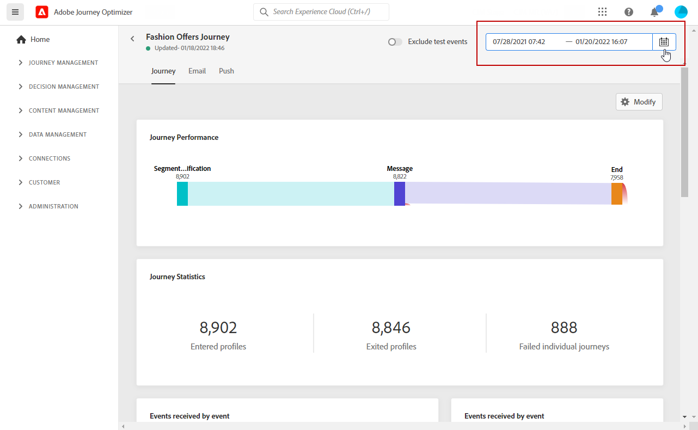

# 라이브 보고서 {#live-report}

**[!UICONTROL Live report]**을 사용하면 내장된 대시보드를 통해 여정 및 메시지 성능의 효과를 실시간으로 측정하고 시각화할 수 있습니다.
배달 또는 여정이 실행되면 **[!UICONTROL Live report]**&#x200B;에서 배달 데이터를 사용할 수 있습니다.

* 여정에서 여정 또는 배달을 타깃팅하려면 **[!UICONTROL Journeys]** 메뉴에서 여정에 액세스하여 **[!UICONTROL Live report]** 아이콘을 클릭합니다. 그런 다음 여정, 이메일 및 푸시 라이브 보고서를 찾을 수 있습니다.

   

* 특정 배달을 타게팅하려면 메시지의 **[!UICONTROL Executions]** 탭의 **[!UICONTROL Live view]**&#x200B;에서 선택한 배달에 대한 고급 메뉴에서 **[!UICONTROL Live Report]**&#x200B;를 선택합니다.

   

## 대시보드 {#modify-dashboard} 수정

각 보고 대시보드는 위젯의 크기를 조절하거나 제거하여 수정할 수 있습니다. 위젯을 변경하면 현재 사용자의 대시보드에만 영향을 줍니다. 다른 사용자는 자신의 대시보드 또는 기본적으로 설정된 대시보드를 보게 됩니다.

1. 라이브 보고서에서 **[!UICONTROL Modify dashboard]**&#x200B;을 클릭합니다.

   

1. 오른쪽 아래 모서리를 드래그하여 위젯 크기를 조정합니다.

   

1. 바운스를 추적할 필요가 없는 다른 위젯을 제거하려면 **[!UICONTROL Remove]**&#x200B;을 클릭합니다.

   

1. 위젯의 표시 순서와 크기에 만족하면 **[!UICONTROL Save]**&#x200B;을 클릭합니다.

이제 대시보드가 저장됩니다. 나중에 라이브 보고서를 사용하기 위해 다른 변경 내용이 다시 적용됩니다. 필요한 경우 **[!UICONTROL Reset]** 옵션을 사용하여 기본 위젯 및 위젯 순서를 복원합니다.
