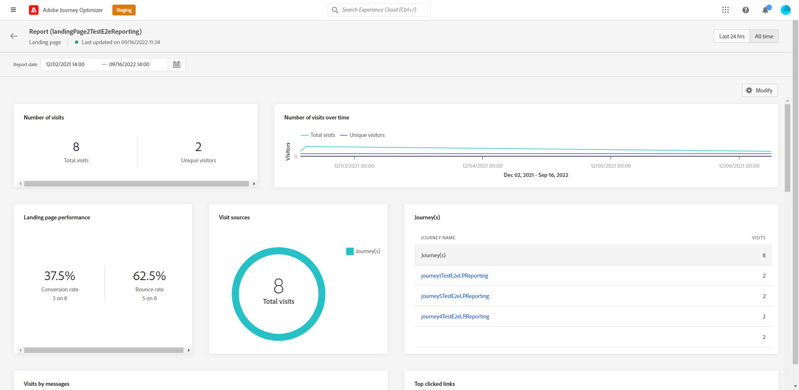

# 랜딩 페이지 글로벌 보고서 {#lp-report-global}

>[!CONTEXTUALHELP]
>id="ajo_landing_page_global_report"
>title="랜딩 페이지 글로벌 보고서"
>abstract="랜딩 페이지 글로벌 보고서를 사용하여 선택된 기간에 대해 랜딩 페이지의 영향을 측정할 수 있습니다. 보고서는 랜딩 페이지 성공 사례와 오류를 자세히 설명하는 여러 위젯으로 나눠집니다. 위젯 크기를 조정하거나 위젯을 제거하여 각 보고 대시보드를 수정할 수 있습니다."

>[!AVAILABILITY]
>
>현재 보고 경험은 2025년 1월부터 종료됩니다. 이 날짜 이후에는 새로운 보고 경험이 표준이 됩니다. 원활한 전환을 위해 새로운 기능을 숙지하는 것이 좋습니다. [Journey Optimizer 새 보고 인터페이스를 시작합니다.](report-gs-cja.md)

모든 시간 탭에서 액세스할 수 있는 글로벌 보고서에는 최소 2시간 전에 발생한 이벤트와 선택한 기간 동안의 이벤트가 표시됩니다. 반면 라이브 보고서는 이벤트 발생으로부터 최소 2분의 시간 간격을 가지고 지난 24시간 내에 발생한 이벤트에 중점을 둡니다.

보고서에 액세스하려면 선택한 랜딩 페이지의 고급 메뉴에서 **[!UICONTROL 보고서]**&#x200B;를 선택하십시오.

랜딩 페이지 **[!UICONTROL 전역 보고서]**&#x200B;은(는) 게재의 성공 및 오류를 자세히 설명하는 여러 위젯으로 나뉩니다. 필요한 경우 각 위젯의 크기를 조정하고 삭제할 수 있습니다. 자세한 내용은 이 [섹션](global-report.md)을 참조하세요.

+++랜딩 페이지 글로벌 보고서에 사용할 수 있는 다양한 지표 및 위젯에 대해 자세히 알아보십시오.

**[!UICONTROL 방문 횟수]** 및 **[!UICONTROL 시간 경과에 따른 방문 횟수]** 위젯을 사용하면 다음 지표와 함께 그래프 및 KPI를 통해 선택한 기간 동안의 랜딩 페이지의 영향을 볼 수 있습니다.

* **[!UICONTROL 총 방문 수]**: 여정 및 외부 소스에서 받은 랜딩 페이지에 대한 총 방문 수입니다(받는 사람 한 명의 여러 방문 포함).

* **[!UICONTROL 고유 방문자 수]**: 랜딩 페이지를 방문한 사람 수, 받는 사람 한 명의 여러 방문은 고려되지 않습니다.

**[!UICONTROL 랜딩 페이지 성능]** 위젯은 KPI를 통해 메시지와 관련된 기본 정보를 자세히 설명합니다.

* **[!UICONTROL 전환율]**: 총 방문 횟수와 관련하여 랜딩 페이지와 상호 작용한(예: 양식을 구독한) 사람의 수입니다.

* **[!UICONTROL 바운스 비율]**: 총 방문 수와 관련하여 랜딩 페이지와 상호 작용하지 않고 구독 작업을 완료하지 않은 사용자 수입니다.

**[!UICONTROL 방문 소스]** 위젯은 방문자가 랜딩 페이지에 액세스하는 방법을 나타냅니다.

* **[!UICONTROL 여정]**: 여정에서 랜딩 페이지로 이동한 횟수입니다.

* **[!UICONTROL 기타 원본]**: 여정 대신 외부 원본에서 랜딩 페이지에 대한 방문 수입니다.

**[!UICONTROL 가장 많이 클릭한 링크]**&#x200B;는 게재와 방문자의 상호 작용을 식별합니다.

* **[!UICONTROL 클릭 수]**: 랜딩 페이지에서 콘텐츠를 클릭한 횟수입니다.

* **[!UICONTROL 클릭률]**: 랜딩 페이지의 클릭률.

**[!UICONTROL 여정]** 위젯은 여정의 랜딩 페이지 방문 횟수를 나타냅니다.

* **[!UICONTROL 방문]**: 한 명의 받는 사람의 여러 방문을 포함하여 랜딩 페이지에 대한 방문 수입니다.

**[!UICONTROL 다른 원본]** 위젯은 여정 대신 외부 원본에서 랜딩 페이지에 대한 방문 횟수를 나타냅니다.

**[!UICONTROL 메시지를 통한 방문]** / **[!UICONTROL 메시지를 통한 전환]** 그래프는 보낸 메시지에 따라 해당 기간 동안 랜딩 페이지와 성공적으로 상호 작용한 총 방문 및 사용자 수를 나타냅니다.

**[!UICONTROL 채널별 방문]**/채널별 전환&#x200B;]**그래프는 채널에 따라 해당 기간 동안 랜딩 페이지와 성공적으로 상호 작용한 총 방문 및 사용자 수를 나타냅니다.**[!UICONTROL 
+++

Adobe Journey Optimizer에서 사용할 수 있는 모든 지표의 자세한 목록은 [이 페이지](global-report.md#list-of-components-global)를 참조하세요.
