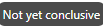

# 캠페인 글로벌 보고서 {#objective-report}

Campaign 글로벌 보고서는 Campaign에서 **[!UICONTROL 보고서 보기]** 단추를 클릭합니다.

캠페인 **[!UICONTROL 글로벌 보고서]** 은 캠페인의 성공 및 오류를 자세히 설명하는 다양한 위젯으로 나뉩니다. 필요한 경우 각 위젯의 크기를 조정하고 삭제할 수 있습니다. 자세한 내용은 다음을 참조하십시오. [섹션](../reports/global-report.md#modify-dashboard).

Adobe Journey Optimizer에서 사용할 수 있는 모든 지표의 자세한 목록은 을 참조하십시오. [이 페이지](global-report.md#list-of-components-global.md)

## 캠페인 탭 {#campaign-global-objectives}

### 게재 {#delivery-global-objectives}

다음 **[!UICONTROL 캠페인 통계]** 위젯은 캠페인과 관련된 기본 정보를 자세히 설명합니다.

* **[!UICONTROL 입력된 프로필]**: 여정을 시작한 프로필 수입니다.

* **[!UICONTROL 액션 전달됨]**: 여정의 작업이 전달된 총 고유 횟수입니다.

* **[!UICONTROL %의 액션 실패]**: 작업이 전달된 총 고유 횟수와 비교하여 여정에서 작업이 실패한 총 고유 횟수입니다.

### 목표 보고서 {#objective-global}

>[!AVAILABILITY]
>
>다음 **목표 보고서** 기능은 현재 조직 집합(제한된 가용성)에만 사용할 수 있습니다. 자세한 내용은 Adobe 직원에게 문의하십시오.

다음 **[!UICONTROL 목표]** 탭을 사용하면 한 개의 특정 지표를 타겟팅하여 게재의 보고서를 더 세밀하게 조정할 수 있습니다.

다음 **[!UICONTROL 목표]** 나열된 항목이 다음에 링크됨 **[!UICONTROL 데이터 세트]** 추가 정보를 검색할 수 있도록 시스템에 대한 연결을 정의합니다. 기본 제공 목록 **[!UICONTROL 목표]** 은(는) 사용할 수 있지만, 새 을(를) 추가하여 자신의 을(를) 추가할 수 있습니다. **[!UICONTROL 데이터 세트]**. 자세한 절차는 다음을 참조하십시오. [섹션](../campaigns/reporting-configuration.md).

타깃팅할 목표를 선택한 후 다음 두 가지 **[!UICONTROL 성능 개요]** 및 **[!UICONTROL 캠페인 목표]** 위젯은 게재 성능에 대한 자세한 요약을 제공합니다.

포함 **[!UICONTROL 캠페인 목표]** 위젯을 사용하여 기본 목표를 다른 지표와 비교하도록 선택할 수도 있습니다.

### 실험 보고서 {#experimentation-global-objectives}

다음 **[!UICONTROL 실험]** 탭은 각 변형의 성능에 대한 주요 인사이트를 제공하며 가장 성공적인 변형을 식별합니다.

최상의 수행자를 정의하는 데 시간이 걸릴 수 있습니다. 이 아이콘으로 표시됩니다. .

+++실험 보고서에 사용할 수 있는 다양한 지표 및 위젯에 대해 자세히 알아보십시오.

다음 **[!UICONTROL 실험 결과]** 위젯은 각 변형의 성능을 자세히 설명합니다. 에서 처리 중 하나를 선택하여 기준선을 변경할 수 있습니다. **[!UICONTROL 기준선]** 드롭다운. 최고의 치료법은 별 모양 아이콘으로 표시됩니다.

이 표에는 다음 지표가 나와 있습니다.

* **[!UICONTROL 기준선 위로 올림]**: 기준선에 대한 해당 처리의 전환율 개선 비율을 측정합니다.

* **[!UICONTROL 신뢰도]**: 주어진 치료가 기준 치료와 동일하다는 증거. [자세히 알아보기](../campaigns/experiment-calculations.md#understand-confidence)

* **[!UICONTROL 고유 아웃바운드 클릭수]**: 아웃바운드 채널 간 총 클릭 수.

* **[!UICONTROL 프로필]**: 이 처리의 대상으로 삼은 프로필 수입니다.

* **[!UICONTROL 고유 아웃바운드 클릭수/프로필]**: 실험을 만들 때 이전에 선택한 성공 지표의 총 값을 프로필 수로 나눈 값입니다.

다음 **[!UICONTROL 신뢰 구간]** 그래프는 개선 관련 불확실성을 측정합니다. 기준 처리와 최상의 성능 처리 사이의 성능 차이를 백분율로 자세히 설명합니다. [자세히 알아보기](../campaigns/experiment-calculations.md#confidence-intervals).
+++

이러한 결과에 대한 자세한 내용과 해석 방법은 다음을 참조하십시오. [이 페이지](../campaigns/get-started-experiment.md#interpret-results).

