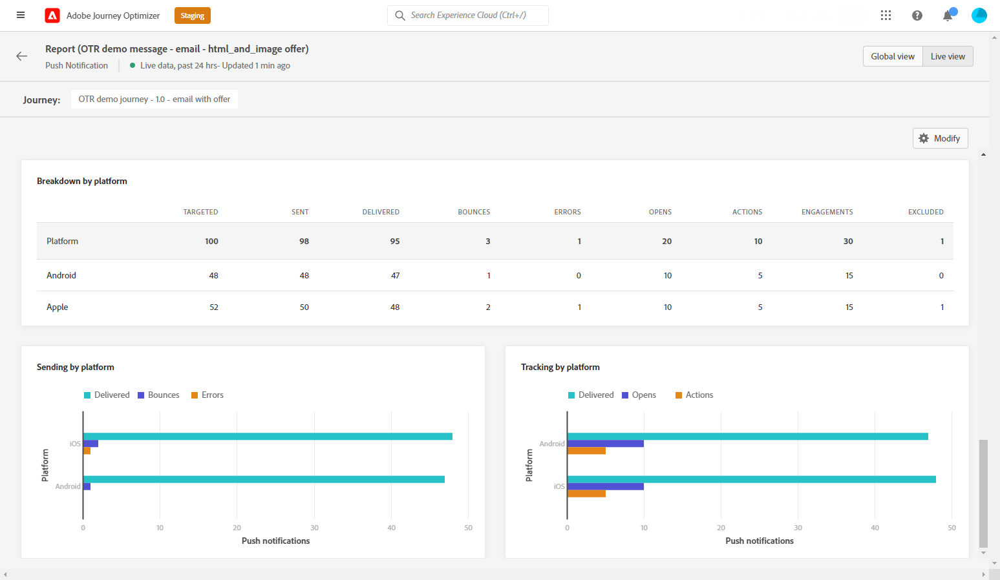

# 라이브 보고서 푸시 {#push-live-report}

푸시 **[!UICONTROL Live report]** 하나의 특정 푸시 전달만 타깃팅합니다.

에서 **[!UICONTROL Executions]** 의 탭 **[!UICONTROL Messages]** 메뉴, 선택 **[!UICONTROL Live view]** 그런 다음 선택한 게재의 고급 메뉴에서 을(를) 선택합니다 **[!UICONTROL Live report]**.

푸시 **[!UICONTROL Live report]** 은 게재의 성공 및 오류를 설명하는 다른 위젯으로 구분됩니다. 필요한 경우 각 위젯의 크기를 조정하고 삭제할 수 있습니다. 자세한 정보는 다음을 참조하십시오 [섹션](live-report.md#modify-dashboard).

**[!UICONTROL Push notification performance]** 및 **[!UICONTROL Push notification summary]** 위젯은 그래프 및 KPI를 사용하여 메시지에 대한 기본 정보를 자세히 설명합니다.

* **[!UICONTROL Sent]**: 게재에 대한 총 전송 수입니다.

* **[!UICONTROL Delivered]**: 보낸 총 메시지 수와 관련하여 성공적으로 보낸 메시지 수입니다.

* **[!UICONTROL Bounces]**: 총 보낸 메시지 수와 관련하여 게재 및 자동 반환 처리 중에 누적된 총 오류 수입니다.

* **[!UICONTROL Errors]**: 게재 중에 발생한 총 오류로 인해 프로필이 전송되지 않았습니다.

* **[!UICONTROL Opens]**: 게재에서 메시지를 연 횟수입니다.

* **[!UICONTROL Actions]**: 전달된 푸시 알림에 대한 총 작업 수(예: 단추 클릭 또는 취소)

* **[!UICONTROL Engagements]**: 이 푸시 알림에 대한 총 열기 및 작업 수(즉, 프로필이 푸시를 열었는지 또는 단추를 클릭했는지 여부)입니다.

다음 **[!UICONTROL Sending metrics - by push]** 표는 게재의 성공에 대해 자세히 설명합니다.

* **[!UICONTROL Targeted]**: 이 게재의 타겟 프로필로 자격을 얻은 사용자 프로필 수입니다.

* **[!UICONTROL Excluded]**: 타겟팅된 프로필에서 제외되고 메시지를 받지 못한 사용자 프로필 수입니다.

* **[!UICONTROL Sent]**: 게재에 대한 총 전송 수입니다.

* **[!UICONTROL Delivered]**: 보낸 총 메시지 수와 관련하여 성공적으로 보낸 메시지 수입니다.

* **[!UICONTROL Bounces]**: 총 보낸 메시지 수와 관련하여 게재 및 자동 반환 처리 중에 누적된 총 오류 수입니다.

* **[!UICONTROL Errors]**: 게재 중에 발생한 총 오류로 인해 프로필이 전송되지 않았습니다.

* **[!UICONTROL Opens]**: 게재에서 메시지를 연 횟수입니다.

다음 **[!UICONTROL Tracking by platform]**, **[!UICONTROL Sending by platform]** 및 **[!UICONTROL Breakdown by platform]** 그래프 및 표는 운영 시스템에 따라 푸시 알림의 성공을 자세히 설명합니다.

다음 **[!UICONTROL Sending statistics - Failed]** 위젯을 사용하면 발생한 오류 및 바운스 수를 확인할 수 있습니다.

다음 **[!UICONTROL Error Reasons]** 그래프 및 표를 사용하면 게재 중에 발생한 오류를 확인할 수 있습니다.
