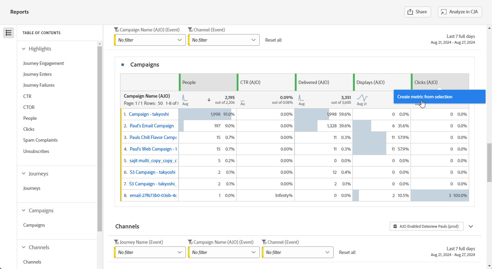

# 보고서 관리 {#channel-cja-manage}

## Customer Journey Analytics에서 분석 {#analyze}

모든 보고서에서 사용할 수 있는 **[!UICONTROL CJA에서 분석]** 기능을 활용하여 **[!DNL Customer Journey Analytics]** 라이선스로 데이터 분석 환경을 향상시킵니다.

이 강력한 옵션을 사용하면 **[!DNL Customer Journey Analytics]** 환경으로 원활하게 리디렉션되어 보고서를 광범위하게 개인화할 수 있습니다. 전문 Customer Journey Analytics 지표로 위젯을 보강하여 통찰력을 완전히 새로운 수준으로 끌어올릴 수 있습니다.

[Customer Journey Analytics 인터페이스에 대해 자세히 알아보세요.](https://experienceleague.adobe.com/en/docs/analytics-platform/using/cja-overview/cja-getting-started)

## 보고서 기간 정의 {#report-period}

보고서에 액세스할 때 보고서의 오른쪽 상단 모서리에 있는 기간 필터를 적용할 수 있습니다.

기본적으로 캠페인 또는 여정에 대한 필터 기간은 시작 및 종료 날짜로 설정됩니다. 종료 날짜가 없는 경우 필터는 기본적으로 현재 날짜로 설정됩니다.

필터를 수정하려면 사용자 지정 시작 날짜 및 기간을 선택하거나 지난 주 또는 2개월 전과 같은 사전 설정 옵션 중에서 선택할 수 있습니다.

필터가 적용되거나 수정되면 보고서가 자동으로 업데이트됩니다.

## 보고서 내보내기 {#export-reports}

서로 다른 보고서를 PDF 또는 CSV 형식으로 쉽게 내보내 공유하거나 인쇄할 수 있습니다. 보고서를 내보내는 단계는 아래 탭에 자세히 설명되어 있습니다.

>[!BEGINTABS]

>[!TAB 보고서를 CSV 파일로 내보내기]

1. 보고서에서 **[!UICONTROL 내보내기]**&#x200B;를 클릭하고 **[!UICONTROL CSV 파일]**&#x200B;을 선택하여 전체 보고서 수준에서 CSV 파일을 생성합니다.

   

1. 파일은 자동으로 다운로드되며 로컬 파일에서 찾을 수 있습니다.

   보고서 수준에서 파일을 생성한 경우, 여기에는 제목 및 데이터를 포함하여 각 위젯에 대한 자세한 정보가 포함됩니다.

>[!TAB 보고서를 PDF 파일로 내보내기]

1. 보고서에서 **[!UICONTROL 내보내기]**&#x200B;를 클릭하고 **[!UICONTROL 파일 PDF]**&#x200B;을 선택합니다.

   

1. 다운로드를 요청한 후 **[!UICONTROL 다운로드]**&#x200B;를 클릭합니다.

   

1. 파일이 브라우저에서 자동으로 열립니다.

이제 보고서를 pdf 파일에서 보거나 다운로드하거나 공유할 수 있습니다.

>[!ENDTABS]

## 간단한 지표 만들기 {#create-simple-metric}

보고서 내에서 직접 사용자 지정 계산된 지표를 만들 수 있습니다. 특정 보고 요구에 맞는 방식으로 두 개의 기존 지표를 결합하여 맞춤형 인사이트를 생성하고 데이터를 더 잘 분석할 수 있습니다.

1. 새 지표를 추가하려는 보고서에 액세스해 보십시오.

1. 보고서의 테이블에서 `Shift` 또는 `CTRL/CMD` 키를 누른 채로 원하는 지표를 선택합니다. 그런 다음 마우스 오른쪽 단추를 클릭하고 **[!UICONTROL 선택 항목에서 지표 만들기]**&#x200B;를 선택합니다.

   지표를 두 개 이상 선택하는 경우 처음 두 개만 지표 빌더에서 사용됩니다.

   

1. 계산된 지표 빌더에서 **[!UICONTROL 제목]** 필드에 입력하여 새 지표의 이름을 지정합니다. **[!UICONTROL 설명]**&#x200B;을 추가할 수도 있습니다.

   >[!NOTE]
   >
   >Customer Journey Analytics을 소유하고 있는 경우 추가 옵션을 사용하여 지표를 추가로 개인화할 수 있습니다. [자세히 알아보기](https://experienceleague.adobe.com/en/docs/analytics-platform/using/cja-components/cja-calcmetrics/cm-workflow/cm-build-metrics#areas-of-the-calculated-metrics-builder)

1. 적절한 **[!UICONTROL 소수점 이하 자리 수]**&#x200B;를 선택하고 지표를 표시할 방법을 기준으로 **[!UICONTROL 형식]**(소수점, 시간, 백분율 또는 통화)을 선택합니다.

1. 더하기, 빼기, 곱하기 또는 나누기와 같이 지표가 계산되는 방식을 결정하는 연산자를 선택합니다.

   

1. 필요한 경우 구성 요소의 순서를 변경할 수 있습니다.

1. 설정이 만족스러우면 **[!UICONTROL 적용]**&#x200B;을 클릭하여 새 지표를 완료합니다.

1. 새 지표는 보고서의 원래 지표 옆에 표시됩니다.

   

보고서를 PDF 또는 CSV로 내보낼 때 새로 만든 지표가 포함됩니다. 하지만 보고서를 종료하면 보고서에서 제거됩니다.

## 탐색적 분석을 사용하여 데이터 탐색 {#exploratory}

Exploratory Analysis 도구를 사용하여 선택한 **[!UICONTROL Dimension]** 및 **[!UICONTROL 지표]**&#x200B;에서 표와 시각화를 쉽게 만들 수 있습니다. 이 도구를 사용하면 데이터 탐색을 간소화하여 정보를 쉽게 자동으로 사용자 정의하고 분석할 수 있습니다. 자세한 내용은 [이 설명서](https://experienceleague.adobe.com/en/docs/analytics/analyze/analysis-workspace/panels/quickinsight)를 참조하세요.

1. Exploratory Analysis를 사용할 보고서에 액세스해 보십시오.

1. 왼쪽 레일 메뉴에서 Exploratory Analysis 메뉴를 선택합니다.

   

1. 드롭다운 메뉴를 사용하여 **[!UICONTROL Dimension]** 및 **[!UICONTROL 지표]**&#x200B;을(를) 선택하여 쿼리를 작성하십시오. 필요한 경우 **[!UICONTROL 세그먼트]**&#x200B;를 선택할 수도 있습니다.

   

1. 분석의 날짜 범위를 정의하여 초점을 맞출 기간을 지정합니다. 기본적으로 날짜 범위는 보고서 패널에서 사용되는 날짜 범위로 설정됩니다.

1. 추가 차원을 포함하려면 **[!UICONTROL 분류 추가]** 또는 **[!UICONTROL 지표 추가]** 옵션을 사용하여 보다 자세한 데이터 분류를 허용합니다.

   최대 3개의 **[!UICONTROL Dimension]**, **[!UICONTROL 지표]** 및 **[!UICONTROL 세그먼트]**&#x200B;만 추가할 수 있습니다.

이제 사용자 지정된 테이블 및 시각화 도구를 사용하여 데이터를 분석할 수 있습니다.

<!--## Create a down-funnel metric {#down-funnel}

1. Create a new journey or open an existing one. [Learn more on journey creation](../building-journeys/journey-gs.md)

1. On the canvas editor, select the option to "add a metric".

c. In the metric selector, choose whichever conversion metric seems appropriate and publish your journey

d. Open the report for the journey that you added the metric to and ensure that the metric has been added to the table alongside all the other pre-configured metrics.
-->

## 보고 데이터에서 대상자 만들기 {#create-audience}

>[!IMPORTANT]
>
>각 조직은 25개의 대상자를 게시하는 것으로 제한됩니다. 또한 사용자는 시간당 최대 5개, 일별 20개의 대상을 게시할 수 있습니다.
> 일회성 대상의 수명은 48시간입니다. 따라서 25개의 대상이 해당 기간 내에 게시되는 경우 추가 대상은 48시간 기간이 경과한 후에만 게시할 수 있습니다.

이제 테이블 내에서 특정 데이터를 선택하고 이러한 선택 항목으로 대상을 직접 만들 수 있으므로 대상 만들기 프로세스를 간소화하고 단순화할 수 있습니다.

1. 대상자로 변형할 데이터가 포함된 보고서 테이블로 이동하는 것부터 시작합니다.

1. 원하는 셀을 마우스 오른쪽 단추로 클릭하고 **[!UICONTROL 대상 만들기]**&#x200B;를 선택합니다.

   또는 노드를 선택하고 마우스 오른쪽 단추로 클릭하여 **[!UICONTROL 여정 캔버스]** 위젯에서 대상 만들기를 시작할 수 있습니다.

1. **[!UICONTROL 대상 만들기]** 창에서 **[!UICONTROL 이름]**&#x200B;을(를) 입력하고 게시하려는 대상에 대해 **[!UICONTROL 일회성 날짜 범위]**&#x200B;를 설정하십시오.

   >[!NOTE]
   >
   >Customer Journey Analytics을 소유하고 있는 경우 추가 옵션을 사용하여 지표를 추가로 개인화할 수 있습니다. [자세히 알아보기](https://experienceleague.adobe.com/en/docs/analytics-platform/using/cja-components/audiences/publish)

   

1. **[!UICONTROL 만들기]** 단추를 클릭하여 대상 만들기를 완료합니다. 이 프로세스를 완료하는 데 시간이 걸릴 수 있습니다.

이제 여정 또는 캠페인으로 새로 생성된 대상자를 계속 사용할 수 있습니다.

