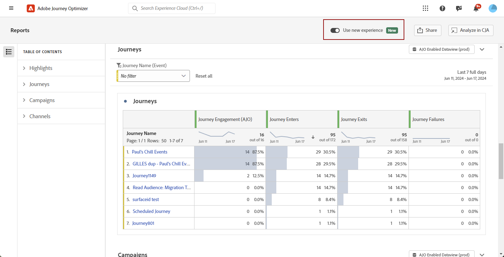

# 새 보고 인터페이스 시작 {#channel-report-gs-cja}

>[!NOTE]
>
> Journey Optimizer의 기존 보고로 되돌리려면 **[!UICONTROL 새 경험 사용]** 옵션을 선택합니다.

이제 Journey Optimizer 보고는 Customer Journey Analytics 기능과 완전히 통합되어 두 플랫폼 간에 보고를 표준화하고 데이터 일관성 및 안정성을 개선합니다. Journey Optimizer과 Customer Journey Analytics 간의 이러한 원활한 통합을 통해 성능 지표를 보다 명확하게 볼 수 있으므로 사용자가 보다 정보에 입각한 결정을 내릴 수 있습니다.

* 여정 컨텍스트에서 여정 또는 게재를 타겟팅하려면 **[!UICONTROL 여정]** 메뉴에서 여정에 액세스하고 **[!UICONTROL 보고서 보기]** 단추를 클릭합니다.

  기존 여정 목록에서 다음을 선택할 수도 있습니다. **[!UICONTROL 보고서]** 여정 을 클릭합니다. [여정 보고서에 대해 자세히 알아보기](journey-global-report-cja.md)

  

* 캠페인을 타깃팅하려면 **[!UICONTROL 캠페인]** 메뉴에서 캠페인에 액세스하고 **[!UICONTROL 보고서]** 단추를 클릭합니다.

  기존 캠페인 목록에서 다음을 선택할 수도 있습니다. **[!UICONTROL 보고서]** 을 선택합니다. [Campaign 보고서에 대해 자세히 알아보기](campaign-global-report-cja.md)

  

* 환경 내의 모든 캠페인 및 여정에 대한 지표를 타깃팅하려면 **개요** 다음 위치로 이동하여 보고 **[!UICONTROL 보고서]** 내 메뉴 **[!UICONTROL 여정 관리]** 섹션. [개요 보고서에 대해 자세히 알아보기](channel-report-cja.md)

  

## 전제 조건 {#prerequisites}

* 다음을 수행하는 경우 **아님** 자신의 Customer Journey Analytics 또는 소유하고 있지만 **아님** 모든 Customer Journey Analytics 제품 프로필에 액세스할 수 있으며 Journey Optimizer에서 권한이 관리됩니다. 이 경우 다음만 필요합니다. **[!UICONTROL 채널 보고서 보기]** 권한 또는 관련 역할. [Journey Optimizer 권한에 대해 자세히 알아보기](../administration/permissions.md)
* Customer Journey Analytics을 소유하고 있고 Customer Journey Analytics 제품 프로필에 대한 액세스 권한이 있는 경우 표준 Customer Journey Analytics 권한이 적용됩니다. Customer Journey Analytics 관리자는 적절한 사용자 액세스를 유지 관리할 책임이 있습니다. [Customer Journey Analytics 권한에 대해 자세히 알아보기](https://experienceleague.adobe.com/en/docs/analytics-platform/using/technotes/access-control)
* 다음 설정으로 Customer Journey Analytics 데이터 보기를 구성해야 합니다. **Adobe Journey Optimizer에서 기본 데이터 보기로 설정**. [데이터 보기에 대해 자세히 알아보기](https://experienceleague.adobe.com/en/docs/analytics-platform/using/cja-dataviews/create-dataview)
* Journey Optimizer 내에서 Customer Journey Analytics 대시보드에 액세스하려면 **[!UICONTROL 새 경험 사용]** 보고서에서 전환합니다.

  

