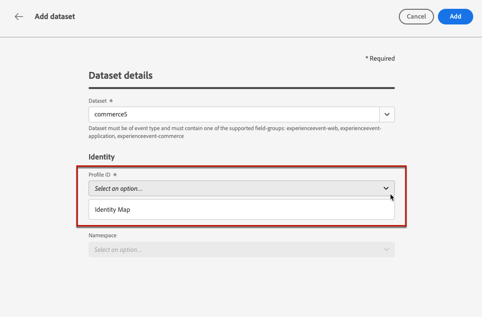

# 보고 및 실험 사전 요구 사항 {#reporting-configuration}

>[!CONTEXTUALHELP]
>id="ajo_admin_reporting_config"
>title="보고용 데이터 세트 설정"
>abstract="보고 구성을 사용하여 캠페인 보고서에서 사용되는 추가 지표를 검색할 수 있습니다. 기술 사용자가 수행해야 합니다."

>[!CONTEXTUALHELP]
>id="ajo_admin_reporting_dataset"
>title="데이터 세트 선택"
>abstract="지원되는 필드 그룹(애플리케이션 세부 사항, 상거래 세부 사항, 웹 세부 사항) 중 하나 이상이 포함되어야 하는 이벤트 유형 데이터 세트만 선택할 수 있습니다."

>[!NOTE]
>
>기술 사용자가 보고 구성을 수행해야 합니다.

데이터 소스 구성을 보고하면 보고서에서 사용할 추가 정보 검색을 위해 시스템에 대한 연결을 정의할 수 있습니다.

이 구성의 경우 보고서에 사용할 추가 요소가 포함된 데이터 세트를 한 개 이상 추가해야 합니다. 이렇게 하려면 [아래](#add-datasets) 단계를 수행합니다.

웹, 코드 기반 및 인앱 채널의 경우 데이터 수집을 위해 구성된 [데이터 세트](../data/get-started-datasets.md)도 이 보고 구성에 추가되었는지 확인해야 합니다. 그렇지 않으면 웹 및 인앱 데이터가 콘텐츠 실험 보고서에 표시되지 않습니다.

## 전제 조건

보고 구성에 데이터 세트를 추가하려면 먼저 해당 데이터 세트를 만들어야 합니다. [Adobe Experience Platform 설명서](https://experienceleague.adobe.com/docs/experience-platform/catalog/datasets/user-guide.html#create){target="_blank"}에서 방법을 알아보세요.

* 이벤트 유형 데이터 세트만 추가할 수 있습니다.

* 이러한 데이터 세트에는 `Experience Event - Proposition Interactions` [필드 그룹](https://experienceleague.adobe.com/docs/experience-platform/xdm/tutorials/create-schema-ui.html?lang=ko#field-group){target="_blank"}이(가) 포함되어야 합니다.

* 이러한 데이터 세트에는 [필드 그룹](https://experienceleague.adobe.com/docs/experience-platform/xdm/tutorials/create-schema-ui.html?lang=ko#field-group){target="_blank"} 중 하나(`Application Details`, `Commerce Details`, `Web Details`)가 포함될 수도 있습니다.

  >[!NOTE]
  >
  >다른 필드 그룹도 포함될 수 있지만 현재 Journey Optimizer 보고에서 위의 필드 그룹만 지원됩니다.

  예를 들어 이메일 캠페인이 구매 또는 주문과 같은 상거래 데이터에 미치는 영향을 알려면 `Commerce Details` 필드 그룹으로 경험 이벤트 데이터 세트를 만들어야 합니다.

  마찬가지로, 모바일 상호 작용에 대해 보고하려면 `Application Details` 필드 그룹으로 경험 이벤트 데이터 세트를 만들어야 합니다.

  <!--The metrics corresponding to each field group are listed [here](#objective-list).-->

* 이러한 필드 그룹을 하나 또는 여러 데이터 세트에서 사용할 하나 또는 여러 스키마에 추가할 수 있습니다.

>[!NOTE]
>
>[XDM 시스템 개요 설명서](https://experienceleague.adobe.com/docs/experience-platform/xdm/home.html?lang=ko-KR){target="_blank"}에서 XDM 스키마 및 필드 그룹에 대한 자세한 내용을 알아보세요.

<!--
## Objectives corresponding to each field group {#objective-list}

The table below shows which metrics will be added to the **[!UICONTROL Objectives]** tab of your campaign reports for each field group.

| Field group | Objectives |
|--- |--- |
| Commerce Details | Price Total Payment Amount (Unique) Checkouts (Unique) Product List Adds (Unique) Product List Opens (Unique) Product List Removal (Unique) Product List Views (Unique) Product Views (Unique) Purchases (Unique) Save For Laters Product Price Total Product Quantity |
| Application Details | (Unique) App Launches First App Launches (Unique) App Installs (Unique) App Upgrades |
| Web Details | (Unique) Page Views |
-->

## 데이터 세트 추가 {#add-datasets}

>[!NOTE]
>
>새로 만든 모든 데이터 세트는 Customer Journey Analytics 보고서에서만 사용할 수 있습니다.

1. **[!UICONTROL 관리]** 메뉴에서 **[!UICONTROL 구성]**&#x200B;을 선택합니다. **[!UICONTROL 보고]** 섹션에서 **[!UICONTROL 관리]**&#x200B;를 클릭합니다.

   

   이미 추가된 데이터 세트 목록이 표시됩니다.

1. **[!UICONTROL 데이터 집합]** 탭에서 **[!UICONTROL 데이터 집합 추가]**&#x200B;를 클릭합니다.

   

   >[!NOTE]
   >
   >**[!UICONTROL 시스템 데이터 세트]** 탭을 선택하면 시스템에서 만든 데이터 세트만 표시됩니다. 다른 데이터 세트를 추가할 수 없습니다.

1. **[!UICONTROL 데이터 집합]** 드롭다운 목록에서 보고서에 사용할 데이터 집합을 선택합니다.

   >[!CAUTION]
   >
   >지원되는 [필드 그룹](https://experienceleague.adobe.com/docs/experience-platform/xdm/tutorials/create-schema-ui.html?lang=ko#field-group){target="_blank"} 중 하나 이상을 포함해야 하는 이벤트 유형 데이터 세트만 선택할 수 있습니다. **응용 프로그램 세부 정보**, **Commerce 세부 정보**, **웹 세부 정보**. 해당 기준과 일치하지 않는 데이터 세트를 선택하면 변경 사항을 저장할 수 없습니다.

   

   [Adobe Experience Platform 설명서](https://experienceleague.adobe.com/docs/experience-platform/catalog/datasets/overview.html?lang=ko){target="_blank"}에서 데이터 세트에 대한 자세한 내용을 알아보세요.

1. **[!UICONTROL 프로필 ID]** 드롭다운 목록에서 보고서에서 각 프로필을 식별하는 데 사용할 데이터 세트 필드 특성을 선택합니다.

   

   >[!NOTE]
   >
   >보고에 사용할 수 있는 ID만 표시됩니다.

1. **[!UICONTROL 기본 ID 네임스페이스 사용]** 옵션은 기본적으로 활성화되어 있습니다. 선택한 **[!UICONTROL 프로필 ID]**&#x200B;이(가) **[!UICONTROL ID 맵]**&#x200B;인 경우 이 옵션을 비활성화하고 표시되는 드롭다운 목록에서 다른 네임스페이스를 선택할 수 있습니다.

   

   [Adobe Experience Platform 설명서](https://experienceleague.adobe.com/docs/experience-platform/identity/namespaces.html?lang=ko){target="_blank"}에서 네임스페이스에 대한 자세한 내용을 알아보세요.

1. 변경 사항을 저장하여 선택한 데이터 세트를 보고 구성 목록에 추가합니다.

   >[!CAUTION]
   >
   >이벤트 유형이 아닌 데이터 세트를 선택한 경우 진행할 수 없습니다.

<!--
When building your campaign reports, you can now see the metrics corresponding to the field groups used in the datasets you added. Go to the **[!UICONTROL Objectives]** tab and select the metrics of your choice to better fine-tune your reports. [Learn more](content-experiment.md#objectives-global)

>[!NOTE]
>
>If you add several datasets, all data from all datasets will be available for reporting.

## How-to video {#video}

Understand how to configure Experience Platform reporting data sources.

>[!VIDEO]()
-->
