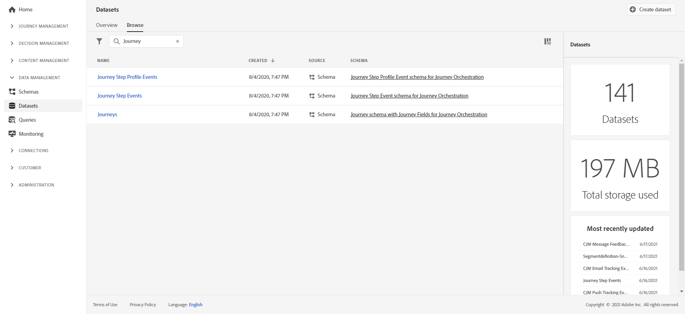

# 여정 보고서 만들기 {#design-jo-reports}

에 더하여 [실시간 보고서](live-report.md) 기본 제공 [글로벌 보고 기능](global-report.md), [!DNL Journey Optimizer] 은 여정 성능 데이터를 Adobe Experience Platform에 자동으로 전송할 수 있으므로 분석 목적으로 다른 데이터와 결합할 수 있습니다.

>[!NOTE]
>
>이 기능은 여정 단계 이벤트의 모든 인스턴스에서 기본적으로 활성화됩니다. 단계 이벤트에 대한 프로비저닝 중에 생성된 스키마 및 데이터 세트는 수정하거나 업데이트할 수 없습니다. 기본적으로 이러한 스키마와 데이터 세트는 읽기 전용 모드에 있습니다.

예를 들어 여러 이메일을 전송하는 여정을 설정했습니다. 이 기능을 사용하면 을 결합할 수 있습니다 [!DNL Journey Optimizer] 전환이 발생한 횟수, 웹 사이트에서 참여가 발생한 횟수 또는 스토어에서 발생한 거래 수와 같은 다운스트림 이벤트 데이터가 포함된 데이터. 여정 정보는 다른 디지털 속성 또는 오프라인 속성에서 Adobe Experience Platform의 데이터와 결합하여 성능을 보다 종합적으로 볼 수 있습니다.

[!DNL Journey Optimizer] 는 개인이 여정에서 수행하는 각 단계에 대해 필요한 스키마와 스트림을 Adobe Experience Platform의 데이터 세트에 자동으로 생성합니다. 단계 이벤트는 여정 내의 한 노드에서 다른 노드로 이동하는 개인에 해당합니다. 예를 들어 이벤트, 조건 및 작업이 있는 여정에서 3단계 이벤트가 Adobe Experience Platform으로 전송됩니다.

동일한 노드에 대해 여러 이벤트를 만들 수 있는 경우가 있습니다. 예를 들어 대기 활동의 경우:

* 프로필이 대기를 입력할 때 하나의 이벤트가 생성됩니다(journeyNodeProcessed 속성은 false와 같음).
* 프로필이 종료되면 하나의 이벤트가 생성됩니다(journeyNodeProcessed 속성은 true와 같음).

전달되는 XDM 필드 목록은 포괄적입니다. 일부는 시스템 생성 코드를 포함하고 다른 것은 사람이 읽을 수 있는 친근한 이름을 갖는다. 예를 들어 여정 활동의 레이블 또는 단계 상태(작업이 시간 초과되거나 오류로 종료되는 횟수)가 있습니다.

>[!CAUTION]
>
>실시간 프로필 서비스에 대해 데이터 세트를 켤 수 없습니다. 다음을 확인하십시오. **[!UICONTROL 프로필]** 토글이 꺼져 있습니다.

[!DNL Journey Optimizer] 는 발생하는 대로 스트리밍 방식으로 데이터를 전송합니다. 쿼리 서비스를 사용하여 이 데이터를 쿼리할 수 있습니다. Customer Journey Analytics 또는 기타 BI 도구에 연결하여 이러한 단계와 관련된 데이터를 볼 수 있습니다.

다음 스키마가 생성됩니다.

* 여정 단계 이벤트 스키마 [!DNL Journey Orchestration] - 여정 메타데이터에 연결된 여정 단계 이벤트입니다.
* 다음에 대한 여정 필드가 있는 여정 스키마 [!DNL Journey Orchestration] - 여정을 설명하는 여정 메타데이터

다음 데이터 세트가 전달됩니다.

* 여정 단계 이벤트
* 여정

Adobe Experience Platform에 전달된 XDM 필드 목록은 여기에 자세히 설명되어 있습니다.

* [단계 이벤트 필드 목록](../reports/sharing-field-list.md)
* [이전 단계 이벤트 필드](../reports/sharing-legacy-fields.md)

## Customer Journey Analytics과 통합 {#integration-cja}

[!DNL Journey Optimizer] 단계 이벤트는 의 다른 데이터 세트에 연결할 수 있습니다. [Adobe Customer Journey Analytics](https://experienceleague.adobe.com/docs/analytics-platform/using/cja-overview/cja-overview.html?lang=ko){target="_blank"}.

일반적인 워크플로우는 다음과 같습니다.

* [!DNL Customer Journey Analytics] &quot;여정 단계 이벤트&quot; 데이터 세트를 수집합니다.
* 다음 **profileID** 연관된 &quot;Journey Orchestration에 대한 여정 단계 이벤트 스키마&quot;의 필드가 ID 필드로 정의됩니다. 위치 [!DNL Customer Journey Analytics]그런 다음 이 데이터 세트를 개인 기반 식별자와 동일한 값을 가진 다른 데이터 세트에 연결할 수 있습니다.
* 에서 이 데이터 세트를 사용하려면 [!DNL Customer Journey Analytics], 크로스 채널 여정 분석은 를 참조하십시오. [Customer Journey Analytics 설명서](https://experienceleague.adobe.com/docs/analytics-platform/using/cja-usecases/cross-channel.html){target="_blank"}.

➡️ [Customer Journey Analytics 작업](cja-ajo.md){target="_blank"}
