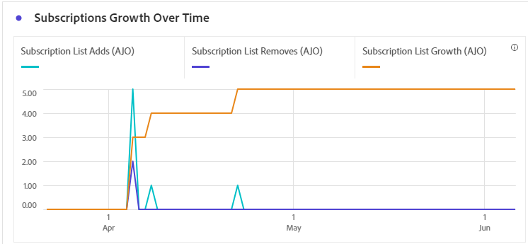

# 구독 보고서 {#subscription-report-global-cja}

**구독 보고서**&#x200B;는 특정 목록과 연결된 프로필의 구독 및 구독 취소에 대한 중요한 통찰력을 제공하여 참여 및 전환을 추진하는 데 있어 다양한 구독 캠페인과 이니셔티브의 효과를 이해하는 데 도움이 됩니다.

보고서에 액세스하려면 고급 메뉴에서 선택한 구독 목록의 **[!UICONTROL 보고서]** 아이콘을 클릭하십시오.

작업 영역 Customer Journey Analytics 및 데이터를 필터링하고 분석하는 방법에 대한 자세한 내용은 [이 페이지](https://experienceleague.adobe.com/en/docs/analytics-platform/using/cja-workspace/home)를 참조하세요.

## 구독 목록 추가

**[!UICONTROL 구독 목록 추가]** KPI는 지정된 기간 동안 획득한 총 구독 수에 대한 포괄적인 개요를 제공합니다. 이 지표는 신규 가입자의 증가와 습득을 강조 표시하여 가입 캠페인 또는 이니셔티브의 효과에 대한 중요한 통찰력을 제공합니다.

## 구독 목록 제거

**[!UICONTROL 구독 목록에서 제거]** KPI는 지정된 기간 동안 발생한 총 구독 취소 수에 대한 분석을 제공합니다. 이 지표는 구독자 이탈에 대한 중요한 통찰력을 제공합니다.

## 시간 경과에 따른 구독 증가

**[!UICONTROL 시간 경과에 따른 구독 증가]** 그래프는 지정된 기간 동안의 구독 진행 상황을 시각적으로 표시하여 구독자 기반이 어떻게 발전했는지 명확하게 파악할 수 있습니다.

* **[!UICONTROL 구독 목록 추가]**: 해당 기간의 총 구독 수입니다.

* **[!UICONTROL 구독 목록에서 제거]**: 해당 기간의 총 구독 취소 수입니다.

* **[!UICONTROL 구독 목록 증가]**: 일정 기간 동안 구독자 목록이 증가하는 비율입니다.

## 구독 목록

**[!UICONTROL 구독 목록]** 표는 특정 구독 목록과 연결된 프로필의 구독 및 구독 취소에 대한 중요한 통찰력을 제공합니다. 다음은 참여 및 전환을 유도하기 위한 다양한 구독 목록의 효과를 이해하는 데 유용한 정보입니다.

* **[!UICONTROL 구독 목록 추가]**: 해당 기간의 총 구독 수입니다.

* **[!UICONTROL 구독 목록에서 제거]**: 해당 기간의 총 구독 취소 수입니다.

## 여정

**[!UICONTROL 여정]** 테이블은 사용자 여정의 일부로 방문자의 구독에 대한 복잡한 세부 정보를 보여주는 광범위한 보기를 제공합니다.

* **[!UICONTROL 구독 목록 추가]**: 해당 기간의 총 구독 수입니다.

* **[!UICONTROL 구독 목록에서 제거]**: 해당 기간의 총 구독 취소 수입니다.

## 캠페인

**[!UICONTROL 캠페인]** 테이블은 특정 캠페인에 의해 트리거된 프로필의 구독 및 구독 취소에 대한 중요한 통찰력을 제공합니다. 이 포괄적인 보기를 통해 캠페인의 효과를 측정하고 랜딩 페이지 콘텐츠와의 참여를 효과적으로 추적할 수 있습니다.

* **[!UICONTROL 구독 목록 추가]**: 해당 기간의 총 구독 수입니다.

* **[!UICONTROL 구독 목록에서 제거]**: 해당 기간의 총 구독 취소 수입니다.

## 채널

**[!UICONTROL 채널]** 표에는 각 채널별로 분류된 프로필 구독 및 구독 취소 수가 표시됩니다.

* **[!UICONTROL 구독 목록 추가]**: 해당 기간의 총 구독 수입니다.

* **[!UICONTROL 구독 목록에서 제거]**: 해당 기간의 총 구독 취소 수입니다.
