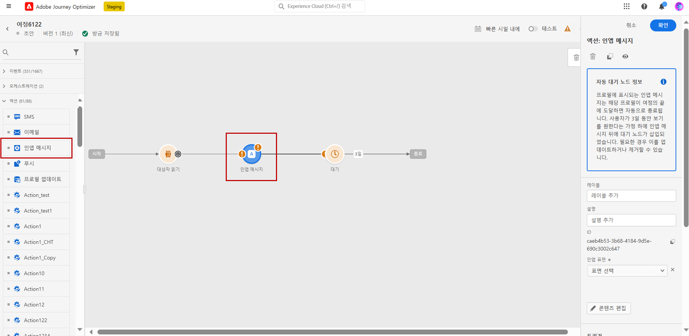

# 초기 릴리스 정보 {#e-release-notes}

[!DNL Adobe Journey Optimizer]는 지속적으로 새로운 기능, 기존 기능 개선, 버그 해결을 제공합니다. 모든 변경 사항은 매달 마지막 주 [릴리스 정보](release-notes.md)에 통합됩니다.

아래 초기 릴리스 정보는 릴리스를 사용할 수 있는 당일까지 사전 통지 없이 변경될 수 있습니다. 링크, 화면, 업데이트된 설명서는 릴리스 날짜의 [릴리스 정보](release-notes.md)에 게시됩니다.

## 2023년 8월 초기 릴리스 정보 {#aug-rn-2023}

**릴리스 일자**: 2023년 8월 23~24일

### 새로운 기능{#aug-2023-features}

이번 릴리스에는 아래 목록에 있는 새로운 기능이 제공됩니다.

<table>
<thead>
<tr>
<th><strong>여정에서 인앱 메시지 보내기</strong> </th>
</tr>
</thead>
<tbody>
<tr>
<td>

이제 여정 내에서 앱 사용자에게 개인화된 인앱 메시지를 보낼 수 있습니다. Journey Optimizer를 사용하여 알림을 디자인하고 메시지 레이아웃, 디스플레이, 텍스트, 버튼을 사용자 정의하여 원활한 경험을 만들 수 있습니다.

자세한 내용은 <a href="../in-app/get-started-in-app.md">세부 설명서</a>를 참조하십시오.

</tr>
</tbody>
</table>

<table>
<thead>
<tr>
<th><strong>시드 목록을 사용한 이메일 유효성 검사</strong> </th>
</tr>
</thead>
<tbody>
<tr>
<td>

이제 Journey Optimizer에서 시드 목록을 만들고 관리할 수 있습니다. 시드 목록은 실제 대상자에 추가할 수 있는 내부 주소로 구성되며, 게재 실행 시 해당 목록의 주소는 타겟팅한 프로필과 정확히 동일한 메시지를 수신합니다. 이 기능을 사용하면 보내는 커뮤니케이션을 모니터링하여 모든 표시 형식, URL, 이미지, 링크가 올바른지 확인할 수 있습니다.

<!--p>For more information, refer to the <a href="../audience/get-started-audience-orchestration.md">detailed documentation</a>.</p-->
</td>
</tr>
</tbody>
</table>

<!--table>
<thead>
<tr>
<th><strong>Generate text and images with the Content assistant</strong> </th>
</tr>
</thead>
<tbody>
<tr>
<td>

Once you have created and personalized your message, take your content to the next level with the Content assistant. You can now use the Content assistant to optimize your message's impact by experimenting with different main titles, and images. Each variant is managed as a unique Treatment, to measure and compare which title effectively generates more clicks.

This capability is currently available as a private beta.

For more information, refer to the <a href="../start/search-filter-categorize.md#tags">detailed documentation</a>.

</td>
</tr>
</tbody>
</table-->

### 개선 사항 {#aug-2023-improvements}

이 릴리스는 아래 목록에 있는 개선 사항과 함께 제공됩니다.

**API**

이제 콘텐츠 조각을 만들고 관리하기 위한 새 API를 사용할 수 있습니다. [자세히 알아보기](https://developer.adobe.com/journey-optimizer-apis/references/content-templates/#tag/Content-fragment-API){target="_blank"}.

**이메일 채널**

이메일 표면 설정의 새로운 설정을 통해 트랜잭션 메시지 대상자에 스팸 메시지 불만 제기로 인해 억제된 이메일 주소를 포함할 수 있습니다. 이 옵션을 사용하면 해당 프로필이 마케팅 메시지를 스팸으로 표시했더라도 암호 재설정이나 계정 관련 공지와 같은 트랜잭션 메시지를 받을 수 있습니다. 이 옵션은 기본적으로 비활성화되어 있습니다.

**여정**

* 이제 사용자 정의 작업에 API 호출 응답을 활용하고, 이 응답을 기반으로 여정을 오케스트레이션할 수 있습니다. 이 기능은 현재 Private Beta로 사용할 수 있습니다.
<!--* A new type of system alert has been introduced. You can now get notified when a custom action fails.
* When duplicating a journey, you can now define the name of the journey copy.-->

**다이렉트 메일**

* 이제 파일 라우팅 구성에서 서버 유형으로 Azure를 선택할 수 있습니다.
* 이제 DM 표면 설정의 열 구분 기호 필드로 앰퍼샌드를 사용할 수 있습니다.