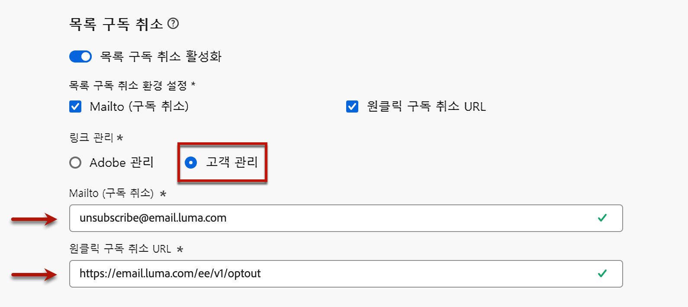

# 초기 릴리스 정보 {#e-release-notes}

[!DNL Adobe Journey Optimizer]는 지속적으로 새로운 기능, 기존 기능 개선, 버그 해결을 제공합니다. 모든 변경 사항은 매월 말 [릴리스 정보](release-notes.md)에 통합됩니다.

**아래 초기 릴리스 정보는 릴리스 공개 당일까지 사전 통지 없이 변경될 수 있습니다**. 링크, 화면, 업데이트된 설명서는 릴리스 날짜의 [릴리스 정보](release-notes.md)에 게시됩니다.

## 2025년 2월 초기 릴리스 정보 {#25-02-rn}

### 새로운 기능 {#25-02-features}

이번 릴리스의 새로운 기능은 아래에 자세히 설명되어 있습니다.

<table>
<thead>
<tr>
<th><strong>비즈니스 규칙 만들기 및 관리</strong> </th>
</tr>
</thead>
<tbody>
<tr>
<td>

이제 규칙 세트를 사용하여 비즈니스 규칙을 만들 수 있습니다. 규칙 세트는 캠페인 내의 보낸 메시지 및 채널 간 여정 작업을 제한하고 여정에 대한 프로필 항목을 제어하는 데 도움이 되는 규칙 그룹입니다.

<ul><li>채널 규칙 세트를 만들어 하나 또는 여러 채널에서 전송되는 메시지 수를 제한합니다. 캠페인 또는 여정 작업에 적용하여 규칙 세트에 정의된 규칙을 적용합니다. 채널 규칙 세트를 사용하면 통신 유형에 따라 최대 가용량 규칙을 적용할 수 있습니다. 예를 들어 "프로모션 메시지"와 "뉴스레터"에 대한 다른 메시지를 제한하도록 규칙 세트를 설정합니다. 보내는 커뮤니케이션 유형에 따라 캠페인 또는 여정 작업에 적절한 규칙 세트를 적용합니다.</li>
<li> 프로필 항목을 여정으로 제어하려면 여정 규칙 세트를 만듭니다. 프로필이 지정된 기간 내에 여정을 입력할 수 있는 빈도 또는 프로필을 동시에 등록할 수 있는 여정 수를 제한합니다. 여정 수준에서 이를 적용하여 적절한 항목 관리를 보장합니다.</li>

이전에는 조직 집합(LA)에서 사용할 수 있었으나, 이제 모든 사용자(GA)가 비즈니스 규칙을 사용할 수 있습니다.

<!--p>For more information, refer to the <a href="../configuration/business-rules.md">detailed documentation</a>.</p-->
</td>
</tr>
</tbody>
</table>

<table>
<thead>
<tr>
<th><strong>SMS에 대한 다중 지역 지원</strong> </th>
</tr>
</thead>
<tbody>
<tr>
<td>

이제 게재, 피드백, 인바운드 및 콜백 URL을 재정의하여 다중 지역 끝점의 SMS 메시지 게재를 관리할 수 있습니다. 이를 지원하기 위해 새 필드 Override URL이 API Credentials 구성에 추가되었습니다. 이 변경 사항은 Sinch 공급자에서만 사용할 수 있습니다.

<!--p>For more information, refer to the <a href="../configuration/business-rules.md">detailed documentation</a>.</p-->
</td>
</tr>
</tbody>
</table>

<table>
<thead>
<tr>
<th><strong>AI Assistant를 사용하여 랜딩 페이지 생성</strong> </th>
</tr>
</thead>
<tbody>
<tr>
<td>

이제 랜딩 페이지 게재에서 AI Assistant를 사용하여 텍스트, 이미지 또는 전체 페이지 레이아웃을 생성할 수 있습니다.

<!--img src="assets/do-not-localize/ai-lp.gif">

For more information on AI Assistant, refer to the <a href="../email/generative-lp.md">detailed documentation</a>.</p-->
</td>
</tr>
</tbody>
</table>

<table>
<thead>
<tr>
<th><strong>브랜드 지침(베타)</strong> </th>
</tr>
</thead>
<tbody>
<tr>
<td>

이제 고유한 Brand 지침을 설정하여 브랜드의 시각적 및 언어적 정체성을 정의할 수 있습니다. 브랜드 기능은 비공개 베타로 출시되며 모든 고객은 향후 릴리스에서 점진적으로 사용할 수 있습니다.

<!--p>For more information, refer to the <a href="../configuration/business-rules.md">detailed documentation</a>.</p-->
</td>
</tr>
</tbody>
</table>

<table>
<thead>
<tr>
<th><strong>유연한 대상 평가(제한된 가용성)</strong> </th>
</tr>
</thead>
<tbody>
<tr>
<td>

유연한 대상 평가를 통해 선택한 대상에 대해 온디맨드로 세분화 작업을 실행할 수 있으므로 Journey Optimizer 여정 및 캠페인으로 대상자를 타기팅하기 전에 항상 최신 대상 데이터를 보유하도록 합니다.

자세한 내용은 <a href="../audience/about-audiences.md#flexible">세부 설명서</a>를 참조하십시오.

 유연한 대상 평가는 조직 집합(제한된 가용성)에만 사용할 수 있습니다. 액세스 권한을 받으려면 Adobe 담당자에게 문의하십시오.

사용 가능한 날짜: 2025년 1월 28일

</tr>
</tbody>
</table>

<table>
<thead>
<tr>
<th><strong>Customer Journey Analytics 템플릿</strong> </th>
</tr>
</thead>
<tbody>
<tr>
<td>

이제 Customer Journey Analytics 템플릿을 활용하여 Journey Optimizer 보고서를 향상시킬 수 있는 옵션이 제공됩니다. 이 새로운 기능을 사용하면 분석 요구 사항에 맞게 미리 디자인된 템플릿을 사용하여 보고 프로세스를 간소화할 수 있습니다.

자세한 내용은 <a href="../reports/report-cja-manage.md#cja-template">세부 설명서</a>를 참조하십시오.

사용 가능한 날짜: 2025년 1월 15일부터 시작

</tr>
</tbody>
</table>

### 개선 사항 {#25-02-improvements}

아래의 개선 사항은 2월 업데이트와 함께 제공됩니다.

* **여정** - 이제 관리 섹션에서 API 호출을 전송하여 사용자 지정 작업을 테스트할 수 있습니다. 이 새로운 기능을 사용하면 여정에서 사용자 지정 작업을 사용하기 전에 먼저 문제를 해결할 수 있습니다.

* **TTL(Time-to-Live)** - 이번 달부터 TTL(Time-to-Live) 가드레일이 다음과 같이 새 샌드박스 및 새 조직의 Journey Optimizer 시스템 생성 데이터 세트로 롤아웃됩니다.

   * 프로필 스토어의 데이터에 대해 90일
   * 데이터 레이크의 데이터에 대해 13개월

  이 변경 사항은 후속 단계에서 기존 고객 샌드박스로 롤아웃됩니다.

  [이 전용 FAQ](../data/datasets-ttl.md#frequently-asked-questions)에서 이 업데이트에 대해 자세히 알아보세요.

<!--* **Playbooks** - You can now create and publish your own Use Case Playbooks in Journey Optimizer.-->

* **DM** - 이제 DM 채널 구성에서 파일 라우팅에 대해 새로운 서버 유형인 데이터 랜딩 영역이 지원됩니다.

**개인화**

<!--
* The personalization editor has been enhanced with new capabilities such as Auto-complete, Search, and filtering options. You can also show or hide deprecated attributes.-->

* 사용 가능한 날짜: 2025년 1월 29일 - 새로운 날짜/시간 도우미 기능을 개인화 편집기에서 사용할 수 있습니다. [자세히 보기](../personalization/functions/dates.md)

**전자 메일 구성** - 사용 가능한 날짜: 2025년 2월 12일

* Adobe 외부의 동의를 관리하는 경우 이제 사용자 지정 구독 취소 이메일 주소와 사용자 지정 원클릭 구독 취소 URL을 이메일 채널 구성 설정의 일부로 설정할 수 있습니다. [자세히 보기](../email/list-unsubscribe.md#custom-managed)

  {width="80%"}

**Decisioning** - 사용 가능한 날짜: 2025년 1월 28일

* 이제 Decisioning에서 항목 카탈로그의 스키마를 편집할 때 개체 데이터 유형을 지원합니다. [자세히 보기](../experience-decisioning/catalogs.md)