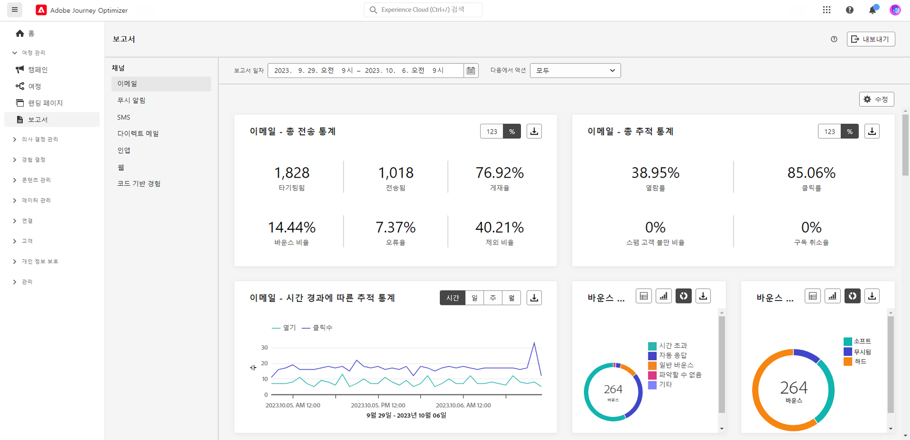

# 초기 릴리스 정보 {#e-release-notes}

[!DNL Adobe Journey Optimizer]는 지속적으로 새로운 기능, 기존 기능 개선, 버그 해결을 제공합니다. 모든 변경 사항은 매달 마지막 주 [릴리스 정보](release-notes.md)에 통합됩니다.

아래 초기 릴리스 정보는 릴리스를 사용할 수 있는 당일까지 사전 통지 없이 변경될 수 있습니다. 링크, 화면, 업데이트된 설명서는 릴리스 날짜의 [릴리스 정보](release-notes.md)에 게시됩니다.

## 2023년 10월 초기 릴리스 정보 {#oct-rn-2023}

**릴리스 날짜**: 2023년 10월 25~26일

### 새로운 기능{#oct-2023-features}

이번 릴리스에는 아래 목록에 있는 새로운 기능이 제공됩니다.

<table>
<thead>
<tr>
<th><strong>샌드박스 도구</strong> </th>
</tr>
</thead>
<tbody>
<tr>
<td>

샌드박스 도구를 사용하면 패키지 내보내기 및 가져오기를 활용하여 여러 샌드박스 간에 개체를 복사할 수 있습니다. 패키지는 단일 개체 또는 여러 개체로 구성될 수 있습니다. 패키지에 포함된 모든 객체는 동일한 샌드박스의 객체여야 합니다.

<!--img src="../data/assets/dataset-export-setup.png"-->
<!--p>For more information, refer to the <a href="../audience/get-started-audience-orchestration.md">detailed documentation</a>.</p-->
</td>
</tr>
</tbody>
</table>

<!-- table>
<thead>
<tr>
<th><strong>Composed audiences in journeys</strong> </th>
</tr>
</thead>
<tbody>
<tr>
<td>

You can now use audiences created in composition workflows in your journeys to target customers. Once an audience composition is published, and the audience saved, use a Read Audience activity to select this new audience in your journey canvas.

For more information, refer to the <a href="../audience/get-started-audience-orchestration.md">detailed documentation</a>.

</tr>
</tbody>
</table -->

<table>
<thead>
<tr>
<th><strong>SMS(베타)의 MMS(멀티미디어 메시지 서비스)</strong> </th>
</tr>
</thead>
<tbody>
<tr>
<td>

이제 SMS 채널을 통해 MMS(멀티미디어 메시지 서비스) 메시지를 전송하여 고객과 이미지, GIF 또는 비디오를 공유할 수 있으므로 커뮤니케이션을 향상시킬 수 있습니다. 이 기능은 현재 Sinch의 Beta에서만 사용할 수 있습니다.

<!--img src="assets/channel-reports.png"/-->
<!--p>For more information, refer to the <a href="../in-app/get-started-in-app.md">detailed documentation</a>.</p-->
</tr>
</tbody>
</table>

### 개선 사항 {#oct-2023-improvements}

이 릴리스는 아래 목록에 있는 개선 사항과 함께 제공됩니다.

**대상자**

* 이제 CSV 파일에서 업로드한 대상을 여정 및 캠페인으로 타깃팅할 수 있습니다.
* 이제 대상 구성을 통해 만든 대상을 타기팅하고 여정에서 데이터 보강 속성을 활용할 수 있습니다.

>[!AVAILABILITY]
>
>이러한 기능은 현재 개인 베타로 사용할 수 있습니다.

<!--
**Spam scoring for emails**

* When simulating an email content, a new option enables you to check how your content performs against inboxes spam filtering. This feature is currently proposed to a set of customers only (Limited Availability), and available for the Email channel.-->

**캠페인**

* 이제 실시간 1회 캠페인을 중지하고 수정하고 다시 시작할 수 있습니다. 이 개선 사항은 베타에서 사용할 수 있습니다.
* 캠페인 중 하나에서 오류가 발생하면 이제 캠페인 목록에 캠페인 상태와 함께 경고 아이콘이 표시됩니다.

**여정**

* 모든 대기 시간에 정의할 수 있는 최대 기간은 이제 30일이 아니라 29일입니다. 이는 다음 경우에 적용됩니다.

   * 다음 **총 시간** 의 필드 [대기 활동](../building-journeys/wait-activity.md)
   * 다음 **재등록 대기 기간** 위치: [여정 속성](../building-journeys/journey-gs.md#entrance)
   * 다음 **대기** 의 시간 초과 정의에 있는 필드 [일반](../building-journeys/general-events.md#events-specific-time) 및 [반응](../building-journeys/reaction-events.md) 이벤트.

**채널 구성의 동의**

* 이제 채널 표면 수준에서 마케팅 작업을 선택할 수 있습니다. 표면에서 사용할 경우 고객의 선호도를 존중하기 위해 해당 마케팅 액션과 연결된 모든 동의 정책을 활용합니다.

**의사 결정 관리**

* 의사 결정 관리 인터페이스의 오퍼 한도 설정과 관련된 몇 가지 레이블이 업데이트되었습니다.
