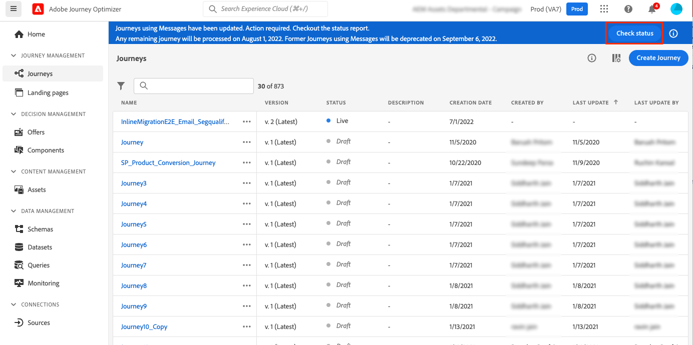

# 인라인 작성 마이그레이션 단계{#migration-steps}

Adobe Journey Optimizer에서 컨텐츠를 작성하는 새 프로세스는 다음과 같습니다 [페이지](../rn/inline-messages.md). 여정 자동 전환이 수행됩니다. 몇 가지 단계로 여러분의 도움이 필요합니다.

>[!VIDEO](https://video.tv.adobe.com/v/344699)

다음은 주요 단계 및 단계입니다.

**[마이그레이션 전](../rn/inline-messages-steps.md#migration-step-1)**

1. 비프로덕션 샌드박스에서 모든 라이브 및 닫힌 여정을 중지합니다. [자세히 보기](../rn/inline-messages-steps.md#migration-step-1-1)
1. 프로덕션 샌드박스에서 프로필이 아직 없는 모든 라이브 애드혹 여정을 중지합니다. [자세히 보기](../rn/inline-messages-steps.md#migration-step-1-2)

**[첫 번째 반복 후](../rn/inline-messages-steps.md#migration-step-2)**

1. 마이그레이션된 라이브 여정에 대한 오류를 확인하십시오. [자세히 보기](../rn/inline-messages-steps.md#migration-step-2-1)
1. 마이그레이션에서 만든 모든 새 버전을 나열합니다. [자세히 보기](../rn/inline-messages-steps.md#migration-step-2-2)
1. 하나씩 테스트하고 게시합니다. [자세히 보기](../rn/inline-messages-steps.md#migration-step-2-3)
1. 모든 라이브 버전을 나열합니다. [자세히 보기](../rn/inline-messages-steps.md#migration-step-2-4)
1. 마이그레이션된 초안 버전에서 오류가 있는지 확인합니다. [자세히 보기](../rn/inline-messages-steps.md#migration-step-2-5)

**[두 번째 반복 후](../rn/inline-messages-steps.md#migration-step-3)**

1. 마이그레이션 단계를 모두 확인합니다. [자세히 보기](../rn/inline-messages-steps.md#migration-step-3-1)
1. 이전 버전을 중지합니다. [자세히 보기](../rn/inline-messages-steps.md#migration-step-3-2)

**[세 번째 및 마지막 반복 전](../rn/inline-messages-steps.md#migration-step-4)**

사용 중단 전에 모든 것이 마이그레이션되었는지 확인합니다.

  

## 마이그레이션 전(7월 25일){#migration-step-1}

### 1. 모든 라이브 및 닫힌 여정 중지{#migration-step-1-1}

설정 **비프로덕션 샌드박스**&#x200B;를 눌러 모든 라이브 및 닫힌 여정을 중지합니다. 이렇게 하면 자동 마이그레이션 프로세스가 사용자의 작업 없이 샌드박스에서 모든 여정을 마이그레이션할 수 있습니다. 마이그레이션 후 중지된 여정 버전을 복제하고 사용할 수 있습니다.

### 2. 프로필이 아직 없는 모든 Ad Hoc 여정 중지{#migration-step-1-2}

설정 **프로덕션 샌드박스**&#x200B;를 눌러 더 이상 프로필을 포함하지 않는 모든 임시 여정을 중지합니다.

+++이러한 여정을 찾는 방법

이러한 여정을 찾으려면 **여정** 메뉴를 사용하여 &quot;Status = Live&quot; 및 &quot;Type = Read segment&quot;에서 목록을 필터링합니다. 또한 여정을 가장 이른 날짜부터 최신 &quot;게시된&quot; 날짜까지 시간순으로 정렬할 수도 있습니다.

위에서 아래로 엽니다.

* 여정에 메시지가 있는지 확인합니다.
* 반복적인 여정이 아닌지 확인합니다. 임시 항목이 아닙니다. 여러분은 아마 그들을 계속 살고 싶어할 거예요. 예를 들어, 임시 여정이 아닌 재귀적 사용자입니다.

   

* 대기 또는 이벤트 리스너를 해당 여정에서 사용한 경우 프로필이 여전히 내부에 있을 수 있습니다. 여정 실행 날짜를 보고 대기 또는 이벤트 리스너에 정의한 시간/일을 추가하여 프로필이 남아 있지 않은 실제 날짜를 추론합니다. 해당 날짜가 지난 경우 여정을 중지할 수 있습니다. 그렇지 않으면 여정 실행 날짜로부터 30일 후에 이 여정이 자동으로 &quot;완료됨&quot; 상태로 이동합니다.

+++

**중요 정보**

* 마이그레이션 날짜(7월 25일) 전에 여정을 닫지 마십시오. 마이그레이션 스크립트가 라이브 또는 닫힌 여정을 마이그레이션하지 않으므로 프로덕션 샌드박스에서 닫힌 여정 수를 제한하면 마이그레이션 후 필요한 수동 작업 수가 제한됩니다.

* 최신 버전이 아닌 라이브 여정이 있는 경우, 즉 초안에서 다른 여정 버전을 만들었다면, 게시하거나 삭제하십시오.

* 메시지가 여정에 사용되지 않고 유지하려는 경우 템플릿으로 저장합니다. 다음을 참조하십시오 [페이지](../design/email-templates.md#save-as-template). 사용 중단 시까지 계속 액세스할 수 있습니다.

## 마이그레이션 첫 번째 반복 후(7월 25일){#migration-step-2}

마이그레이션은 다음 두 단계로 시퀀싱됩니다. 작업 항목이 필요한 자동화된 단계(7월 25일부터 7월 26일까지)와 수동 단계(7월 26일부터 시작)입니다.

자동화된 단계에 대해서는 다음을 참조하십시오 [페이지](../rn/inline-messages.md#process). 수동 단계의 경우 다음 작업을 수행합니다 **프로덕션 샌드박스**:

<!--
_On non-production sandboxes:_

**1. Check the migration status report for any error**

Click the **Check status** button in the top banner and check that there has been no error during the automatic migration and that there is nothing left to migrate. 

Look for the "ERROR" status. 

* If there is no error, you are good to go.
* If there are errors, look for the error by searching "errorMessage". The following error is expected as migration of multi-channel messages is not supported: "Migration of multi-channel messages is not supported". You will have to rebuild this journey.

    

_On the production sandbox:_

-->

### 1. 마이그레이션된 라이브 여정에 대한 오류를 확인합니다{#migration-step-2-1}

상태 보고서([자세히 알아보기](../rn/inline-messages.md#status). 을(를) 클릭합니다. **상태 확인** 위쪽 배너에 있는 단추.

&quot;ERROR_NEW_VERSION_CREATION&quot;을 찾습니다.

* 오류가 없으면 마이그레이션이 필요한 모든 라이브 여정 버전이 처리되었으며 새 마이그레이션된 초안 버전이 자동으로 생성되었음을 의미합니다.

* 오류가 표시되면 &quot;errorMessage&quot;를 검색하고 로그에서 오류 메시지를 확인할 수 있습니다. 다중 채널 메시지는 마이그레이션되지 않습니다. 다른 여정을 만들어야 합니다.

   

* 다른 오류는 CSM 또는 Adobe 담당자에게 문의하여 지침을 받으십시오.

### 2. 마이그레이션에서 만든 모든 새 버전을 나열합니다{#migration-step-2-2}

이 변수들은 [마이그레이션됨] 여정 레이블 및 작성 날짜가 업데이트됩니다.

### 3. 하나씩 테스트 및 게시{#migration-step-2-3}

프로덕션 환경에서 여정을 실행해야 합니다. 만약 [마이그레이션 전 준비](../rn/inline-messages-steps.md#migration-step-1) 가 올바르게 수행되지 않았으므로 더 이상 필요하지 않은 일회성 여정에 대해 새 버전을 만들 수 있습니다.

이제 인라인 채널 작업이 포함된 여정의 초안 버전을 테스트합니다.

새 여정 버전을 게시합니다. 그런 다음 이전 라이브 버전이 &quot;닫힌&quot; 상태로 이동합니다.

### 4. 모든 라이브 버전 나열{#migration-step-2-4}

그것들은 모두 최신으로 표시되어야 합니다. 없는 경우 최신 버전을 찾아 테스트하고 게시합니다.

### 5. 마이그레이션된 초안 버전에 대한 오류를 확인합니다 {#migration-step-2-5}

을(를) 클릭합니다. **상태 확인** 위쪽 배너의 단추([자세히 알아보기](../rn/inline-messages.md#status) 및 가 자동 마이그레이션 중에 오류가 없으며 마이그레이션해야 할 사항이 아직 없는지 확인합니다. 오류가 있는 모든 여정(메시지 포함)는 9월 5일(모든 샌드박스)이후 사용되지 않습니다.

&quot;오류&quot; 상태를 찾습니다.

* 오류가 없으면 가도 좋다.

* 오류가 있으면 &quot;errorMessage&quot;를 검색하여 오류를 찾습니다. 다중 채널 메시지 마이그레이션이 지원되지 않으므로 다음 오류가 발생할 수 있습니다. &quot;다중 채널 메시지 마이그레이션은 지원되지 않습니다.&quot; 이 여정을 다시 만들어야 합니다.

## 두 번째 반복 후(8월 1일){#migration-step-3}

두 번째 반복은 8월 1일부터 8월 2일 사이의 야간 시간에 수행됩니다.

<!--
_On non-production sandboxes:_

**1. Check at the status report**

Click the **Check status** button in the top banner and check that all journeys have been migrated and there's nothing left to migrate. If there is an error or something left to migrate, please reach out to your CSM or Adobe representative for guidance.

-->

이전 단계가 모두 제 시간에 수행된 경우, 닫힌 단계와 오류가 있는 단계를 제외하고 모든 여정이 마이그레이션되었습니다. 다음은 이 작업을 수행하는 단계입니다 **프로덕션 샌드박스**:

### 1. 마이그레이션 단계를 모두 확인합니다{#migration-step-3-1}

오류가 없는 경우 &quot;qualificationStatus&quot;의 &quot;toMigrate&quot; 및 &quot;createNewVersion&quot;에 여정이 없어야 합니다. 다음 예에는 &quot;ERROR&quot; 및 &quot;ERROR_NEW_VERSION_CREATION&quot;이 한 개 있습니다.

### 2. 이전 버전 중지{#migration-step-3-2}

최신 여정 버전을 게시하지 않은 경우( 참조) [섹션](../rn/inline-messages-steps.md#migration-step-2-3))을 지정할 수 있습니다. 반복 2(8월 1일) 전에 새 버전을 게시합니다.

>[!NOTE]
>
>이전 버전을 중지하지 않으면 이전 버전과 관련 보고가 손실됩니다.

## 세 번째 및 마지막 반복 전(9월 5일){#migration-step-4}

8월 1일과 9월 5일 사이에 모든 항목이 마이그레이션되었으며 아직 메시지를 사용하는 여정이 남아 있지 않은지 확인해야 합니다. 그렇지 않으면 9월 5일에 더 이상 사용되지 않습니다.

