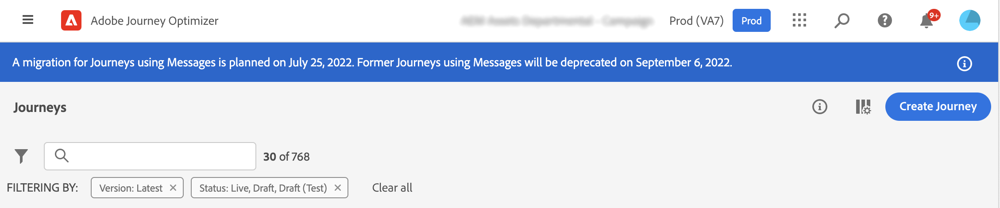

# 인라인 작성 마이그레이션 개요{#inline-authoring}

>[!CONTEXTUALHELP]
>id="ajo_messages_migration_before"
>title="새 인라인 작성 메시지에 대해 자세히 알아보기"
>abstract="2022년 7월 25일부터 메시지는 여정에서 직접 작성됩니다. 기존 메시지는 자동으로 새 모델로 마이그레이션됩니다. 마이그레이션 후 추가 작업이 필요합니다."
>additional-url="https://experienceleague.adobe.com/docs/journey-optimizer/using/whats-new/inline-messages-steps.html" text="마이그레이션 단계"

>[!CONTEXTUALHELP]
>id="ajo_messages_migration_during"
>title="상황 파악"
>abstract="2022년 7월 25일부터 메시지는 여정에서 직접 작성됩니다. 환경을 마이그레이션하고 있습니다. 마이그레이션 후 추가 작업이 필요합니다."
>additional-url="https://experienceleague.adobe.com/docs/journey-optimizer/using/whats-new/inline-messages-steps.html" text="마이그레이션 단계"

>[!CONTEXTUALHELP]
>id="ajo_messages_migration_after"
>title="메시지 마이그레이션 방법 알아보기"
>abstract="2022년 7월 25일부터 메시지는 여정에서 직접 작성됩니다. 이제 기존 메시지가 새 모델로 마이그레이션되었습니다. 이제 여정 전문가의 경우 추가 작업이 필요합니다."
>additional-url="https://experienceleague.adobe.com/docs/journey-optimizer/using/whats-new/inline-messages-steps.html" text="마이그레이션 단계"

>[!CONTEXTUALHELP]
>id="ajo_messages_depecrated_inventory"
>title="메시지 마이그레이션 방법 알아보기"
>abstract="2022년 7월 25일부터 메시지 메뉴가 사라지고 여정에서 바로 메시지가 작성됩니다. 여정에서 기존 메시지를 다시 사용하려면 템플릿을 템플릿으로 저장해야 합니다."
>additional-url="https://experienceleague.adobe.com/docs/journey-optimizer/using/design/email-templates.html#save-as-template" text="메시지를 템플릿으로 저장"

Adobe Journey Optimizer은 Journey Optimizer 채널(이메일, 푸시, SMS)용 컨텐츠를 작성하는 방법을 개선하는 새로운 기능을 출시했습니다. 이제 Journey Optimizer의 경우 여정에서 직접 메시지를 만들고 작성할 수 있습니다.

이 기능을 사용하려면 메시지를 사용하는 기존 여정을 마이그레이션해야 합니다.

이 페이지에서는 이 변경에 필요한 정보와 필요한 단계를 확인할 수 있습니다.

Journey Optimizer 전문가의 역할 및 책임에 대한 자세한 내용은 다음을 참조하십시오 [페이지](../start/path/marketer.md).

<!--
Here are the main changes in the interface:

* Messages are created direcly from journeys.
* The **Messages** entry in the left navigation menu has been removed. 
* There is no separate library of messages, the journey now centralizes all components.

-->

>[!VIDEO](https://video.tv.adobe.com/v/344698)

## 주요 사항{#keys}

* **영향을 받습니까**: 다음에서 메시지를 만드는 경우 영향을 받습니다. **메시지** 메뉴를 사용하여 여정에서 사용할 수 있습니다. 타사 시스템(예: Adobe Campaign)을 사용하는 경우 이 마이그레이션의 영향을 받지 않습니다.

* **제품 변경 사항**: ga(7월 25일)에 각 여정 내에서 채널 컨텐츠가 생성 및 관리됩니다. 다음 **메시지** 메뉴 아래의 왼쪽 탐색 영역에서 더 이상 사용할 수 없습니다.[추가 정보](../rn/inline-messages.md#change)). 기존 여정에 대한 마이그레이션을 진행합니다.

* **타임라인**: 마이그레이션은 몇 가지 방법으로 야간에 각 지역에 대해 발생합니다 [반복](../rn/inline-messages.md#iterations).

   

* **필수 작업**: 여정 자동 전환이 수행됩니다. 몇 가지 단계로 여러분의 도움이 필요합니다. 이 단원에서 필요한 단계에 대해 자세히 알아보십시오 [페이지](../rn/inline-messages-steps.md).

* **사용 중단**: 9월 6일 이후에는 기존 메시지를 계속 사용하는 모든 여정이 나중에 중지되고 삭제됩니다.

## 이점 및 제품 변경{#change}

Adobe의 목표는 제품을 지속적으로 간소화하여 사용자 흐름을 효율화하고 최적화하는 것입니다. 이러한 새로운 메시지 작성 방법을 사용하면 보다 능률적인 사용자 프로세스가 사용됩니다.

이 새로운 워크플로우를 설계하여 콘텐츠를 직접 사용하는 위치에 배치했습니다.

이제 컨텐츠 만들기가 여정 내에서 직접 수행됩니다. 즉시 **이점** 다음과 같습니다.

* Journey Optimizer 채널을 단일 흐름으로 사용하여 보다 신속하게 여정 구축
* 여정의 모든 이메일, 푸시 및 SMS 컨텐츠 간에 원활하게 전환하여 컨텐츠를 빠르게 시각화할 수 있습니다.
* 캔버스에서 상황별 개인화를 사용하여 이메일 및 푸시에 대한 플로우가 개선되었습니다.
* 여정 보고는 세부 채널 보고 정보를 중앙 집중화합니다.

여기 있습니다 **제품 변경 사항** 이 새로운 기능을 통해 제공됩니다.

<table>
<tr>
<th>마이그레이션 전</th>
<th>마이그레이션 후</th>
</tr>
<tr>
<td>
전에 <strong>메시지</strong> 메뉴 아래의 제품에서 사용할 수 있습니다. 
</td>
<td>
이제, <strong>메시지</strong> 메뉴 아래의 왼쪽 탐색 영역에서 더 이상 사용할 수 없습니다. 
</td>
</tr>
<tr>
<td>
그런 다음 여정을 만들고 <strong>메시지</strong> 활동을 선택하고 이전에 만든 메시지를 선택했습니다.
</td>
<td>
이제 원하는 채널 작업 활동(이메일, SMS, 푸시)을 여정에 추가하면 됩니다. 활동에서는 메시지 매개 변수를 직접 구성하고 콘텐츠 편집기에 액세스합니다.
</td>
</tr>
<tr>
<td>
이전에는 메시지 및 여정 수준에서 보고에 액세스할 수 있었습니다. 메시지 실행 탭과 여정 보고서 간을 탐색해야 했습니다.
</td>
<td>
이제 모든 보고가 여정 수준에서 중앙 집중화되었습니다. 탐색 및 사용자 경험이 향상됩니다. 여정에 여러 개의 이메일이 있는 경우 <strong>작업</strong> 관련 보고서를 보려면 드롭다운 메뉴를 클릭하십시오.

</td>
</tr>
</table>

GA(7월 25일)에 이 새 사용자 흐름은 모든 새 여정에 적용됩니다. 다음 **메시지** 메뉴 아래의 왼쪽 탐색 영역에서 더 이상 사용할 수 없습니다.

## 마이그레이션 타임라인{#iterations}

를 사용하여 기존 여정을 전환하려면 마이그레이션이 필요합니다. **메시지** 인라인 작성 작업을 사용하여 여정에 추가할 수 있습니다. 여정 자동 전환이 수행됩니다. 몇 가지 단계로 여러분의 도움이 필요합니다.

마이그레이션은 몇 번의 반복을 통해 야간에 각 지역에 대해 발생합니다. 다음은 마이그레이션 타임라인입니다.

* 2022년 7월 25일: GA - 첫 번째 반복
* 2022년 8월 1일: 두 번째 반복
* 2022년 9월 5일: 세 번째 반복
* 2022년 9월 6일: 사용 중단

여러 이터레이션이 필요한 이유는 무엇입니까?

반복 중에 각 여정을 살펴보고 가능한 경우 마이그레이션합니다. 자동으로 마이그레이션하지 않으려는 경우도 있습니다. 여정이 활성 상태이거나 닫힌 경우(프로필에 여전히 프로필이 있을 수 있음). 이러한 경우 작업을 수행하도록 요청한 다음 다음 반복에서 이전 반복에서 마이그레이션할 수 없는 이러한 여정을 마이그레이션합니다.

## FAQ {#faq}

### 변경 내용을 어떻게 알 수 있습니까?{#inform}

Adobe은 첫 번째 반복 전에 사용자와 통신합니다.

변경 사항은 여러 반복 작업을 통해 밤새 배포됩니다. 추가 정보 [반복](../rn/inline-messages.md#inline-authoring).

또한 여정 화면에 표시되는 제품 내 알림을 통해 알림을 받습니다.

* 배포 변경 전

   

* 반복 중

   

* 반복 후

   

   반복 후 **상태 확인** 단추가 표시됩니다. 이렇게 하면 모든 여정을 JSON 포맷 및 해당 마이그레이션 상태로 볼 수 있습니다. 다음 보기 [섹션](../rn/inline-messages.md#status).

* 배너가 사라지면 가도 좋다. 더 이상의 작업이 필요하지 않습니다.

### 마이그레이션 프로세스는 무엇입니까?{#process}

라이브 또는 닫히지 않은 여정에 대해 마이그레이션은 완전히 자동으로 수행됩니다. 프로덕션 영향을 방지하기 위해 라이브 또는 닫힌 여정에 영향을 주지 않으려고 합니다. 새로 만든 버전을 게시해 달라고 요청합니다.

고객 조직의 모든 샌드박스가 동시에 처리됩니다. 변경 배포 중에 다음 작업이 수행됩니다.

**메시지를 사용하지 않는 여정**

변경 사항은 영향을 받지 않습니다. 메시지를 사용하는 여정만 마이그레이션의 대상이 됩니다. 그러나 다음 URL을 통해 여정에서 사용되지 않는 메시지에 액세스할 수 있습니다. https://experience.adobe.com/#/@[조직]/sname:[샌드박스]/여정-optimizer/messages/

**하나 이상의 메시지를 사용하는 초안 여정**

마이그레이션 중에 메시지 초안 버전이 수정됩니다. 더 이상 메시지를 참조하지 않습니다. 다음 **메시지** 활동은 적절한 채널 작업 활동으로 대체됩니다. 각 페이지에는 채널 매개 변수와 컨텐츠가 포함됩니다.

평소대로 게시하기 전에 초안 여정을 테스트합니다.

**하나 이상의 메시지를 사용하는 라이브 여정**

여정의 라이브 버전은 프로덕션에 영향을 주지 않도록 계속 실행됩니다.

마이그레이션 중에 이 여정의 새 초안 버전이 만들어집니다. 이 새 초안 버전은 라이브 버전의 사본이지만 메시지가 인라인 작성된 채널 작업으로 대체됩니다. 각 채널 작업 활동에는 채널 매개 변수와 콘텐츠가 포함됩니다. 콘텐츠가 유실되지는 않습니다. 보고는 유실되지 않습니다

이 초안 버전을 검토하고 테스트한 후 게시하여 라이브 버전이 되기를 바랍니다.

**하나 이상의 메시지를 사용하여 완료되었거나 중지된 여정**

이러한 여정도 마이그레이션됩니다.

여정 보고서를 볼 때 보고서는 이전에 메시지 보고서에서 사용할 수 있었던 정보 수준을 포함하도록 더 풍부하게 됩니다.

**하나 이상의 메시지를 사용하여 닫힌 여정**

프로덕션에 영향을 주지 않도록 닫힌 버전의 여정은 내부의 모든 프로필에 대해 계속 실행됩니다.

닫힌 여정은 30일 후 &quot;완료됨&quot; 상태로 자동 전환됩니다. 완료되면 다음 반복에서 고려됩니다.

**다중 채널 여정**

마이그레이션되지 않습니다. 다시 만들어야 합니다.

### 고객으로서 내 작업 항목은 무엇입니까?{#actions}

여정 자동 전환이 수행되지만 몇 가지 단계가 필요합니다. 이 단원에서 필요한 단계에 대해 자세히 알아보십시오 [페이지](../rn/inline-messages-steps.md).

<!--

The process timeline is indicated in a blue banner on the Journeys screen. See this [section](../rn/inline-messages.md#inform). 

**Before migration**

* Check the date indicated in the banner. 
* Stop non-critical journeys, on development, stage and production environments.
* If you have draft messages that you want to keep using, add them to a journey so they are migrated.

**During migration**

* Migration occurs at night-time
* Do not to create, edit or delete journeys.

**After migration**

* After each iteration, click the **Check status** button in the top banner. This page lists all journeys and their migration status. See this [section](../rn/inline-messages.md#status). 

* For each live journey, a new version is created. Review the new version, test it and publish it. 

* The **Messages** menu, in the left navigation is no longer available. You need to use the new in-line message feature. See this [section](../rn/inline-messages.md#change). 

* If you need to access a specific message which was not used in a journey, you can use this URL and save the content as a template: https://experience.adobe.com/#/@[ORG]/sname:[SANDBOX]/journey-optimizer/messages/

## How can I check the migration status?{#status}

Click the **Check status** button in the top banner. The following page is displayed.

The status report is at sandbox level. This report includes several useful sections:

**migrationStatus**

This section displays the migration information since the first iteration. Numbers are incremented after each iteration.

* MIGRATED: number of draft journeys migrated successfully.
* NEW_VERSION_CREATED: number of live journeys migrated. For each live journey, a new draft version is created: you must test and publish this version.
* ERROR: number of draft journeys not migrated because of a failure. You need to re-create them.
* ERROR_ON_NEW_VERSION_CREATION: number of live journeys not migrated because of a failure. new draft journey versions not migrated because of a failure. You need to re-create them.

**eligibilityStatus**

This section lists the remaining items after the last iteration:

* toMigrate: number of draft journeys that need to be migrated.
* createNewVersion: number of live journeys to migrate.
* noMigration_live: number of live journeys that do not need to be migrated
* noMigration: number of draft journeys that do not need to be migrated.

The **details** section gives, for each of the above indicators, the list of related journeys.

-->

### 마이그레이션 상태를 확인하려면 어떻게 해야 합니까?{#status}

을(를) 클릭합니다. **상태 확인** 위쪽 배너에 있는 단추. 다음 페이지가 표시됩니다.

상태 보고서는 샌드박스 수준에 있습니다. 이 보고서에는 다음과 같은 몇 가지 유용한 섹션이 포함되어 있습니다.

**migrationStatus**

이 섹션에는 첫 번째 반복 이후의 마이그레이션 정보가 표시됩니다. 번호는 각 반복 후에 증가합니다.

* 마이그레이션됨: 성공적으로 마이그레이션된 초안, 완료 및 중지된 여정 수입니다.
* NEW_VERSION_CREATED: 마이그레이션된 라이브 여정 수입니다. 각 라이브 여정에 대해 새 초안 버전이 만들어집니다. 이 버전을 테스트하고 게시해야 합니다.
* 오류: 오류로 인해 마이그레이션되지 않은 초안, 완료 및 중지된 여정 수입니다. 다시 만들어야 합니다.
* ERROR_ON_NEW_VERSION_CREATION: 오류로 인해 마이그레이션되지 않은 라이브 여정 수입니다. 오류로 인해 새 초안 여정 버전이 마이그레이션되지 않았습니다. 새 초안 버전이 작성되지 않았습니다. 수동으로 다시 만들어야 합니다.

**qualificationStatus**

이 섹션에는 마지막 반복 후의 나머지 항목이 나열됩니다.

* toMigrate: 마이그레이션해야 하는 초안, 완료 및 중지된 여정 수입니다.
* createNewVersion: 마이그레이션할 라이브 여정 수.
* noMigration_live: 마이그레이션하지 않아도 되는 라이브 여정 수입니다. 닫힌 여정도 여기에 나열됩니다.
* noMigration: 마이그레이션할 필요가 없는 여정 수.

다음 **세부 정보** 섹션에서는 위의 각 섹션에 대해 관련 여정 목록을 제공합니다.

### 이 변경으로 인해 서비스가 중단됩니까?{#interruption}

서비스 중단은 없습니다.

* 라이브 여정: 아무런 영향도 미치지 않고 계속 실행됩니다.
* 작성된 여정 시: 마이그레이션 중(야간에)에는 여정을 만들거나, 편집하거나, 삭제하지 않는 것이 좋습니다.

### 데이터 손실이 있습니까? {#data}

라이브 여정에는 데이터 손실과 영향을 주지 않습니다. 업데이트된 여정 버전 게시를 제어할 수 있습니다.

### 기능 손실이 있습니까?{#functionality}

메시지를 작성하는 방식에 변화가 있을 것입니다. 기능은 손실되지 않습니다.

### 마이그레이션 프로세스 중에 환경에 액세스할 수 있습니까?

야간에 마이그레이션이 발생합니다. 제품을 사용할 수 있습니다. 하지만 여정을 만들거나, 편집하거나, 삭제하지 마십시오.

### 메시지가 계속 전송됩니까?

예, 라이브 여정은 계속 실행됩니다.

### 마이그레이션이 완료되었음을 어떻게 알 수 있습니까?

배너가 사라지면 마이그레이션이 완료됩니다. 다음 보기 [섹션](../rn/inline-messages.md#inform).

<!--
* Improved authoring flow and navigation
* Personalization: improved contextual personalization flow
* Reporting: the message execution screen will no longer exist. Reporting is centralized in journeys.
* You will still be able to update content in a live journey.
->>
