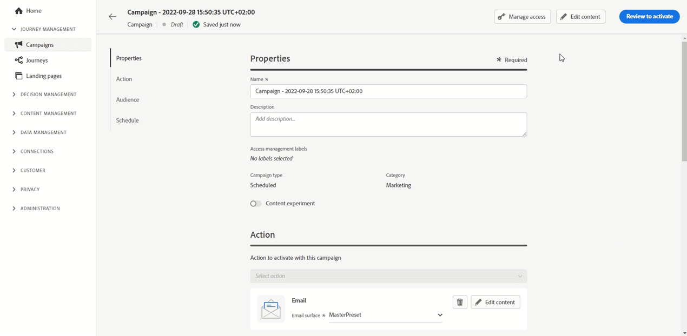

# 2022년 릴리스 정보 {#release-notes-2022}

이 페이지에는 [!DNL Journey Optimizer] 2022년에 릴리스되었습니다.

## 2022년 9월 릴리스{#sept-2022-release}

### 새로운 기능{#sept-2022-features}

<table>
<thead>
<tr>
<th><strong>다이내믹 콘텐츠 및 새로운 조건부 규칙 빌더</strong> </th>
</tr>
</thead>
<tbody>
<tr>
<td>

이제 조건부 규칙에 따라 메시지 콘텐츠를 조정할 수 있는 동적 콘텐츠를 만들 수 있습니다.
 

조건부 규칙은 표현식 편집기 내에서 시각적 규칙 빌더를 사용하여 작성되며, 여기서 여정 및 캠페인 간에 추가로 재사용할 수 있도록 저장할 수 있습니다.

자세한 내용은 <a href="../personalization/get-started-dynamic-content.md">세부 설명서</a>.
</td>
</tr>
</tbody>
</table>

<table>
<thead>
<tr>
<th><strong>API가 트리거된 캠페인</strong> </th>
</tr>
</thead>
<tbody>
<tr>
<td>

이제 기존의 예약된 캠페인 외에, Journey Optimizer에서 API 트리거된 캠페인을 만들어 API를 사용하여 외부 시스템에서 호출할 수 있습니다.

이를 통해 암호 재설정, OTP 토큰 등과 같은 다양한 운영 및 트랜잭션 메시지 요구 사항을 처리할 수 있습니다.

자세한 내용은 <a href="../campaigns/api-triggered-campaigns.md">세부 설명서</a>.
</td>
</tr>
</tbody>
</table>

<table>
<thead>
<tr>
<th><strong>데이터 액세스 제어</strong> </th>
</tr>
</thead>
<tbody>
<tr>
<td>

속성 기반 액세스 제어를 통해 관리자는 특정 속성에 따라 특정 객체에 대한 액세스를 제어할 수 있습니다. 이러한 속성은 레이블과 같은 객체에 추가된 메타데이터일 수 있습니다. 이 릴리스부터 관리자는 특정 필드 및/또는 개체에만 액세스할 수 있는 사용자 역할과 해당 필드 및/또는 개체에 해당하는 데이터를 정의할 수도 있습니다.

 속성 기반 액세스 제어 사용은 현재 선택한 고객에게만 제한되며, 향후 릴리스의 모든 환경에 배포됩니다.

자세한 내용은 <a href="../administration/object-based-access.md">세부 설명서</a>.
</td>
</tr>
</tbody>
</table>

<table>
<thead>
<tr>
<th><strong>데이터 거버넌스 및 개인 정보</strong> </th>
</tr>
</thead>
<tbody>
<tr>
<td>

DULE(Data Usage Labeling and Enforcement) 거버넌스 프레임워크를 사용하면 이제 Journey Optimizer를 Adobe Experience Platform 거버넌스 정책을 활용하여 사용자 지정 작업을 통해 중요한 필드를 타사 시스템으로 내보낼 수 있습니다. 시스템이 사용자 지정 작업 매개 변수에서 제한된 필드를 식별하면 오류가 표시되므로 여정을 게시할 수 없습니다.

DULE(Data Usage Labeling and Enforcement) 사용은 현재 선택한 고객에게만 제한되며, 향후 릴리스의 모든 환경에 배포됩니다.

자세한 내용은 <a href="../action/action-privacy.md">세부 설명서</a>.
</td>
</tr>
</tbody>
</table>

<table>
<thead>
<tr>
<th><strong>자동화된 동의 적용(동의 정책)</strong> </th>
</tr>
</thead>
<tbody>
<tr>
<td>

Adobe Experience Platform을 사용하면 고객의 동의 환경 설정을 준수하도록 마케팅 정책을 쉽게 채택하고 적용할 수 있습니다. 동의 정책은 Adobe Experience Platform에서 정의됩니다. Journey Optimizer에서 이러한 동의 정책을 사용자 지정 작업에 적용할 수 있습니다. 예를 들어 이메일, 푸시 또는 SMS 커뮤니케이션에 동의하지 않은 고객을 제외하는 동의 정책을 정의할 수 있습니다.

현재 Automated Consent Enforcement는 Healthcare Shield 추가 기능 서비스를 구입한 조직에서만 사용할 수 있습니다.

자세한 내용은 <a href="../action/consent.md">세부 설명서</a>.
</td>
</tr>
</tbody>
</table>

<table>
<thead>
<tr>
<th><strong>권한 관리</strong> </th>
</tr>
</thead>
<tbody>
<tr>
<td>

Journey Optimizer에서는 기능 및 개체에 대한 권한을 관리하기 위한 사용자 역할 및 액세스 정책 정의를 지원합니다. 사용 <strong>Adobe Experience Cloud 권한</strong>, 역할을 만들고 관리하며, 이러한 역할에 대해 원하는 리소스 권한을 지정할 수 있습니다. 또한 권한을 사용하여 특정 역할과 연관된 레이블, 샌드박스 및 사용자를 관리할 수도 있습니다.

 권한 사용은 현재 선택한 고객에게만 제한되며 향후 릴리스의 모든 환경에 배포됩니다.

자세한 내용은 <a href="../administration/attribute-based-access.md">세부 설명서</a>.
</td>
</tr>
</tbody>
</table>

<table>
<thead>
<tr>
<th><strong>경고 및 모니터링</strong> </th>
</tr>
</thead>
<tbody>
<tr>
<td>

이제 Journey Optimizer 사용자는 사용자 인터페이스를 통해 시스템 경고에 액세스하여 여정이 예상대로 작동하지 않을 때 알림을 받을 수 있습니다. 사용 가능한 경고를 보고 구독할 수 있습니다. 세그먼트 읽기 활동이 정의된 기간 동안 프로필을 처리하지 않은 경우 이 릴리스에서 사용할 수 있는 첫 번째 경고에 경고가 표시됩니다. 이 워크플로우의 잠금이 해제되면 더 많은 작업이 표시됩니다.

자세한 내용은 <a href="../reports/alerts.md">세부 설명서</a>.
</td>
</tr>
</tbody>
</table>

<!--table>
<thead>
<tr>
<th><strong>Data Hygiene</strong> </th>
</tr>
</thead>
<tbody>
<tr>
<td>

Adobe Experience Platform provides a suite of data hygiene capabilities that allow you manage your stored data through programmatic deletions of consumer records and datasets. This capability is now available for Adobe Journey Optimizer. 

You can manage your data stores to ensure that information is used as expected, is updated when incorrect data needs fixing, and is deleted when organizational policies deem it necessary.

<strong>Caution</strong> - Data Hygiene capabilities are currently only available for organizations that have purchased the Healthcare Shield add-on offering.

For more information, refer to the <a href="../building-journeys/read-segment.md#configuring-segment-trigger-activity">detailed documentation</a>.
</td>
</tr>
</tbody>
</table-->

### 개선 사항{#sept-2022-improvements}

**여정**

* 다음 **엔티티 데이터 세트** 이제 Adobe Journey Optimizer에서 기본 데이터 세트로 사용할 수 있습니다. 이 조회 데이터 세트에는 추적 및 피드백 데이터 세트 정보를 보강하는 메타 데이터가 포함되어 있습니다. 이렇게 하면 보다 쉽게 이해할 수 있는 데이터로 보고서 및 쿼리를 향상시킬 수 있습니다. [추가 정보](../data/datasets-query-examples.md#entity-dataset)
* 같은 이벤트에 대해 여정이 여러 번 잘못 트리거되지 않도록 단일 여정(이벤트 또는 세그먼트 자격 시작으로 시작)에 새로운 보호 기능이 추가되었습니다. 이제 프로필 다시 시작은 기본적으로 5분 동안 일시적으로 차단됩니다. [추가 정보](../start/guardrails.md#events-g)

**관리**

* 이제 허용된 목록을 활성화하거나 비활성화할 때 각 작업의 영향을 자세히 설명하는 새 경고가 표시됩니다. [추가 정보](../configuration/allow-list.md#enable-allow-list)
* 채널 서피스 생성, IP 풀 생성, 억제 목록 및 허용 목록 관리 및 SMS 채널 구성을 위한 사용자 인터페이스가 업데이트되었습니다.
* 이제 주어진 하위 도메인에 대한 첫 번째 채널 서피스를 생성할 때 처리 시간은 10분에서 10일, 해당 하위 도메인을 사용하는 후속 서피스에 대해 최대 3시간까지 소요됩니다. [추가 정보](../configuration/channel-surfaces.md#create-channel-surface)
* 랜딩 페이지 사전 설정 및 랜딩 페이지 하위 도메인을 만들기 위한 사용자 인터페이스를 업데이트했습니다. [추가 정보](../landing-pages/lp-subdomains.md)

**감사 제어**

* Journey Optimizer를 사용하면 시스템 사용자가 캠페인, 여정, 메시지, 랜딩 페이지 등과 같은 다양한 서비스 및 기능을 통해 수행한 작업을 식별할 수 있습니다. 이제 감사 로그 리소스에는 다양한 다른 작업에 대한 변경 사항이 포함되며, 활동이 발생하면 자동으로 기록됩니다. 추가 정보 [이 페이지에서](../privacy/audit-logs.md).

**아카이빙 지원**

* 새로운 **엔티티 데이터 세트** 에는 보관을 위해 모든 채널에서 보낸 메시지의 형식 및 구조를 내보낼 수 있는 템플릿 필드가 포함되어 있습니다. [추가 정보](../configuration/archiving-support.md)

**랜딩 페이지**

* 이제 동일한 랜딩 페이지 내에서 다른 페이지에서 가져온 컨텍스트 데이터를 사용할 수 있습니다. 예를 들어, 기본 랜딩 페이지의 구독 목록에 확인란을 연결하는 경우, &quot;감사합니다&quot; 하위 페이지에서 해당 구독 목록을 사용할 수 있습니다. [추가 정보](../landing-pages/lp-content.md#use-primary-page-context)

<!--* When configuring the primary page, you can now create additional data to enable storing information when the landing page is being submitted. [Learn more](../landing-pages/lp-content.md#use-additional-data)-->

<!--* You can now use information that was submitted on a landing page to send communications to your customers. For example, if a user subscribes to a given subscription list, you can leverage that information to send an email recommending other subscription lists to that user.-->

### 기타 변경 사항{#sept-2022-other}

* 여정 버스트 모드가 Campaign Rapid 게재 모드로 대체되었습니다. [추가 정보](../campaigns/create-campaign.md#rapid-delivery)
* 성능을 향상시키기 위해 경험 이벤트 필드 그룹을 읽기 세그먼트, 세그먼트 자격 또는 비즈니스 이벤트 활동으로 시작하는 여정에서 더 이상 사용할 수 없습니다. 이 변경 사항은 새 여정에만 적용됩니다. 기존 동작은 현재 동작을 유지합니다. [추가 정보](../start/guardrails.md#expression-editor)
* 예약된 읽기 세그먼트 여정에 대한 1시간 제한이 제거되었습니다. 이제 이러한 여정을 지연 없이 실행할 수 있습니다.

## 2022년 8월 릴리스 {#aug-2022-release}

### 새로운 기능

<table>
<thead>
<tr>
<th><strong>Journey Optimizer에서 캠페인 만들기 및 관리</strong> </th>
</tr>
</thead>
<tbody>
<tr>
<td>

Journey Optimizer 캠페인을 사용하여 다양한 채널을 사용하여 특정 세그먼트에 일회성 콘텐츠를 전달할 수 있습니다. 여정 사용 시 작업이 순서대로 실행되도록 디자인됩니다. 캠페인을 사용하면 작업이 동시에 즉시 또는 지정된 스케줄에 따라 수행됩니다. 

에서 캠페인을 만드는 방법을 알아봅니다 <a href="../campaigns/get-started-with-campaigns.md">세부 설명서</a> 및 <a href="https://video.tv.adobe.com/v/346680">기능 비디오</a>.
</td>
</tr>
</tbody>
</table>

<table>
<thead>
<tr>
<th><strong>사용자에게 SMS 보내기(일반 가용성)</strong> </th>
</tr>
</thead>
<tbody>
<tr>
<td>

이제 Journey Optimizer와 통합을 통해 SMS를 만들고, 개인화하고, 보낼 수 있습니다 <b>Sinch</b> 또는 <b>트왈리오</b>.

여기에서 SMS를 만들고 보내는 방법을 알아봅니다 <a href="../sms/create-sms.md">세부 설명서</a>.

</td>
</tr>
</tbody>
</table>

<!--table>
<thead>
<tr>
<th><strong>New Dynamic Expression Builder</strong> </th>
</tr>
</thead>
<tbody>
<tr>
<td>

You can now create conditional content blocks across different authoring services to personalize your content.

In addition to the Personalization Expression Library, the Expression Editor provides a new Conditional Rule Builder to help you design and save your content blocks.

For more information, refer to the <a href="../building-journeys/read-segment.md#configuring-segment-trigger-activity">detailed documentation</a>.
</td>
</tr>
</tbody>
</table-->

### 개선 사항

**보고**

* 이제 동의 정책 테이블 및 그래프를 Journey Global 보고서에서 사용할 수 있습니다. 이러한 위젯을 사용하면 사용자 지정 작업의 정책에서 제외된 프로필을 추적할 수 있습니다. [추가 정보](../reports/journey-global-report.md#journey-global)

   최신 위젯에 액세스하려면 다른 보고 대시보드를 재설정해야 합니다. 대시보드 사용자 지정에 대한 자세한 내용은 [자세한 설명서](../reports/global-report.md).

**관리**

* 이제 SMS 채널에 사용할 기본 전화 번호를 업데이트할 수 있습니다. [추가 정보](../configuration/primary-email-addresses.md)

## 2022년 7월 릴리스 {#july-2022-release}

### 새로운 기능

<table>
<thead>
<tr>
<th><strong>새로운 인라인 메시징 흐름</strong> </th>
</tr>
</thead>
<tbody>
<tr>
<td>

Journey Optimizer는 여정에서 메시지 작성을 위한 새로운 흐름을 제공합니다. 인라인 메시징을 사용하면 사용자에게 상당한 시간을 절약하고 Journey Optimizer에서 이메일, 푸시 알림 또는 SMS를 만들고 전달하는 워크플로우 프로세스를 간소화할 수 있습니다. 메시지를 별도의 단계로 제거하고 대신 Journey Canvas에서 작업의 일부로 인라인 편집할 수 있도록 함으로써 사용자는 더 적은 수의 단추를 클릭하고 더 적은 화면으로 이동하여 컨텐츠를 디자인하고 편집해야 합니다.

</td>
</tr>
</tbody>
</table>

<table>
<thead>
<tr>
<th><strong>속성 기반 액세스 제어(제한된 가용성)</strong> </th>
</tr>
</thead>
<tbody>
<tr>
<td>

이제 조직 또는 데이터 사용 범위를 정의하는 레이블을 사용하여 스키마 필드를 식별할 수 있습니다. 관리자는 권한 인터페이스를 사용하여 XDM 스키마 필드에 적용되는 액세스 정책을 정의하고 사용자 또는 사용자 그룹(내부, 외부 또는 타사 사용자)에 부여된 액세스를 더 잘 관리하며 특정 데이터 유형(즉, 중요한 개인 데이터/SPD)에 대한 액세스를 관리할 수 있습니다.

속성 기반 액세스 제어 사용은 현재 선택한 사용자로만 제한되며 향후 릴리스의 모든 환경에 배포됩니다.

자세한 내용은 <a href="../administration/attribute-based-access.md">세부 설명서</a>.

</td>
</tr>
</tbody>
</table>

<table>
<thead>
<tr>
<th><strong>일괄 결정 작업</strong> </th>
</tr>
</thead>
<tbody>
<tr>
<td>

이제 사용자 인터페이스에서 배치 의사 결정 작업을 실행할 수 있으므로 배치 api 작업을 실행하는 개발자가 필요하지 않으며 마케팅 관련 시간을 줄일 수 있습니다. 이 새 인터페이스를 사용하면 작업을 만들고 현재/과거 작업을 관리할 수 있습니다.

자세한 내용은 <a href="../offers/batch-delivery.md">자세한 설명서

</td>
</tr>
</tbody>
</table>

<table>
<thead>
<tr>
<th><strong>의사 결정 시 가장 성과가 좋은 오퍼를 자동으로 사용(제한된 가용성)</strong> </th>
</tr>
</thead>
<tbody>
<tr>
<td>

이제 의사 결정 관리에서 개인화된 최적화 모델 시스템을 사용할 수 있습니다. 이 새로운 유형의 모델을 사용하면 세그먼트와 오퍼 성과를 기반으로 오퍼를 최적화하고 개인화할 수 있습니다.

개인화된 최적화 AI 모델의 사용은 현재 선택한 사용자로만 제한되며 향후 릴리스의 모든 환경에 배포됩니다.

자세한 내용은 <a href="../offers/ranking/personalized-optimization-model.md">세부 설명서</a>.

</td>
</tr>
</tbody>
</table>

### 개선 사항

**여정**

* **여정 종료** - 여정 캔버스에서 **종료** 활동이 팔레트에서 제거되었습니다. 이제 끝 태그가 각 경로 끝에 기본적으로 추가되므로 제거할 수 없습니다. 이 개선 사항을 통해 고객이 여정 담당자로부터 필요한 작업 없이 여정에서 떨어진 위치를 더 잘 보고할 수 있습니다. 자세한 내용은 [설명서](../building-journeys/end-journey.md) 및 [기능 비디오](https://video.tv.adobe.com/v/345376){target=&quot;_blank&quot;}.

* 다음 **프로필 시간대** 이제 여정 속성에서 옵션이 기본적으로 선택 취소됩니다. [추가 정보](../building-journeys/timezone-management.md#timezone-from-profiles)

**메시지**

* 이제 메시지 사전 설정이 **채널 서피스**. [추가 정보](../configuration/channel-surfaces.md)

**관리**

* **PTR 레코드 편집** - 이제 PTR 레코드를 업데이트할 때 처리 시간은 최대 3시간만 소요됩니다. [추가 정보](../configuration/ptr-records.md#processing)

* **허용된 목록 UI** - 이제 Journey Optimizer 사용자 인터페이스를 사용하여 새 이메일 주소 또는 도메인을 허용 목록에 추가할 수 있습니다. [추가 정보](../configuration/allow-list.md)

* **허용된 목록 논리 업데이트** - 이제 목록이 비어 있더라도 기능이 활성화되는 즉시 허용된 목록 논리가 적용됩니다. [추가 정보](../configuration/allow-list.md#logic)

* **URL 추적 매개 변수** - 이제 표현식 편집기를 사용하여 전자 메일 표면(예: 사전 설정)에서 URL 추적 매개 변수를 구성할 수 있습니다. [추가 정보](../email/email-settings.md#url-tracking)

**의사 결정 관리**

* **대상 크기** - 이제 의사 결정 규칙을 만들거나, 세그먼트 또는 규칙을 선택하여 오퍼 자격 설정을 하거나, 세그먼트 또는 규칙을 의사 결정 범위에 추가할 때 사용자 인터페이스에 새 대상 크기 예상 구성 요소가 표시됩니다.

## 2022년 6월 릴리스 {#june-2022-release}

### 새로운 기능

<table>
<thead>
<tr>
<th><strong>사용자에게 SMS 보내기(제한된 가용성)</strong> </th>
</tr>
</thead>
<tbody>
<tr>
<td>

이제 Journey Optimizer와 통합을 통해 SMS를 만들고, 개인화하고, 보낼 수 있습니다 <b>Sinch</b> 또는 <b>트왈리오</b>.

<!--img src="assets/do-not-localize/SMS.gif"/-->

SMS 채널은 현재 조직 집합(제한된 가용성)에만 사용할 수 있습니다. 자세한 내용은 Adobe 담당자에게 문의하십시오.

여기에서 SMS를 만들고 보내는 방법을 알아봅니다 <a href="../sms/create-sms.md">세부 설명서</a>.

</td>
</tr>
</tbody>
</table>

<table>
<thead>
<tr>
<th><strong>Adobe Stock 통합을 통해 더 효과적인 이미지 찾기</strong> </th>
</tr>
</thead>
<tbody>
<tr>
<td>

Adobe Stock 및 Adobe Journey Optimizer 이메일 디자이너 통합 플러그인을 사용하면 메시지 작성에 사용할 이미지를 쉽게 탐색, 라이선스 및 저장할 수 있습니다.   새로운 <b>유사한 스톡 사진 찾기</b> 또한, 이미지의 내용, 색상 및 컴포지션과 일치하는 스톡 사진을 찾을 수 있습니다. 

<!--img src="assets/do-not-localize/stock-rn.gif"/-->

자세한 내용은 <a href="../email/stock.md">세부 설명서</a>.

</td>
</tr>
</tbody>
</table>

<table>
<thead>
<tr>
<th><strong>모든 이메일에서 이메일 BCC 사용</strong> </th>
</tr>
</thead>
<tbody>
<tr>
<td>

이제 이메일 BCC(숨은 참조) 기능을 사용하여 Adobe Journey Optimizer에서 보낸 이메일을 저장할 수 있습니다. 전자 메일 사전 설정에서 이 옵션을 활성화하여 전송된 모든 전자 메일이 BCC 주소로 블라인드(bcc)로 복사됩니다.

<!--img src="assets/do-not-localize/bcc-rn.gif"/-->

자세한 내용은 <a href="../configuration/archiving-support.md#bcc-email">세부 설명서</a>.

</td>
</tr>
</tbody>
</table>

<!--<table>
<thead>
<tr>
<th><strong>Automatically use the best performing offer in your decisions</strong> </th>
</tr>
</thead>
<tbody>
<tr>
<td>

You can now use personalized optimization model systems in Decision Management. This new type of model allows you to optimize and personalize offers based on segments and offer performance.

The use of personalized optimization AI models is currently restricted to selected users, and will be deployed to all environments in a future release.

For more information, refer to the <a href="../offers/ranking/personalized-optimization-model.md">detailed documentation</a>.

</td>
</tr>
</tbody>
</table>-->

<table>
<thead>
<tr>
<th><strong>샌드박스 간 개체 복사</strong> </th>
</tr>
</thead>
<tbody>
<tr>
<td>

이제 Journey Optimizer 샌드박에서 다른 샌드박스로(예: 비프로덕션 샌드박스에서 프로덕션 샌드박스로) 경험을 다시 만들 수 있습니다. 이 새 기능은 Journey Orchestration이 올바른 실행을 위해 사용하는 개체를 비롯하여 전체 여정을 복사하여 한 환경에서 다른 환경으로 보냅니다. 여정 외에 오퍼, 메시지, 스키마, 데이터 세트, 데이터 소스, 이벤트 및 작업과 같은 다른 구성 요소를 복사할 수도 있습니다.

자세한 내용은 <a href="../building-journeys/copy-to-sandbox.md">세부 설명서</a>.
</td>
</tr>
</tbody>
</table>

### 개선 사항

**의사 결정 관리**

* **HTML 및 JSON 파일 지원** - 이제 Adobe Experience Cloud 자산 라이브러리의 외부 HTML 및 JSON 파일을 오퍼 표시 컨텐츠로 끌어다 놓을 수 있습니다. [추가 정보](../offers/offer-library/add-representations.md#html-json)

**이메일**

* **템플릿으로 저장** - 이제 이메일 콘텐츠를 템플릿으로 저장하고 다른 메시지를 만들 때 다시 사용할 수 있습니다. [추가 정보](../email/email-templates.md)

**관리**

* **미리 보기 추적 URL 매개 변수** - 메시지 사전 설정을 구성할 때 URL 추적 매개 변수를 정의하는 경우 결과 추적 URL의 동적 미리 보기가 표시됩니다. [추가 정보](../email/email-settings.md#url-tracking)

* **메시지 사전 설정 편집** - 이제 메시지 사전 설정을 업데이트할 때 처리 시간은 최대 3시간만 소요될 수 있습니다. [추가 정보](../configuration/channel-surfaces.md#edit-channel-surface)

* **IP 풀 에디션** - 이제 IP 풀을 업데이트할 때 처리 시간은 최대 3시간만 소요될 수 있습니다. [추가 정보](../configuration/ip-pools.md#edit-ip-pool)

## 2022년 5월 릴리스 {#may-2022-release}

### 새로운 기능

<table>
<thead>
<tr>
<th><strong>메시지 빈도 규칙</strong> </th>
</tr>
</thead>
<tbody>
<tr>
<td>

이제 메시지 및 작업에서 과도하게 요청된 프로필을 자동으로 제외하는 크로스 채널 비즈니스 규칙을 설정할 수 있습니다.

<!--img src="assets/do-not-localize/frequency-rn.gif"/-->

자세한 내용은 <a href="../configuration/frequency-rules.md">세부 설명서</a>.

</td>
</tr>
</tbody>
</table>

<table>
<thead>
<tr>
<th><strong>의사 결정 관리 - AI 등급 자동 최적화 모델</strong> </th>
</tr>
</thead>
<tbody>
<tr>
<td>

이제 의사 결정 관리에서 숙련된 모델 시스템을 사용할 수 있습니다. 이 새 기능은 주어진 프로필에 대해 표시할 오퍼에 등급을 지정합니다.

<!--img src="assets/do-not-localize/optimization.gif"/-->

자세한 내용은 <a href="../offers/offer-activities/configure-offer-selection.md#use-ranking-strategy">세부 설명서</a>.

</td>
</tr>
</tbody>
</table>

<!--table>
<thead>
<tr>
<th><strong>Attribute-based Access Control (ABAC)</strong> </th>
</tr>
</thead>
<tbody>
<tr>
<td>

Permission management in Journey Optimizer has been extended to data access. You can now manage data access for specific teams or groups of users (i.e. internal, external, 3rd parties) ​and manage access to specific types of data (i.e. Sensitive Personal Data/SPD).

This capability is available for a limited set of customers.

For more information, refer to the <a href="../landing-pages/create-lp.md">detailed documentation</a>.

</td>
</tr>
</tbody>
</table-->

<table>
<thead>
<tr>
<th><strong>Journey Optimizer 감사 로그</strong> </th>
</tr>
</thead>
<tbody>
<tr>
<td>

이제 Adobe Journey Optimizer 리소스에서 사용자가 수행한 작업을 모니터링할 수 있습니다.

<!--img src="assets/do-not-localize/audit-rn.gif"/-->

자세한 내용은 <a href="../privacy/audit-logs.md">세부 설명서</a>.

</td>
</tr>
</tbody>
</table>

### 개선 사항

**개인화**

* **문자 숨김을 위한 새 도우미 함수** - `mask` 도우미 함수를 사용하면 문자열의 일부를 &quot;X&quot; 문자로 바꿀 수 있습니다. [추가 정보](../personalization/functions/string.md#mask)

**랜딩 페이지**

* **양식이 없는 랜딩 페이지** - 이제 양식을 포함하지 않고 방문자의 작업이 필요 없는 랜딩 페이지를 만들어 게시할 수 있습니다.
* **랜딩 페이지 템플릿** - 이제 랜딩 페이지를 템플릿으로 저장하고 다른 랜딩 페이지를 만들 때 다시 사용할 수 있습니다. [추가 정보](../landing-pages/lp-templates.md)
* **기본 페이지로 돌아갑니다** - 이제 동일한 랜딩 페이지 내의 하위 페이지에서 기본 페이지에 링크를 추가할 수 있습니다.
* **사용자 지정 JavaScript 지원** - 이제 사용자 지정 JavaScript를 랜딩 페이지 콘텐츠에 추가하여 고급 스타일을 수행하거나 사용자 지정 동작을 랜딩 페이지에 추가할 수 있습니다.    [추가 정보](../landing-pages/lp-custom-js.md)

**여정**

* **세그먼트 읽기** - 이제 일회성 읽기 세그먼트 여정이 여정 실행 후 30일 후에 완료됨 상태로 이동합니다. 예약된 읽기 세그먼트의 경우 마지막 항목이 실행된 후 30일이 경과합니다. [추가 정보](../building-journeys/read-segment.md)
* **표현식 편집기** - [제한](../building-journeys/functions/functionlimit.md) 목록 항목 수를 제한할 수 있도록 함수가 추가되었습니다. 다음 [sort](../building-journeys/functions/functionsort.md) 이제 함수 를 사용하여 목록 개체를 정렬할 수 있습니다. listObject에 대한 지원도 추가되었습니다 [불변](../building-journeys/functions/functiondistinct.md) 및 [distinctWithNull](../building-journeys/functions/functiondistinctwithnull.md) 함수 위에 있어야 합니다.

**관리**

* **라이선스 사용 대시보드 업데이트** - 사용 가능한 라이센스 사용량 대시보드 [!DNL Adobe Journey Optimizer] 이제 사용자 인터페이스에 의 정확한 값이 반영됩니다 **라이센스** 평균 프로필 품질. 이 지표 표시에 감소가 표시되는데, 이것은 이제 라이선스 제한이 올바로 보고됨을 의미합니다. [추가 정보](../segment/license-usage.md)

## 2022년 4월 릴리스 {#april-2022-release}

### 개선 사항

**랜딩 페이지**

* **옵트인/옵트아웃 확인란에 대한 새 옵션** - 이제 구독 랜딩 페이지에 옵트인/옵트아웃에 대한 단일 확인란을 삽입할 수 있습니다. 동의(옵트인)를 위해 상자를 선택하고 선택을 취소하여 동의(옵트아웃)를 제거해야 합니다. [추가 정보](../landing-pages/design-lp.md#define-lp-specific-content)

* **랜딩 페이지 필드 미리 채우기** - 이제 사용자에게 랜딩 페이지 필드를 프로필 정보로 미리 채울 수 있는 기능을 제공할 수 있습니다. [추가 정보](../landing-pages/create-lp.md#configure-primary-page)

**의사 결정 관리**

* **Edge의 의사 결정 API** - Edge Decisioning API는 의사 결정 관리에서 관리되는 개인화된 오퍼를 제공하고 렌더링할 수 있습니다. 의사 결정 관리 사용자 인터페이스(UI) 또는 API를 사용하여 오퍼 및 기타 관련 개체를 만들 수 있습니다. [추가 정보](../offers/api-reference/offer-delivery-api/edge-decisioning-api.md)

**관리**

* **PTR 제출 기간** - PTR 편집 유효 기간이 몇 시간 남았습니다. [추가 정보](../configuration/ptr-records.md#processing)

**이메일 디자인**

* **20개의 새로운 이메일 템플릿** 이제 Journey Optimizer에서 이메일 콘텐츠를 디자인할 수 있습니다.

**사용자 인터페이스**

* **Journey Optimizer UI의 상황별 도움말** - Journey Optimizer에서 상황별 도움말 링크를 여러 페이지에 추가했습니다. 사용 가능한 경우 &quot;i&quot; 아이콘을 클릭하여 현재 기능에 대한 간단한 설명을 보고 관련 문서에 액세스합니다.

**Adobe Campaign Standard와 통합**

이제 Adobe Campaign Standard 고객은 Journey Optimizer를 사용하여 이메일, 푸시 알림 및 SMS를 보낼 수 있습니다. 새로운 기본 작업을 사용하여 Campaign Standard 트랜잭션 메시지 기능을 Journey Optimizer에 활용할 수 있습니다.  [추가 정보](../action/acs-action.md)

<!--
### Fixes

* Fixed an issue which caused tracking reports not to be available as the `JourneyActionId` was not properly populated. PLATIR-19854, CJM-26006
* Fixed an error on business events which could block the journey publication. CJM-25931
* Fixed an issue which could prevent images in Email Designer templates from being displayed. PLATIR-18176, CJM-25008
-->

## 2022년 3월 릴리스 {#march-2022-release}

### 개선 사항

**여정**

* 통합 프로필 스키마에 불필요한 필드가 없도록 하기 위해 기본적으로 프로필에 대해 여정 단계 이벤트 스키마가 더 이상 활성화되지 않습니다. 필요한 경우 활성화할 수 있습니다. [추가 정보](../reports/sharing-overview.md)
* 이제 내보내기 작업과 관련된 새 단계 이벤트를 Journey Optimizer에서 Adobe Experience Platform으로 보냅니다. 쿼리의 예가 설명서에 추가되었습니다. [추가 정보](../reports/query-examples.md)

**의사 결정 관리**

* 이제 오퍼 캡핑이 모든 사용자 간에 적용되는지, 아니면 하나의 특정 프로필, 모든 배치 또는 배치마다 적용되는지를 지정할 수 있습니다. [추가 정보](../offers/offer-library/add-constraints.md#capping)
* Batch Decisioning API를 사용하면 한 번의 호출로 주어진 세그먼트의 모든 프로필에 대한 의사 결정 관리 기능을 사용할 수 있습니다. 세그먼트에 있는 각 프로필에 대한 오퍼 컨텐츠는 사용자 지정 배치 워크플로우에 사용할 수 있는 AEP 데이터 세트에 배치됩니다. [추가 정보](../offers/api-reference/offer-delivery-api/batch-decisioning-api.md)

**관리**

* 이제 메시지 사전 설정 수준의 이메일 헤더에서 구독 취소 링크를 활성화/비활성화하고 메시지 수준에서 사용자 지정 구독 취소 URL을 설정할 수 있습니다. [추가 정보](../configuration/channel-surfaces.md#list-unsubscribe)
* 이제 허용 목록을 [!DNL Journey Optimizer] 프로덕션 및 비프로덕션 샌드박스의 인터페이스. [추가 정보](../configuration/allow-list.md#enable-allow-list)

**개인화**

* 이제 라이브러리에 40개 이상의 개인화 표현식을 저장할 수 있습니다. [추가 정보](../personalization/personalization-library.md)

## 2022년 2월 릴리스 {#feb-2022-release}

### 새로운 기능

<table>
<thead>
<tr>
<th><strong>구독 랜딩 페이지</strong> </th>
</tr>
</thead>
<tbody>
<tr>
<td>

이제 Journey Optimizer에서 랜딩 페이지를 만들고 디자인할 수 있으며, 사용자가 커뮤니케이션 수신을 옵트인하거나 옵트아웃할 수 있는 온라인 양식으로 전송하거나 뉴스레터와 같은 특정 서비스에 가입할 수 있습니다.

자세한 내용은 <a href="../landing-pages/create-lp.md">세부 설명서</a> 및 관련 <a href="../landing-pages/lp-use-cases.md">샘플 사용 사례</a>.

</td>
</tr>
</tbody>
</table>

<table>
<thead>
<tr>
<th><strong>새 개인화 표현식 라이브러리</strong> </th>
</tr>
</thead>
<tbody>
<tr>
<td>

이제 Journey Optimizer에서 사전 정의된 개인화 표현식에 액세스할 수 있는 라이브러리를 제공합니다. 이러한 표현식은 관리자 사용자가 구성합니다.

자세한 내용은 <a href="../personalization/personalization-library.md">세부 설명서</a>.

</td>
</tr>
</tbody>
</table>

<!--table>
<thead>
<tr>
<th><strong>API Developer Site and Suppression API</strong> </th>
</tr>
</thead>
<tbody>
<tr>
<td>

Journey Optimizer provide RESTful APIs that allow you to programmatically perform key operations in your applications.
Developer SDK for Journey Optimizer is now available with the Suppression API (beta).

With this API, you can control your outgoing messages using suppression and allow lists.
The suppression list helps you with honoring the ISPs' feedback to preserve sending IP reputation. The allow list helps you ensure that you send only to those email addresses which are in the allowed list, and typically to ensure that you don't send mails to customers from your development sandbox.

See <a href="https://developer.adobe.com/journey-optimizer-apis/">Adobe Journey Optimizer APIs</a>.

</td>
</tr>
</tbody>
</table-->

<table>
<thead>
<tr>
<th><strong>UTM 추적 매개 변수를 사용하여 메시지를 추적하는 정보 전달</strong> </th>
</tr>
</thead>
<tbody>
<tr>
<td>

이제 Journey Optimizer 메시지 콘텐츠에서 링크에 UTM 매개 변수를 추가할 수 있습니다. 이 링크를 통해 해당 링크에 대한 추가 데이터를 제공할 수 있으며, 사용자가 링크를 클릭한 위치와 이유를 파악할 수 있습니다.

자세한 내용은 <a href="../configuration/channel-surfaces.md#configure-email-settings">세부 설명서</a>.

</td>
</tr>
</tbody>
</table>

### 개선 사항

**여정**

* 성능을 최적화하기 위해 1주일 동안 트리거되지 않은 테스트 모드의 모든 여정은 이제 초안 상태로 돌아갑니다. [자세한 내용](../building-journeys/testing-the-journey.md#important_notes)
* Journey Optimizer와 Adobe Campaign Classic 간의 통합이 성능 향상을 위해 최적화되었습니다. 최대 가용량 기본 구성이 4000 호출/5분으로 변경되었습니다.    [자세한 내용](../action/acc-action.md#important-notes)

**보고**

* 이제 상태에 따라 게재를 필터링할 수 있습니다.
   * 이제 메시지 실행 목록에서 증명을 게재 목록에서 제외할 수 있습니다.
   * 라이브/전역 보고서에서 테스트 이벤트를 제외하도록 선택할 수 있습니다.

* 이제 전송 시간 최적화 데이터에 대한 보고서에 액세스할 수 있습니다. 메시지를 즉시 보낸 사람 수 및 1시간 최적화, 2시간 최적화 등을 통해 메시지를 보낸 사람 수

<!--* decision management reports are now available in Journey Optimizer. You can access the following metrics: Offers sent - Offers' impression rate - Offers' click rate - Breakdown report on Offers' sent.-->

**의사 결정 관리**

* 이제 등급 및 AI 등급이 단일 탭으로 그룹화됩니다.

## 2022년 1월 릴리스 {#january-2022-release}

### 새로운 기능

<table>
<thead>
<tr>
<th><strong>여정 - 프로필 상한 조건으로 IP 램프 업 최적화</strong> </th>
</tr>
</thead>
<tbody>
<tr>
<td>

구성 시 <strong>조건</strong> 이제는 여정에서 활동 제한을 정의할 수 있습니다. 이 새로운 조건 유형을 사용하면 여정 경로에 대해 최대 프로필 수를 설정할 수 있습니다. 이 한도에 도달하면 입력한 프로필에서 대체 경로를 사용합니다. 이를 통해 게재 볼륨을 높일 수 있습니다(IP 램프 업). 예를 들어 실행을 분할하여 도메인에서 게재를 램프 할 수 있습니다. 2일 등 1일에 1000개의 메시지를 보냅니다.

자세한 내용은 <a href="../building-journeys/condition-activity.md#profile_cap">세부 설명서</a> 및 관련 <a href="../building-journeys/ramp-up-deliveries-uc.md">샘플 사용 사례</a>.

</td>
</tr>
</tbody>
</table>

<table>
<thead>
<tr>
<th><strong>여정 - 세그먼트 읽기 개선 사항</strong> </th>
</tr>
</thead>
<tbody>
<tr>
<td>

다음 <strong>증분 읽기</strong> 반복에 옵션이 추가되었습니다. <strong>세그먼트 읽기</strong> 활동. 이 옵션을 사용하면 여정의 마지막 실행 이후 세그먼트에 입력한 개인만 타겟팅할 수 있습니다. 첫 번째 실행은 항상 모든 세그먼트 구성원을 타깃팅합니다.

자세한 내용은 <a href="../building-journeys/read-segment.md#configuring-segment-trigger-activity">세부 설명서</a>.
</td>
</tr>
</tbody>
</table>

### 개선 사항

**여정**

* 이제 Journey Optimizer 단계 이벤트를 의 다른 데이터 세트에 연결할 수 있습니다 [Adobe Customer Journey Analytics](https://experienceleague.adobe.com/docs/analytics-platform/using/cja-overview/cja-overview.html). 다음 **profileID** 이제 기본 제공 여정 단계 이벤트 스키마의 필드가 id 필드로 정의됩니다. [추가 정보](../reports/sharing-overview.md#integration-cja)

**의사 결정 관리**

* 게시된 메시지에서 직접 또는 간접적으로 참조되는 오퍼, 대체 오퍼, 오퍼 컬렉션 또는 오퍼 결정을 업데이트하면 이제 다시 게시할 필요 없이 업데이트가 해당 메시지에 자동으로 반영됩니다. [추가 정보](../offers/offers-e2e.md#insert-decision-in-email)

* 주어진 테스트 프로필에 대해 제공될 오퍼를 시뮬레이션할 때 이제 기본 시뮬레이션 설정을 수정하고 문제 해결 용도로 사용할 수 있는 시뮬레이션에 해당하는 코드를 볼 수 있습니다. [추가 정보](../offers/offer-activities/simulation.md#define-simulation-settings)

**관리**

* 이제 관리자는 CNAME이 하위 도메인을 설정하여 PTR 레코드를 편집할 수 있습니다. [추가 정보](../configuration/ptr-records.md#edit-ptr-subdomains-cname)

**개인화**

* **즐겨찾기에 추가** - 개인화 작업 시 효율성을 개선하기 위해 즐겨찾기 저장 개념을 도입했습니다. 즐겨찾기 메뉴에 다른 속성을 추가하면 가장 자주 사용하는 항목에 빠르게 액세스할 수 있습니다. [추가 정보](../personalization/personalize.md#fav)
